# Create Pipeline

## Introduction
In this lab, we will observe how to build a pipeline in GGSA. All of the components used to elicit Kafka events from a machine learning classification model will be described in detail. Lastly, data will be sent to OAS for analysis. 

Estimated Time: 55 minutes

### Objectives

In this lab, you will complete the following tasks:
- Validate That the Required Services are Up and Running
- Log in to GoldenGate Stream Analytics
- Create File Stream
- Create a pipeline
- Create a GoldenGate Stream
- Add a Query Stage
- Add a Filter to the Query Stage
- Add a OML Stage
- Add a Spending Factor Filter
- Create a Spending Factor
- Add a Filter using the Spending Factor
- Create a Kafka Stage
- Create an OAS Stage
  
### Prerequisites

This lab assumes you have:
- An Oracle Always Free/Free Tier, Paid or LiveLabs Cloud Account

## Task 1: Validate That the Required Services are Up and Running

1. When deploying the stack, access the GGSA Server using the NoVNC link.

## Task 2: Log in to GoldenGate Stream Analytics

1. Use the following login information to access the GGSA portal:
- username: **osaadmin**
- password: **GGSAdm123456!**

    

## Task 3: View GoldenGate Stream

1. Select the **toggle button** to expand the filter bar. Select **Steams** to filter by streams. Select **DMFinances** to view the GoldenGate stream.  
   
    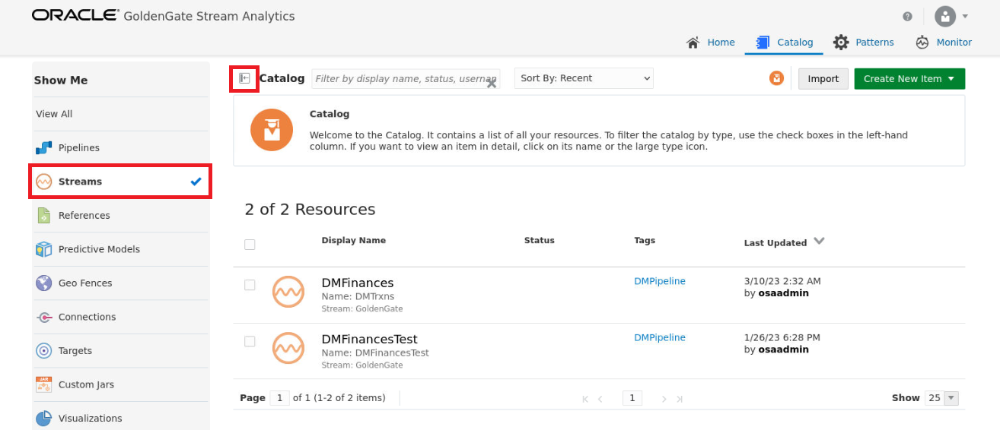

2. Observe the GoldenGate Change Data that we viewed in the previous lab. Click the **X** to exit back.

    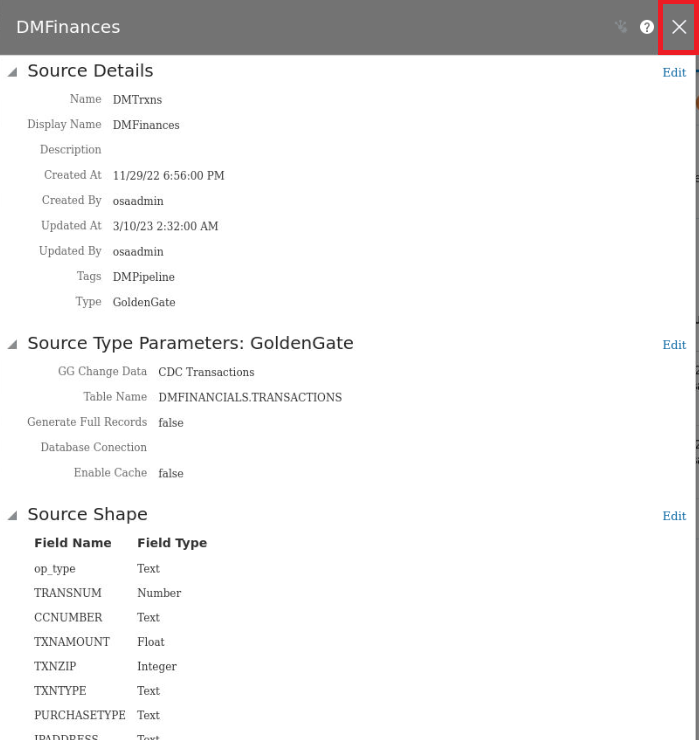

## Task 4: Create a pipeline

1. Select the **Green button** to create new item and select **Pipeline** from the drop-down options.

    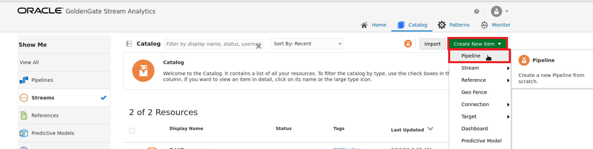

2. Insert a name for the pipeline, such as **Financials_DataPipeline** and select **DMFinances** from the stream options. Click **Save** to create the pipeline.

    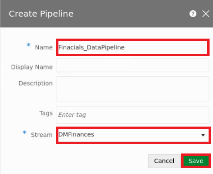


## Task 5: Add a Query Stage

1. Right click the **DMFinances** and select **Query** from the options.

    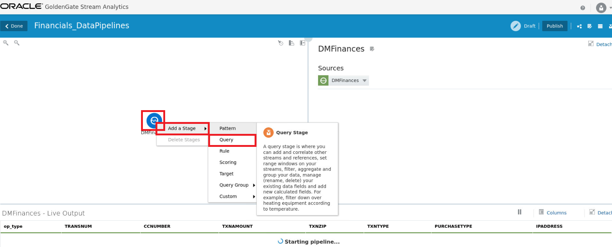

2. Name the query stage and select **Save**.
    ```
    $ <copy>DataEnrichment</copy>
    ```

    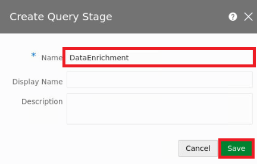

3. In the workflow section, click on the **Entertainment** stage and make sure it is highlighted blue. This is where the live data is streaming from and acts as a query stage.

    

## Task 7: Add a Source to the Query Stage

1. Select add a source **DMFinances** and **Customers**.

    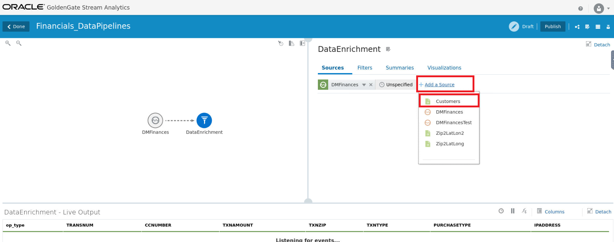

2. Add a condition to match **CCNUMBER_1** is **equals (case sensitive)** to **CCNUMBER**.
   
    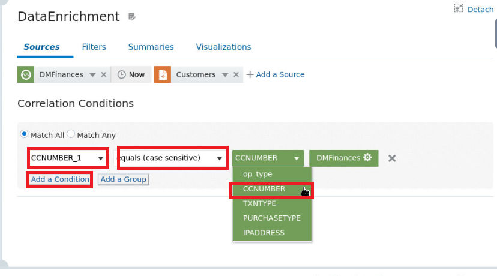

## Task 8: Add a Data Cleaning stage

1. Right click **DataEnrichment** and add another Query stage.

    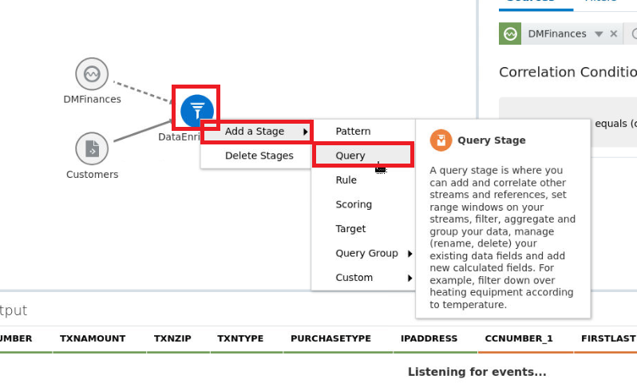

2. Name the query stage and select **Save**.
    ```
    $ <copy>DataCleaning</copy>
    ```

    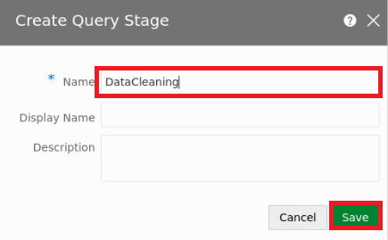

2. Right click **op_type** and select **Remove from output**.

    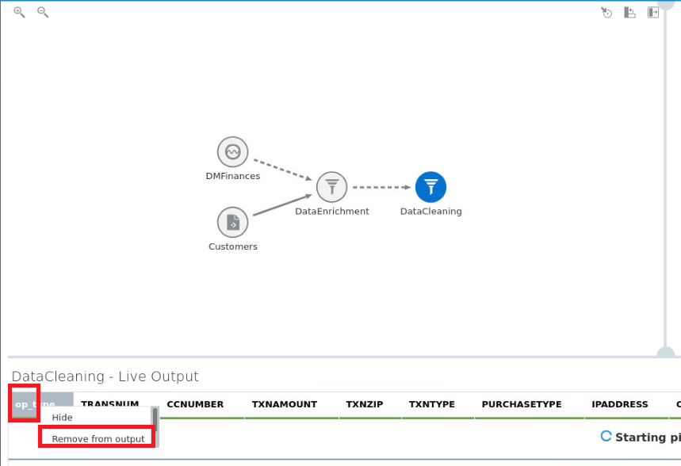

3. Again, right click **CCNUMBER_1** and select **Remove from output**.

    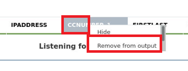

## Task 9: Add a ZipLatLong Query stage

1. Right click on **DataCleaning** and select **Query**.

    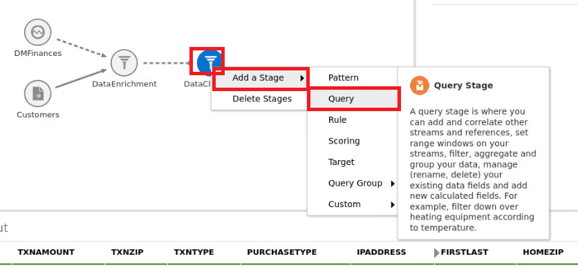

2. Select **Add a source** to join **Zip2Latlon2** to the pipeline.

    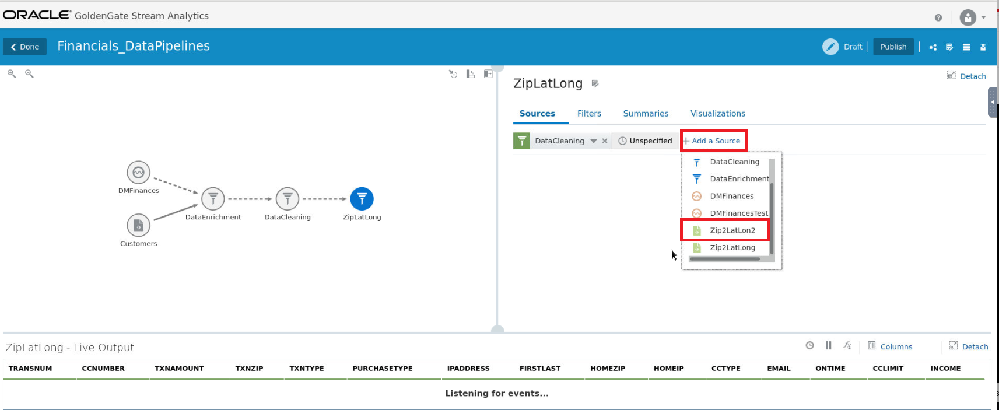

3. Click **Add a condition** and then match **Zip** equals **TXNZIP**.

    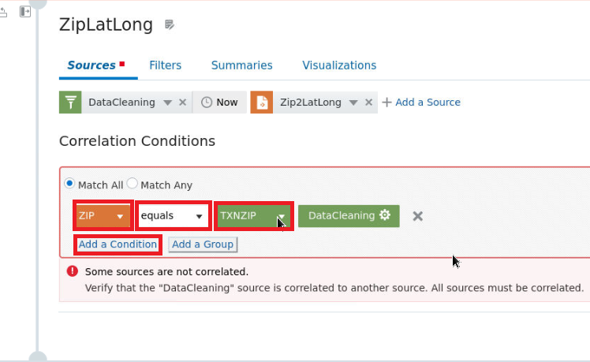

## Task 10: Create a Current and Previous Event Pattern Stage

1. Right click **ZipLatLong** stage and select **Pattern**.

    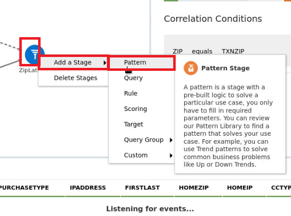

2. Select **Trend** category and choose **Current and Previous Events**.

    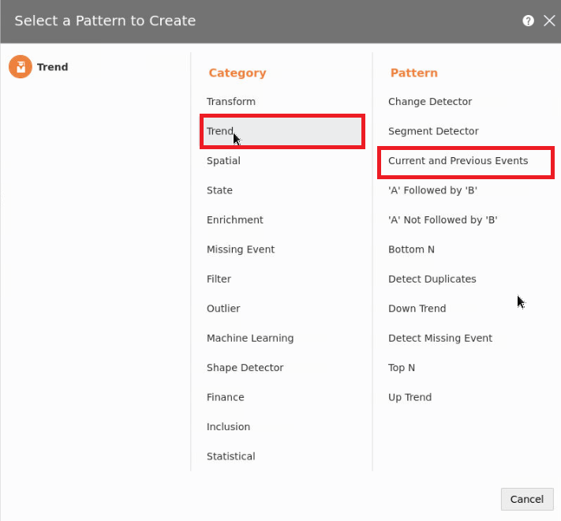

3. Name the stage **CurrPvEvents** and click **Save**.
    ```
    $ <copy>CurrPvEvents</copy>
    ```

4. Select **Partion Criteria** to include the following:
    ```
    CCNUMBER, CCTYPE, FIRSTLAST, EMAIL, HOMEZIP, HOMEIP
    ```
    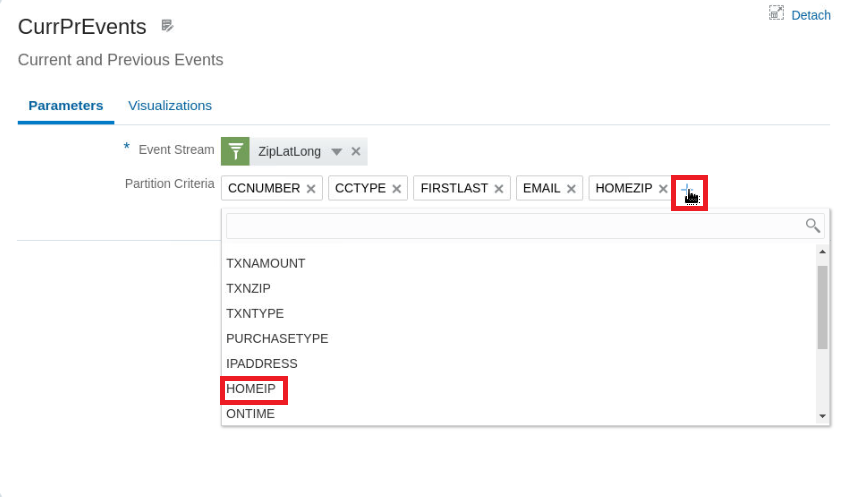

## Task 11: Add a Filter using the Spending Factor

1. Click on **NewSpending** stage to see how this source is sent to both Kafka and OAS.

    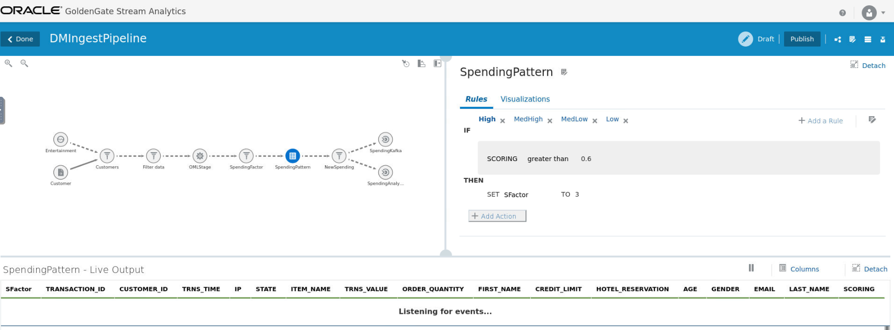

## Task 12: Create a Kafka Stage

1. Click on **SpendingKafka** to view the target mapping.

    

## Task 13: Create an OAS Stage

1. Click on **SpendingAnalytics** to view the target mapping for OAS.

    

## Task 14: Create a visualization

1. Right-click on **SpendingFactor** and add a stage. Select **Query Group** and then **Stream,** which will open a popup window.
    
    

2. Name the component **StreamCategorization** and click **Next.**

    

3. Click **Groups** tab and then **Add a Summary.**

    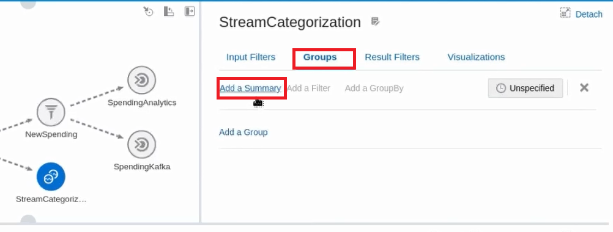

4. From the first drop-down menu, Select **Count,** then select **SFactor** on the next drop-down menu to the right.

   

5. Select **Add a GroupBy** to present a new drop-down menu.

   

6. Select **SFactor** from the menu options.

   

7. Select the **Visualization** tab and scroll down to select **Add Visualization.**

   

8. Select the **Pie Chart** from the drop-down menu.

   

9. Name the visualization **Score** and select **COUNT_of_SFactor** from the Measure menu and **SFactor** from the Group menu. Click **Create** when done.

   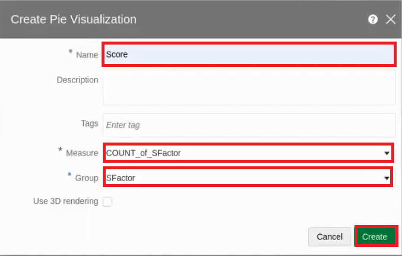

10. The result will populate a live chart that will update as the pipeline is populated with data.

   

You may now **proceed to the next lab.**

## Acknowledgements

- **Author**- Nicholas Cusato, Santa Monica Specialists Hub, July 14, 2022
- **Contributers**- Hadi Javaherian, Hannah Nguyen, Gia Villanueva, Akash Dahramshi
- **Last Updated By/Date** - Nicholas Cusato, Santa Monica Specialists Hub, July 14, 2022