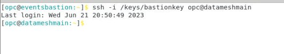

# Feed Pipeline and Validate

## Introduction

In order to simulate a real festival, a shell script has been created to mirror the streaming of transactions that would flow from IoT data sources. In order to access the Bastion server, Putty is used to ssh into the server. The terminal is used to ssh into the data source instance. This lab will walk through the process of running the script and viewing the output generated.

Estimated Time: 5 minutes

### Objectives

In this lab, you will complete the following tasks:

- SSH in Terminal
- Execute Data Feed script
- Confirm output on GGSA

### Prerequisites

This lab assumes you have:
- An Oracle Always Free/Free Tier, Paid or LiveLabs Cloud Account

## Task 1: SSH in Terminal

1. Within the browser, open a terminal and ssh into the instance.
    ```
    $ <copy>ssh -i /keys/bastionkey opc@datameshmain</copy>
    ```



2. Sudo privilege as Oracle using the following command:
    ```
    $ <copy>sudo su - oracle</copy>
    ```

3. Set the enviroment variable using the following command:
    ```
    $ <copy>. oraenv</copy>
    ```

4. Press enter to confirm ORACLE_SID = [dmdcbl]

## Task 2: Execute Data Feed script

1. In order to populate the data feed, a shell script has been deployed along with the instance. Enter the following:
    ```
    $ <copy>./feed_script.sh dmfinancials_transactionsNew.sql 1</copy>
    ```


## Task 3: Confirm output on GGSA

1. Returning to the GGSA pipeline, the live output will start to populate. Observe the data flow in each of the steps.


You may now **proceed to the next lab.**

## Acknowledgements

- **Author**- Nicholas Cusato, Santa Monica Specialists Hub
- **Contributers**- Hadi Javaherian, Hannah Nguyen, Gia Villanueva, Mathew McDaniel
- **Last Updated By/Date** - Alpha Diallo, Nicholas Cusato, June 2023