# Analyze the Discrimination Dataset

## Introduction

In this lab we will analyze a dataset on Discrimination.

Estimated Time: 30 minutes

### Objectives
- Create various visualizations of Discrimination data in order to find valuable insights.

### Prerequisites
- Oracle Analytics Cloud
- You've completed the previous lab that loads the Discrimination Dataset

## Task 1: Create Score tiles

1. From the homepage, open Data, then click on the Discrimination dataset to create a new Workbook for it. A workbook is the place where we create visualizations on datasets.

    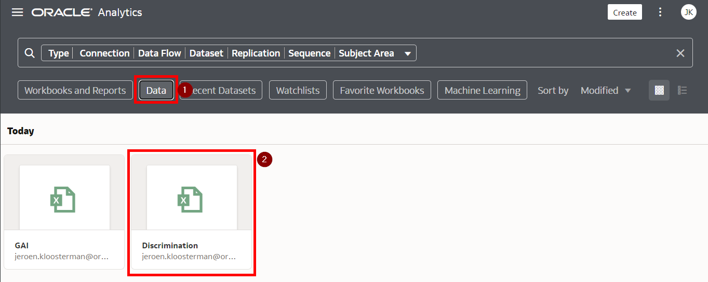

2. We want to look at Discrimination data for 2022, so let's first set a filter by dragging the Year to the filters area, and choosing 2022.

   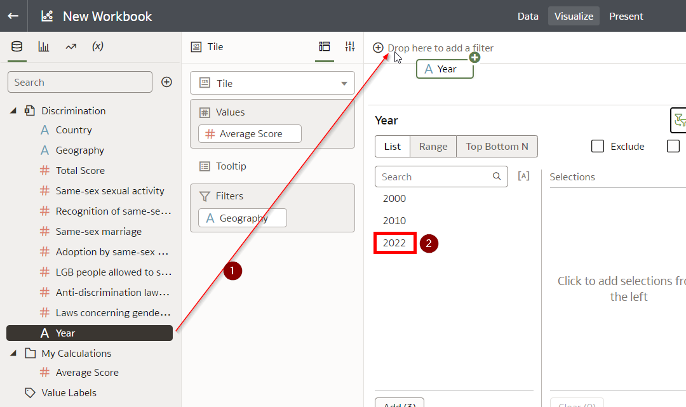

3. Our goal is to create an overview of the scores per region. In order to do that, we first create a calculation for Average Score.

   Right click on "My Calculations", then choose "Add Calculation", add the formula as shown in the screenshot, name it "Average Score" and press Save.

   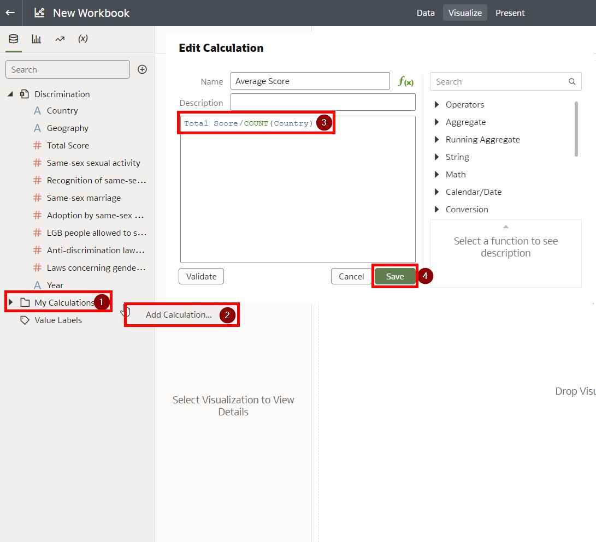

4. Drag the newly created calculated field to the canvas.

   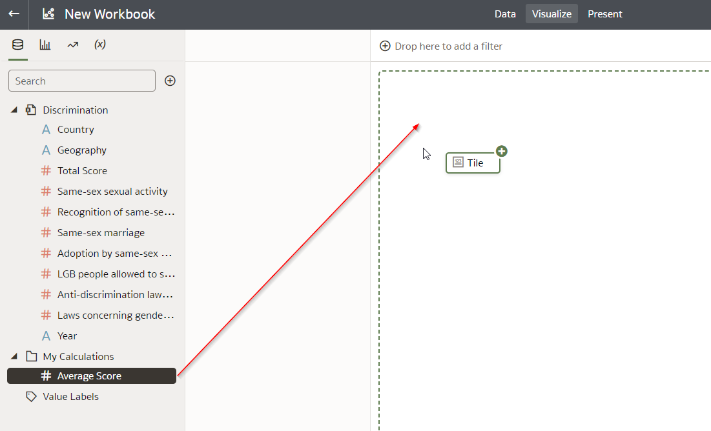

   The result should look like this:
   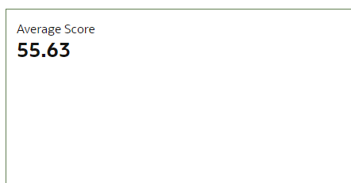

3. Now, let's create score tiles for each of the world regions. 

   Right click on the existing score tile, and select Edit -> Duplicate Visualization.

   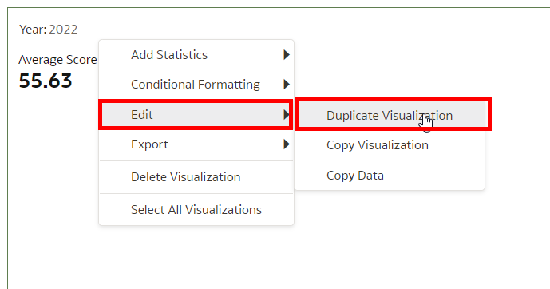

4. Click on the new visualization, drag the Geography attribute to the "Filters" and set its value to "EMEA".

   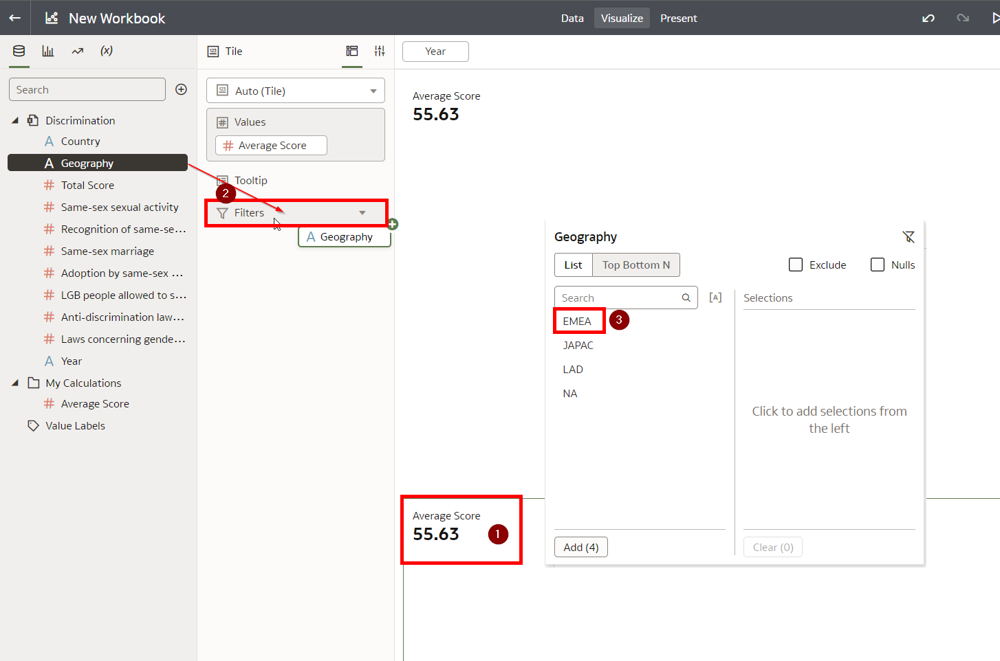

   The result should look like this:

   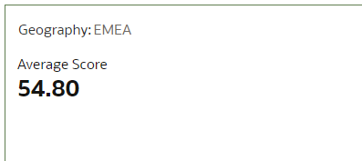

5. Now, following the same mechanism, create tiles for the average score for JAPAC, LAD and NA.

  The result should look like this:
  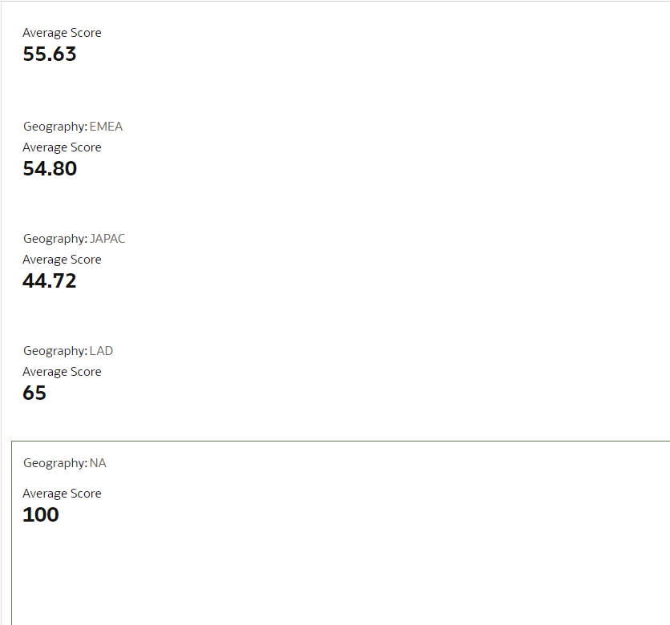

6. Move the tiles so that they are organized horizontally by dragging their headers. In the screenshot below you see how the last tile is dragged into position.

  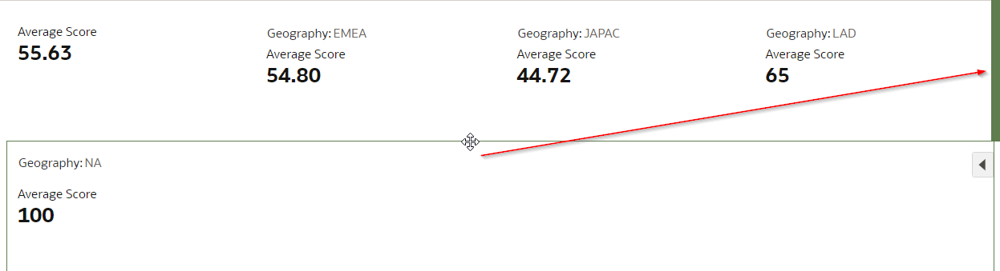

## Task 2: Create a discrimination score map view

1. Use Control+Click to select the Country and Total Score attribute. Next, right click on any of those attributes, choose Pick Visualization and choose the Map icon.

  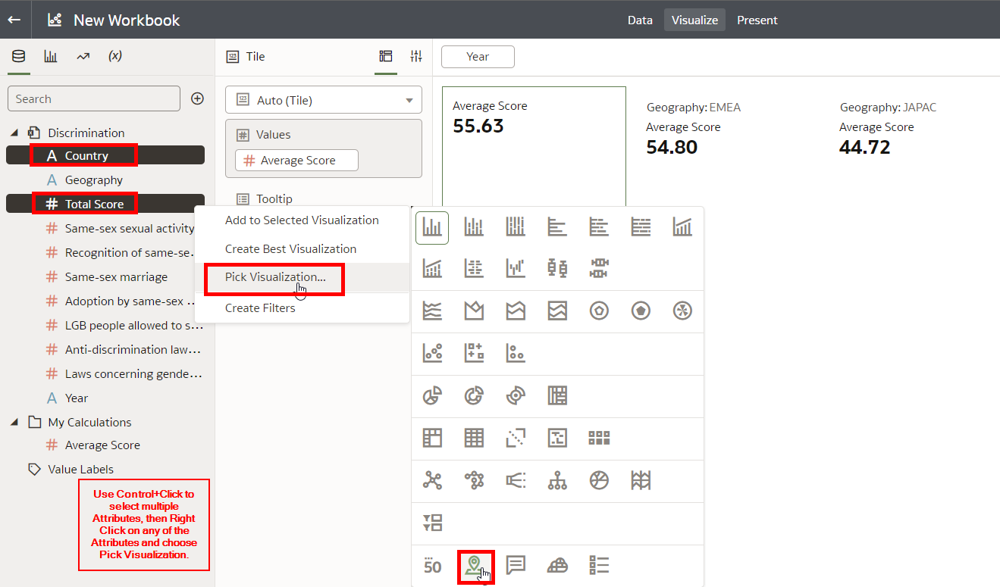

2. Drag all the other measure attributes to the Tooltip. This means these values will be shown when hovering over a country.

  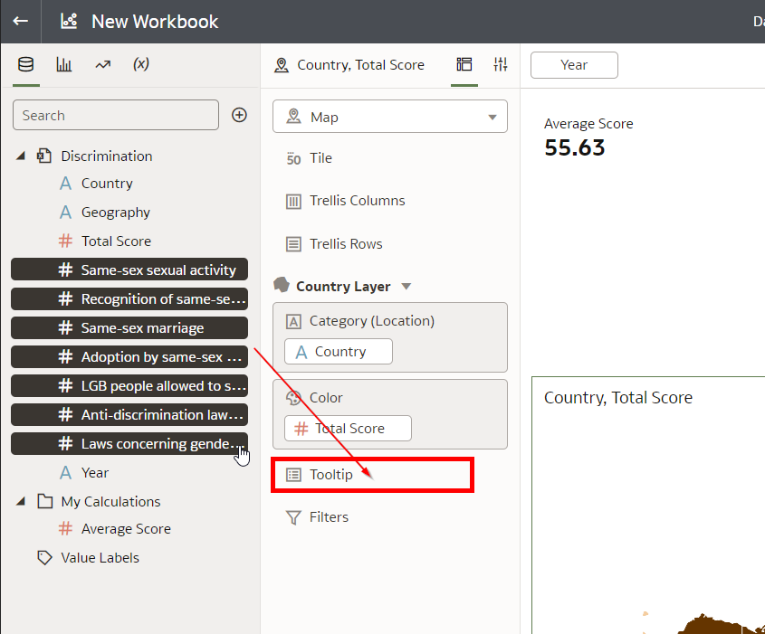

3. We want to change the colors so that they range from red to green. Choose Color -> Management Assignments, Choose the Red/Green gradient present, set Midpoint Value to 50, set Stepped Color to 20 and finally click Done.

  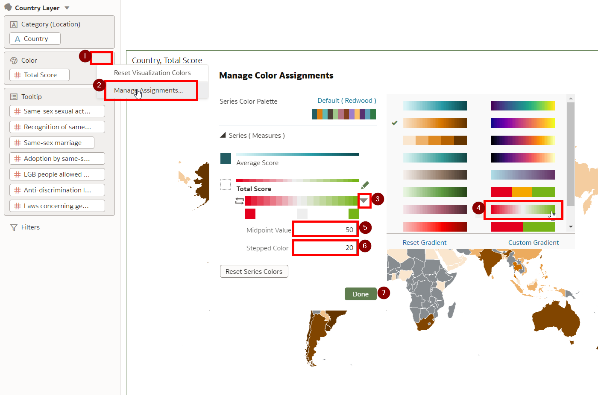

## Task 3: Create a discrimination score bar chart

1. Use Control+Click to select the Country and Total Score attributes. Drag the attributes to just below the map to create a new visualization there.

  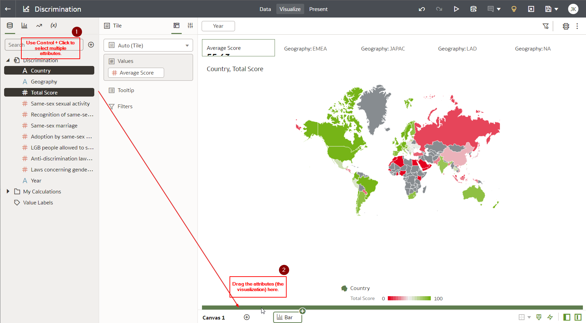

  This should automatically create a bar chart.

2. Now let's order the countries. Click the Sort icon on the new chart and sort by "Total Score" -> "High to Low", then click "Ok".

  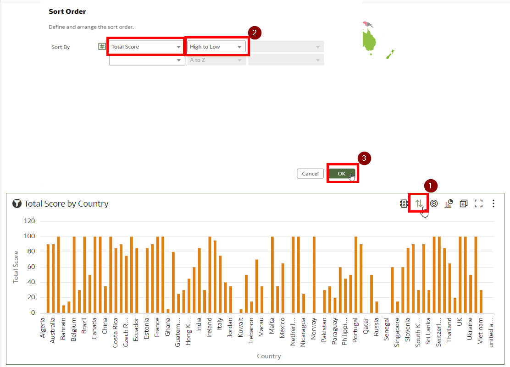

3. Drag "Total Score" to the color section to color code the chart.

  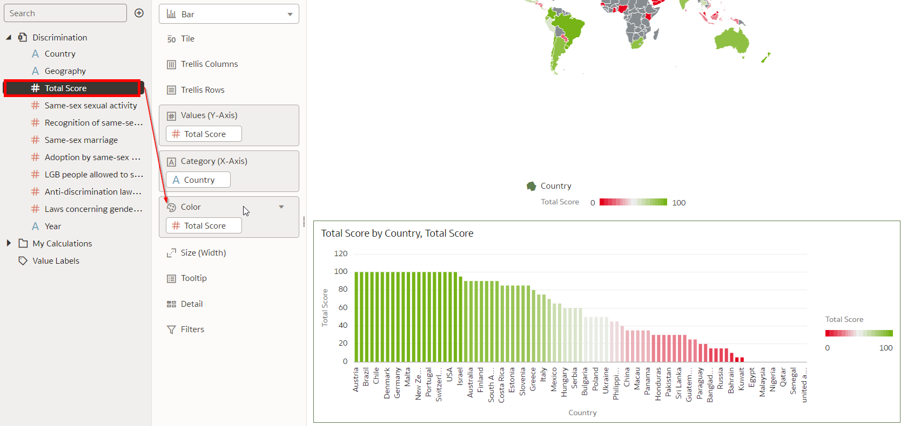

4. Finally, save the workbook by giving it a name and pressing "Save".

  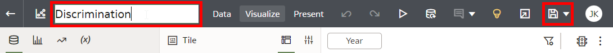

## Task 4: Experiment with different settings

Feel free to experiment with different settings to uncover new insights from the data.

1. For example, in case you are interested in focusing on Same-sex marriage in particular, you can change the chart settings accordingly. The result of this would look like this:

  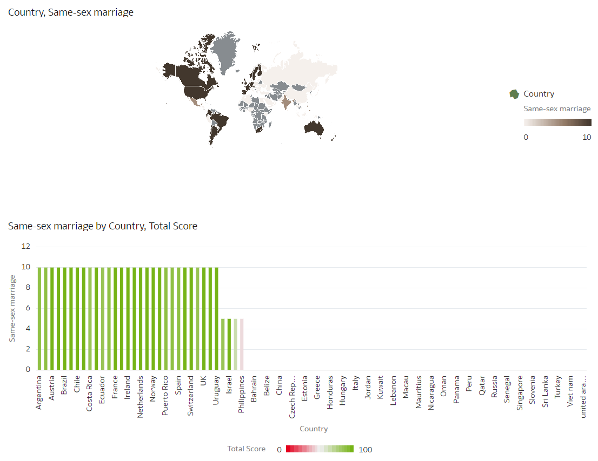

Suggestion: Try modifying the filters to see how discrimination has changed over time. Go ahead and try out different configurations!

**Proceed to the next lab.**

## **Acknowledgements**

- **Author** - Alexandra Sims - Engagement Strategy Manager, Jeroen Kloosterman - Technology Product Strategy Director.
