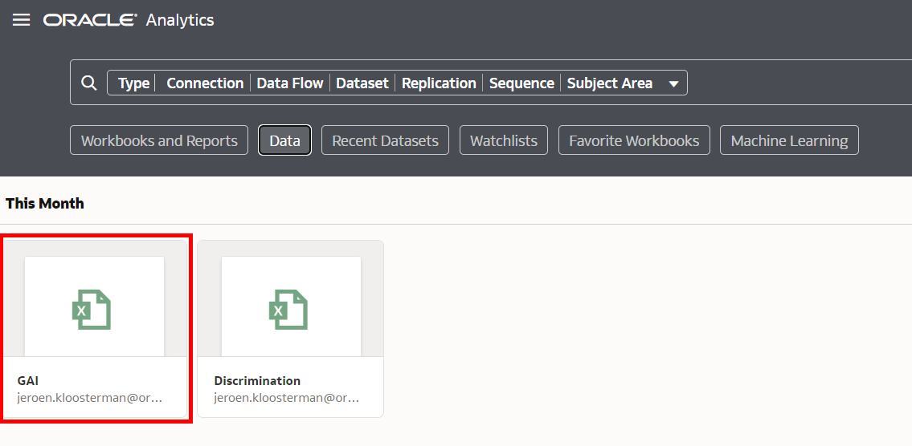
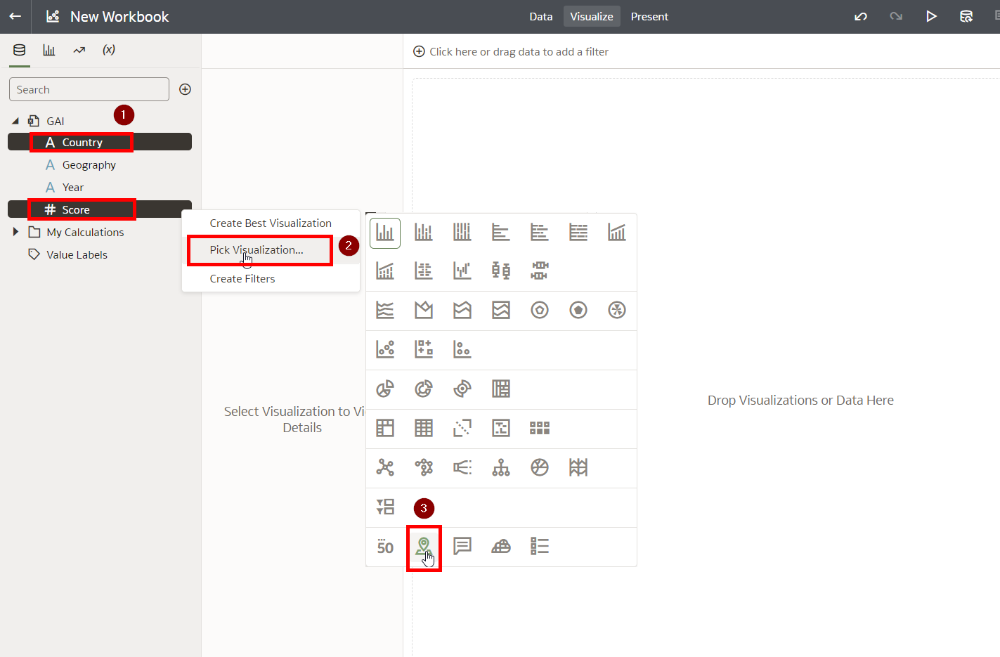
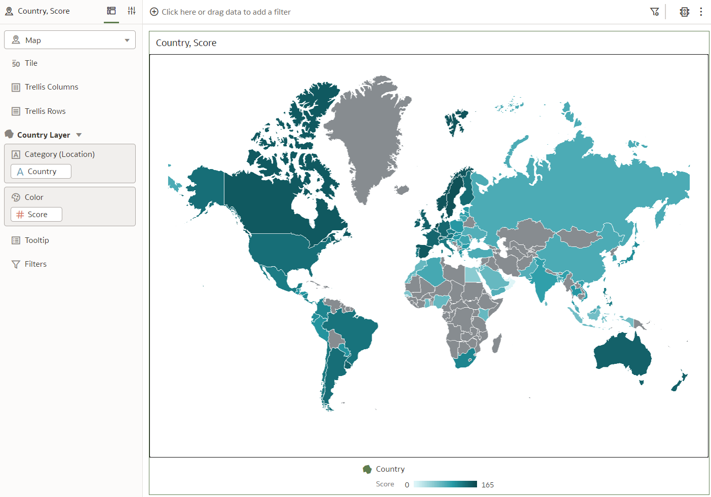
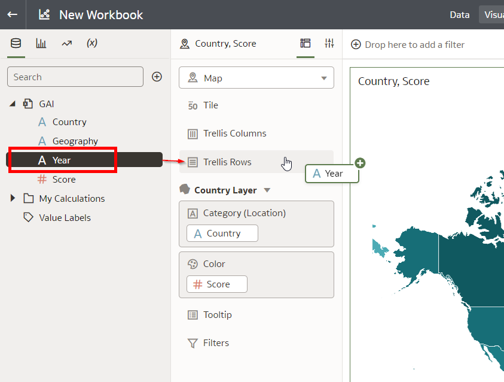
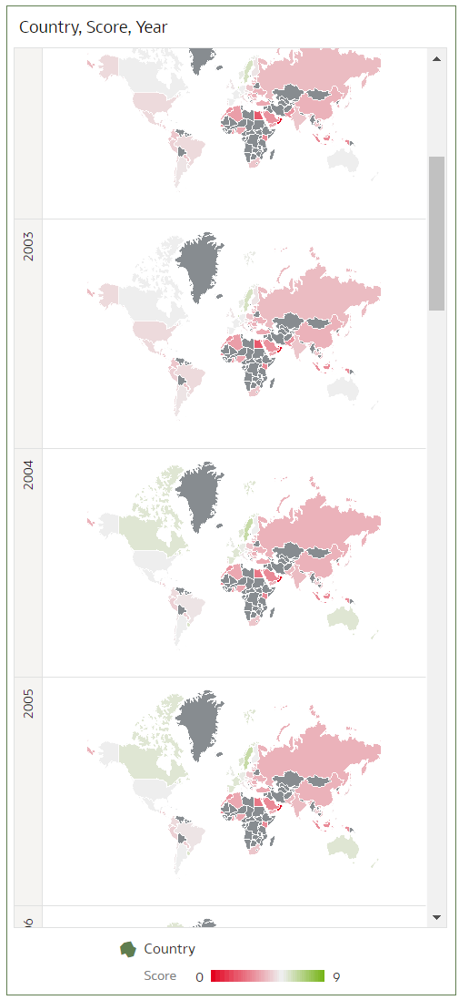
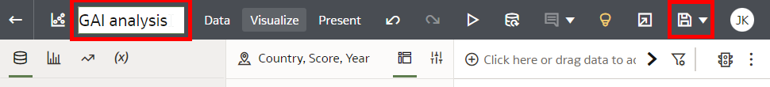

# Analyze the LGTBQ+ Global Acceptance Index (GAI) Dataset

## Introduction

In this lab we will analyze a dataset on LGTBQ+ Global Acceptance Index (GAI).

Estimated Time: 30 minutes

### Objectives
- Create various visualizations of GAI data in order to find valuable insights.

### Prerequisites
- Oracle Analytics Cloud
- You've completed the previous lab that loads the GAI Dataset

## Task 1: Create the initial Map visualization

We want to look at the trend of GAI. In other words, we want to see how the GAI Score has been changing over time.

1. From the homepage, open Data, then click on the GAI dataset to create a new Workbook for it. A workbook is the place where we create visualizations on datasets.

    

2. Select both the Year and Score attributes by using Control + Click. Next, Right Click any of the attributes, choose "Pick Visualization" and then click the Map icon.

    

    The result should look like this.

    

    Note that this will automatically summarize all the scores for all of the years, therefore this is not yet the end result that we want.

## Task 2: Show the score trend by creating a Map for each year

1. Drag the Year attribute to the "Trellis Rows" section of the chart.

    

   This will create a separate Map for each year. 
   Feel free to adapt the colors of the Map.
   The result should look like this.

    

   Note how you can now see how GAI score has changed over the years.

2. Finally, save the workbook by giving it a name and pressing "Save".

    

Congratulations on completing the workshop!

## **Acknowledgements**

- **Author** - Alexandra Sims - Engagement Strategy Manager, Jeroen Kloosterman - Technology Product Strategy Director.
