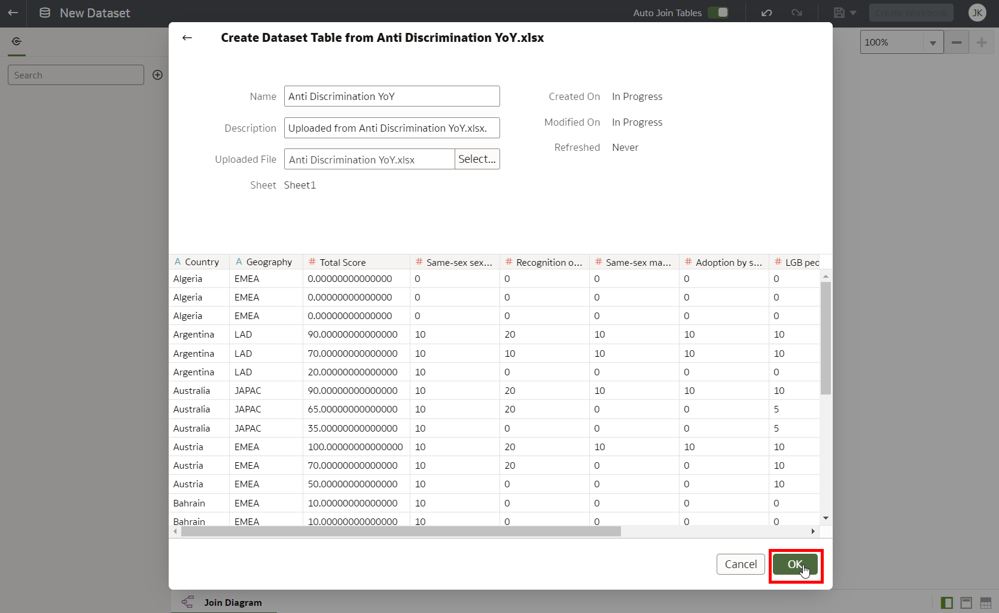

# Load and Prepare Data

<!---->

## Introduction

In this lab we will load the data on Discrimination and LGTBQ+ Global Acceptance Index (GAI).

Estimated Time: 5 minutes

### Objectives
- Open Analytics Cloud.
- Load and Explore Data.

### Prerequisites
- Oracle Analytics Cloud.

## Task 1: Open Oracle Analytics Cloud

1. In Oracle Cloud, click the **Navigation Menu** in the upper left, navigate. Navigate to **Analytics & AI** and then **Analytics Cloud**.

    

8. **Open** the Cloud Analytics **URL** associated with your instance (we created this earlier) by using the dots menu button on the right-hand side of your instance information and selecting **Analytics Home Page**.

   Make sure your Oracle Analytics Cloud instance is in status `Active` (not `Creating`) before you go to the **Analytics Home Page**. 

   

   The **Oracle Analytics** page will open in a new browser **window/tab**.

## Task 2: Add the Discrimination Dataset

1. **Download** the <a href="./files/Anti Discrimination YoY.xlsx" target="\_blank">Discrimination dataset</a> to your local machine. Depending on your browser, you may have to use Right Click. Make sure that the file is saved with extension `.xlsx`.

2. In Oracle Analytics Cloud, on the top right, choose Create and then Dataset.

   

3. Drag the "Anti Discrimination YoY.xlsx" file on top of the indicated tile.

   

4. Confirm the dataset by pressing Ok.

   

5. By default, the Year is classified as a Measure. This is incorrect, as we will not use it for any calculations. Therefore, change the Year to an Attribute by first choosing "Anti Discrimination YoY", then click the "Year" column, and change the "Treat As" setting to "Attribute".

   

6. Finally, save the dataset by giving it the name "Discrimination", then press the Save icon, and click the Left button to go back to the main menu.

   

## Task 3: Add the LGTBQ+ Global Acceptance Index (GAI) Dataset

1. **Download** the <a href="./files/GAI Index.xlsx" target="\_blank">GAI dataset</a> to your local machine. Depending on your browser, you may have to use Right Click. Make sure that the file is saved with extension `.xlsx`.

2. In Oracle Analytics Cloud, on the top right, choose Create and then Dataset.

   

3. Drag the "Anti Discrimination YoY.xlsx" file on top of the indicated tile.

   

4. Confirm the dataset by pressing Ok.

   

5. By default, the Year is classified as a Measure. This is incorrect, as we will not use it for any calculations. Therefore, change the Year to an Attribute by first choosing "Anti Discrimination YoY", then click the "Year" column, and change the "Treat As" setting to "Attribute".

   

6. Finally, save the dataset by giving it the name "GAI", then press the Save icon, and click the Left button to go back to the main menu.

   

You may now proceed to the next lab.

## **Acknowledgements**

- **Author** - Alexandra Sims - Engagement Strategy Manager, Jeroen Kloosterman - Technology Product Strategy Director.
