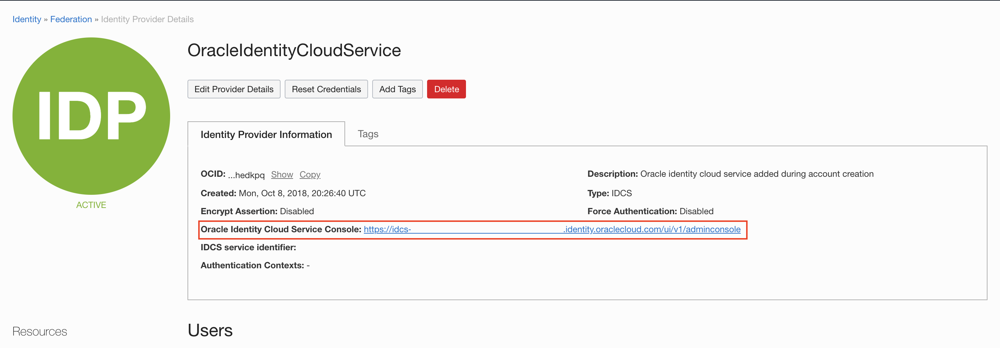
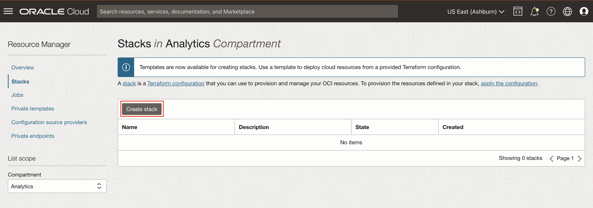
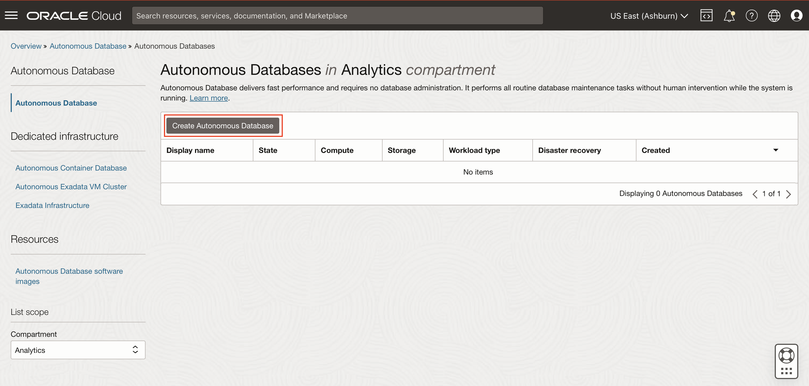
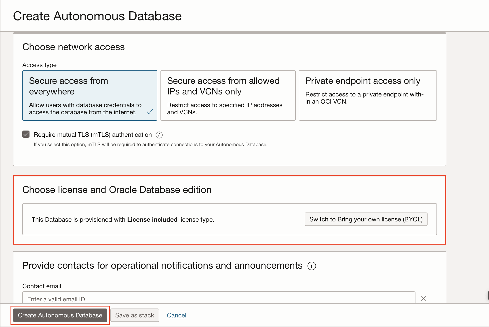
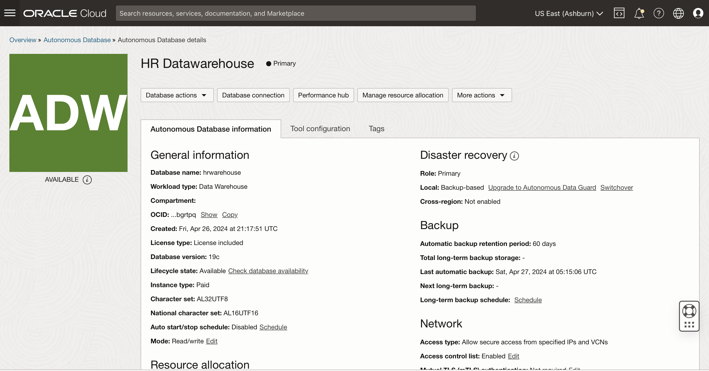

# Provision Resources

## Introduction

In this lab you will provision the resources required for this workshop.

Estimated Time: 30 minutes

### Objectives

Provision an Autonomous Data Warehouse instance and an Analytics Cloud instance.

### Prerequisites

- Method 1
    - IDCS Access Token to provision an analytics instance as part of the stack.
    - Necessary permissions to provision the stack in a compartment.

- Method 2
    - Necessary permissions to provision an analytics instance and an autonomous database.

## **METHOD 1:** Using a Resource Manager Stack

In order to provision an analytics cloud instance as part of a **Resource Manager** stack, an IDCS access token is required. If you don't have the necessary privileges, then proceed to Method 2.

### Task 1: Obtain IDCS Access Token

1. Click on the **Navigation Menu** in the upper left, navigate to **Identity & Security** and select **Federation**.

	

2. Click on the link to the **OracleIdentityCloudService**.

    

3. In the page that opens, click on the Service Console URL.

    

4. In the Identity Cloud Service Console, click on the user icon in the top right corner and select **My Access Tokens**.

    

5. If you have access to the relevant APIs, you should be able to select them, under the **Invokes Identity Cloud Service APIs** radio button. Thereafter, enter the duration of validity of the token in minutes and click on the **Download Token** button.

    

**Note:** If you don't have access to the required APIs, follow **Method 2**.

6. Open the token.tok file that you just downloaded. Keep it handy because in a few minutes you will need to copy the contents of this file.

    

**Note:** You may follow the video [here](https://objectstorage.us-ashburn-1.oraclecloud.com/p/VEKec7t0mGwBkJX92Jn0nMptuXIlEpJ5XJA-A6C9PymRgY2LhKbjWqHeB5rVBbaV/n/c4u04/b/livelabsfiles/o/data-management-library-files/mdw%20-%20idcs.mp4), if you are unsure of the steps above.

7. You may now close the Identity Cloud Service Console.

### Task 2: Provision the Stack

1. Click on the **Navigation Menu** in the upper left, navigate to **Developer Services**, and select **Stacks**.

	

2. Click on the **Create Stack** button.

    

3. Select the **Template** radio button. Then, click on the **Select template** button.

    

4. In the side menu that opens, select the **Architecture** tab and then check the **Departmental Data Warehousing** template and hit the **Select template** button.

    

5. Provide a name to the stack and hit **Next**.

    

6. On the **Configure Variables** screen, enter the admin password, database name and database display name.

7. Check the **Auto Scaling** box to enable auto-scaling of the database. Enabling this is optional, but recommended. Also, enter 0.0.0.0/0 in the public IP address field.

    

8. Scroll down and provide a name to the analytics instance and paste the access token that you had downloaded earlier. Now, hit **Next**.

    

9. Review all the details and click on the **Create** button.

    

10. Now that the stack has been created, click on **Apply**. In the panel that appears, click on **Apply**, again.

    

    

    

**Note:**  If you have followed the steps above, the job should succeed without any issues. Keep an eye on the logs to monitor the progress. If the job fails, please fix the issues and proceed. To do so, click on **Stack Details** at the top of the page. Then, click on the **Edit** dropdown and select **Edit Stack** to get to the stack configuration page. Thereafter, you need to fix the errors and save the changes.

    

11. If everything goes to plan, the status of the job will change to **SUCCEEDED**.

    

12. On the same page, you will find the **Job resources** under the **Resources** menu. Click on it to get the links to the provisioned resources.

    

13. Clicking on the links to the resources should take you to their pages.

**Note:** In case there is no link to get to analytics instance, follow the two steps given below, else proceed to the next lab.

14. Click on the **Navigation Menu** in the upper left, navigate to **Analytics & AI**, and select **Analytics Cloud**. 
	
	

15. Click on the analytics instance to get to its page. Thereafter, click on the **Analytics Home Page** button to access the instance.

    

    

## **METHOD 2:** Independently Provision the Resources

### Task 1: Provision the Autonomous Data Warehouse

1. Click on the **Navigation Menu** in the upper left, navigate to **Oracle Database**, and select **Autonomous Data Warehouse**.
	
	

2. Click on the **Create Autonomous Database** button.

    

3. Choose a compartment, enter the **Display Name** and also enter a name for the **Database**. Leave everything else set to the default values.

    

4. Scroll down and provide a password for the administrator.

    

5. Choose an appropriate licence type and thereafter, hit **Create Autonomous Database**.

    

6. The database should be up and running in a couple of minutes.

    

**Note:** Keep this page open or make note of how to get here, since you will need to visit this page for the information required to connect to the database.

### Task 2: Provision the Analytics Cloud Instance

1. Click on the **Navigation Menu** in the upper left, navigate to **Analytics & AI**, and select **Analytics Cloud**. 
	
	

2. On the next page, click on the **Create Instance** button.

    

3. Choose a compartment and provide a name for the instance. Let everything else stay the same. Then click on **Create**.

    

4. The instance will be up in 12-14 minutes. Once the instance is available, click on the **Open URL** button to gain access to the instance.

    

You may now **proceed to the next lab**.

## Acknowledgements
 - **Authors** - Yash Lamba, Senior Cloud Engineer; Massimo Castelli, Senior Director Product Management. September 2020
 - **Contributors** - Maharshi Desai, Frankie OToole, Clarence Ondieki, Shikhar Mishra, Srihareendra Bodduluri, Arvi Dinavahi, Devika Chandrasekhar, Shikhar Mishra
 - **Last Updated By/Date** - Yash Lamba, March 2023

