# Run Analytics - Create Dashboards

## Introduction

In this lab, you will use a DVA file to get started with HR Departmental analytics in Oracle Analytics Cloud.

Estimated Lab Time: 45 minutes

### Objectives

- Create connection to ADW  
- Upload DVA file and refresh the data flowing through the connection
- View analysis.

### Prerequisites

- Autonomous Data Warehouse (ADW) and Oracle Analytics Cloud (OAC) instances.
- Access to the files needed to recreate this demo. 
    - [AttritionPrediction.csv](https://objectstorage.us-ashburn-1.oraclecloud.com/p/VEKec7t0mGwBkJX92Jn0nMptuXIlEpJ5XJA-A6C9PymRgY2LhKbjWqHeB5rVBbaV/n/c4u04/b/livelabsfiles/o/data-management-library-files/AttritionPrediction.csv)
    - [HumanResources.dva](https://objectstorage.us-ashburn-1.oraclecloud.com/p/VEKec7t0mGwBkJX92Jn0nMptuXIlEpJ5XJA-A6C9PymRgY2LhKbjWqHeB5rVBbaV/n/c4u04/b/livelabsfiles/o/data-management-library-files/HumanResource.dva)
    - [hr.sql](https://objectstorage.us-ashburn-1.oraclecloud.com/p/VEKec7t0mGwBkJX92Jn0nMptuXIlEpJ5XJA-A6C9PymRgY2LhKbjWqHeB5rVBbaV/n/c4u04/b/livelabsfiles/o/data-management-library-files/hr.sql)

**Note:** Please download the files above before continuing.

## Task 1: Installing HR Schema on Autonomous Database

1. Use SQL Developer to connect to your database as the ADMIN user. The steps to do so can be found [here](https://docs.oracle.com/en/cloud/paas/autonomous-data-warehouse-cloud/user/connect-sql-dev182.html#GUID-14217939-3E8F-4782-BFF2-021199A908FD).

2. Run the following code to create the HR user. You should replace MYpassword12 in the statement below with a password of your choosing.

    ```
    CREATE USER HR IDENTIFIED BY MYpassword12;
    
    GRANT DWROLE TO HR;

    ALTER USER HR QUOTA UNLIMITED ON DATA;
    ```

3. Now go ahead and log in as the HR user, then run the hr.sql script to install the HR schema. 

4. The following tables should be visible: EMPLOYEES, LOCATIONS, JOBS, COUNTRIES, DEPARTMENTS, REGIONS, JOB_HISTORY

    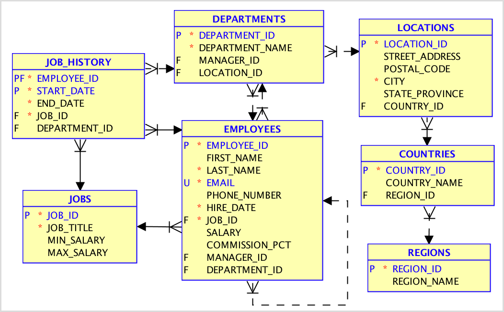
    
## Task 2: Setting up the Human Resource Analytics Project in OAC

1. Login to your analytics cloud instance. The URL can be found on the page of the instance. Refer to the previous lab for instructions on how to get to your analytics cloud instance.

    

2. Click on the ellipses menu on the right-side, select **Import Project/Flow**. Then click on **Select File** and choose the HumanResources.dva file.

    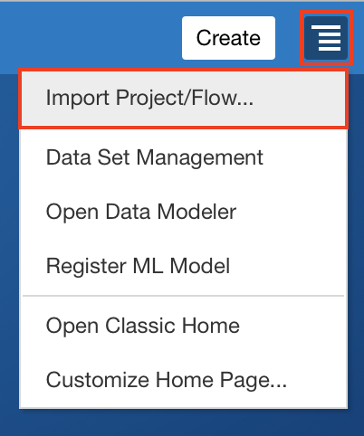
    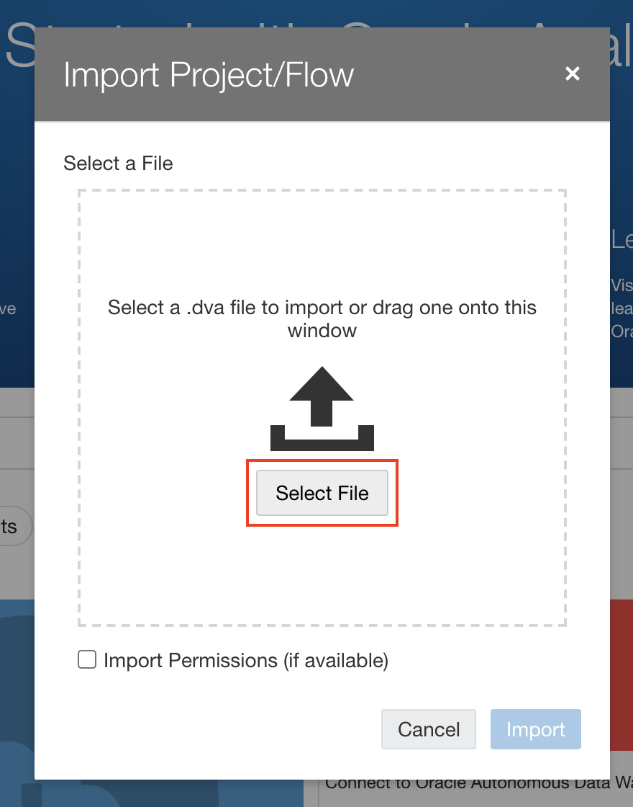

3.  Import the file into OAC by clicking on **Import**. The password is **Admin123**. Hit OK to close the dialog. 

    
    

4. Click on the navigation menu icon in the top left. Go to **Data** and open the **Connections** tab. You should see a connection named 'adw_hr'. 

    
    

5. Click on the ellipses menu on the extreme right of the connection’s name and select inspect.

     

6. Click on the **Select** button in front of Client Credentials and select the wallet to your ADW instance. Let the username be **ADMIN** and provide the database password. Click **Save**.

    

7. We will now refresh our data sets to utilize our connection. Select the **Data Sets** tab and you will see all our tables appear below. Go ahead and reload each data set by clicking on the ellipses menu to the right of the data set's name and selecting **Reload Data**.

    

8. Now proceed to the hamburger menu and select **Catalog** and open your project. The visualizations should load, but click **Refresh Data** if needed to refresh the visuals.

    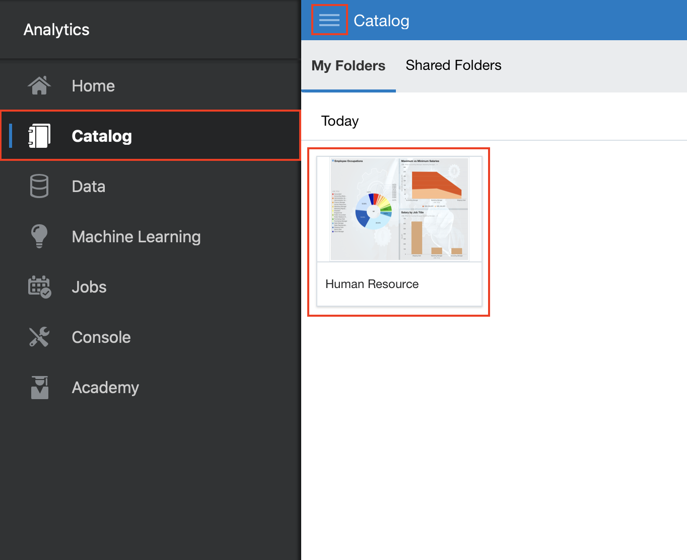
    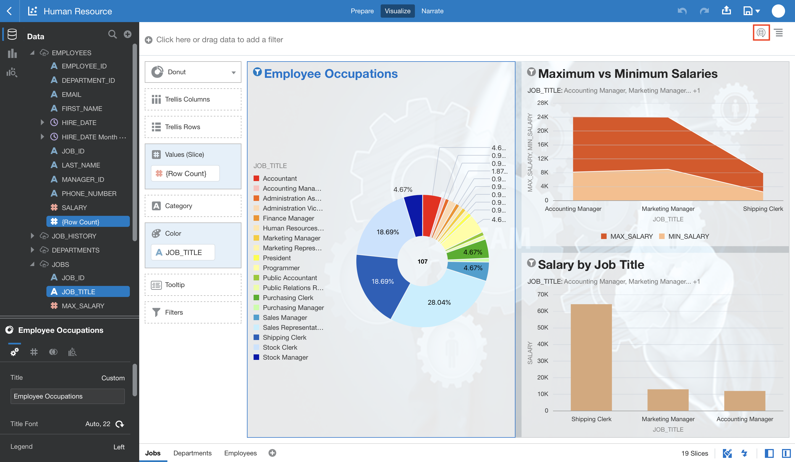

## Task 3: Uploading a file to the Datawarehouse using OAC

1. Return to the home page. Click on the **Create** button and then select **Data Flow**.

    

2. Select the **Create Data Set**, choose the **Click to Browse** option and select the AttritionPrediction.csv file. 

    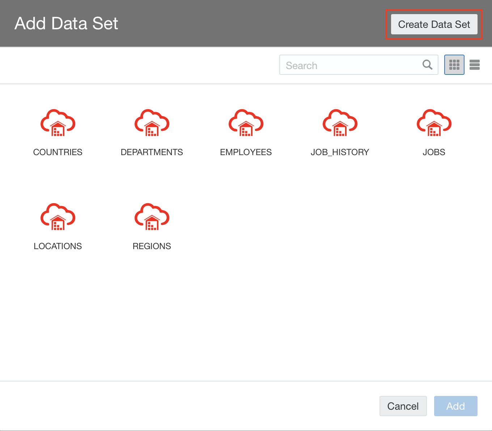
    

**Note:** You may drag and drop the file instead.

3. Once the file is uploaded, select **Add**.
    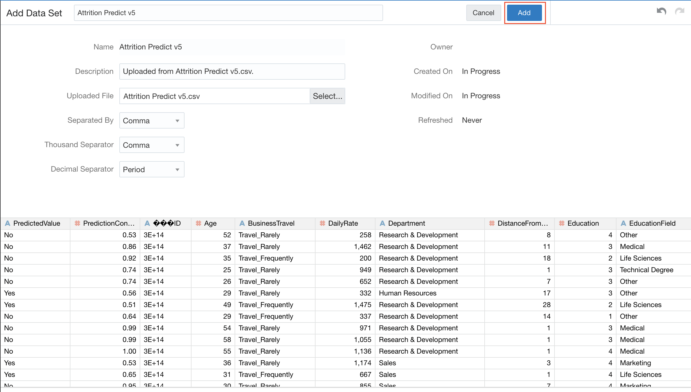

4. Next, drag the **Save Data Set** option from the **Data Flow Steps** on the left, and move it right next to the Attrition Prediction data set in the panel at the top. Provide a name to the Data Set. In the **Save Data To** drop down, select **Database Connection**. 

    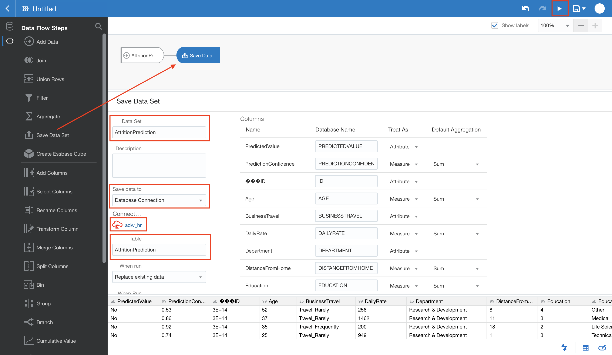

5. Click on **Select connection** and choose the adw_hr connection. Thereafter, also give a name that would be used for the table in the database.

    

6. Hit the **Run Data Flow** button at the top. You will be prompted to save the data flow. Give it a name and click on **Save & Run**.

    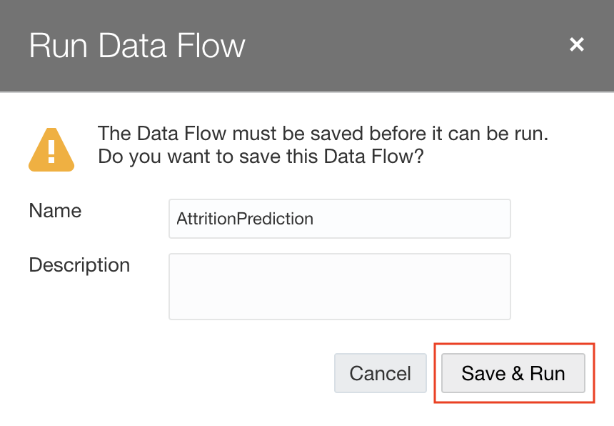

The data flow should run and upon successful execution you should be able to see the two data sets under the **Data** menu item.

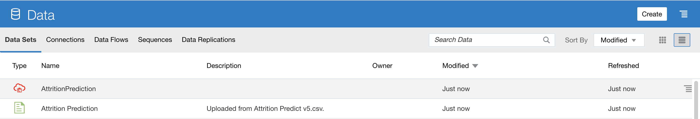

## Task 4: Using Attrition Data set in the Human Resource project

1. Open the Human Resource project. From the data panel, click on the 'plus' sign and select **Add Data Set**.

    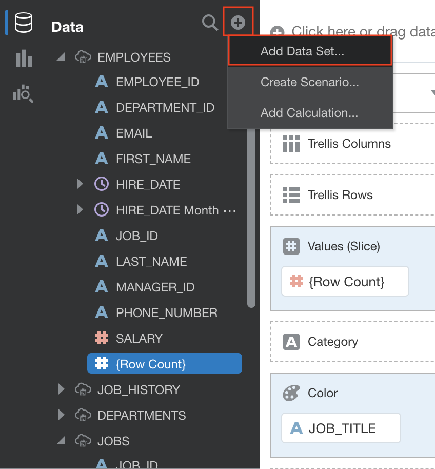

2. Select the **AttritionPrediction** data set that is stored in the database.    
    
    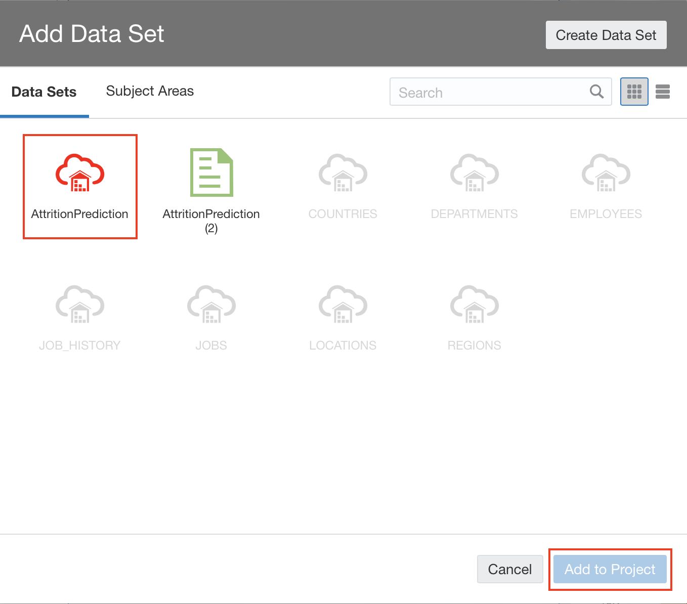

3. Click on the '+' sign next to the canvas names at the bottom of the screen to add a new canvas. 

    

4. Right click on the name of the new canvas and choose **Rename**. Give the canvas a meaning full name.

    

5. Now drag the **Employee Count** data item under Attrtion Prediction to this canvas to get you first visualisation. 

    

We will now leave it upto your imagination to analyse the data sets that have been provided to you.

*Congratulations! You have successfully completed the lab*.

## Acknowledgements
 - **Author** - Yash Lamba, Cloud Native Solutions Architect, Massimo Castelli, Senior Director Product Management, September 2020
 - **Contributors** - Maharshi Desai, Frankie OToole, Clarence Ondieki, Shikhar Mishra, Srihareendra Bodduluri, Arvi Dinavahi, Devika Chandrasekhar, Shikhar Mishra,
 - **Last Updated By/Date** - Kay Malcolm, October 2020

