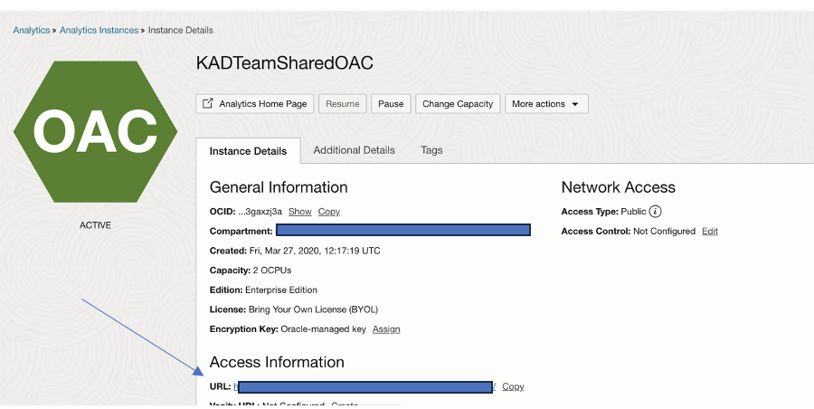

# Connect OAC to Essbase cube

<!---->

## Introduction

This lab shows how we can create a connection between OAC and Essbase

*Estimated Lab Time:* 10 minutes

### Objectives
In this lab, you will:
- Launch OAC Console
- Connect to Essbase.

### Prerequisites
- Oracle Free Trial Account.

## Task 1 : Launch Cloud URL

### Login to OCI Console

Click on the hamburger icon, select Analytics & AI and click on Analytics Cloud

Launch OAC Console:

Click on the https URL under Access Information

## Task 2: Create Essbase Connection

Click on create and select connections:

Click on Oracle Essbase:

Enter the relevant details:
- a.	Provide a connection name.
- b.	Appropriate description
- c.	Enter the DSN as per the screenshot. (Make sure It is either Non-SSL URL or a CA certified Certificate which you are using)
- d.	Provide username and password, please make sure the user you are providing here has admin access to Essbase instance.
- e.	Click on Save

## Task 3: Create Dataset

Click on Create and select Dataset:

A pop up will appear with the list of connections, select the connection we created above for Essbase:

Select the application for which you want to perform reporting and click on Add:

Note: You can create multiple datasets for the same application by giving different names to the Dataset

## Acknowledgements

 - **Authors** – Srinivas SR NACI
 - **Contributors** - Srinivas SR/ Sudip Bandyopadhyay, NACI
 - **Last Updated By/Date** – 22/02/2024

