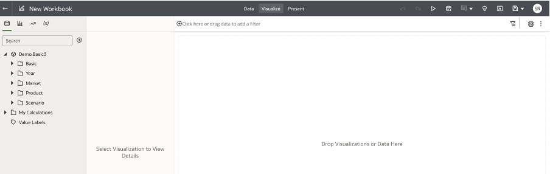
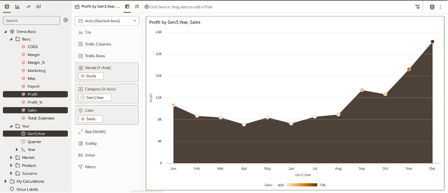
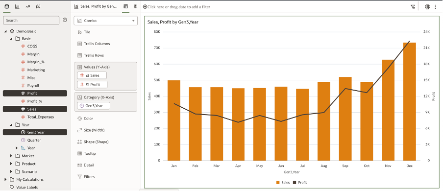
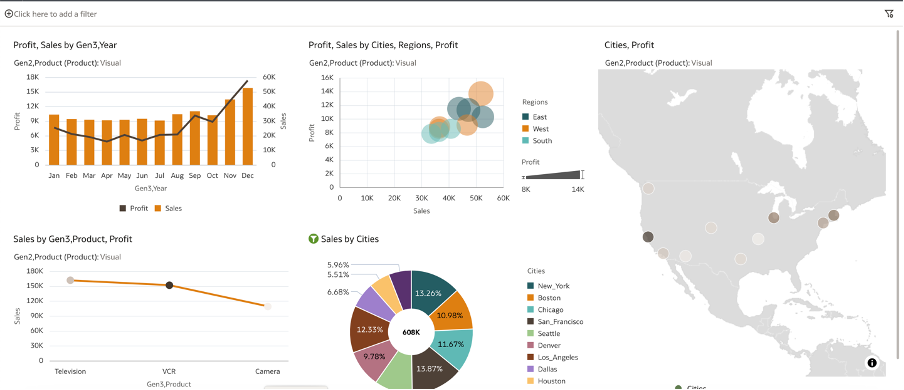

# Creating Workbooks

<!---->

## Introduction

In this lab we will be creating Data Visualisations in OAC using Essbase connection created.

*Estimated Lab Time:* 30 minutes

### Objectives
In this lab, you will:
- Create Workbook
- Create Visualisation

### Prerequisites
- Oracle Free Trial Account.

## Task 1: Create Workbook

Follow below steps to create a Workbook:

1.Click on Create Workbook

2.From the Dataset, select Gen3 year from Year folder and Profit and Sales from Basic folder and drag them to the visualization section.

OAC will create the best visualization based on the type of columns we have used.

3.Now we can change it to line bar visualization to represent data in more meaningful way.

4.You can play around with the data set and create more visualizations to build a story Below is the sample dashboard for your reference:

## Acknowledgements

 - **Authors** – Srinivas SR NACI
 - **Contributors** - Srinivas SR/ Sudip Bandyopadhyay, NACI
 - **Last Updated By/Date** – 30/11/2023