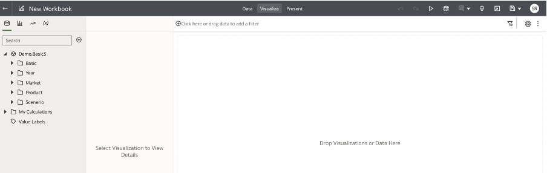
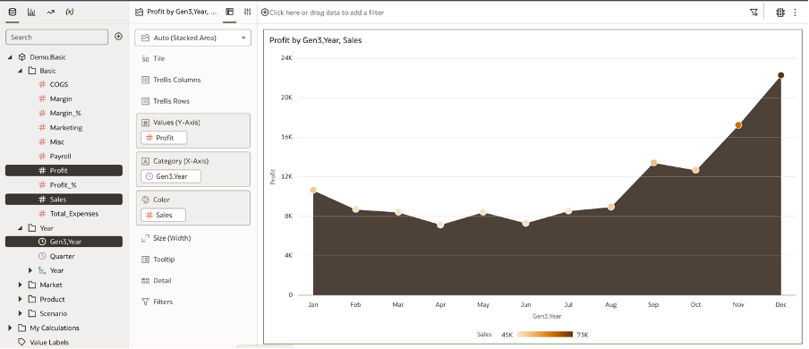
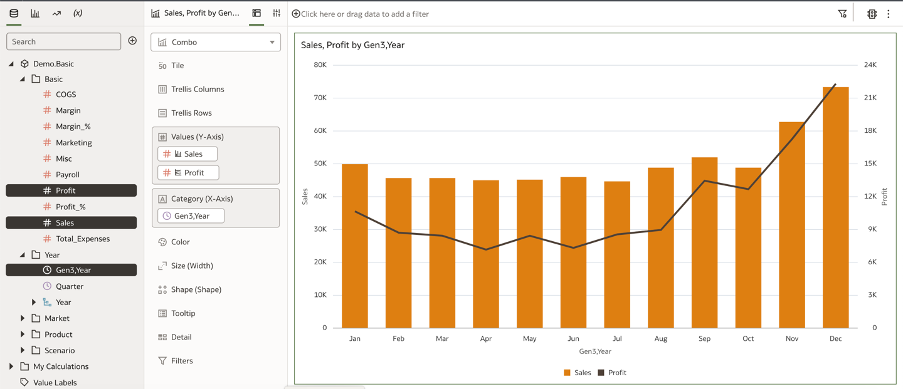
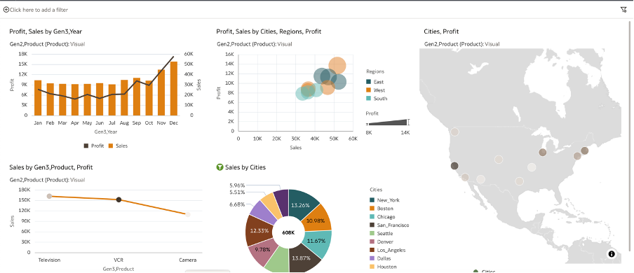

# Creating Workbooks

In this lab we will be creating Data Visualisations in OAC using Essbase connection created.

### Task 1: Create Workbook

Click on Create Workbook

From the Dataset, select Gen3 year from Year folder and Profit and Sales from Basic folder and drag them to the visualization section.

OAC will create the best visualization based on the type of columns we have used.

Now we can change it to line bar visualization to represent data in more meaningful way.

You can play around with the data set and create more visualizations to build a story Below is the sample dashboard for your reference:

