# Set up compute instance

<!---->

## Introduction

This lab will show you how to set up a Resource Manager stack that will generate the Oracle Cloud objects needed to run your workshop.

*Estimated Lab Time:* 15 minutes 

Watch the video below for a walk-through of this Environment Setup lab.

<iframe width="300" height="600" src="https://www.youtube.com/embed/anPEOZYBdyA" title="Environment Setup" frameborder="0" allow="accelerometer; autoplay; clipboard-write; encrypted-media; gyroscope; picture-in-picture; web-share" allowfullscreen></iframe> 

 

### About Terraform and Oracle Cloud Resource Manager

For more information about Terraform and Resource Manager, please see the appendix below.

### Objectives

In this lab, you will:

- Create Compute + Networking Resource Manager Stack
- Connect to compute instance

### Prerequisites

- Oracle Free Trial Account.

## Task 1: Create Stack: Choose a Path

Proceed to deploy your workshop environment using Oracle Resource Manager (ORM) stack

Your options are:

1. Task 1A: Create Stack: Compute + Networking (recommended)
2. Task 1B: Create Stack: Compute Only

## Task 1A: Create Stack: Compute + Networking

1. Identify the ORM stack zip file downloaded in Lab: Prepare Setup

2. Log in to Oracle Cloud

3. Open up the hamburger menu in the top left corner. Click Developer Services, and choose Resource Manager > Stacks. Choose the compartment in which you would like to install the stack. Click Create Stack.

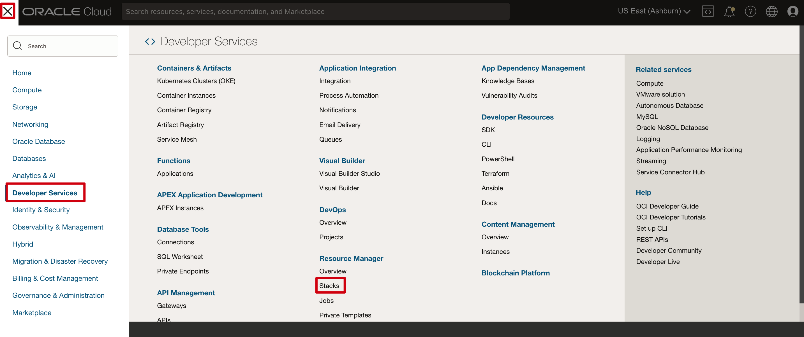

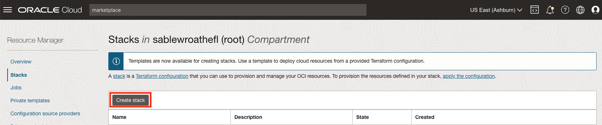

4. Select **My Configuration**, choose the **.Zip file** button, click the **Browse** link, and select the zip file that you downloaded or drag-n-drop for the file explorer.

5. Click **Next**.

6. Enter or select the following:

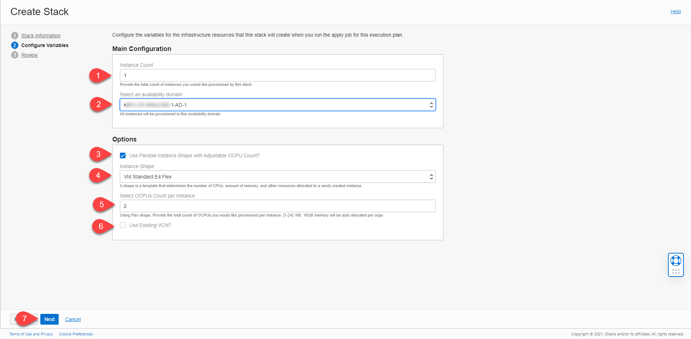

 - **Instance Count**: Accept the default, 1, unless you intend to create more than one. e.g. for a team
 - **Select Availability Domain**: Select an availability domain from the dropdown list.

7. Depending on the quota you have in your tenancy you can choose from standard Compute shapes or Flex shapes. Please visit the Appendix: Troubleshooting Tips for instructions on checking your quota

 - **Use Flexible Instance Shape with Adjustable OCPU Count?**: Keep the default as checked (unless you plan on using a fixed shape)
 - **Instance Shape**: Keep the default or select from the list of Flex shapes in the dropdown menu (e.g *VM.Standard.E4.Flex*).
 - **Instance OCPUS**: Accept the default shown. e.g. (4) will provision 4 OCPUs and 64GB of memory. You may also elect to reduce or increase the count by selecting from the dropdown. e.g. [2-24]. Please ensure you have the capacity available before increasing.

8. If don't have any quota for Flex Shapes or you prefer to use fixed shapes, follow the instructions below. Otherwise, skip to the next step.

 - **Use Flexible Instance Shape with Adjustable OCPU Count?**: Unchecked
 - **Instance Shape**: Accept the default shown or select from the dropdown (e.g. *VM.Standard2.2*).

 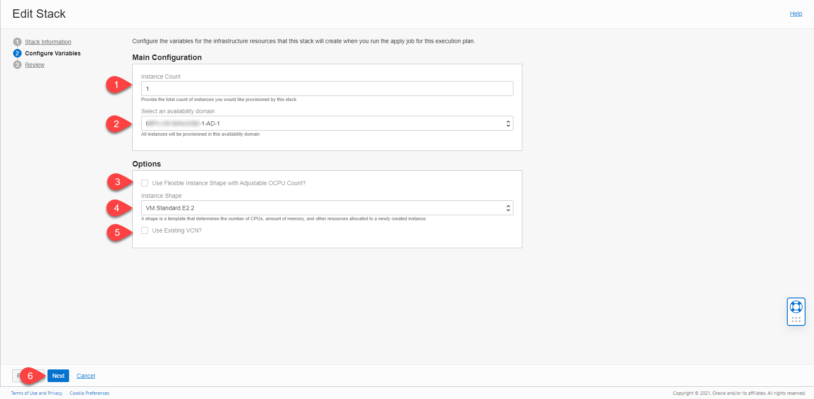

9. For this section we will provision a new VCN with all the appropriate ingress and egress rules needed to run this workshop. 
If you already have a VCN, make sure it has all of the correct ingress and egress rules and skip to the next section.

 - **Use Existing VCN?**: Accept the default by leaving this unchecked. This will create a **new VCN**.

10. Click Next.

11. Select **Run Apply** and click **Create**.

 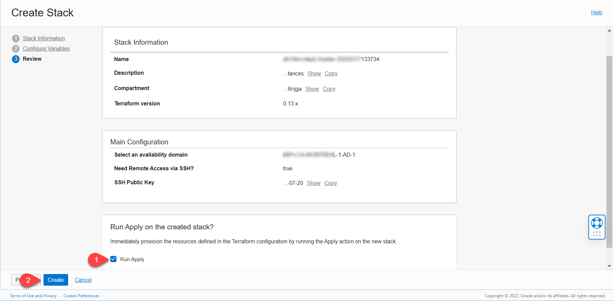

12. Your stack is now created and the *Apply action* triggered is running to deploy your environment!

 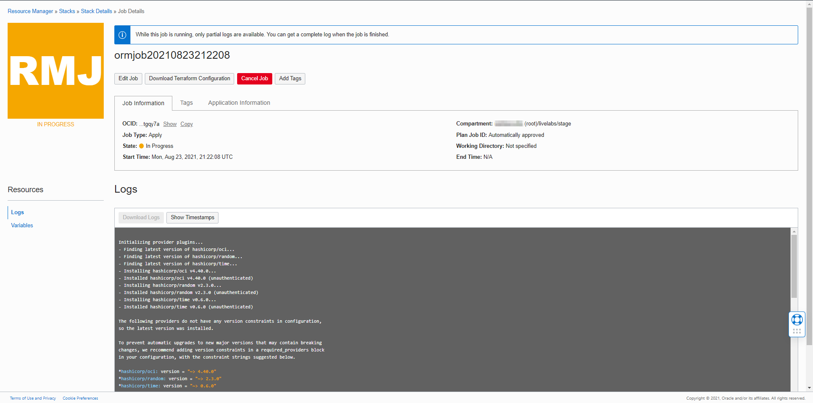
You may now proceed to Task 2 (skip Task 1B).

## Task 1B: Create Stack: Compute only

If you just completed Task 1A, please proceed to Task 2. If you have an existing VCN and are comfortable updating VCN configurations, please ensure your VCN meets the minimum requirements. Refer to *Lab: Prepare Setup*.

**Note** : We recommend letting our stack create the VCN to reduce the potential for error.

1. Identify the ORM stack zip file downloaded in *Lab: Prepare Setup*

2. Log in to Oracle Cloud

3. Open up the hamburger menu in the left-hand corner. Click Developer Services, and choose Resource Manager > Stacks. Choose the compartment in which you would like to install the stack. Click Create Stack.

4. Select **My Configuration**, choose the .Zip file button, and click the Browse link and select the zip file (dbsec-lab-mkplc-freetier.zip) that you downloaded. Click **Select**.

 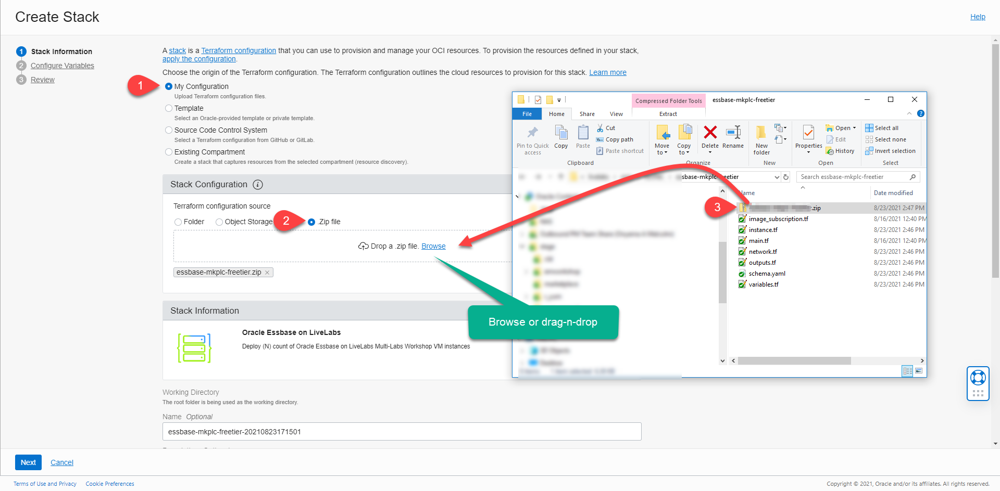

 Enter the following information:

  - **Name**: Enter a name or keep the prefilled default (DO NOT ENTER ANY SPECIAL CHARACTERS HERE, including periods, underscores, exclamation, etc, it will mess up the configuration and you will get an error during the apply process)
  - **Description**: Same as above
  - **Create in compartment**: Select the correct compartment if not already selected

**Note**: If this is a newly provisioned tenant such as freetier with no user-created compartment, stop here and first create it before proceeding.

5. Click Next.

 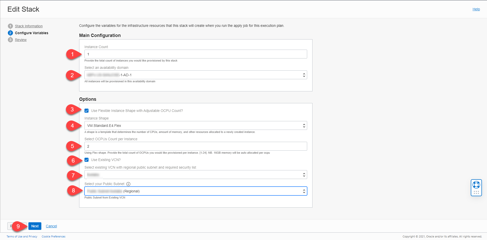

 Enter or select the following:

 - **Instance Count**: Keep the default to 1 to create only one instance. You may also choose a higher number if you need more than one instance created.
 - **Select Availability Domain**: Select an availability domain from the dropdown list.
 - **Use Flexible Instance Shape with Adjustable OCPU Count?**: Keep the default as checked (unless you plan on using a fixed shape)
 - **Instance Shape**: Keep the default or select from the list of Flex shapes in the dropdown menu (e.g VM.Standard.E4.Flex).
 - **Instance OCPUS**: Accept the default shown. e.g. (4) will provision 4 OCPUs and 64GB of memory. You may also elect to reduce or increase the count by selecting from the dropdown. e.g. [2-24]. Please ensure you have the capacity available before increasing.
 - **Use Existing VCN?**: Check to select.
 - **Select Existing VCN?**: Select existing VCN with regional public subnet and required security list.

**Note**: For an existing VCN Option to be used successfully, review the Appendix 2 at the bottom of the lab.

6. If you prefer to use fixed shapes, follow the instructions below. Otherwise, skip to the next step.

 - **Use Flexible Instance Shape with Adjustable OCPU Count?**: Unchecked
 - **Instance Shape**: Accept the default shown or select from the dropdown. e.g. VM.Standard.E2.2
 
 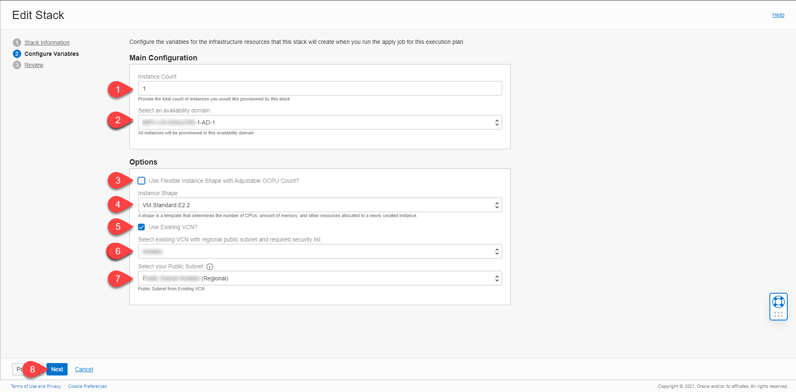

7. Review the stack information, select Run Apply, and click Create.

 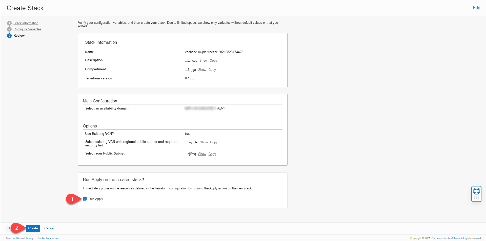

8. Your stack is now created and the Apply action triggered is running to deploy your environment!

## Task 2: Terraform Apply

In the prior steps, we elected to trigger the *terraform apply action* on stack creation.

 1. Review the job output.

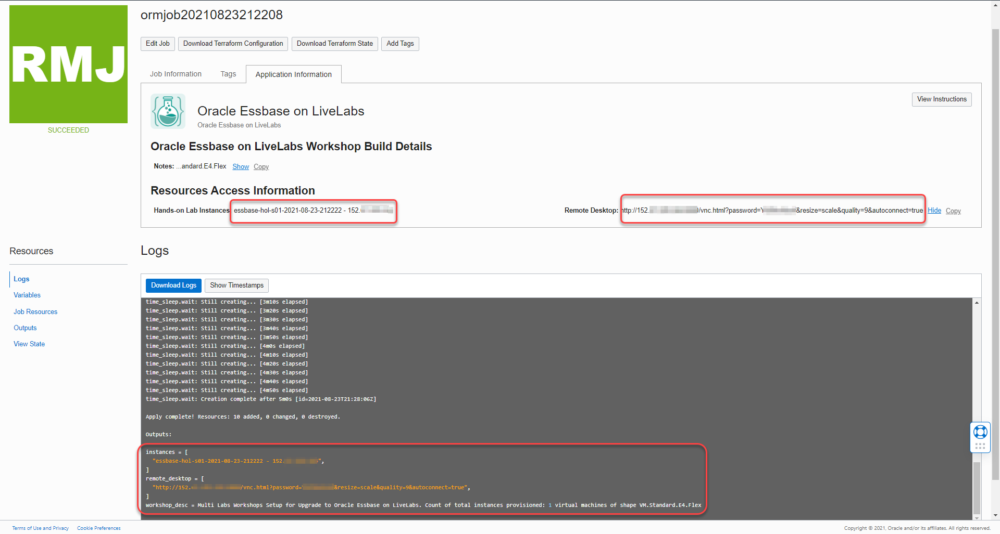

 2. Congratulations, your environment has been created! Click the Application Information tab to get additional information about what you have just done.

 3. Your public IP address(es), instance name(s), and remote desktop URL are displayed.

## Task 3: Access the Graphical Remote Desktop

For ease of execution of this workshop, your VM instance has been pre-configured with a remote graphical desktop accessible using any modern browser on your laptop or workstation. Proceed as detailed below to log in.

 1. Navigate to Stack Details, Application Information tab, and click on the remote desktop URL

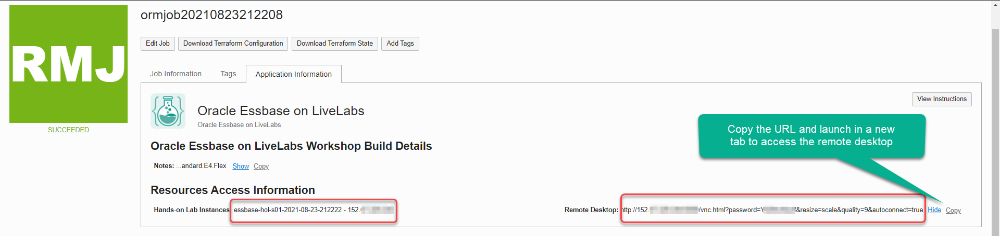

 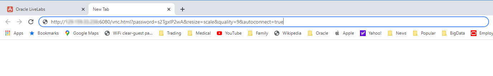

 This should take you directly to your remote desktop in a single click.

 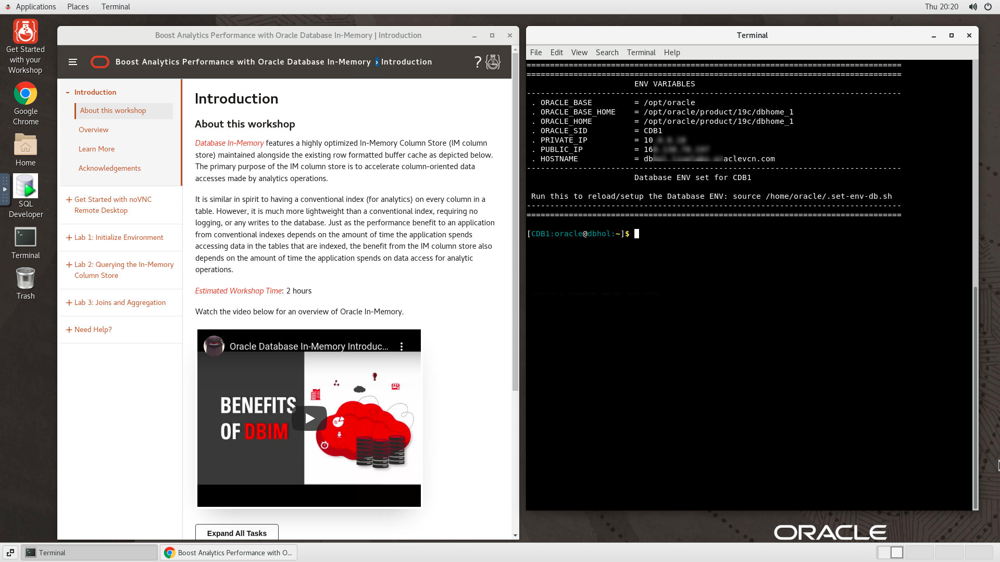 

 **Note**: While rare, you may see an error on the browser - “Deceptive Site Ahead” or similar depending on your browser type as shown below.

 Public IP addresses used for LiveLabs provisioning come from a pool of reusable addresses and this error is because the address was previously used by a compute instance long terminated, but that wasn't properly secured, got bridged, and was flagged. You can safely ignore and proceed by clicking on Details, and finally, on Visit this unsafe site.

 

You may now proceed to the next lab.

## Appendix 1: Terraform and Resource Manager

Terraform is a tool for building, changing, and versioning infrastructure safely and efficiently. Configuration files describe to Terraform the components needed to run a single application or your entire datacenter. In this lab, a configuration file has been created for you to build a network and compute components. The compute component you will build creates an image out of Oracle's Cloud Marketplace. This image is running Oracle Linux 7.

Resource Manager is an Oracle Cloud Infrastructure service that allows you to automate the process of provisioning your Oracle Cloud Infrastructure resources. Using Terraform, Resource Manager helps you install, configure, and manage resources through the "infrastructure-as-code" model. To learn more about OCI Resource Manager, watch the video below.

<iframe width="300" height="600" src="https://www.youtube.com/embed/udJdVCz5HYs" title="Oracle Cloud Infrastructure Resource Manager" frameborder="0" allow="accelerometer; autoplay; clipboard-write; encrypted-media; gyroscope; picture-in-picture; web-share" allowfullscreen></iframe>

## Appendix 2: Troubleshooting Tips

If you encountered any issues during the lab, follow the steps below to resolve them. If you are unable to resolve them, please skip to the Need Help lab on the left menu to submit your issue to our support emailbox.

 - Availability Domain Mismatch
 - Limits Exceeded
 - Flex Shape Not Found
 - Instance shape selection grayed out
 
**Issue #1**: Availability Domain Mismatch
 

**Issue #1 Description**

When creating a stack and using an existing VCN, the availability domain and the subnet must match, otherwise the stack errors.

**Fix for Issue #1**

 1. Click Stack-> Edit Stack -> Configure Variables.
 2. Scroll down to the network definition.
 3. Make sure the Availability Domain number matches the subnet number. E.g. If you choose AD-1, you must also choose subnet #1.
 4. Click Next
 5. Click Save Changes
 6. Click Terraform Actions -> Apply
 
**Issue #2**: Flex Shape Not Found

 

 **Issue #2 Description**

  When creating a stack, your ability to create an instance is based on the capacity you have available for your tenancy.

 **Fix for Issue #2**

 If you have other compute instances you are not using, you can go to those instances and delete them. If you are using them, follow the instructions to check your available usage and adjust your variables.

 1. Click the Hamburger menu, go to Governance -> Limits, Quotas and Usage
 2. Select Compute
 3. These labs use the following compute types. Check your limit, your usage, and the amount you have available in each availability domain (click Scope to change Availability Domain)
 4. Look for Cores for Standard.E2 based VM and BM instances, Cores for Standard.xx.Flex based VM and BM instances, and Cores for Optimized3 based VM and BM instances
 5. Click the hamburger menu -> Resource Manager -> Stacks
 6. Click the stack you created previously
 7. Click Edit Stack -> Configure Variables.
 8. Scroll down to Options
 9. Change the shape based on the availability you have in your system
 10. Click Next
 11. Click Save Changes
 12. Click Terraform Actions -> Apply

**Issue #3: Limits Exceeded**

**Issue #3 Description**

When creating a stack, your ability to create an instance is based on the capacity you have available for your tenancy.

*Please ensure that you have available cloud credits. Go to Governance -> Limits, Quotas and Usage, select compute, and ensure that you have more than the micro tier available. If you have only 2 micro computes, this workshop will NOT run.*

**Fix for Issue #3**

If you have other compute instances you are not using, you can go to those instances and delete them. If you are using them, follow the instructions to check your available usage and adjust your variables.

 1. Click the Hamburger menu, go to Governance -> Limits, Quotas and Usage
 2. Select Compute
 3. These labs use the following compute types. Check your limit, your usage, and the amount you have available in each availability domain (click Scope to change Availability Domain)
 4. Look for Cores for Standard.E2 based VM and BM instances, Cores for Standard.xx.Flex based VM and BM instances, and Cores for Optimized3 based VM and BM instances
 5. Click the Hamburger menu -> Resource Manager -> Stacks
 6. Click the stack you created previously
 7. Click Edit Stack -> Configure Variables.
 8. Scroll down to Options
 9. Change the shape based on the availability you have in your system
 10. Click Next
 11. Click Save Changes
 12. Click Terraform Actions -> Apply

**Issue #4: Instance Shape LOV Selection Grayed Out**

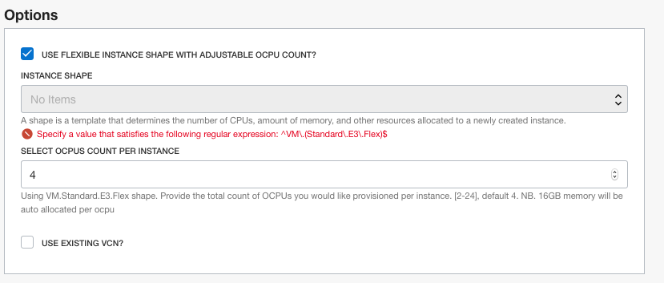

**I**ssue #4 Description**

When creating a stack, select the option "Use Flexible Instance Shape with Adjustable OCPU Count", but the "Instance Shape" LOV selection is grayed out, and the following error message is displayed:"Specify a value that satisfies the following regular expression: ^VM.(Standard.E3.Flex)$"

This issue is an indication that your tenant is not currently configured to use flexible shapes (e3flex)

**Fix for Issue #4**

 Modify your stack to use fixed shapes instead.

 1. Uncheck the option "Use Flexible Instance Shape with Adjustable OCPU Count" to use a fixed shape instead
 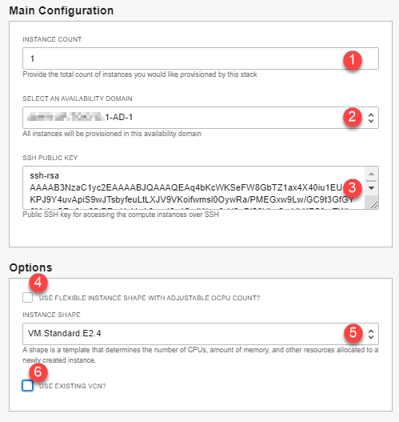

You may now proceed to the next lab.

## Acknowledgements

 - **Author** - Rene Fontcha, LiveLabs Platform Lead, NA Technology
 - **Contributors** - Arabella Yao, Product Manager, Database Product Management
 - **Last Updated By/Date** - Arabella Yao, Jan 2023