# Create Data Model, Classic Reports, and Dashboards

In this lab we will utilize the RPD to create financial dashboards in OAC. This is an alternate way of creating reports.

## Task 1: Install OAC Developer client tool

Oracle Analytics Client Tools for Oracle Analytics Cloud provides capabilities to develop and maintain data models for use in cloud.
Download Developer Client Tool for OAC from [here](https://www.oracle.com/middleware/technologies/oac-tools-downloads.html). It is recommended that the Client Tool version match or be higher than the OAC version.

## Task 2: Create Essbase Connection and Import Essbase

Open OAC Model Administration Tool from your windows menu and create new repository

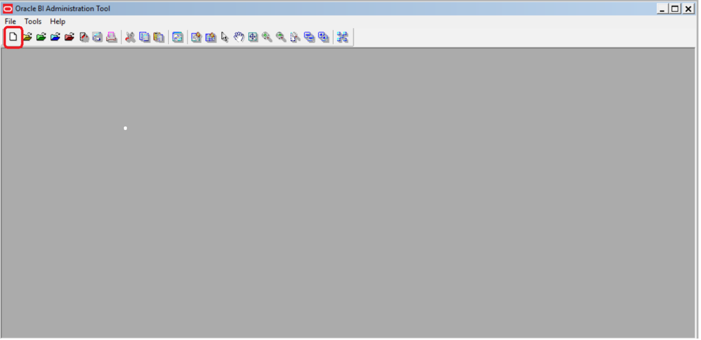

Provide RPD name, location to save, and RPD password and click Next

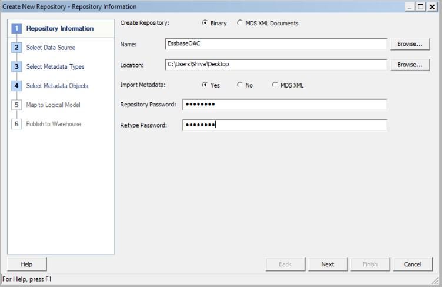

In the connection type drop down menu select Essbase 9+ and enter Essbase URL and credentials
OAC supports Essbase version from 11.1.2.4.0+ till 21c

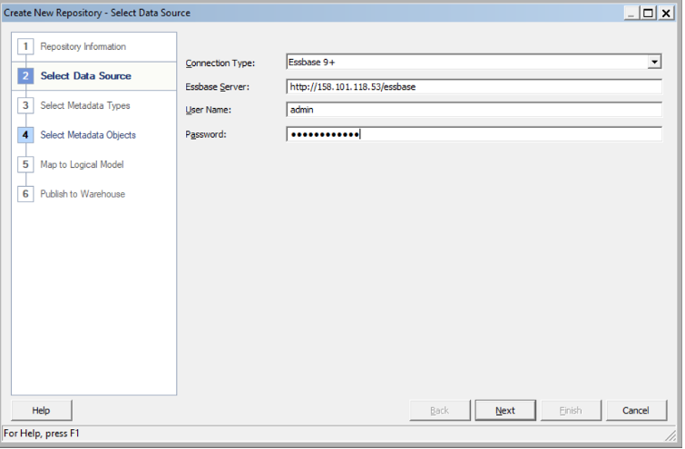

If connection is successful, you should see the list of Essbase cubes in the connection.

Import the required cubes for data modelling

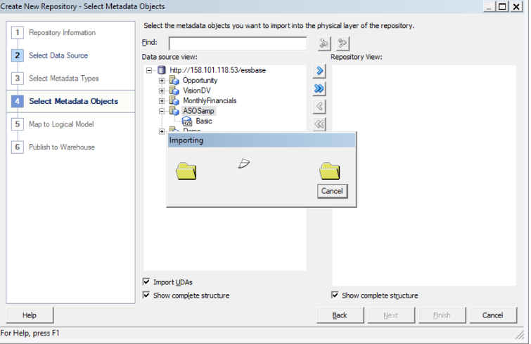

Once the cubes are imported, click Finish

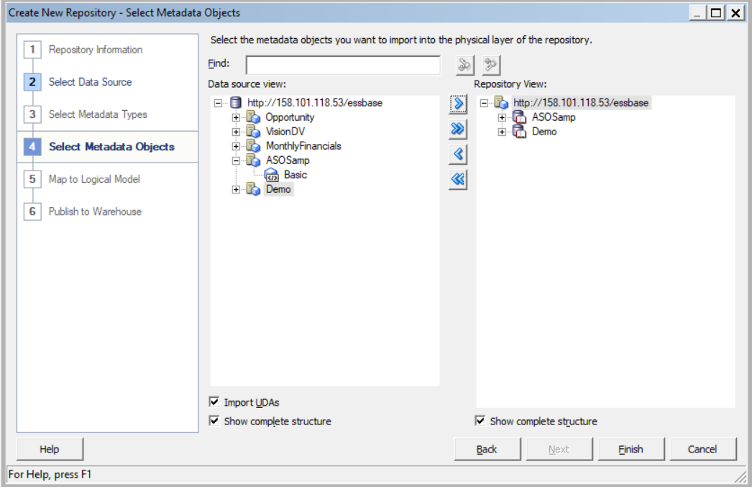

Once you import, you should see the data source created in the physical layer of the RPD

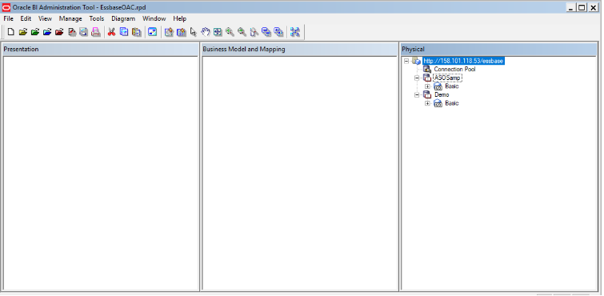

In Essbase cube, there will be different dimensions including the measure dimension. You can flatten the measure dimension members. 
You can also continue without flattening the measure dimension members. In this case, you may need to create custom measures using the Basic – measure based on the reports requirement.

In this lab we are going to flatten the list of measure dimension members.

Right click on Basic cube icon under your Essbase Application and select the option convert measure dimension to flat measures. You can see this will create different measure levels available in Essbase application

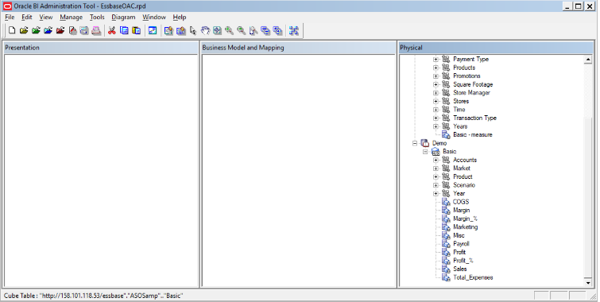

## Task 3: Model Essbase cube

Drag and drop Essbase cubes from physical layer to BMM layer. Expand Basic table and you can see that flattened measures in physical layer have been aggregated automatically in the BMM layer. 

Please note that these measures have been aggregated as per the aggregation rules defined in Essbase application

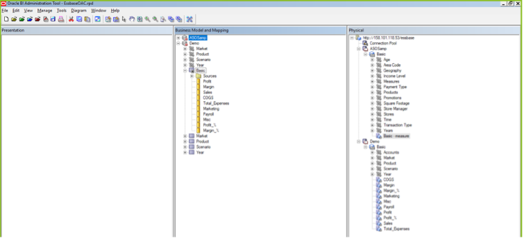

By default, BMM model will be disabled. We must enable to make it available for queries.

Right click on Demo BMM model and go to properties. You can see the disabled check box is selected. You should uncheck to make it available for queries.

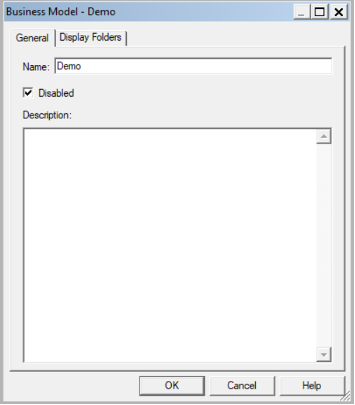

After unchecking, you can notice that BMM model is enabled.

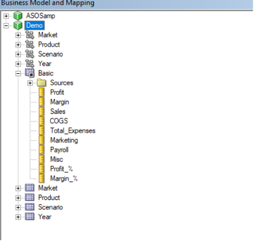

Drag and drop Demo BMM model to presentation layer. The models in the presentation layer are available as subject area in the OAC.

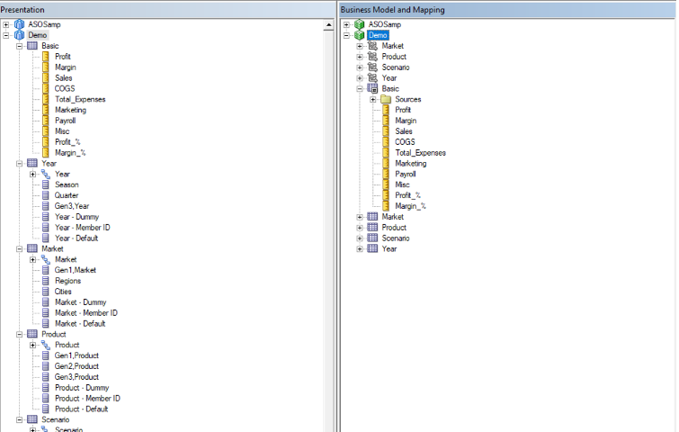

Save the RPD using save button in the menu. A popup window appears to check the consistency. Click yes to see if there are any inconsistencies in the RPD. Save the RPD to the preferred location.

## Task 4: Upload the Repository to the OAC instance

Login to your OAC instance using the OAC URL.

From the OAC home page, go to menu on top left and click on Console

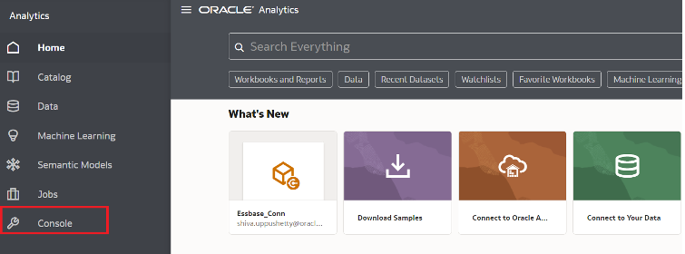

Under Configuration & Administration section click on the Snapshots 

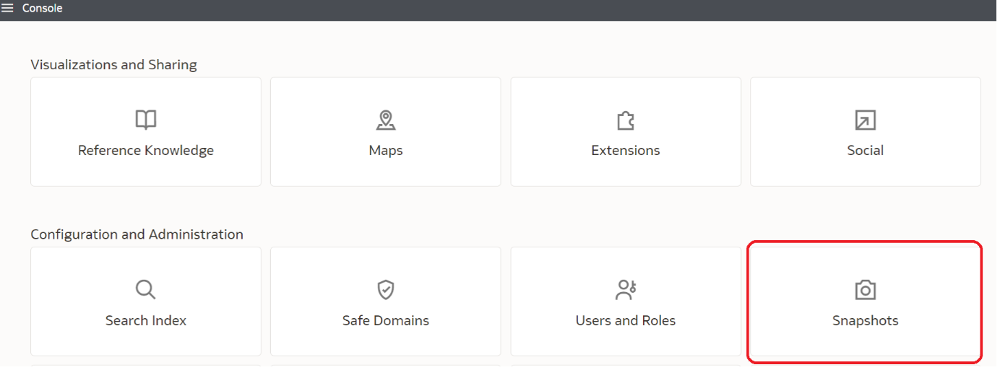

Click on the properties button on the top right and click on Replace data model to upload the repository to the OAC instance.

Click on browse button and select the RPD saved on your local system, enter the RPD password and click on Replace button.

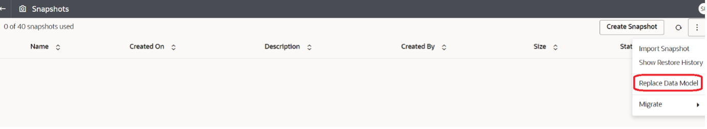

Please note that this will replace the existing RPD content in your OAC instance.
On the successful deployment of your RPD, you should see the message Replace Data Model succeeded.

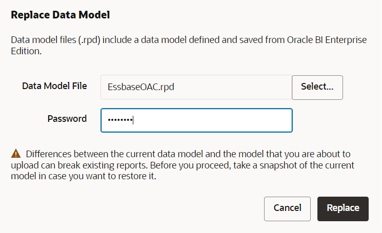

Go to OAC homepage and create data set (you can refer in the Task (YTC) to create a dataset)

In the create data set window, select Local Subject Area

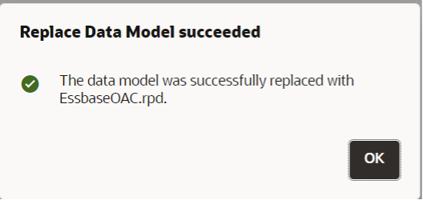

