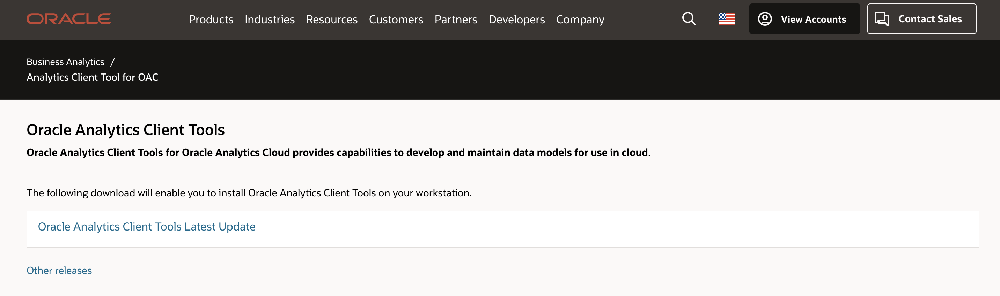
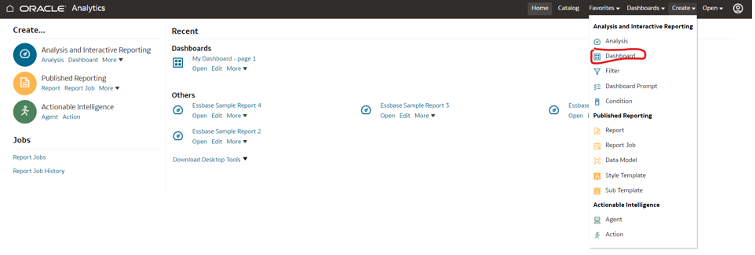

# Create Data Model, Classic Reports, and Dashboards

In this lab we will utilize the RPD to create financial dashboards in OAC. This is an alternate way of creating reports.

*Estimated Lab Time:* 60 minutes (provisioning time may vary)

### Objectives
In this lab, you will:
- Install OAC Model Administration Tool
- Create RPDs
- Upload RPDs
- Create Visualisation using the RPDs

### Prerequisites
- Oracle Free Trial Account.

## Task 1: Install OAC Developer client tool

Oracle Analytics Client Tools for Oracle Analytics Cloud provides capabilities to develop and maintain data models for use in cloud.
Download Developer Client Tool for OAC from [here](https://www.oracle.com/middleware/technologies/oac-tools-downloads.html). It is recommended that the Client Tool version match or be higher than the OAC version.

## Task 2: Create Essbase Connection and Import Essbase

Open OAC Model Administration Tool from your windows menu and create new repository

Provide RPD name, location to save, and RPD password and click Next

In the connection type drop down menu select Essbase 9+ and enter Essbase URL and credentials
OAC supports Essbase version from 11.1.2.4.0+ till 21c

If connection is successful, you should see the list of Essbase cubes in the connection.

Import the required cubes for data modelling

Once the cubes are imported, click Finish

Once you import, you should see the data source created in the physical layer of the RPD

In Essbase cube, there will be different dimensions including the measure dimension. You can flatten the measure dimension members. 
You can also continue without flattening the measure dimension members. In this case, you may need to create custom measures using the Basic – measure based on the reports requirement.

In this lab we are going to flatten the list of measure dimension members.

Right click on Basic cube icon under your Essbase Application and select the option convert measure dimension to flat measures. You can see this will create different measure levels available in Essbase application

## Task 3: Model Essbase cube

Drag and drop Essbase cubes from physical layer to BMM layer. Expand Basic table and you can see that flattened measures in physical layer have been aggregated automatically in the BMM layer. 

Please note that these measures have been aggregated as per the aggregation rules defined in Essbase application

By default, BMM model will be disabled. We must enable to make it available for queries.

Right click on Demo BMM model and go to properties. You can see the disabled check box is selected. You should uncheck to make it available for queries.

After unchecking, you can notice that BMM model is enabled.

Drag and drop Demo BMM model to presentation layer. The models in the presentation layer are available as subject area in the OAC.

Save the RPD using save button in the menu. A popup window appears to check the consistency. Click yes to see if there are any inconsistencies in the RPD. Save the RPD to the preferred location.

## Task 4: Upload the Repository to the OAC instance

Login to your OAC instance using the OAC URL.

From the OAC home page, go to menu on top left and click on Console

Under Configuration & Administration section click on the Snapshots 

Click on the properties button on the top right and click on Replace data model to upload the repository to the OAC instance.

Click on browse button and select the RPD saved on your local system, enter the RPD password and click on Replace button.

Please note that this will replace the existing RPD content in your OAC instance.
On the successful deployment of your RPD, you should see the message Replace Data Model succeeded.

Go to OAC homepage and create data set (you can refer in the Task (YTC) to create a dataset)

In the create data set window, select Local Subject Area

You should see the subject area we created in the RPD.

We already learned creating the visualization in the task 4

## Task 5: Create Classic Reports and Dashboards using Essbase Subject area

In this task we will learn creating reports and dashboards in Classic BI

Navigate to Classic BI either using Open Classic Home option from OAC home page or using URL by replacing dv with analytics (Use your Analytics URL)

https://xxx.ocp.oraclecloud.com/ui/analytics

From the Classic BI home page, click create and click on Analysis which will show all the subject areas created in the repository.

Select the Demo subject area which you have created and proceed with report development.

Select members from each dimension and fact as shown in the below screenshot and click on Results

This will generate a tabular report by default. You can change the visualization type using the views button. Classic BI supports almost all the visualization types available in DV.

You can play around building different reports and build a dashboard. 

### Build a dashboard.

From the Classic BI home page, go to menu and click Create and select Dashboard.

Enter a dashboard name preferred location to save the dashboard.

Expand the Shared Folders from the bottom left and navigate to the folder where your reports are saved. 

Drag the reports to the dashboard layout and save the dashboard. 

## Acknowledgements

- **Authors** – Srinivas SR NACI
- **Contributors** - Srinivas SR/ Sudip Bandyopadhyay, NACI
- **Last Updated By/Date** – 22/02/2024

