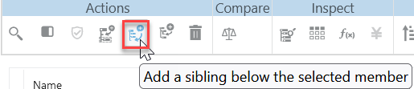
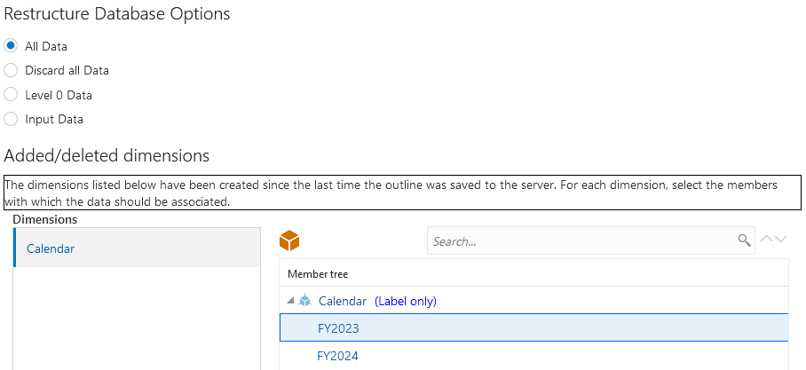
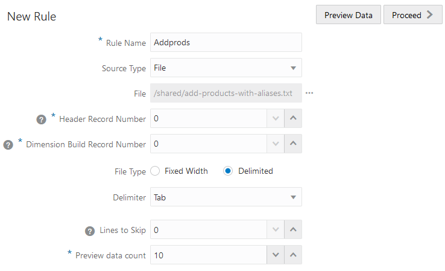
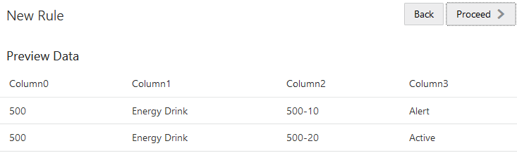
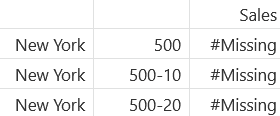

# Add dimensions

## Introduction

In this lab, you’ll manually add a dimension to the outline in the application and cube you created in the previous lab, then you’ll create a dimension rule and perform a dimension build to add products to the outline, and finally, you’ll use an MDX query to analyze the data in the cube.

Estimated Lab Time: -- minutes

### Objectives

In this lab, you will:
* Manually add a dimension to the outline, in the outline editor
* Create a dimension build rule file
* Perform a dimension build job
* Analyze data using an MDX query

### Prerequisites

This lab assumes you have:

* An Oracle Cloud account
* All previous labs successfully completed

*This is the "fold" - below items are collapsed by default*

## Task 1: Add a dimension manually

1. In the outline editor, select the Scenario dimension.

2. Click **Edit Outline**  in the upper right hand corner of the editor.

3. Under **Actions**, select **Add a sibling below the selected member**.

    

4. Type **Calendar**, press Enter, and then Escape.

5. Under **Actions**, press **Add a child to the selected member**.

    

6. Type **FY3023** and press Enter.

7. Type **FY2024** and press Enter, then press Escape.

8. Select **Calendar**, and under **Data storage type**, select **Label Only**.

    

9. Select **FY2023**, and under **Operator**, choose **~ (Ignore)**.

    

10. Select **FY2024**, and under **Operator**, choose **~ (Ignore)**.

11. In the upper right-hand corner of the outline editor, click **Verify** .

12. In the upper right-hand corner of the outline editor, click **Save** .

13. In the **Restructure Database Options** dialog box, leave **All Data** selected, and under **added/deleted dimensions** select **FY2023** as the member with which data should be associated, and click **OK**.

    

## Task 2: Create a dimension build rule file

1. On the **Applications** page, and to the right of the **Basic** cube, click the **Actions** menu.

2. Select **Inspect**.

3. In the cube inspector, select the **Scripts** tab.

4. Select **Rules**, and from the **Create** menu, select **Dimension Build (Regular)**.

5. For the **Rule Name**, enter **Addprods**.

6. For the **Source Type**, select **File**.

7. For **File**, navigate to **add_products_with_aliases.txt** in the **Shared** folder.

8. In the **Preview Data** dialog box, click **Catalog**, then navigate to **All Files** > **shared** > **dimbuild_dataload**. Select **add_products_with_aliases.txt** and then click **Select**.

9. For **File Type**, select **Delimited**.

10. For **Delimiter**, change to **Tab** delimited.

    

11. Click **Preview data** and check that the results look right, and then click **Proceed**.

    

12. In the Rule editor, set the **Dimension** in Field 1 to be **Product**.

13. Set the **Type** in field 1 to be **Parent**.

14. In **Field - 2** set **Type** to **Alias**.

15. In **Field - 3** set **Type** to **Child**.

16.	In **Field - 4** set **Type** to **Alias**.

    

17. Click **Verify**.

18. Click **Save and Close**.

## Task 3: Create a dimension build job

1. Go to the **Jobs** page and select **New Job** and **Build Dimension**.

2. Select the **Sample** application and the **Basic** cube.

3. For **Script**, navigate to **Addprods.rul** in your cube directory, and select it.

4. For **File**, navigate to **add_products_with_aliases.txt** in the **Shared** folder, and select it.
*Do I need to select a restructure option here?*

    

5. Click **OK**.

6. Check the status of the job and see that it succeeded with the green check mark under **Status**. You may need to refresh the page.

7. Open the outline and see that the new product 500 group was created.

    

## Task 4: Analyze data for the newly created product group

1. On the **Applications** page, click the **Actions** menu next to the **Basic** cube and select **Analyze Data**.

2. On the **Reports** tab, click **Create**.

3. Enter a **Name** for the report, such as **MDX_500**.

4. In the **Query** field, paste the following MDX query:

    ```
    <copy>SELECT
      {[Measures].[Sales]}
    ON COLUMNS,
    CrossJoin ({[New York]}, {Descendants([Product].[500])})
    ON ROWS
    FROM Sample.Basic
    WHERE ([Scenario].[Actual], [Year].[Qtr1], [Calendar].[FY2023])</copy>
    ```

5. **Validate** and then **Save** the query.

6. Click the query name in the left-hand panel to run the query.

7. Notice that data for the 500 product group is #Missing.

    

Next, we’ll load data to the Product dimension.


## Learn More

*(optional - include links to docs, white papers, blogs, etc)*

* [URL text 1](http://docs.oracle.com)
* [URL text 2](http://docs.oracle.com)

## Acknowledgements

* **Author** - Dori Woodhouse, Principal User Assistance Developer, Essbase documentation team
* **Contributors** -  <Name, Group> -- optional
* **Last Updated By/Date** - <Name, Month Year>