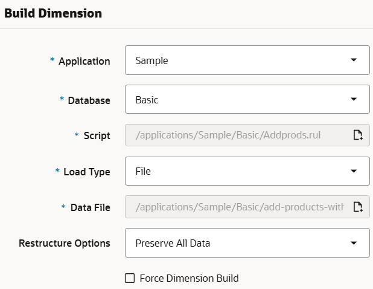

# Add dimensions

## Introduction

In this lab, you’ll manually add a dimension to the outline in the application and cube you created in the previous lab, then you’ll create a dimension rule and perform a dimension build to add products to the outline, and finally, you’ll use an MDX query to analyze the data in the cube.

Estimated Lab Time: 15 minutes

### Objectives

In this lab, you will:

* Download required files for this workshop
* Manually add a dimension to the outline, in the outline editor
* Create a dimension build rule file
* Perform a dimension build job
* Analyze data using an MDX query

### Prerequisites

This lab assumes you have:

* An Oracle Cloud account
* All previous labs successfully completed

## Task 1: Download required files for this workshop

1. Click [here](https://c4u04.objectstorage.us-ashburn-1.oci.customer-oci.com/p/EcTjWk2IuZPZeNnD_fYMcgUhdNDIDA6rt9gaFj_WZMiL7VvxPBNMY60837hu5hga/n/c4u04/b/livelabsfiles/o/data-management-library-files/add-products-with-aliases-and-load-sales-cogs-files.zip) to download required files for this workshop.

2. Save the zip file to your computer, in a location where you can find it easily.

3. Extract the zip file.

    The add-products-with-aliases.txt file will be used for this lab. The load-sales-cogs.txt file will be used in a later lab.

4. Upload the files to the Catalog.

    1. Log in to the Essbase web interface.
    2. Go to the **Files** page.
    3. Select the **Shared** folder.
    4. Select **Upload** and click **Drag and Drop**.
    5. Browse to the files you downloaded, select them, and click **Open**.
    6. Click **Close** and the uploaded files are displayed in the **Shared** folder.

## Task 2: Add a dimension manually

1. Open the **Sample** application and the **Basic** cube (database), and click **Launch Outline**.

2. In the outline editor, select the Scenario dimension.

3. Click **Edit Outline**  in the upper right hand corner of the editor.

4. Under the actions icon, select **Add sibling member below**.

    

5. Type **Calendar** in the **Member name** text box and click **Add**.

6. In the **Add** dialog box, change the selection to **As child for Calendar**.

7. In the **Member name** text box, type **FY2024**.

8. In the **Operator** text box, select **~(Ignore)** and then click **Add**.

9. In the **Member name** text box, type **FY2025**.

10. In the **Operator** text box, select **~(Ignore)** and then click **Add**.

11. Click the **Close add member slider** icon .

12. Select **Calendar**, and from the menu under the **Data storage type** icon, select **Label Only**.

    

13. In the upper right-hand corner of the outline editor, click **Verify** .

14. In the upper right-hand corner of the outline editor, click **Save** .

15. In the **Restructure Database Options** dialog box, select **All Data** and click **Save**.

    

## Task 3: Create a dimension build rule file

1. On the **Applications** page, select the application and select the cube (database).

2. Select the **Scripts** page.

3. Select **Rules**, and from the **Create** menu, select **Dimension Build (Regular)**.

4. In the New Rule dialog box, for the **Rule Name**, enter **Addprods**.

5. For the **Source Type**, select **File**.

6. For **File**, navigate to **Catalog** > **All Files** > **Shared** > and double-click **add-products-with-aliases.txt**.

7. For **File Type**, select **Delimited**.

8. For **Delimiter**, change to **Tab** delimited.

    

9. Click **Preview data** and check that the results look right, and then click **Proceed**.

    

10. In the Rule editor, set the **Dimension** in Field 1 to be **Product**.

11. Set the **Type** in field 1 to be **Parent**.

12. In **Field - 2** set **Type** to **Alias**.

13. In **Field - 3** set **Type** to **Child**.

14. In **Field - 4** set **Type** to **Alias**.

    

15. Click **Verify**.

16. Click **Save and Close**.

## Task 4: Create a dimension build job

1. Go to the **Jobs** page and select **New Job** and **Build Dimension**.

2. Select the **Sample** application and the **Basic** cube.

3. For **Script**, click the **Choose Catalog File** icon and navigate to **Addprods.rul** in your cube directory, and select it.

4. For **Load Type** choose **File**.

5. For **Data File** click the **Choose Catalog File** icon and navigate to **add-products-with-aliases.txt** in the **Shared** directory, and select it.

6. For **Restructure Options**, choose **Preserve All Data**.

    

7. Click **Submit**.

8. Check the status of the job and see that it succeeded with the green check mark under **Status**. You may need to refresh the page.

9. Open the outline and see that the new product 500 group was created.

    

## Task 5: Analyze data for the newly created product group

1. Open the **Sample** application and the **Basic** cube, and click **Analyze Data**.

2. On the **Reports** tab, click **Create**.

3. Enter a **Name** for the report, such as **MDX-500**.

4. In the **Query** field, paste the following MDX query:

    ```MDX
    <copy>
    SELECT
      {[Measures].[Sales]}
    ON COLUMNS,
    CrossJoin ({[New York]}, {Descendants([Product].[500])})
    ON ROWS
    FROM Sample.Basic
    WHERE ([Scenario].[Actual], [Year].[Qtr1], [Calendar].[FY2024])
    </copy>
    ```

5. **Validate** and then **Save** the query.

6. Click the query name in the left-hand panel to run the query.

7. Notice that data for the 500 product group is #Missing.

    

Next, we’ll load data to the Product dimension.

You may now **proceed to the next lab**.

## Learn More

* [Create New Dimension Build Rule](https://docs.oracle.com/en/database/other-databases/essbase/21/essdm/create-new-dimension-build-rule.html)
* [Build Dimension](https://docs.oracle.com/en/database/other-databases/essbase/21/ugess/run-and-manage-jobs-using-web-interface.html#GUID-823F8D30-0A59-4835-97FC-6A6494B46D36)
* [MDX](https://docs.oracle.com/en/database/other-databases/essbase/21/esscq/mdx.html)

## Acknowledgements

* **Author** - Dori Woodhouse, Principal User Assistance Developer, Essbase documentation team
* **Last Updated By/Date** - Dori Woodhouse January, 2025
