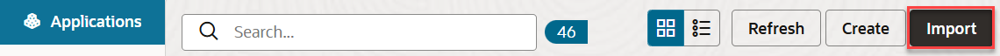
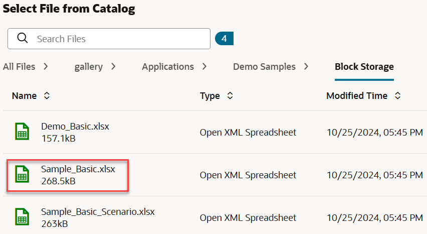
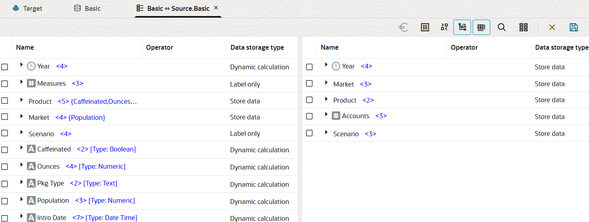
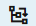

# Compare outlines

## Introduction

This lab walks you through how to compare two outlines in the Essbase web interface. The outlines must be of the same type, both aggregate storage, or both block storage. They can be on the same Essbase server, or on different Essbase servers.

Estimated Lab Time: 10 minutes

### Objectives

In this lab, you will:

* Import two sample cubes
* Open the two outlines side-by-side
* Synchronize expanding and collapsing hierarchies
* Synchronize scrolling
* Copy members from the source to the target outline
* Search the source or the target outline

### Prerequisites

This lab assumes you have:
* An Oracle Cloud account
* All previous labs successfully completed

## Task 1: Import two sample cubes

1. On the **Applications** page, click **Import**.

    

2. In the **Import** dialog box, click **Catalog**.

3. In the **Select Files from Catalog** dialog box, navigate to **gallery** &gt; **Applications** &gt; **Demo Samples** &gt; **Block Storage**, click **Sample\_Basic.xlsx** and click **Select**.

    

4. In the **Import** dialog box, rename the application to **Target** and click **OK** to create the cube.

5. Repeat steps 1-4, this time selecting **Demo_Basic.xlsx** and renaming it to **Source.Basic**.

## Task 2: Open two outlines side-by-side

1. On the **Applications** page, open the **Target** application and the **Basic** cube, and click **Launch Outline**.

2. In the upper right-hand corner of the outline editor, click **Edit outline** .

3. On the outline toolbar, click the **To compare outlines** icon.

    

4. In the **Compare outline** dialog box, keep the **(Current)** connection and select the **Source** application and the **Basic** database.

   Alternatively, you can select a connection to another server in the **Connection** drop down menu, and compare two outlines on different servers.

5. Click **Compare**, and **Source.Basic** is opened to the right of **Target.Basic**. **Source.Basic** is read only. The read only outline is the source outline. The writeable outline is the target outline.

    

## Task 3: Synchronize expanding and collapsing hierarchies

1. Expand the **Year** dimension in **Target.Basic** and notice that the **Year** dimension in **Source.Basic** is expanded as well.

2. In the outline toolbar, click the **Auto expand/collapse target members** icon to deselect it (it is selected by default) .

3. Collapse the **Year** dimension in **Source.Basic** and notice that the **Year** dimension in **Target.Basic** is still expanded. Collapse the **Year** dimension in **Target.Basic**.

## Task 4: Synchronize scrolling

1. Click the **Auto expand/collapse target members** icon  and expand several dimensions so that you need to scroll up and down in order to see the entire outline.

2. Scroll the **Target.Basic** outline horizontally and observe that the **Source.Basic** outline scrolls in sync with it.

3. Scroll the **Target.Basic** outline vertically and observe that you can view member properties for both **Target.Basic** and **Source.Basic**.

<!--## Task 5: Synchronize showing and hiding columns

1. In the outline toolbar, under **Inspect**, click **Display selected columns in the table**.

    

2. In the **Select member properties to display** dialog box, clear the selections for **operator** and **data storage type** and click **Apply and Close**. Notice that the displayed columns in both **Target.Basic** and **Source.Basic** change accordingly.-->

## Task 5: Copy members from the source outline to the target outline

1. In the upper right-hand corner of the outline editor, click **Edit outline** .

2. In the **Source.Basic** outline, expand the **Product** dimension.

3. Right click **Audio** and select **Copy**.

4. In the **Target.Basic** outline, expand the **Product** dimension.

5. Right click **Product**, and select **Paste**, and then **As child**.

   **Audio** and its children are added as children of **Product**.

## Task 6: Search either the source or the target outline

1. In the outline toolbar, under **Actions**, click the **Search members in the outline** icon.

2. Notice that search bars open for both **Source.Basic** and **Target.Basic**, allowing you to search either one.

   > **Note:** The search bar does not open for the target outline when it is from an Essbase version prior to 21c.

## Learn More

* [Compare Outlines](https://docs.oracle.com/en/database/other-databases/essbase/21/ugess/compare-outlines.html#GUID-F6B9A25F-0B32-41EB-AD10-611C31CAB13C)
* [Copy and Paste Members Within and Between Outlines](https://docs.oracle.com/en/database/other-databases/essbase/21/ugess/copy-and-paste-members-and-outlines.html#GUID-630F6AEC-6951-4975-A4FD-94E329A0BDB4)

## Acknowledgements
* **Author** - Dori Woodhouse, Principal User Assistance Developer, Essbase documentation team
* **Last Updated By/Date** - Dori Woodhouse November, 2024
