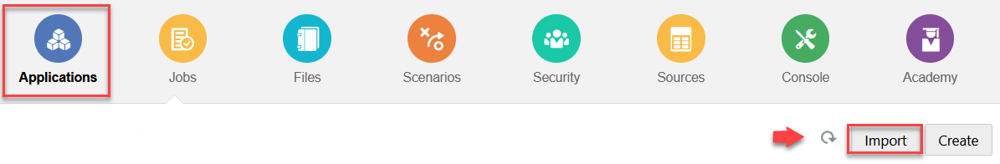
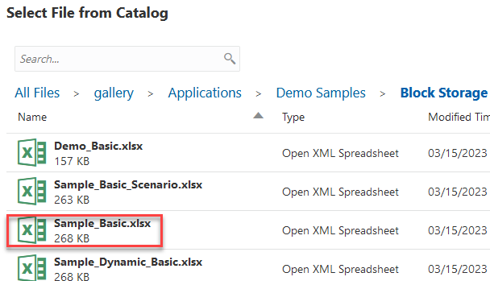
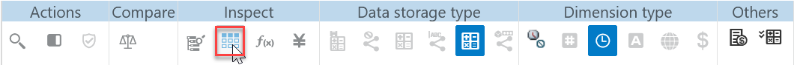
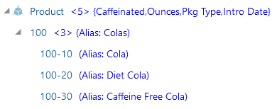

# Create an application

## Introduction

In this lab, you’ll learn how to create an Essbase application by importing a structured Excel file called an application workbook. After you create the application, you’ll view the outline and set it to display active alias names.

Estimated Time: -- 5 minutes

### Objectives

In this lab, you will:

* Import the **Sample\_Basic.xlsx** application workbook to create an application
* Display active alias names in an outline

### Prerequisites

This lab assumes you have:

* An Oracle Cloud account
* All previous labs successfully completed

## Task 1: Import an application workbook

1. On the **Applications** page, click **Import**.

    

2. In the **Import** dialog box, click **Catalog**.

3. In the **Select Files from Catalog** dialog box, navigate to gallery > Applications > Demo Samples > Block Storage, click **Sample\_Basic.xlsx** and click **Select**.

    

4. In the **Import** dialog box, click **OK**.

## Task 2: Display active alias names in the outline

1. On the **Applications** page, expand the **Sample** application.

2. Click the **Actions** menu to the right of the **Basic** cube and click **Outline**.

3. In the outline viewer, expand the **Product** dimension, then expand product **100** to see its children.

4. In the outline toolbar, click **Display selected columns in the table**.

    

5. In the **Select the member properties to display** dialog box, scroll down and select the check box next to **Active alias name**, and select **Apply and Close**.

6. Product aliases are displayed in the outline.

    

## Acknowledgements

* **Author** - Dori Woodhouse, Principal User Assistance Developer, Essbase documentation team
* **Last Updated By/Date** - <Name, Month Year>
