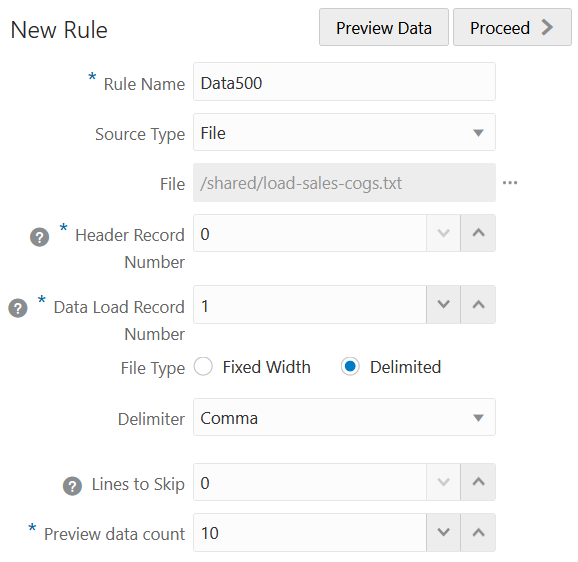
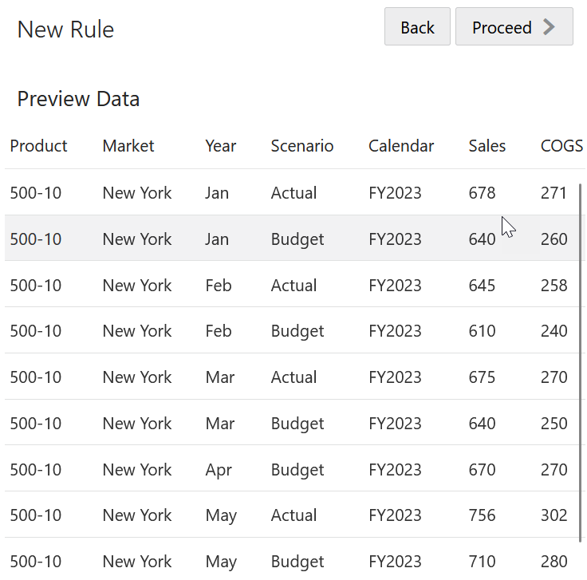
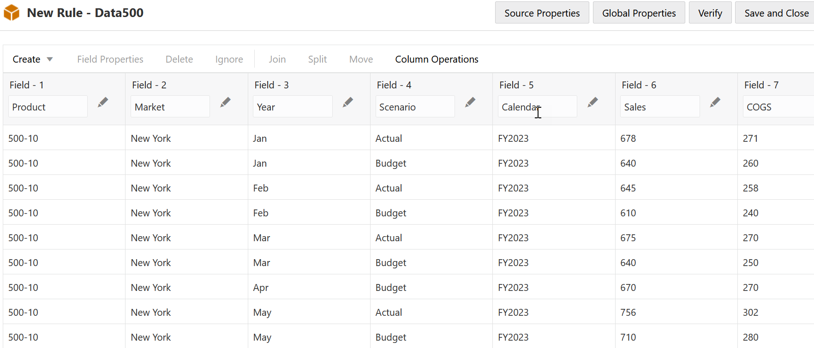
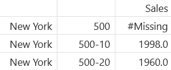
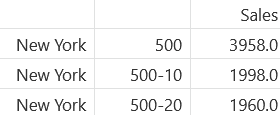

# Load and analyze data

## Introduction

In this lab, you’ll create a data load rule file and load data into the cube, then you’ll calculate and analyze the data.

Estimated Time: 10 minutes

### Objectives

In this lab, you will:

* Create a data load rule file
* Run a data load job
* Calculate and analyze the newly loaded data

### Prerequisites

This lab assumes you have:

* An Oracle Cloud account
* All previous labs successfully completed

## Task 1: Create a data load rule file

1. Go to Sample Basic cube inspector &gt; **Scripts** and create a new data load rule.

2. For the **Rule Name**, use **Data500**.

3. For **Source Type**, select **File**.

4. Navigate to the **load-sales-cogs.txt** data load file. The file is in the **Catalog** under **All Files** &gt; **shared** &gt; **load-sales-cogs.txt**.

5. Change **Data Load Record** number to 1 because row 0 is the header row in the data file.

6. Leave as **Comma** delimited because this source file is comma delimited.

    

7. Click **Preview data** to be sure it looks as expected.

    

8. Click **Proceed**. The Data500 data load rule file is displayed.

    

8. Click **Verify**.

9. Click **Save and Close**.

## Task 2: Run the data load job

1. On the **Jobs** page, select **New Job** &gt; **Load Data**.

2. Select the **Application** and **Database**.

3. Keep **File** as the **Load Type**.

4. Click **Select files from catalog**.

5. Select the **load-sales-cogs.txt** data load file and the **Data500** data load rule file and click **OK**.

6. Look for the green checkmark under **Status** to confirm success. You may need to refresh the page.

7. Open **Analyze Data** and re-run the **MDX-500** MDX query.

    Data exists for 500-10 and 500-20, but not 500. This is because we have not calculated the data yet.

    

## Task 3: Calculate and analyze the newly loaded data

1. On the **Jobs** page, select **New Job** and **Run Calculation**.

2. Select the **Sample** application, the **Basic** database, and the **CalcAll** calculation script.

3. Click **OK**.

4. Look for the green check mark under **Status** to check the status of the job.

5. Open **Analyze Data** and re-run the MDX query.

    Data now exists for product 500.

    

You may now **proceed to the next lab**.

## Learn More

* [Create New Data Load Rule](https://docs.oracle.com/en/database/other-databases/essbase/21/essdm/create-new-data-load-rule.html)
* [Load Data](https://docs.oracle.com/en/database/other-databases/essbase/21/ugess/run-and-manage-jobs-using-web-interface.html#GUID-8779F7B5-1465-4B9E-B6C3-2AF2B7CD95F2)

## Acknowledgements

* **Author** - Dori Woodhouse, Principal User Assistance Developer, Essbase documentation team
* **Last Updated By/Date** - <Name, Month Year>