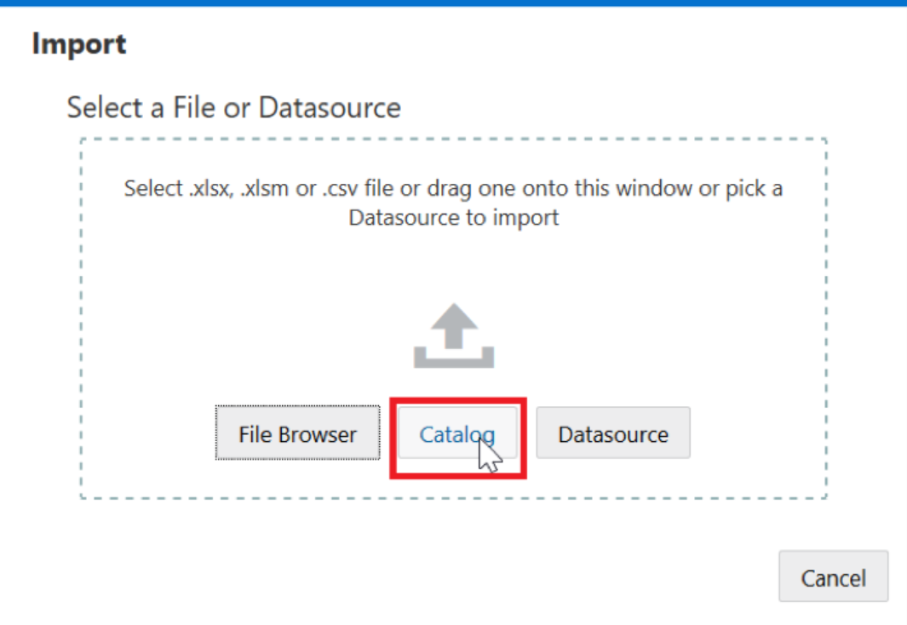
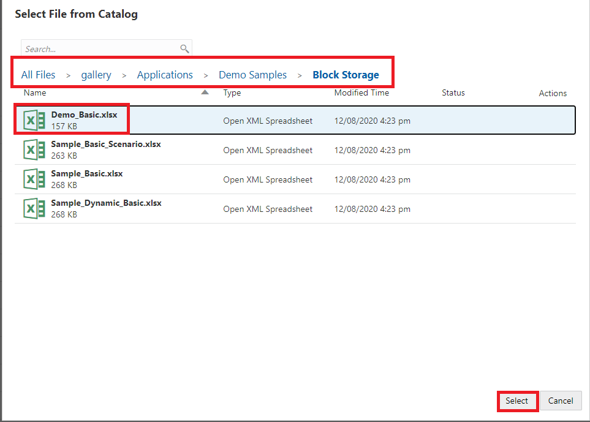
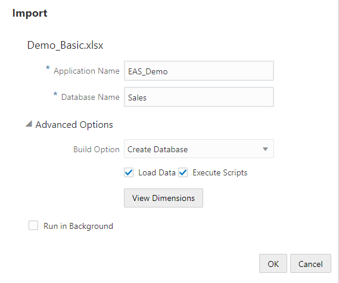
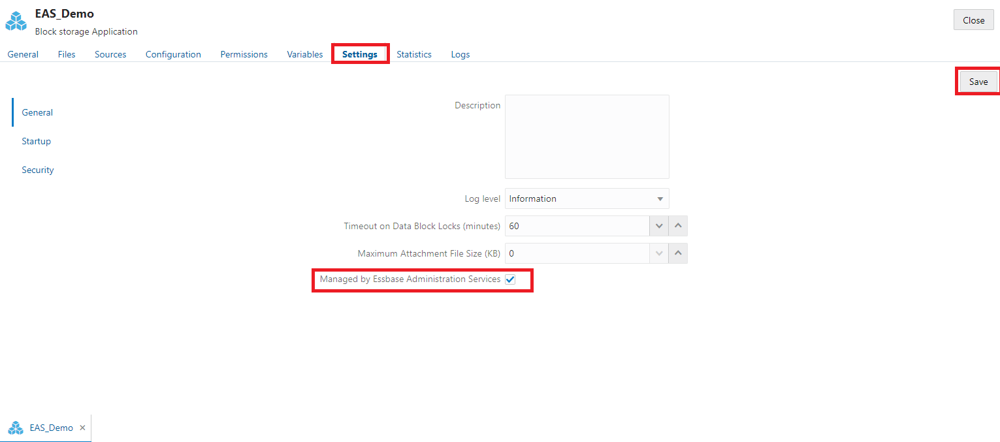
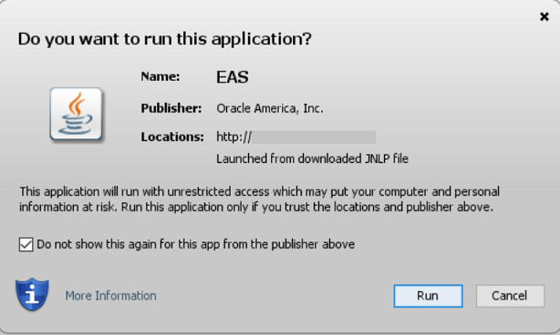
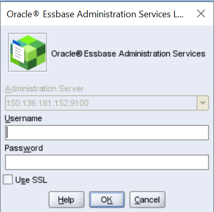
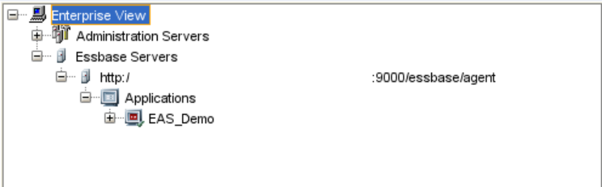
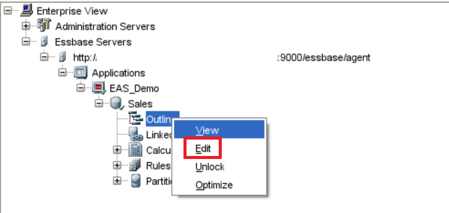
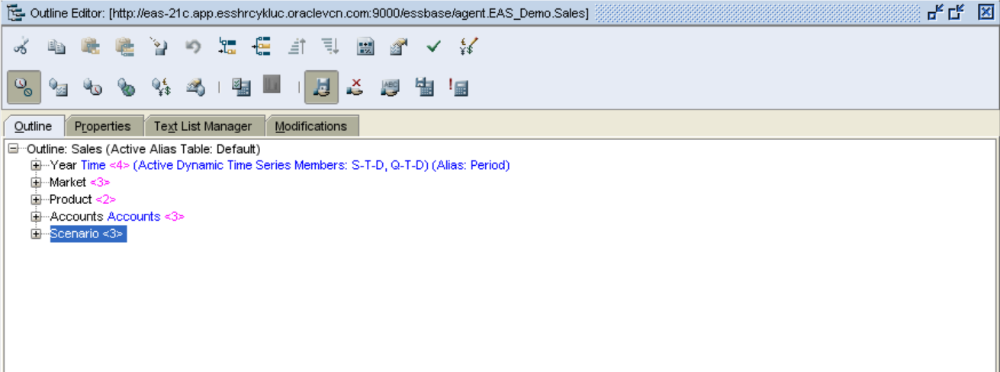

# Essbase Administration Services (EAS Lite)

## Introduction

The Essbase web interface is the modern administration interface that supports all current platform features. A lite version of Essbase Administration Services is a limited-support option for continued management of your applications if your organization isn't ready to adopt the new interface. Once customers are familiar with the environment, they can then start working on 21c.

This option is available only for Essbase 21c independent installations of Essbase.

NOTE: EAS Lite supports only features and functionality available in 11g, and not features added in later Essbase releases.

This option is available in 21c independent installation and not on the Essbase marketplace.


*Estimated Lab Time:* 10 minutes

### Objectives

This lab provides details on how you can optionally manage applications using Essbase Administration Services (EAS) Lite

### Prerequisites
This lab assumes you have:
- A Free Tier, Paid or LiveLabs Oracle Cloud account
- You have completed:
    - Lab: Prepare Setup (*Free-tier* and *Paid Tenants* only)
    - Lab: Environment Setup
    - Lab: Initialize Environment  
    - Lab: Essbase Features: Basic


## Task 1: Manage an Application Using EAS Lite

Before you can connect to an application in EAS Lite, you must set it as an EAS managed application.

To manage an application using EAS Lite:

1.	Log in to the Essbase 21c web interface using the Essbase URL.

    ```
    <copy>
    http://[Instance-Public-IP]:9000/essbase/jet
    </copy>
    ```
    *Note:* Please replace *`[Instance-Public-IP]`* with your instance's public IP Address wherever referenced in this guide.

2.	On the Applications tab click **Import** in the Essbase web interface and click **Catalog**.
   


3.	Select **Demo_Basic.xlsx** file from:

   All Files -> Gallery -> Applications ->Demo Samples-> Block Storage.
   


4.	Name the application “EAS_Demo” and name the cube “Sales” and click **OK**.
   

5.	From the Actions menu to the right of the application EAS_Demo, launch the inspector, and click **Settings**.

6.	From the General tab, select **Managed by Essbase Administration Services**.
   

7.	Click **Save** then **OK**, and then **Close**.

   NOTE: Once the application is EAS managed, you can only view the outline in web interface. All changes that you do in the application are performed using EAS console.

## Task 2: Access the EAS Lite Web Console

1.	Open a web browser and navigate to the URL of the EAS managed server. For example,

      ```
      <copy>
      http://[Instance-Public-IP]:9100/easconsole
      </copy>
      ```
      Note: Please replace ip with your instance's ip.

2.	Click **Launch**. If the EAS Lite console doesn't launch, you may need to configure your browser with a Java Web Start (javaws) plugin that can launch .jnlp files.
   

   Open the downloaded file: easconsole.jnlp.

1. Once the following propmpt is displayed, click **Run**.
   


4.	Log in with the username and password of your Essbase instance.
   

5.	Go to Enterprise View-> Essbase Servers-> http: ip:9000/essbase/agent -> Applications -> EAS_Demo.
   

6.	Expand application “EAS_Demo”. Double-click **Sales**.

7.	Right-click Outline and choose Edit.
   


8.	You can perform all the administrative tasks in the outline as in Essbase 11g version, such as creation of a cube, dimension build, data loading, creation of calculation scripts, rule file, and so on.
   

   **NOTE**: If you want to switch back and make the application web interface managed, go to Step 1: Point 6 and unselect the option Managed by Essbase Administration Services. You can't manage the application by EAS again, once you uncheck this option.


## Acknowledgements
* **Authors** -Sudip Bandyopadhyay, Manager, Analytics Platform Specialist Team, NA Technology
* **Contributors** - Eshna Sachar, Jyotsana Rawat, Kowshik Nittala, Venkata Anumayam
* **Last Updated By/Date** - Jyotsana Rawat, Solution Engineer, Analytics, NA Technology, August 2021
