# Essbase Features: Basic

## Introduction

This lab walks you through the major features of Essbase 21c and their functionalities across the platform along with an overview of the Essbase 21c web interface.

In this lab, the following topics are covered:  

* Explore the Smart View interface
* Create Ad Hoc grids
* Overview of Web user interface

*Estimated Lab Time:* 75 minutes

### Objectives

 * Understand the Essbase 21c add-ins (Smart View and Cube designer)
 * Understand the Essbase 21c web interface overview.

### Prerequisites
This lab assumes you have:
- A Free Tier, Paid or LiveLabs Oracle Cloud account
- Local Computer (Windows/Mac) with Microsoft Excel
- You have completed:
    - Lab: Prepare Setup (*Free-tier* and *Paid Tenants* only)
    - Lab: Environment Setup
    - Lab: Initialize Environment  


## Task 1: Creating a Sample Application in Essbase21c
Due to the requirements for *Microsoft Excel*, some tasks cannot be performed on the remote desktop. As a result, if you're reading this from the remote desktop session, return to your local computer/workstation to proceed.

*Note:* Please replace *`[Instance-Public-IP]`* with your instance's public IP Address wherever referenced in this guide.

1.	Log in to the Essbase 21c web interface using the Essbase URL.

    ```
    <copy>
    http://[Instance-Public-IP]:9000/essbase/jet
    </copy>
    ```
    ```
    Username : <copy>Weblogic</copy>
    ```
    ```
    Password : <copy>Oracle_4U</copy>
    ```
    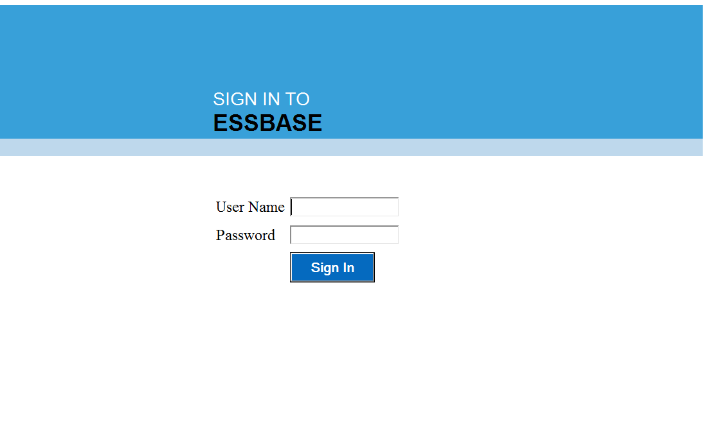
2.	On the Applications tab, click **Import** option in the Essbase web interface as shown below.

    

3.	Click **Catalog**.

    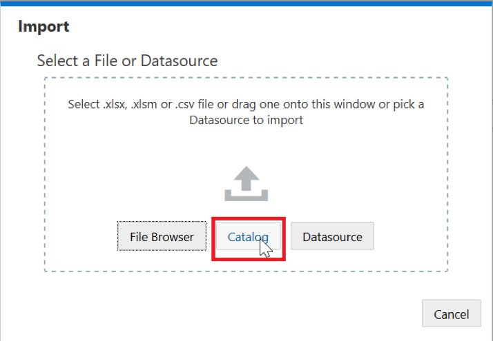

4.	Select **Sample_Basic.xlsx** file from:

    All Files -> Gallery -> Applications ->Demo Samples-> Block Storage.

    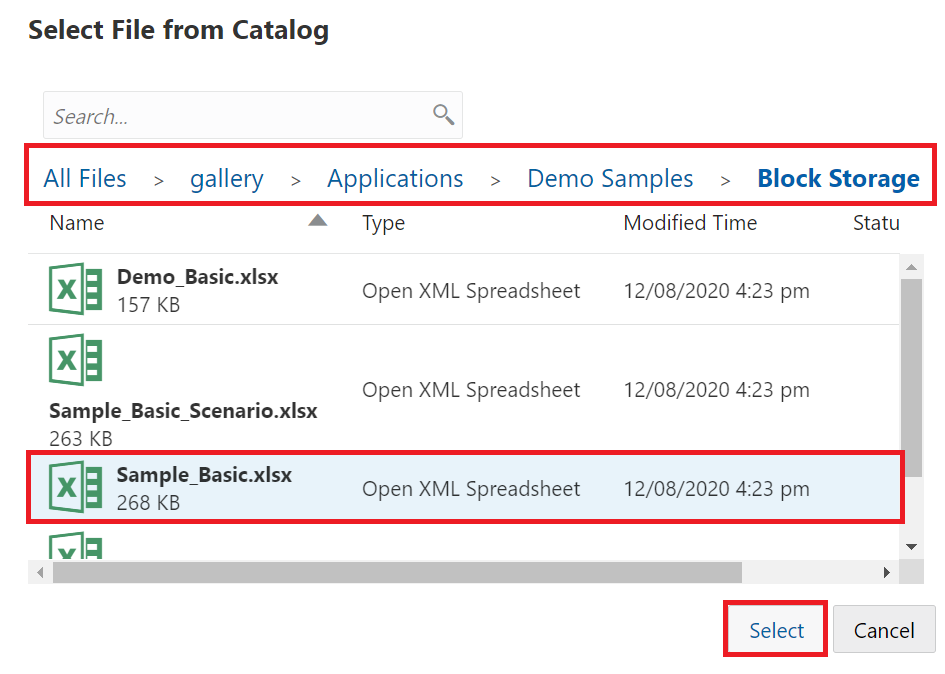

5.	Name the application **DynamicCorp** and the cube **Sales**. Click **OK**.

    

6.	Once the application is deployed, it is visible under the **Applications** tab.

    

This concludes the creation of sample application from the **Catalog** in the Essbase 21c web interface.

## Task 2: Analyzing Essbase data using Smart View Add-ins

After installing Oracle Smart View for Office, you can create connections to Essbase. Follow the Steps below to create a private connection to Essbase.

1. In Excel, select the 'Smart View' ribbon, and then click **Panel**.

2. On the Smart View Panel, select the Private Connections from the list.

    

3. Enter the URL to create a connection.

    URL syntax: 
    ```
    <copy>http://[Instance-Public-IP]:9000/essbase/smartview</copy>
    ```
4. Click on **Go**.

5. On the login window, enter your login credentials.
   Note: Log in with your IP address.

    

6. After successful login, you can now begin working with data in Essbase. Expand **EssbaseCluster** and navigate to the **DynamicCorp** application.    

    - Click **Sales** and **Connect**.  
    - Click **Ad hoc analysis**. 
 
    

## Task 3: Create Ad Hoc Grids

   - **Smart View Ribbon** - 
    The Smart View ribbon option enables you to set Smart View options and perform commands that are common for all data source providers.

   - **Essbase Ribbon** - 
    The Essbase ribbon contains commands that enable you to view, navigate, and analyze Essbase data.

   - **POV Toolbar** - 
    Dimensions that are not displayed in columns or rows of a data grid are displayed on POV toolbar, which identifies a slice of the database for a grid. For default ad hoc grids, all database dimensions are displayed on the POV toolbar at the dimension level.

   - **Smart View Panel** - 
    You use Smart View panel to connect to your Smart View data sources and manage connections.
    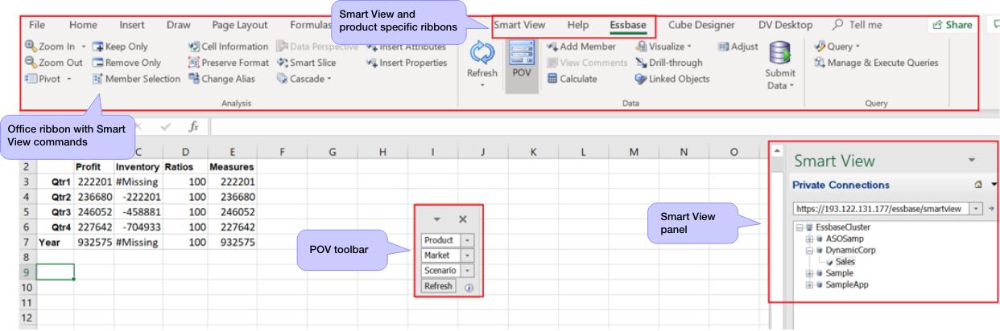

1. Open a new Excel. Click 'Smart View – Panel – Private Connections'. Enter the Smart View URL and the credentials.

2. In the Connection Manager panel to your right, Click **DynamicCorp** – **Sales**. Click **Connect** and then **Ad hoc analysis**.

    

3. After connecting to an Essbase server, you can initiate ad Hoc reports against databases on the connected server. The ad hoc report on a blank worksheet returns data from the top levels of each database dimension.

    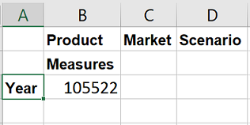

4. Double-click on year or Zoom in to next level. Now you can see the Quarter level data.

    

5. Go to Year. Navigate to 'Essbase' ribbon and click **Keep only**. Using this option, only the Year dimension is displayed and all the quarters are removed.
    
    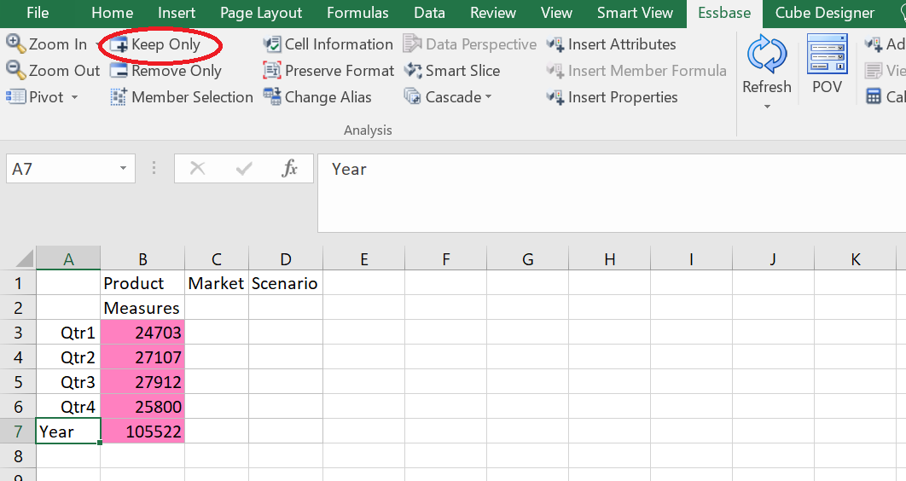

6. Go to Year. Click on **Zoom in- All Levels**. Now you can see the numbers drill down to leaf level (Months).

    

    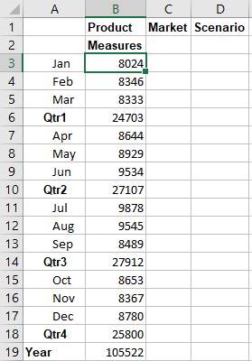

7. Double-click on 'Measures'. It will zoom into next level.

    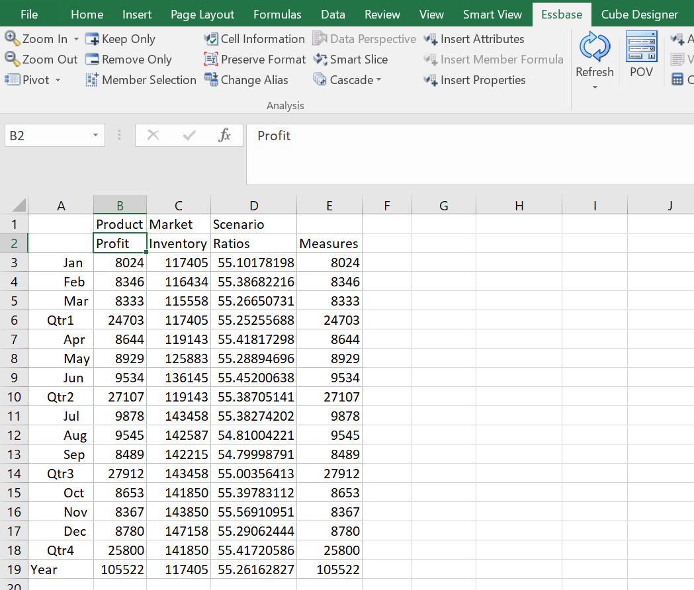

    - Now double-click on 'Profit', it will take you to a further to the next level.

    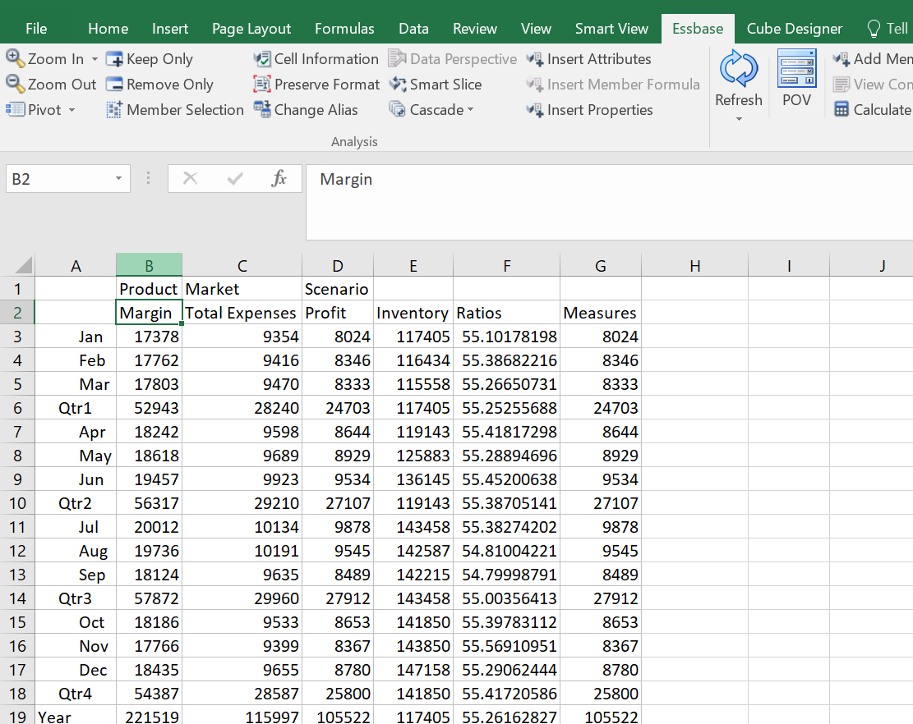

       - Now double-click on 'Margin', it will take you further to the next level (i.e, at sales level).

    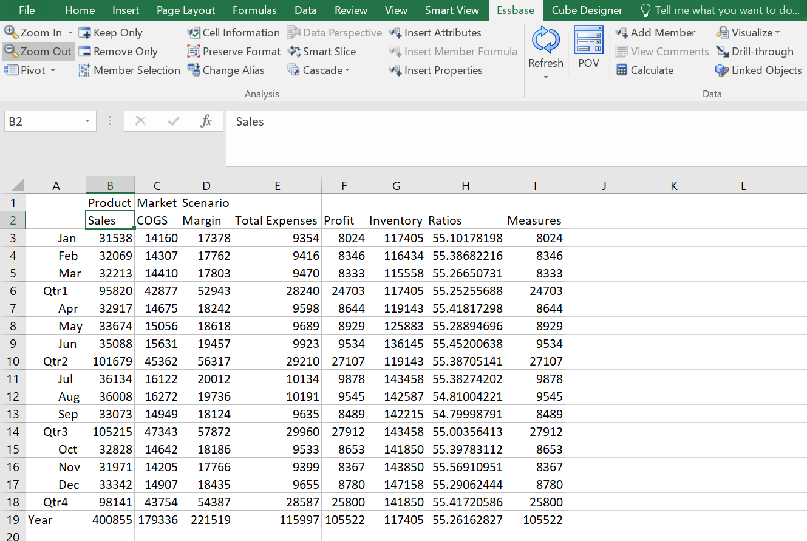

       - Select 'Sales' and click **Keep Only**. Now you are analyzing only Sales numbers and you have removed the rest of the members from your sheet.

    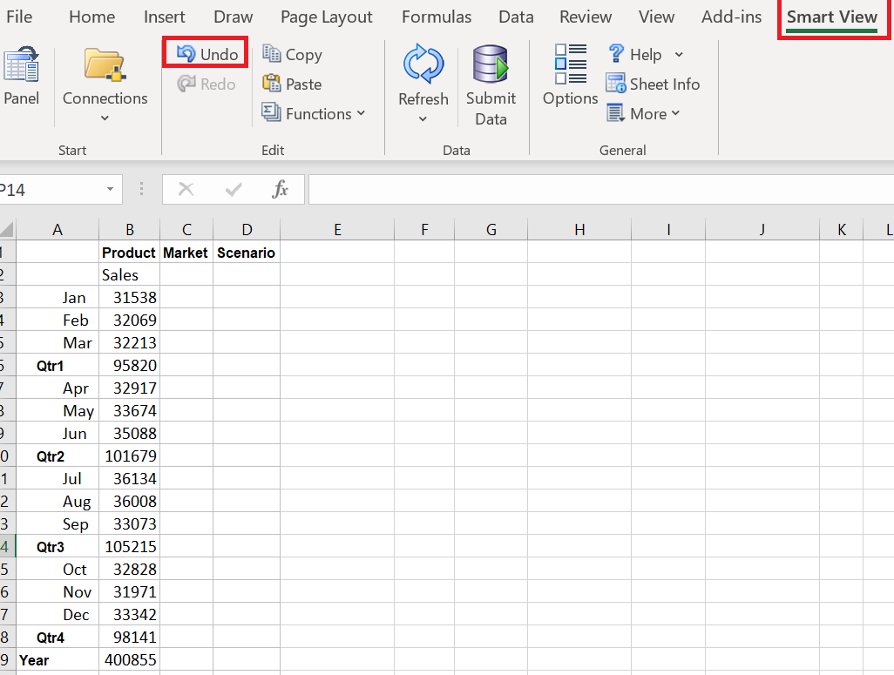

8. In the 'Smart View' ribbon click **Undo**. Undo reverses the last change you made to the data.
    

9.  In the 'Smart View ribbon' click **Redo**. It will take you back to the sheet prior to the Undo.

10.  Click on 'Year' and select **Keep only**. Click on 'Sales' and change it to 'Measures' by clicking 'Zoom out' on sales three times.

    - Create the below report by zooming into next level of Year dimension and Measures dimension.

    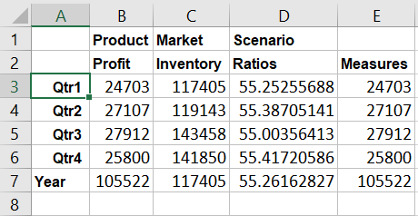

11.  Pivot to POV:

    - Click 'POV' in 'Essbase' ribbon.

    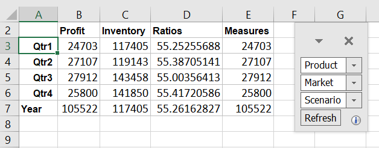

    - Click the down arrow next to Market. Select 'New York'.
  
    

    

    - Select 'New York' in the POV toolbar, and click **Refresh** to see the figures refreshed in the sheet for New York.

    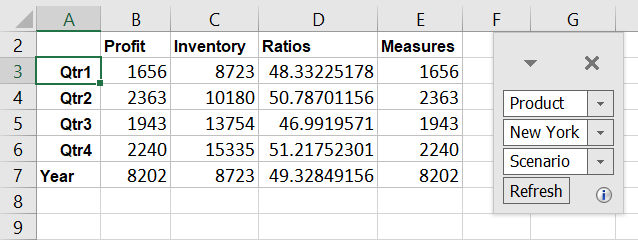

12. Member Selection:

    Note: Revert the last step changes by selecting 'Market' and 'Scenario' in the POV and click on 'refresh'.

    - Click 'POV' in 'Essbase' ribbon again.

    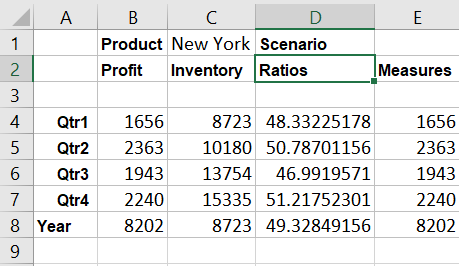

    - Click on 'Scenario'.

    - Click on Member Selection in the Essbase ribbon. Select 'Actual' and 'Refresh'.

    

    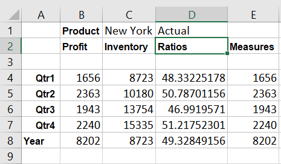

13. Free Form processing:

    - You can enter a member combination on a sheet. Click 'Refresh'. The sheet is updated to show the results of the query in your free form sheet.

    - Start by creating Smart View analysis report.

    - Create the below report by zooming into the Year and Measures dimension.

    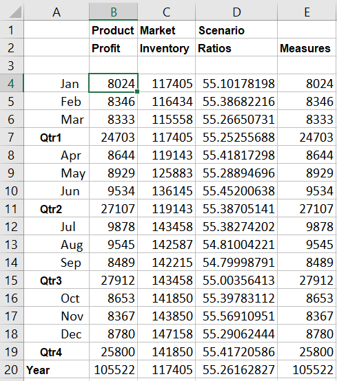

14. You can directly enter Sales account member in place of Profit to visualize sales data across year without needing to perform member selection.

15. Click on the 'Profit' cell, and write 'Sales', hit enter and refresh.

    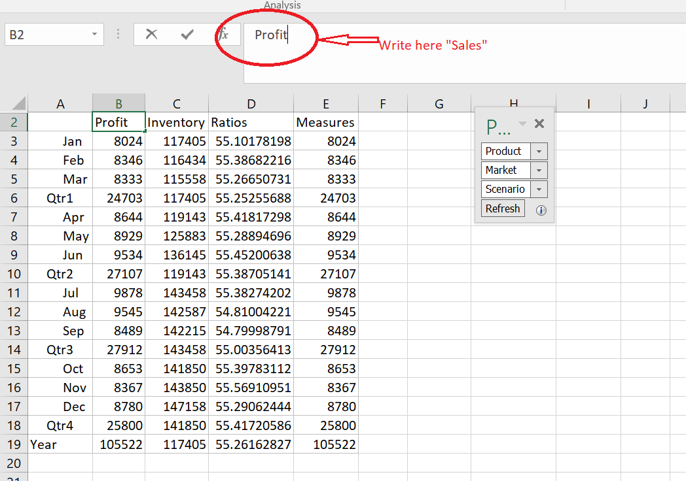

    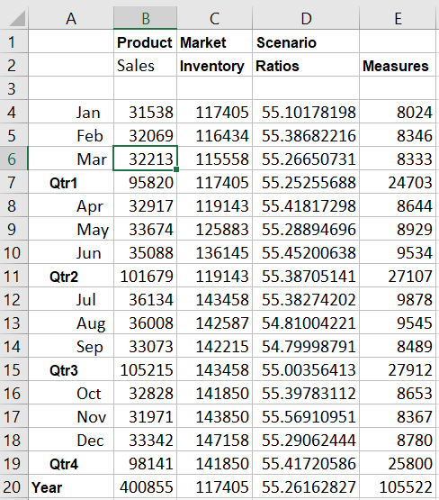


## Task 4: Install the Smart View Cube Designer Extension

1. On the 'Smart View' ribbon, select 'Options', and then 'Extensions'.

    

2. Click the 'Check for updates' link. Smart View checks for all extensions that your administrator has made available to you.

    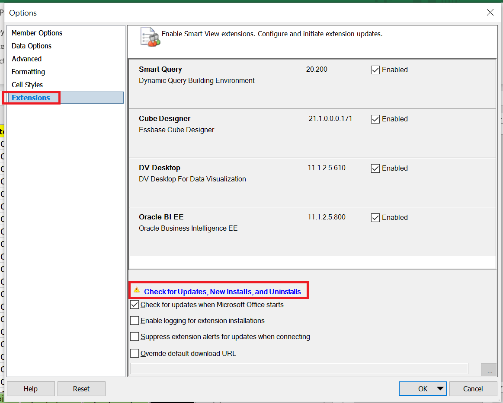

3. Locate the extension named Oracle 'Cube Designer' and click 'install' to start the installer.

4. Follow the prompts to install the extension.
    
    *Note:* Please give 1 or 2 minutes for Cube Designer to complete the installation.


## Task 5: Creating a cube from tabular data in Cube Designer

This workflow uses two sample tabular data excel files to demonstrate the concepts of intrinsic and forced-designation headers. See about [Design and Manage Cubes from Tabular Data](https://docs.oracle.com/en/database/other-databases/essbase/21/ugess/design-and-manage-cubes-tabular-data.html)


1. In the 'Cube Designer' ribbon, click **Connections** -> select the current connection from the dropdown menu to connect to Essbase.

   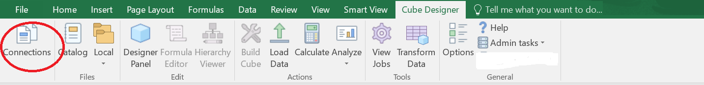

  On the 'Cube Designer' ribbon, click **Catalog**.

2.	On the Essbase Files dialog box, under Catalog, go to 'gallery/Technical/Table Format' as shown below, then select a sample tabular data file: **Unstr_Hints.xlsx**.

    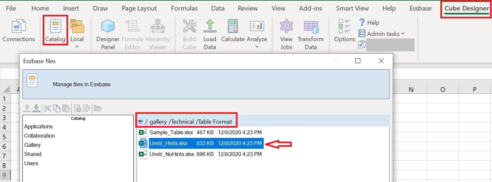

3.	Double-click on the above directed file.  
 The table format workbook have intrinsic headers that uses table.column format.

4.	On the 'Cube Designer' ribbon, select **Transform Data**.

5.	On the 'Transform Data' dialog box, enter an application and a cube name if you want to change the default names that are prepopulated.

    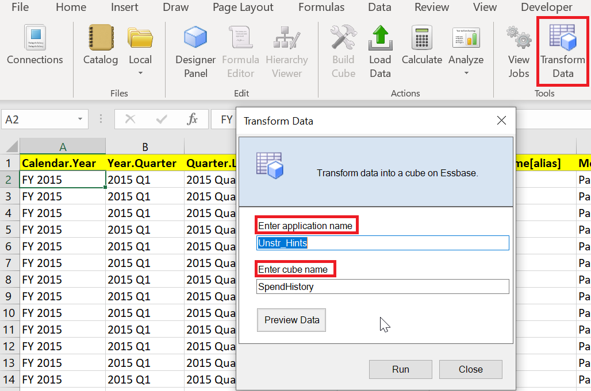

1. The application name is based on the source file name without the extension and the cube name is based on the worksheet name.

    **Unstr\_Hints.xlsx** : Application name is **Unstr\_Hints** and the cube name is **SpendHistory**

7.	Click **Preview Data**. The workbook is sent to Essbase 21c for analysis and then you can verify the dimensions and their members.

8.	When you are ready to create the cube, click **Run**.

9.	Once the job is finished, a pop-up will appear to view the job status. If you want to see the job status, click 'Yes'.

    <!--  image not available in image folder  -->

10.  The newly created application and cube are listed on the Applications home page in the user interface. Now the cube is created from the tabular data, you can export the cube to an application workbook.

11.	On the 'Cube Designer' ribbon, select **Local**, then select **Export Cube to Application Workbook**

    

12.	On the 'Export Cube to Application Workbook' dialog box, select the application and cube, and then select **Run**.

    


  *Note:* In the above exercise, you saw how a normal flat file excel sheet can be converted into an Essbase application and a cube. You can get the application workbook DBX (Design by Example) file in a matter of seconds with the dynamic capabilities of Essbase powered by the Cube Designer add-ins.

## Task 6: Export a Cube to an Application Workbook
1. In Essbase web UI, expand the application: **DynamicCorp** that contains the cube that you want to export.

2. From the Actions menu, to the right of the cube name **Sales**, select **Export to Excel**.

    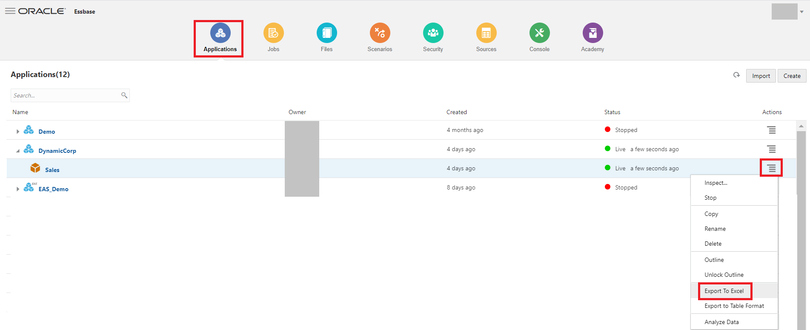

3. On the Export to Excel dialog box:
      * Select **Export Data** to export the data from the cube. How the data is exported depends on whether the cube is block storage or aggregate storage.
           - In block storage cubes, if the size of the data is 400 MB or less, it is exported to the application workbook, on the Data worksheet. If the data size exceeds 400MB, data is exported to a flat file named Cubename.txt, which is included in a file named Cubename.zip on the **Files** page.
           - In aggregate storage cubes, regardless of the size, data is always exported to a flat file named Cubename.txt, which is included in a file named Cubename.zip on the **Files** page.
      * Select build method as **Parent-Child**.
      * Select **Export Script** to export each of the calculation scripts as a separate worksheet within the application workbook.
      * Select **Export Member IDs**.

    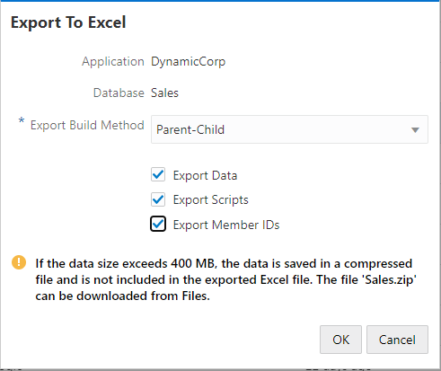

4. When prompted, save the exported application workbook to your local or network drive or download the exported application workbook and data .zip files from the Files page.

    File names do not include spaces because files that are imported to Essbase cannot contain spaces in the file name.


## Task 7: Overview of the WEB-User Interface

### **Applications**:
1. Applications tab gives us the information about the Essbase applications and their respective cubes.

    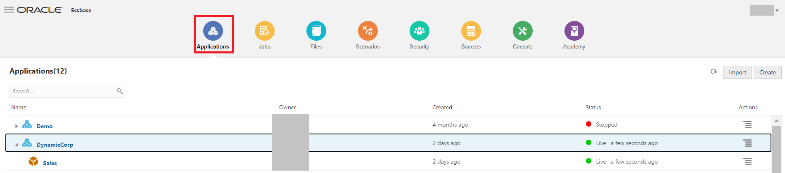

    *Note:* You can try below options for any application.

2. By choosing **Inspect** option for application, you can see application specific logs, audit files, configuration files, etc.

    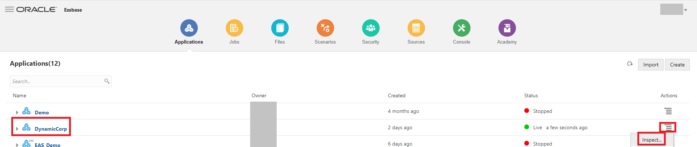
    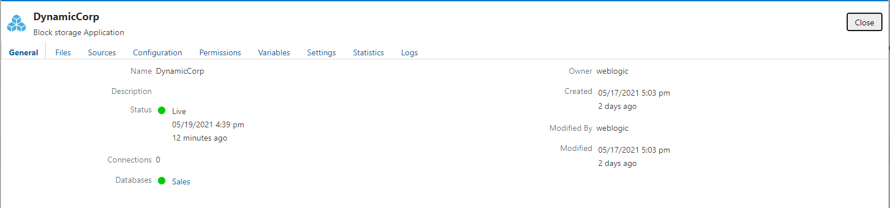

3. You can access cube specific options by selecting **Inspect** for each cube.

    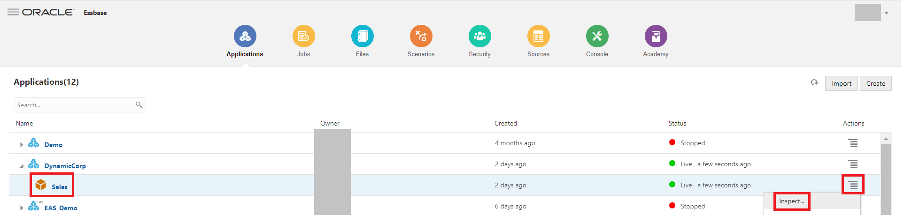
    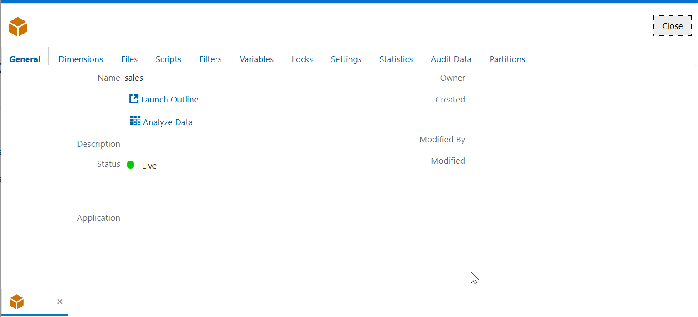

4. **Outline Analysis**:
   The Outline option is equivalent to the EAS console in Essbase on-premises.

   This is where you can add new dimensions or members under dimensions at any level, as required, and can make changes to existing cubes quickly using the 'Edit' option. Select the 'Outline' option for the 'SpendHistory' cube (or any cube that is already LIVE on the Essbase 21c web interface).

    
    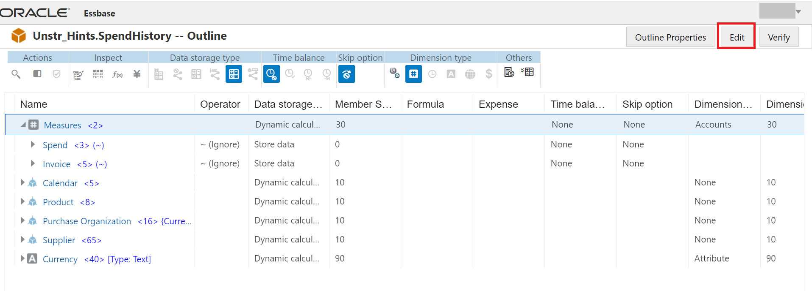

5. Here, add a new child called 'TotalA' under the 'Measures' dimension as shown below. Let us now assign an 'Ignore' Consolidation operator to the 'TotalA’' member. The operator defines how a new member rolls up across the hierarchy.

    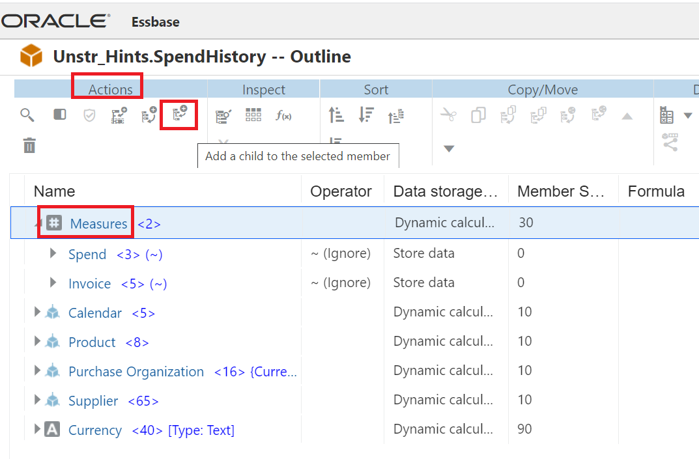

    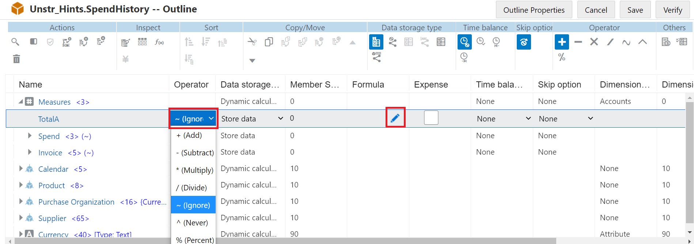

6. We now have to add a formula to this new member using the pencil icon under the 'formula' tab as shown. We will use **Spend + Invoice**;.

7. Once added, we need to verify the formula and then select **Apply** and **Close**.

    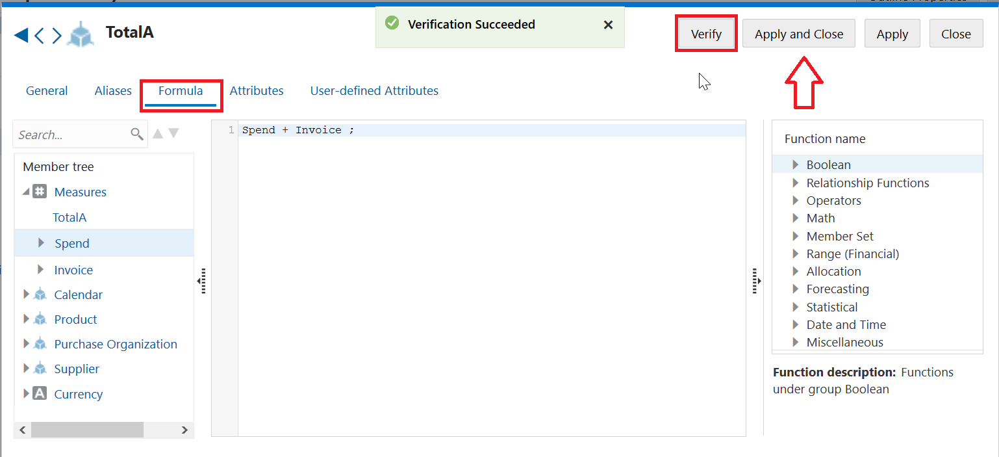

8. You can also specify other options such as Data storage type and 'Sort/Inspect' of members in a dimension using the options in the web interface.

    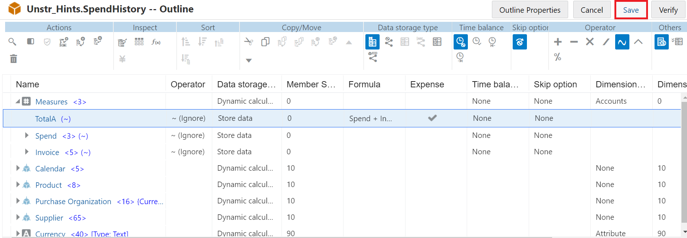

    - **About Time Balance property** : To use time balance property for members, the dimension must be tagged as Accounts. You must have a dimension tagged as Accounts and a dimension tagged as Time.

        | Settings for Time Balance Property  | Description  |
        | ------------- | ------------- |   
        | None | Apply no time balance property. Member values are calculated in the default manner. |  
        | Average | A parent value represents the average value of a time period. |   
        | First | A parent value represents the value at the beginning of a time period. |  
        | Last | A parent value represents the value at the end of a time period. |   

    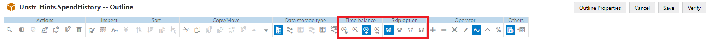

    - **About Skip Option property**: Setting this option to None or Missing for a member determines
    what values are ignored during time balance calculations.

    - **None** means that no values are ignored.

    - **Missing** means that #MISSING values are ignored.

    *NOTE:*
    - You can specify skip settings only if the time balance property is set as first, last, or average.
    - You can set these properties for any members except **Label Only** members.
    
    For members with property *Time Balance = Last* and *Skip Option = Missing*, the following icons are highlighted when you select that member.

9.  Under **Inspect**, Click on Display selected columns in the table. You can select the different member properties to display in the outline tab.

    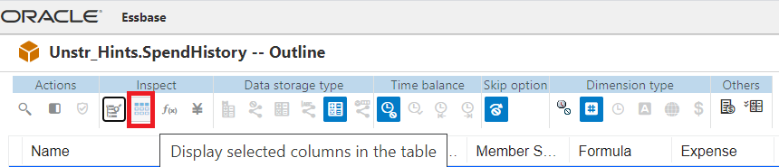

    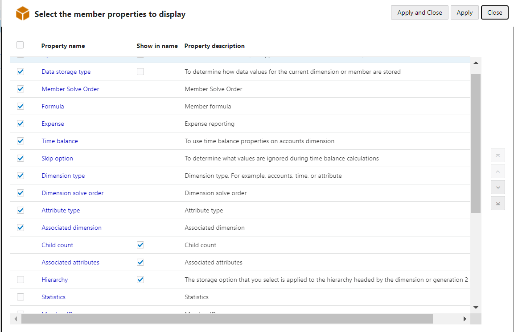

10.  Click on **outline** properties.

    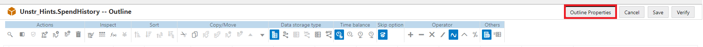

    Outline properties, in part, control the functionality available in an Essbase cube, they also control member naming and member formatting for attribute dimensions, alias tables and text measures.

    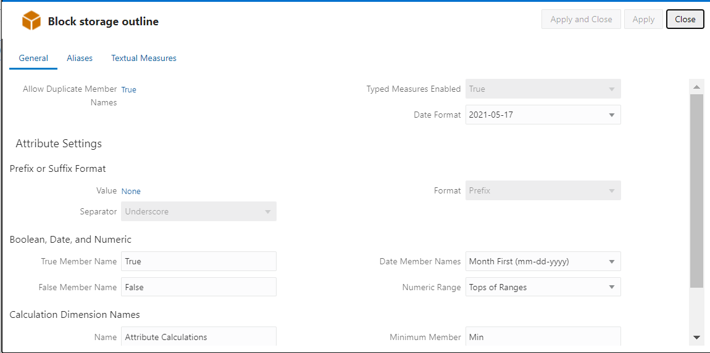


### **Jobs**:

1. Jobs are operations such as loading data, building dimensions, exporting cubes, running MaxL scripts, running calculations, and clearing data. Jobs are asynchronous, meaning they are run in the background as a unique thread. Each job has a unique id.

   The Jobs tab displays all the information about the jobs that have been executed in the Essbase web user interface.

   Job details include information such as script names, data file names, user names, number of records processed and rejected, and completion status. You can also setup and run new jobs
   from this window, as well as re-run previously executed job.


   You can create and run new jobs using this tab by clicking on **New Job** as shown below.

    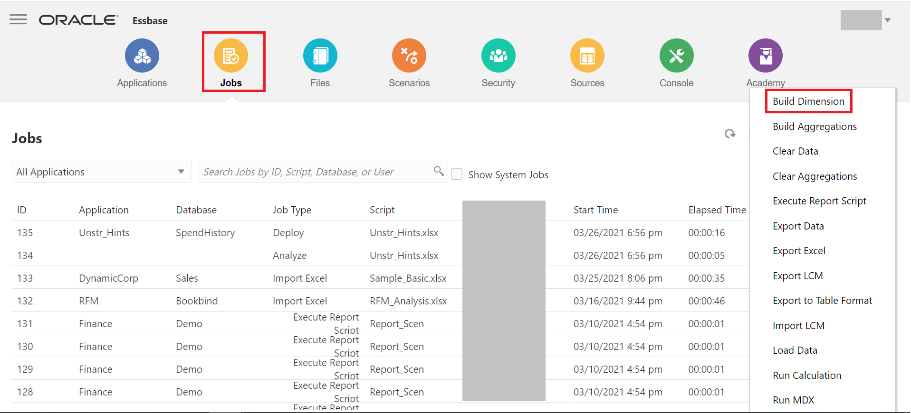

2. Execute a Build Dimension job by selecting the application (**Unstr_Hints**) and cube (**SpendHistory**).

   The 'Script' file is the rule[.rul] file where the dimension build script exists.

   Select the pre-existing 'DimBuild.rul' file and its corresponding 'DimensionsCSV.txt' pair as the Data File, select the restructure Options as 'Preserve all data' and execute the job.

    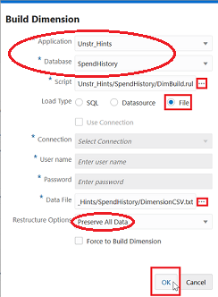

3. You can see the status of the job in Essbase web interface once it is submitted. For more details about the job you can click on **Actions**.

    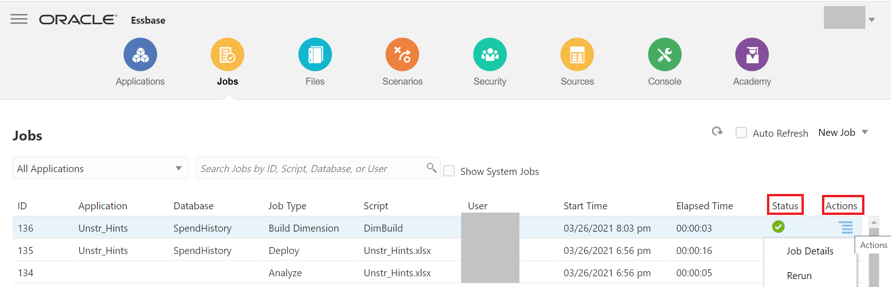

### **Files**:

1. The Files tab is equivalent to the file directory of Essbase. The **Applications** folder consists of all the files related to applications and their respective cubes.

    

2. In the Files tab, you can upload the artifacts/files related to Essbase, such as script files, rule files, load files etc. from your local system directly into the cube using the 'Upload Files' option under the corresponding cube path(In the image below, the application name is 'Sample' and the cube name is 'Basic').

    

3. The **Gallery** folder on the **Files** tab has industry wide sample templates in dbx format that are ready to use. They help you kickstart the process of building cubes related to that specific industry very quickly.

    
    

4. **Application workbooks** comprise a series of worksheets, which can appear in any order, and define a cube, including cube settings and dimensional hierarchies. There are strict layout and syntax requirements for application workbooks, and validations to ensure that workbook contents are formatted correctly. The cube building process will fail, if there are any errors.

    Modifications can also be made to the workbook using Designer Panel.

    Essbase provides application workbook templates for creating block storage and aggregate storage
applications and cubes.

    Using a sample application workbook provided in Essbase, you can quickly create sample applications and cubes. The cubes are highly portable, because they are quickly and easily imported and exported.

### **Scenarios**:

The **Scenarios** tab is where you create scenario modeling on the applications for 'What-If' analysis, which empowers the users to analyze the data and get insights from the data. More details on this are covered in an upcoming lab.

### **Security**:

1. The **Security** tab holds the information about the users in Essbase and the roles they’re assigned. You can change the level of access assigned to a particular user.

2. You can add new users by clicking on the **Add User** option.

    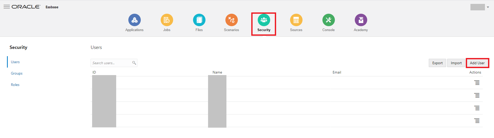

    There are three predefined user-level roles in an identity domain.
    * **Service Administrator**: Administers the entire cloud service instance, including backing up, creating and deleting applications, provisioning users, and running Jobs.
    * **Power User**: Creates applications and cubes, and grants access to users to perform actions on those cubes.
    * **User**: Accesses and performs actions on cubes for which access is granted.
    User Roles are hierarchical in that access granted to lower-level roles is inherited by higher level roles.

    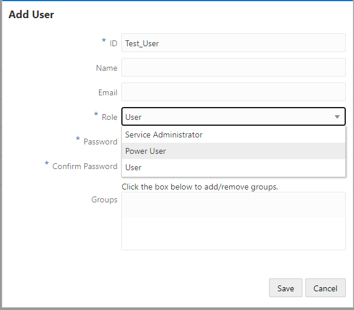

    For example, Service Administrators inherit the access granted to Power User and User roles.

### **Sources**:

Many cube operations require connection information to access remote source data or hosts. You can define 'Connections' and 'Datasources' once and reuse them in various operations.

  - A connection stores login credentials required to access an external source. A Datasource points to an external source of information.  
    More details on this are covered in an upcoming lab.
    

### **Console**:

The Console tab is one stop place for Essbase Administrator tools such as:

*	Export Utility: Command-Line tool for exporting the outline of a cube and other related elements into a application workbook.
*	LCM: Life-Cycle Management tool is used for backing up and restoring the Essbase artifacts.  
*	Command-Line Tool: CLI utility to perform administrative actions on On-Premise Essbase platform.
*	Migration Utility: This utility is used for migrating Essbase artifacts between Essbase instances and environments. This tab also contains the download links for Smart View and Cube Designer add-ins. Extensions and Essbase Client tools such as MaxL, Java API, and others are also available in the Desktop Tools section.

    

* **Console** tab also holds the information regarding session login by users, settings of the Essbase environment, email configuration settings etc.
* The **Global configuration** file of Essbase is available directly from the Essbase Web-user interface, here we can add new variable property settings with corresponding values using 'Add' option.

    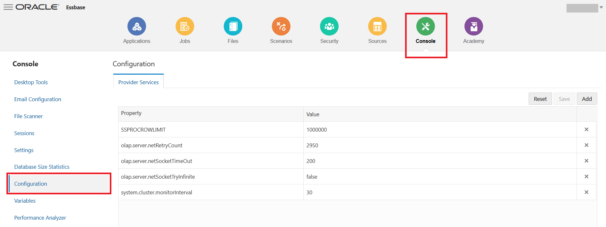


### **Academy**:

**Academy** has documentation links by topics for users and administrators.


You may [proceed to the next lab](#next).

## Acknowledgements
* **Authors** -Sudip Bandyopadhyay, Manager, Analytics Platform Specialist Team, NA Technology
* **Contributors** - Eshna Sachar, Jyotsana Rawat, Kowshik Nittala, Venkata Anumayam
* **Last Updated By/Date** - Jyotsana Rawat, Solution Engineer, Analytics, NA Technology, August 2021
