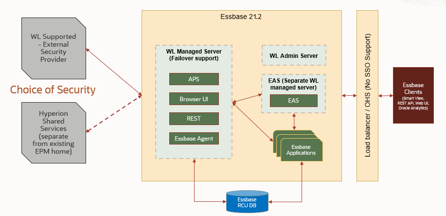

# Introduction

## About this Workshop

In this workshop, you will learn how business users can utilize multiple data sources and Oracle Essbase to benefit their business through advanced data management and analytics. 

This workshop is designed to give you a hands-on experience with various components of Oracle Essbase.

*Estimated Workshop Time:* 5.75 hours

### About Product/Technology

Lines of business are under enormous pressure to generate more insights, faster, from their financial systems and other critical data sources. But most organizations, spend a lot of time manually sourcing, managing, preparing, and securing data – leaving far too little time for true analysis and insight.

Oracle Essbase is a business analytics solution that uses a proven, flexible, best-in-class architecture for analysis, reporting, and collaboration. Essbase delivers instant value and greater productivity for your business users, analysts, modelers, and decision-makers, across all lines of business within your organization.

Oracle Essbase helps you to build your company’s On-Premise strategy efficiently by avoiding data and business process fragmentation. Oracle Essbase can be easily deployed on Oracle Cloud Infrastructure, which can then be widely used to solve simple to complex business analytics use cases across all industries. It is designed to help you model business performance levels and deliver what-if analyses for varying conditions. 

### Features of Oracle Essbase

1. Oracle Essbase provides a complete set of tools and features for deriving and sharing data insights.

2. Both large organizations and small teams can share data easily, without the need to manage or consolidate multiple versions of spreadsheets, and quickly perform ad hoc analysis of the spreadsheet data.

3. Application developers can utilize interfaces that enable them to extend, customize and embed rich analytic experiences in the application flow.

4. Oracle Essbase is a multi-dimensional engine that allows you to extract data from any source, handle real-time data and collaborate easily.

5. With Essbase you can create and manage Essbase applications from Microsoft Excel by using Cube Designer.

6. Create connections and data sources for drill-through, data loads, and dimension builds.

7. We can use Essbase to collect collaborative data, create scenarios, and perform what-if analysis using Smart View.

### Essbase 21c Architecture

  

### Objectives

-   Learn how to use Oracle Essbase with your data and applications to help you model business performance levels and deliver what-if analyses for varying conditions.

### Prerequisites

-   An Oracle public cloud tenancy where you have the admin privileges and resources available to provision an ATP instance with one OCPU and an Essbase 21c instance with one OCPU.
-   Smartview Plugin (steps provided in Essbase lab)

## Appendix 1: Working with Essbase

During our workshop we will help a fictitious company Dynamic Corporation to perform financial analysis. Dynamic Corp. is a high-tech manufacturer of hard disk drives. It is headquartered in Bay Area, California. Dynamic Corp. has its operations spread across multiple regions. Various departments within Dynamic Corp. performs financial analysis.

While doing financial analysis the number of reports developed are as follows:

* Monthly sales revenues by product , by customer
* Current year actual, budget , forecast data
* Customer sales by region            
* Current year actual and budget data
* Monthly product development reports
* Details of company cost structures
* Write back for what-if analysis

Dynamic Corp. extensively use Microsoft Excel application for Financial reporting. Financial analyst at Dynamic Corp. are well versed with use of Excel. But with growing business they find it difficult to manage reporting with excel. They found out Excel is a widely used tool for two dimensional data analysis, but presents enlisted limitations when used for multidimensional data analysis -

1. Disconnected
2. Data Security Risks
3. Error Prone
4. Scalability issues
5. Lack of audit trails/log mechanism
6. Tedious and multi-step calculations

To overcome these limitations and to proceed with an efficient and precise multi-dimensional data analysis, Essbase comes to the rescue. Essbase can be defined as a multidimensional database (comparable to Excel pivot table) offering following benefits -

• One single location for data – all analysts are using the same data, business drivers, and metrics for calculating departmental budgets.

• Standardization of Business Drivers – budget drivers can be loaded and calculated by the administrator so that all budgets are using the same methodology.

• Security – the administrator can apply security to certain dimensions and members, giving users access to only the data that they are responsible for. This allows more participation from the field in the budget process.

With the above stated benefits, it’s certainly worthwhile to understand the nitty-gritty of Essbase, its benefits, features and applications. This lab intends towards providing a holistic view of Essbase, its features, and applications.

Note: The steps going forward will have to followed in a Windows operating system.

## Appendix 2: Installing Smart View Plugin

### **Smart View Prerequisites**
1. The latest release of Smart View
2. On the Oracle Technology Network Downloads tab, the latest release for Smart View is always certified.
3. Microsoft Office 2010, 2013 or 2016
4. .NET Framework 4.0

**Note: You must use .NET Framework 4.5 if you are installing Smart View from Essbase without saving the installer locally.**

### **Installation Steps**
1. Navigate to [link](https://www.oracle.com/middleware/technologies/epm-smart-view-downloads.html) to download latest Smart View for office.
2. On the Smart View download page on Oracle Technology Network, click Download Now, and then click Accept License Agreement. If the Oracle sign-in page is displayed, then sign in with your Oracle user name (usually your email address) and password.
3. Follow the steps for your browser to download the .zip file, and save it to a folder on your computer.
4. Go to the folder that you used in Step 3, and then double click smartview.exe to start the installation wizard.
5. Select a destination folder for Smart View, and then click OK. For new installations, Smart View is installed by default in: ``C:\Oracle\smartview``
9. If you are upgrading an installation of Smart View, then the installer defaults to the folder where you previously installed Smart View.
10. When the installation is complete, click OK.

## Acknowledgements
* **Authors** -Sudip Bandyopadhyay, Manager, Analytics Platform Specialist Team, NA Technology
* **Contributors** - Eshna Sachar, Jyotsana Rawat, Kowshik Nittala, Venkata Anumayam
* **Last Updated By/Date** - Jyotsana Rawat, Solution Engineer, Analytics, NA Technology, August 2021

