# Scenario Management

## Introduction

Using scenario management, scenario participants can perform what-if analysis to model data in their own private work areas. These scenarios can optionally be subject to an approval workflow, which includes a scenario owner and one or more approvers. In the workflow, scenario owners merge scenario data with the final cube data only after it is approved.

*Estimated Lab Time:* 60 minutes

### Objectives

To understand the following:

*	Scenario Management Overview
*	Creating a cube with Sandboxes
*	Creating a Scenario
*	Lightweight Sandboxes		
*	Changing Sandbox Data
*	Scenario Workflow

### Prerequisites
This lab assumes you have:
- A Free Tier, Paid or LiveLabs Oracle Cloud account
- You have completed:
    - Lab: Prepare Setup (*Free-tier* and *Paid Tenants* only)
    - Lab: Environment Setup
    - Lab: Initialize Environment  

## Overview – Understand Scenario

The exercises contained within this lesson will allow the user to get acquainted with different aspects of Scenario Management.  The different aspects include the lightweight nature of sandboxes on the cube; the process involved with initiating Scenario Management and adding sandboxes; as well as, the workflow supported by Scenario Management.  

*	Scenarios are private work areas in which users can model different assumptions within the data and see the effect on aggregated results, without affecting the existing data.

*	Each scenario is a virtual slice of a cube in which one or more users can model data and then commit or discard the changes.

*	The sandbox dimension is flat, with one member called Base and up to 1000 other members, commonly referred to as sandbox members. Sandbox members are named sb0, sb1, and so on.

*	Each sandbox is a separate work area, whereas the Base holds the data currently contained in the cube. A specific scenario is associated with exactly one sandbox member.

*	When first created, sandbox member intersections are all virtual and have no physical storage.

## Task 1: Create a Scenario-Enabled Sample Cube

You can create a scenario-enabled cube by importing the scenario-enabled sample application workbook.

1. Download the worksheet **SandboxApp.xlsx**.

   This file is part of Workshop artifacts. Steps to download the artifacts are mentioned in **Lab: Initialize Environment-> step2**.

   Open the **SandboxApp.xlsx** file.

2. Change the Application name (sheet Essbase.Cube) to **Sample_Scenario**.

   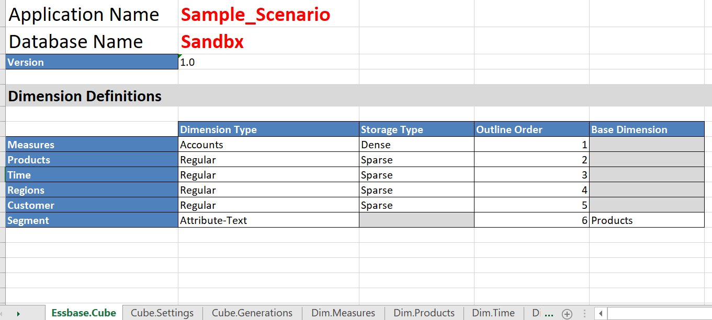

3.	Navigate to the 'Cube.Settings' sheet and in the 'properties' section, check the Scenario Sandboxes properties. Here you are verifying that this is scenario enabled cube because 10 Scenario Sandboxes (scenario-based members) are there.

   

4. Save your file as **SandboxApp.xlsx** and close it.

5. Go to the Essbase web interface and click on **Import**.

   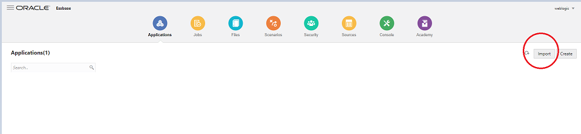

6. Click on **File Browser**, and browse to select **SandboxApp.xlsx** worksheet.

   

  Make sure to check that Load Data option is selected under Advanced Option. Click **OK**.

   

## Task 2: Lightweight Sandboxes

**Show that Sandboxes are lightweight**  

This step shows that creating sandboxes has little impact on resource usage such as disk space.

1. Download **SmartView.xlsx** file.

   This file is part of Workshop artifacts. Steps to download the artifacts are mentioned in **Lab: Initialize Environment-> step2**.

   Open **SmartView.xlsx** and go to **sheet1** tab.
   
   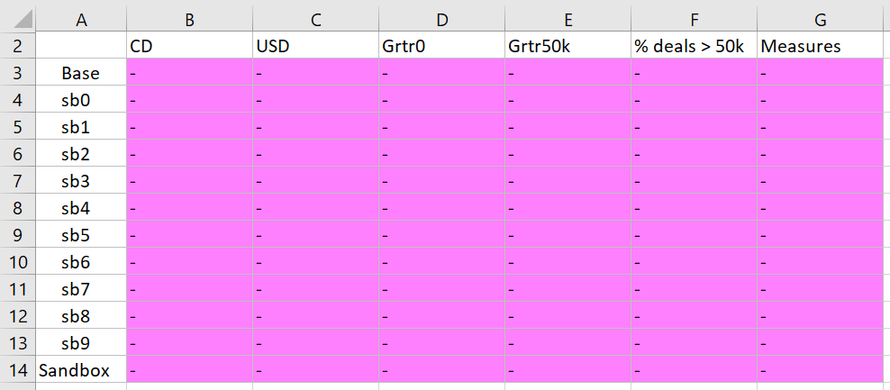

2. Go to the Smart View, Create a private connection to Essbase: http://IP:9000/essbase/smartview.

   Note: Replace the IP with your instance's ip.

   Login and expand 'Sample_Scenario' Application and Select the 'Sandbx' Cube. Click 'Connect'.

   

   In order to query the selected Cube, choose the option -> **Set Active Connection for this Worksheet**.

3. Refresh the data.

   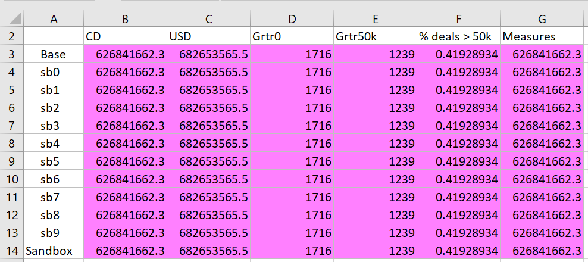

   **Note:**

   By default, all Sandboxes you create have the same values as the data loaded into the base. The data in the sandbox is dynamically queried and do not use any extra storage disk space. Only values that are modified as part of a scenario are stored. This makes creating and using scenarios a very light-weight operation.  

## Task 3: Scenario Management
This step is geared towards developing an understanding of security for Essbase and also the workflow aspects of Scenario Management.  In addition, you will create a couple of calculation scripts and leverage run-time substitution variables from within Smart View.

1. Add Users:   
      * Go to **Security** tab to add users. Under **Users** tab, click on **Add user**.
   
   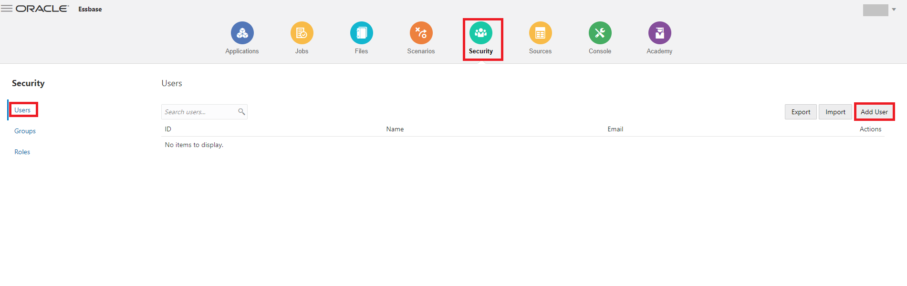

      * Provide the details for adding user: 'John'
        * Id: John
        * Role: user
        * Password: password
   
   

      * Repeat above steps for adding 'Maria', 'Phillip' & 'Sam'.
   
   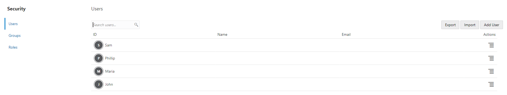

2.	Defining Security:  

      We will define security roles for several people to be used throughout the next several exercises. Once the security is defined validate the privileges by logging in as each user and pay attention to the differences from user to user.

      * On the home page, navigate to the **Sample_Scenario** Application. Launch the application inspector by clicking the button under **Actions** and selecting **Inspect**.
   
   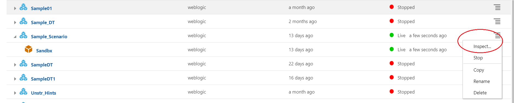

      * On the application inspector, click the **Permissions** tab. Click the + icon on this page to add users to this application.
   
   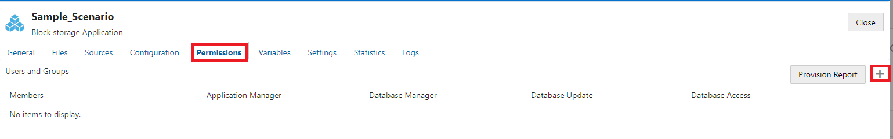

      * Search for John, Maria, Phillip & Sam and click the **+ icon** next to their ids to add the users to the application.
   
   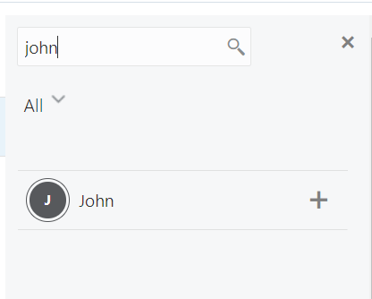

      * By default all users have the Database Access Roles.
   
   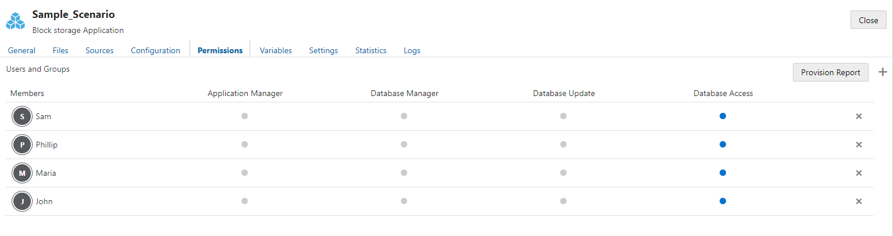

      **Note**:  
      There are four predefined application-level roles:
      * **Application Manager**: Creates, deletes, and modifies databases, application settings, and scenarios in an assigned application. Also assigns users to an application.
      * **Database Manager**: Manages databases, database elements, locks and sessions in an assigned  application; creates and deletes scenarios.
      * **Database Update**: Reads and updates data values based on assigned scope, uses assigned calculations and filters, and creates and deletes scenarios.
      * **Database Access**: Accesses scenarios, reads data values in all cells, and accesses specific data and metadata unless restricted by filters

      * Assign the following roles to the below users and Click **Close**:
         * John -> Database Manager
         * Phillip -> Database Update
         * Sam -> Database Update
         * Maria -> Database Update
   
   

      * Go to Smartview, click on **more** (as shown below) and then click on 'disconnect' to disconnect from the current connection.

   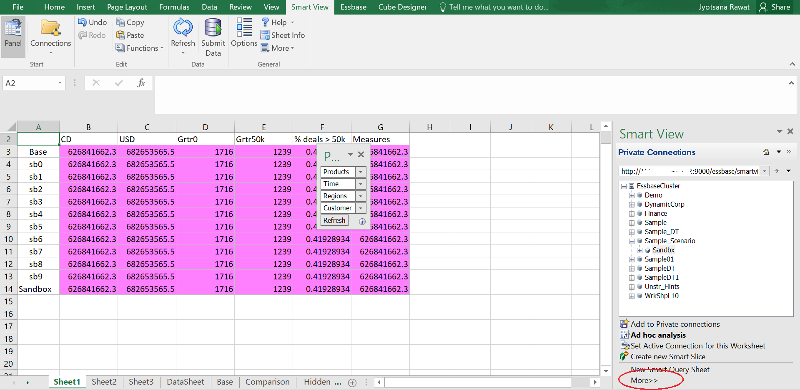
   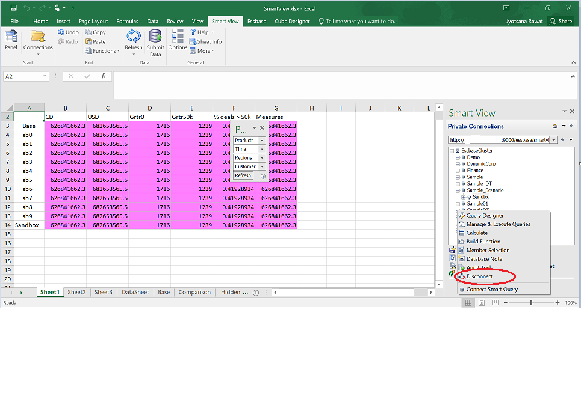

      * Click on **->** (arrow mark as shown below) to log in as John.  
   
   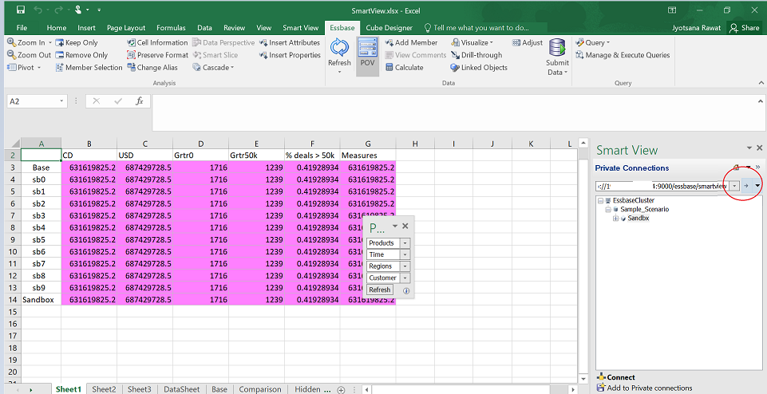

      Expand 'Sample_Scenario' application and select 'Sandbx' database. Click 'connect' and then 'Set Active Connection for this Worksheet'. Refresh the data.

   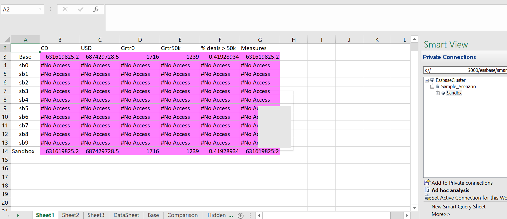

      Close the Smart View.xlsx worksheet.

      Note: Follow the steps mentioned in f) and g) above to switch between different users.


3. Creating Scenarios:

      In this exercise you will log in as Maria and create a new scenario defining Sam as a participant. Validate the impact of the security changes for each user John, Maria, Sam and Phillip.  Without logging out from Smart View, make Phillip a Scenario Approver, then refresh the data in Smart View validate the change to his security.

      * Go to the web interface, log in as Maria.

      * Navigate to **Scenarios** tab. Click **Create Scenario**.
   
   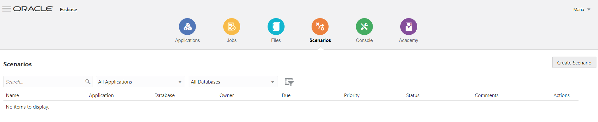

      * Give the scenario a name:**What-If** and a due date. On the **Users** tab, click the '+' icon and add Sam and Phillip. By default a user is added as a Participant. Change Phillip's role to Approver.
      
   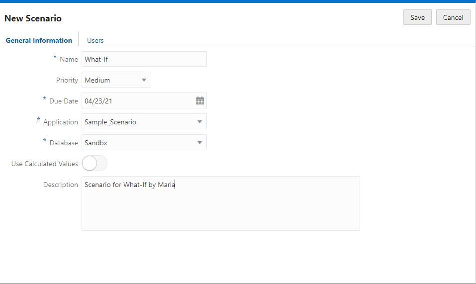
   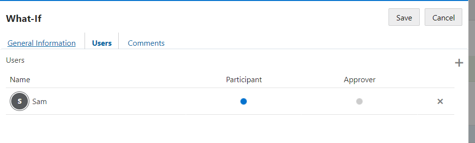

   
      Click **Save**.

      * Once created, click on **What-If** scenario and identify which sandbox member your scenario is using. It would be using sandbox **sb0**.

   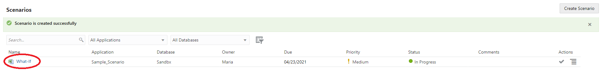
   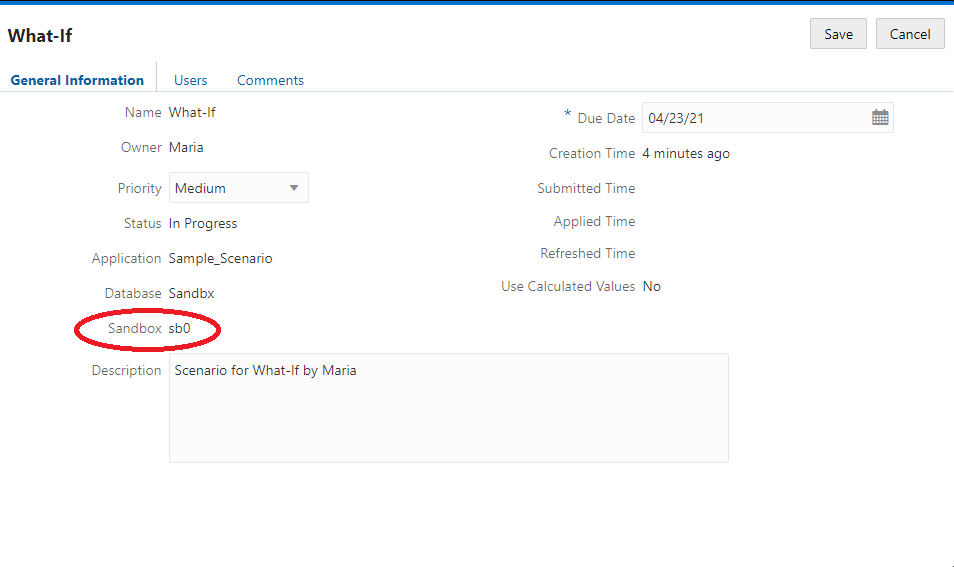


4. Changing Sandbox Data:
      As Sam, you will change some data for the scenario that was just created and using the Essbase web interface you can see the differences between Base and the scenario.

      * Open the Smart View.xlsx.

      * Go to the 'DataSheet' tab and connect to the database as Sam, ensure the POV has the correct sandbox member (sb0).
      
   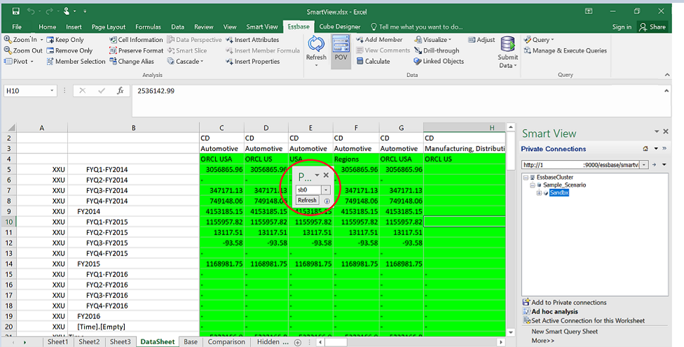

      * Go to the cell C13 and enter a number (for e.g, 2000) then click 'submit' (the intersection updates should be  XXU->FYQ4-FY2015->Automotive->ORCL USA).

      Please verify the intersection as mentioned.

   

      * Go to Essbase web interface, navigate to the **Scenarios** tab. For What-if scenario, click on **Actions**.

      Note: Maria is logged in web interface.

      * Click on the **Show Changes** to show the changes in the UI.
      
   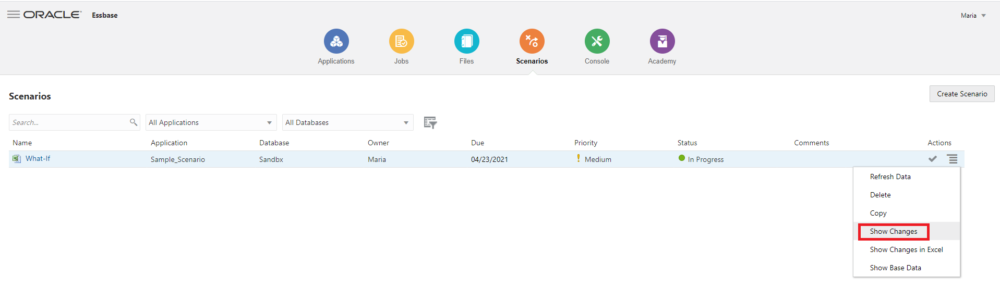

      Verify the changes:
      
   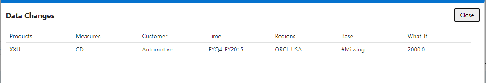

5. Calculations in a Sandbox:
In this step you will create a calculation script to create data for ORCL USA->XXU->Automotive in 2016 by increasing 2014 data by 15%.

   * Login in Essbase web interface as John.

   * Expand the **Sample_Scenario** application and navigate to the database inspector for the **Sandbx** database.
   
   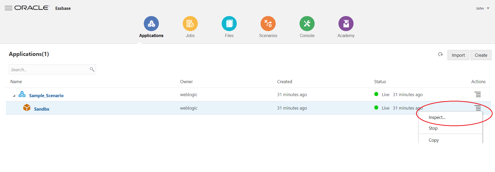

   * Click on the **Scripts** tab on the database inspector and select **Calculation Scripts** from the left navigation menu.
   
   

   * Click the + icon on the right to create a calculation script. Name the script as **Feed16**, type the below content in the scripts section:

      ```
      <copy>        
      set updatecalc off;
      SET CREATENONMISSINGBLK ON;
      Fix("XXU","Automotive","[USA].[ORCL US].[ORCL USA]", @Children(FY2016), "sb0")
      "CD" (@Prior(Base, 8, @LevMbrs(Time,0)) * 1.15;)
      "USD" (@Prior(Base, 8, @LevMbrs(Time,0)) * 1.15;)
      EndFix
      </copy>
      ````

   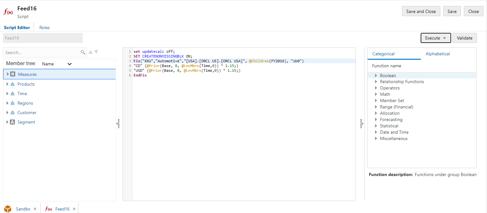
   
   * Validate the script. Click **Save** and **Close**.

   * To execute the script, navigate to the **Jobs** tab and create a new job by clicking **New Job -> Run Calculation**.
   
   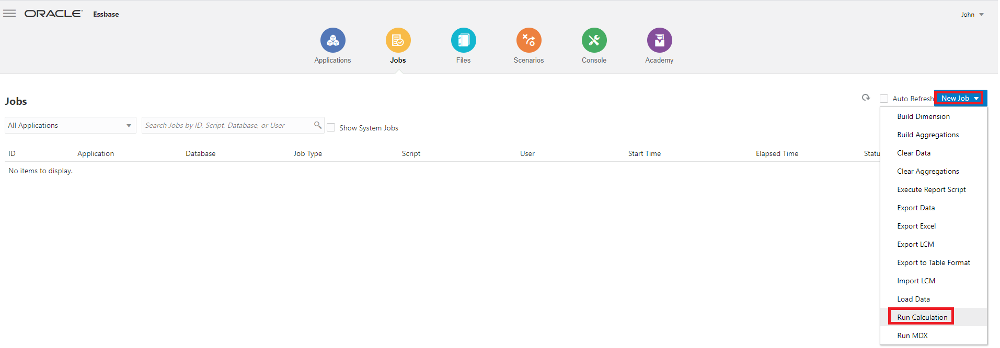

   * Select the Application: **Sample_Scenario** and database: **Sandbx** and the calc script that was just created (**Feed16**). For Variables select the 'sb0' as Value for the sandbox variable.

   * Click **OK**.
      

   * Click **Refresh** to see the job status.
   
   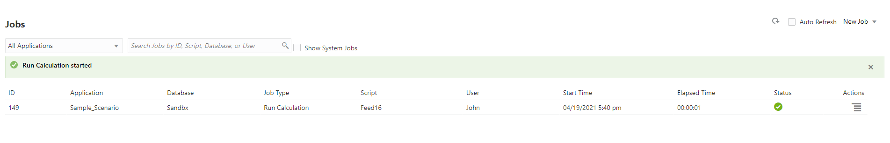

   * Go to 'Smart View' and 'DataSheet' tab. Click on 'Set Active connection for this worksheet' and then refresh to retrieve the data.

   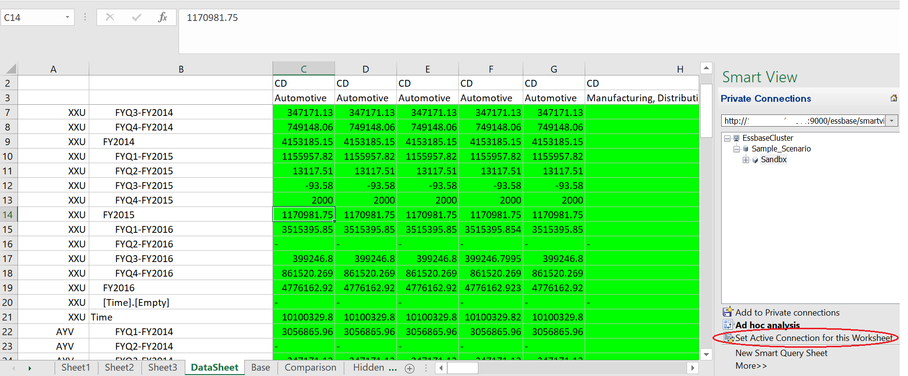

   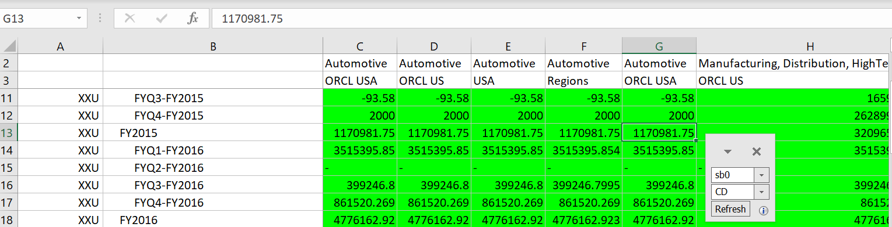

   Go to the Comparison tab. Click again on 'Set Active connection for this worksheet' and then refresh.

   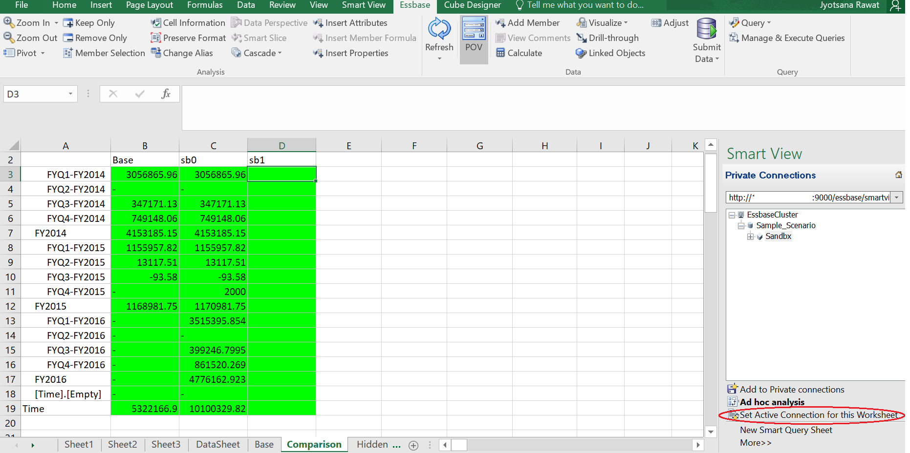

   Note: In Smartview you are already logged in as Sam. Also before refreshing any worksheet tab in smartview, always click on "Set Active connection for this worksheet".

   * Go to Essbase web interface as Sam, Navigate to the **Scenarios** tab. For **What-If** Scenario, click on the icon under **Actions** and select **Show Changes** to show the changes in the UI.
   
   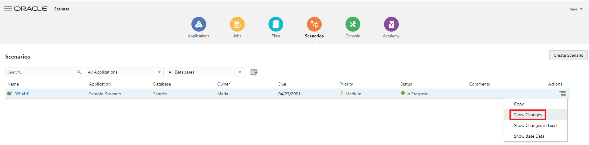

   Verify the Changes:
   
   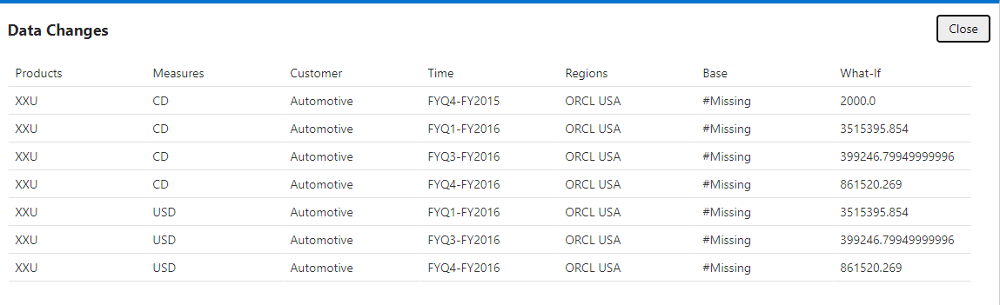

6. Scenario Workflow:

   At this point two things happened with our Sandbox. Sam entered some data using Smart View and John run a calc script that created some data for 2016. Now we will use the Scenario workflow to submit and ultimately merge the scenario data with the base. The flow that we will simulate is:

   * Maria is submitting the data for approval.
   * Phillip can review the data and decides to approve.
   * Once Maria sees that Phillip approve, she can apply the data to the Base.

   Since you are doing it by yourself, you need to play both Maria and Phillip. If you have two different browsers (e.g. Firefox and Chrome) you can log in as each participant in a different browser and jump between the two personas. The instructions assume that you are using the same browser for both (and therefore logout and login are needed).


   Let’s start:

      * Login to Essbase web interface as Maria. Navigate to the **Scenarios** tab.
   
   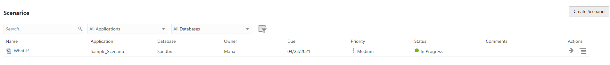

      * For **What-if** scenario, under **Actions**, click the **->** icon to submit, enter a comment if needed(for e.g., submitted for approval). The status should now be submitted.
   
   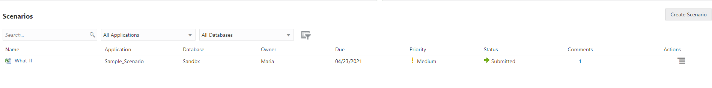

      * Go to Smart View and retrieve data into the Comparison tab.

         Note: In Smartview you are already logged in as Sam. Also before refreshing any worksheet tab in smartview, always click on "Set Active connection for this worksheet".

      * Go to the web interface logging in as Phillip. Navigate to the **Scenarios** tab.

      * For **What-if** scenario, under **Actions**, click the  icon to Approve, enter a comment if needed (for e.g., submitted for approval).
      
   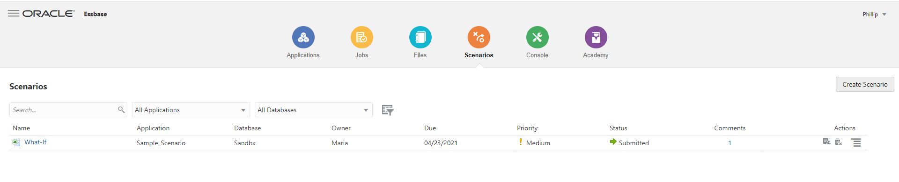
   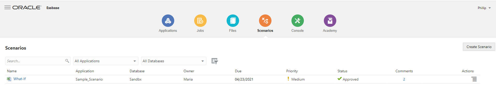

      * Go to Smart View and retrieve data into the Comparison tab.

      Note: In Smartview you are already logged in as Sam. Also before refreshing any excelsheet tab in smartview, always click on "set Active connection for this worksheet".

      * Login to Essbase web interface as Maria. Navigate to the **Scenarios** tab.

      * For **What-if** scenario, under **Actions**, click the   icon to Apply sandbox "sb0" to the Base, enter a comment if needed(for e.g., applied).
      
   

      * Go to Smart View and retrieve data into the Comparison tab.

      Note: In Smartview you are already logged in as Sam. Also before refreshing any excelsheet tab in smartview, always click on "set Active connection for this worksheet".

   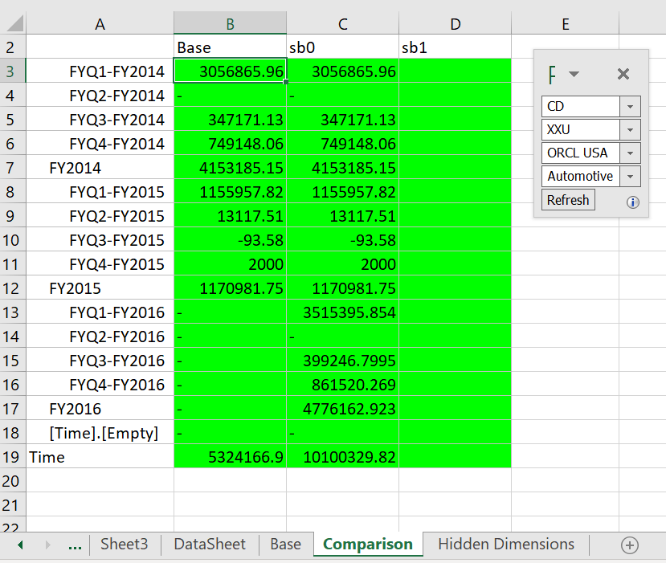

      Note: Notice that changes still have not been updated to base.


## Task 4: Run-time Substitution Variables

Upload the Merge calculation script to your database and review it.  Then, in Smart View, execute the script using the selections (mentioned in Point 10e).  After the script has run validate the data in the Base member.

1. Log on to Essbase web interface as John.

2. Download the file **Merge.csc**.

   This file is part of Workshop artifacts. Steps to download the artifacts are mentioned in ***Lab: Initialize Environment-> step2**.

   Launch the database inspector for the database **Sandbx** under application **Sample_Scenario**.

   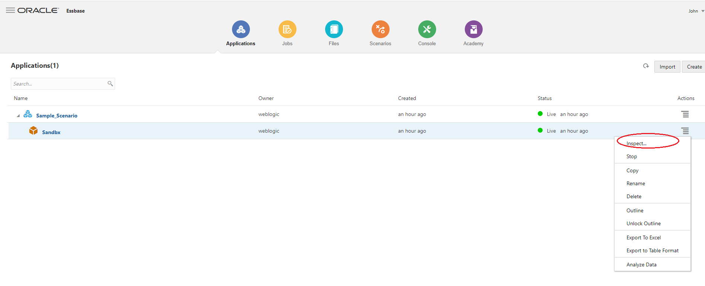

   Select **Files** tab and click **Upload Files**.

   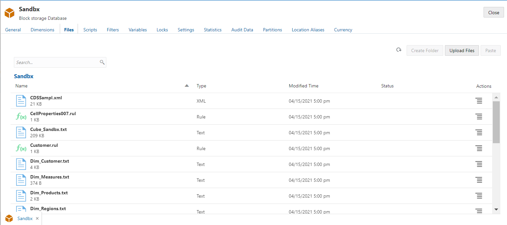

3. Drag or select the provided **Merge.csc** file.
   
   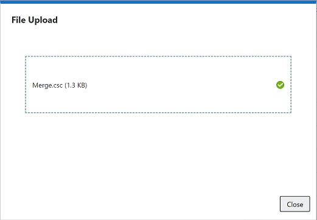

4. Click **Close**.

5. Select the **Scripts** tab on the database inspector.

6. Click on the **Merge Script** to view/edit it.
   
   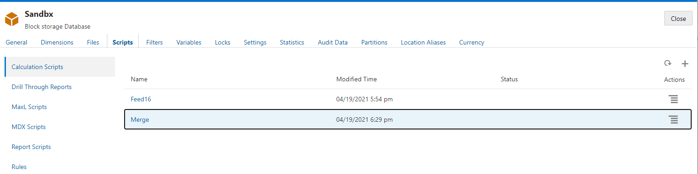

7. Look through it. Validate the script.
   
   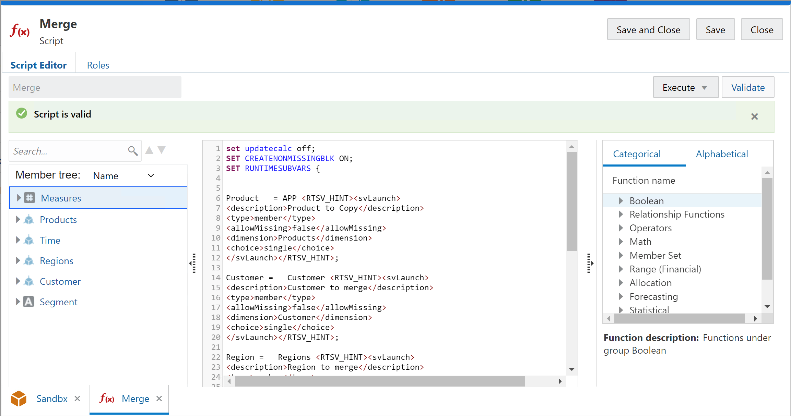

8. Click on **Roles** tab. Click on the + icon and add Maria.
   
   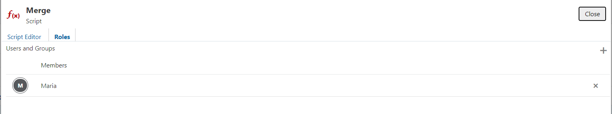

9. Click **Close** to close the database inspector.

10.  Go to Smart View and on the Comparison tab.  

   Disconnect from the current connection by clicking 'More' and then 'Disconnect'.
   
   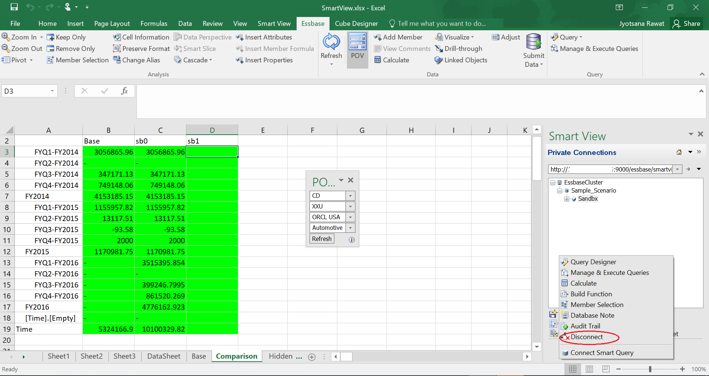

   Click on the -> arrow(as shown below) to login as maria.
   
   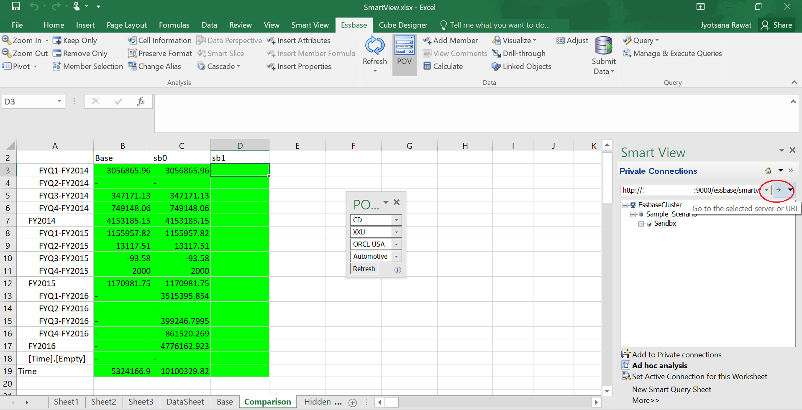

     * Select the **sb0** cell(C2 if unadulterated)  

     * Click on **Calculate** on the Essbase ribbon.  
   
   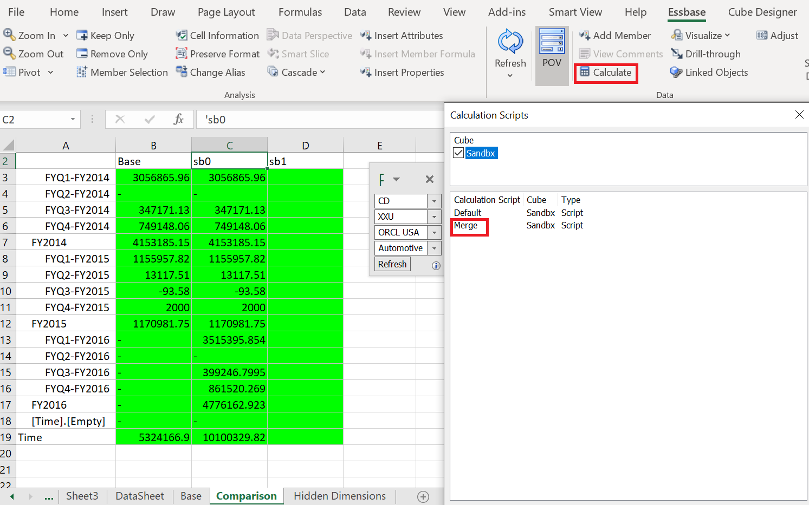  

     * Select the Merge calculation script.

     * Change the prompts:  

        i)  Product = XXU  
        ii)  Customer = Automotive (Hint: Use the search feature to find the member)  
        iii) Region = USA  
        iv) Periods = FYQ1-FY2016, FYQ2-FY2016, FYQ3-FY2016, FYQ4-FY2016  
        v)  Sandbox = sb0  

     * Notice the default selections and that "sb0" was selected for the Sandbox to merge.
   
   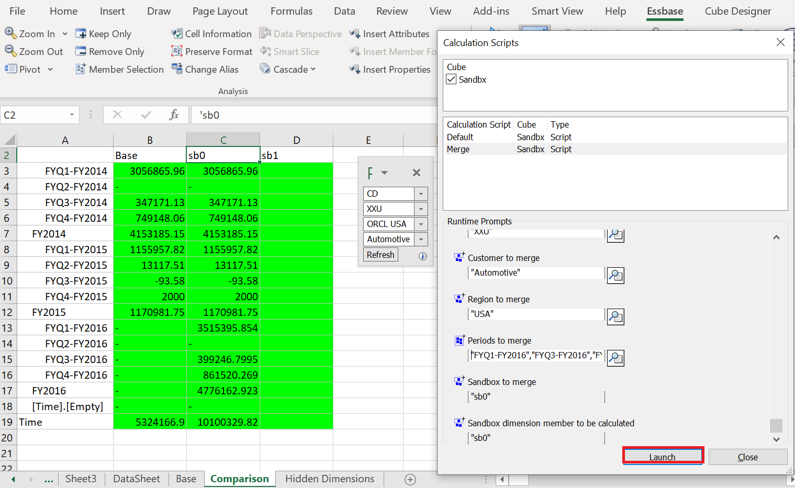

11. Click **launch**.

12. Retrieve data in comparison tab.
   
   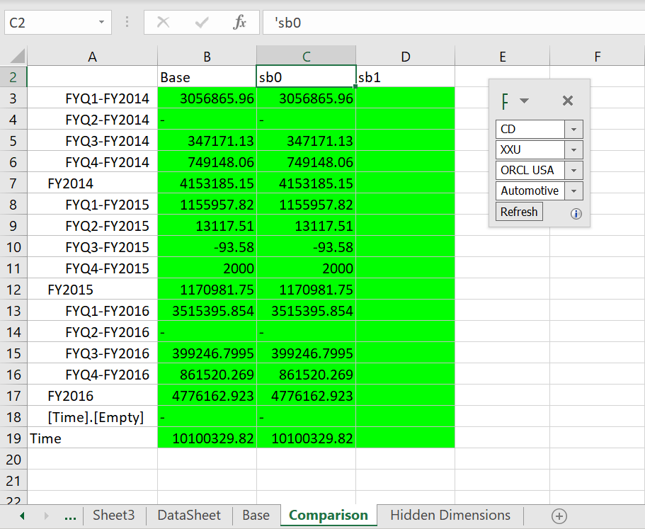

    Notice now the changes are applied to the base.


Note:
Notice that John having **Database Manager** permission, was able to define who can update the changes in the base(database). Also, Maria after creating scenario was not able to apply the changes to base(database) because she was having only "Database Update" permission.

You may [proceed to the next lab](#next).


## Acknowledgements

* **Authors** -Sudip Bandyopadhyay, Manager, Analytics Platform Specialist Team, NA Technology
* **Contributors** - Eshna Sachar, Jyotsana Rawat, Kowshik Nittala, Venkata Anumayam, Kalpana Singh
* **Last Updated By/Date** - Kalpana Singh, Senior Solution Engineer, Analytics, NACI, March 2023
