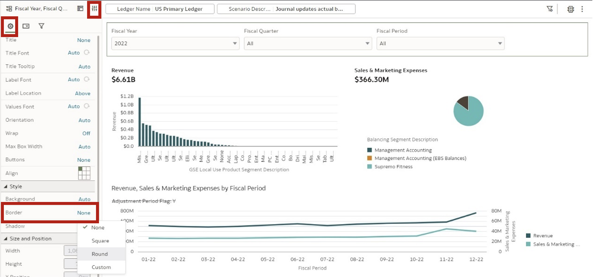
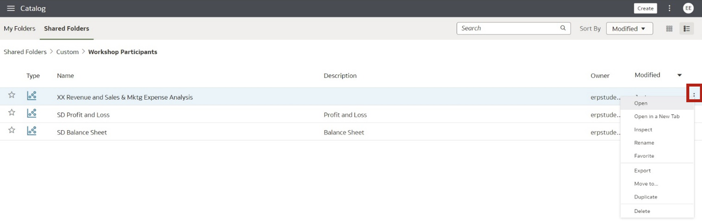

# Create You First Workbook

## Introduction

In this lab, you will act as an analyst who's requirement is to create a Workbook to help monitor two Key Metrics.

**Business Need**: “Revenue” and “Sales & Marketing Expenses” are two key metrics that management would want to monitor. Insights are required primarily across “Balancing Segments” & “Product Segments”.

The focus of our analysis is “US Primary Ledger” & Scenario is “Journal updates actual balances.”
Data is available from Fiscal Year 2013 to Fiscal Period Aug 2023. For this activity, you will focus on 2022 and use the “Financials - GL Profitability” subject area.

Estimated Time: 25 minutes

### Objectives

In this lab, you will:
* Create a custom Workbook with Composite Tile visuals
* Use the ledger as Workbook Filters
* Use the Time dimension as Dashboard Filters
* Create two Composite Tile on a Canvas with the two required metric
* You can be creative with your visuals
* For Revenue, it is best to analyze it by “Product Segment”
* For Sales & Marketing Expense, it is best to analyze it by “Balancing Segment”

### Prerequisites

This lab assumes you have:
* Access to Fusion Data Intelligence Platform

## Task 1: Login to Fusion Data Intelligence Platform

1. Please use your URL, User ID, and password to log in to your FDIP Application. On successful login, FDIP **Homepage** will appear on your screen.

  

## Task 2: Create a workbook

1. From the FAW Home Page, select the **Navigator Menu** and then click on the **Projects** tab.

  

2. This will open the Catalog page, to create a Workbook, click on the **Create** button at the top-right of the Catalog page. From the available options, select **Workbook**.

  

3. From the **Add Data** window, select the required Subject Area, in this case **Financials – GL Profitability**, then click on **Add to Workbook**.

    

4. To focus our analysis on the required Ledger and Scenario, we will have to create two filters. Let’s start by creating our first filter for Ledger. Click on the **+** icon at the top most part of the data visualization pane. A drop down will appear, select **Ledger Name**.

  

5. A list of values available for Ledger Name will appear, select the relevant Ledger. In this case select **US Primary Ledger**. After you have selected the required value, just click outside the filter window.

  

6. The filter is now applicable. In the same manner, let’s now add another filter for **Scenario**. Click on the **+** icon, next to the filter we just added in the earlier step.

  

7. From the folder **Scenario**, select the **Scenario Description** column.

  

8. From the available list, select the **Journal updates actual balances** and click outside the filter box.

  

9. Currently, it just shows the Filter Columns, but does not show the values for which the data will be filtered. To show the values, let’s click on the **Filter Bar Menu** at the top- right.

  

10. Select **Filter Values** and click on **Show All**. This will enable users to see the filter values.

  

11. You are now able to see the filter values, it reaffirms you the slice of data you are analyzing. You now would like to create filters for **Time**. You could create it for the Workbook, similar to Ledger & Scenario, however let’s create a **Canvas** specific filter for **Time**. To do that, click on the **Visualizations** tab on the data pane.

  

12. From the list of visualizations, double click **Dashboard Filters**. You will see the visual format on the Canvas and the Dashboard Filter on the grammar panel. Now to setup the filters you have to go back to the **Data** tab as shown below.

  

13. From the **Data Pane**, open the **Time** folder. Now, double click on **Fiscal Year**, **Fiscal Quarter** and **Fiscal Period**, you will see that these columns appear both on the canvas visual and the grammar panel. Click on the drop of the **Fiscal Year**, select **2022**. After you have selected the year, click outside of the filter selection window.

  

14. You have selected the **Fiscal Year**. All top-level filters you need to start your analysis is done. You want to create a dashboard/canvas where you want all visuals to fit to the screen, rather than have screen scroll up and down. To set it up let’s click on the drop-down icon at the bottom of the screen, available on the tab, and click **Canvas Properties**.

  

15. To fit all visuals on the screen, set up the **Properties** as shown on the screen and click **OK**.

  

16. Let’s begin to create our visuals/charts to help our analysis. From the Subject Area on the data pane, select the required columns to create the **Revenue by Product Segment** analysis/visual/chart. To create the chart lets select the required columns (keep the control/command key pressed to select multiple columns), and right-click. From the available menu, select **Create Best Visualization**.
Note the path of the two columns:

    * GL Segments > GSE Local Use Product Segment > GSE Local Use Product Segment Description
    * Facts – Analytics Currency > Profit and Loss (AC) > Revenue

    

17. A visual is created next to your canvas filter. You would like your filter to be on the top, and all visuals below it. Select the visual.

  

18. Select the visual and **drag** it below the filter. The highlighted bar will show the position as you keep moving the visual.

  

19. The visual appears too scattered, you would now like to sort it to make it more meaningful. Right-click on the visual and a **Sort By** option is presented. Select the sorting by **High to Low**, based on the **Revenue**.

  

20. The visual is now sorted and you can get a view of your top product segments. On the same visual you want to add more information, let’s say you want to see the summary/total/aggregated value of Revenue. Select the **Revenue** column and drag and drop it to the **Tile** section in the grammar panel.

  

21. You now have the aggregated value of Revenue. You now want to make the visual more appealing and easier for consumption of the information. You can set the properties of the visuals. Click on the **Properties** tab. Stay on the **General** tab, represented by the gear icon. Select the **Title** property and set it to **None**.

  

22. Lets now format the value shown on the Tile. To do that navigate to the values tab and select the **Number Format** property. Set it to **Currency**.

  

23. Set it up, to make the information easy to consume. See the setup below.

  

24. After the number format, you would like to make the **Revenue** label bold. You go back to the **General** property tab. Under the **Tile** section, select **Label Font** and make it **Bold**.

  

25. Lets create a new visual/chart. This time as required we will create a visual for analyzing Sales & Marketing Expenses by Balancing Segment. To create the chart lets select the required columns (keep the control/command key pressed to select multiple columns), and right-click. From the available menu, select **Create Best Visualization**.
Note the path of the two columns:
    * Key Metrics > Sales & Marketing Expenses
    * Key Metrics > Sales & marketing Expenses > Balancing Segment Description

  An important observation, you can create visuals/charts either from Key Metrics definition of from facts and folders, the end result is the same.

    

26. A new visual is created on the canvas. Let’s place it besides the **Revenue** visual we created earlier. Select the visual.

  

27. Drag and drop it besides the **Revenue** visual.

  

28. You now want to change the chart type. You want a pie chart for analyzing Sales & Marketing Expenses by Business Segment. Select the visual and click on the **Change Visualization Type** icon.

  

29. From the available chart types, select **Pie**.

  

30. Let’s now get the summary information, like we did for Revenue visual. Drag and drop **Sales & Marketing Expenses** from the **Data panel** to the **Tile** section on the grammar panel.

  

31. Follow the steps you did earlier to format the visual. Same steps want you did for **Revenue** visual. Note the steps listed above (Step 21 to Step 24).

32. You now want to compare the two metrics (Revenue and Sales & Marketing Expenses), to see the relationship between the two. You start by trying to create a trend line of Revenue. Select **Revenue** and **Time > Fiscal Period**. To create the chart lets select the required columns (keep the control/command key pressed to select multiple columns), and right-click. From the available menu, select **Create Best Visualization**.

  

33. A visual/chart is created. You want to place the visual at the very bottom of the screen. Select the visual.

  

34. Drag the visual to the very bottom.

  

35. On a quick look, you want to exclude the Adjustment period. Not relevant for your analysis. You now can create a data filter for the selected visual. Select the **Adjustment Period Flag** column from the data panel and drop it to the **Filters** section of the grammar panel.

  

36. Select the flag **Y** and use the exclusion rule for this filter. Click outside the filter window, to close the filter window.

  

37. In the current visual, let’s bring in Sales & Marketing Expenses, to compare the metrics side by side. Select the **Sales & Marketing Expenses** fact from the folder shown and place it on the **Y–Axis**.

  

38. On the same Axis, with the same scale, the insight is not intelligible. Let’s change the Axis of Sales & Marketing Expenses. On the Grammar panel, right-click on **Sales & Marketing Expenses** and select **Y2 Axis**.

  

39. Your line chart now shows some relation. A bump in the Sales & Marketing Expenses in a prior period shows a bump in Revenue in the subsequent period. You now want to adjust the height of the **Dashboard Filter** visual, select the visual and adjust its height.

  

40. Similarly adjust the height of the visual at the bottom, if required.

  

41. Once you are satisfied with the dashboard/analysis/workbook creation, you can select the **Preview** button on the top-right, to preview the workbook as an end user.

  

42. You are good with the workbook but would like to add borders to each visual. Click on **Edit** icon to go back to edit mode.

  

43. Click on each of the five visuals on the canvas, select **Properties**. From the **General** tab, select **Style**, then **Border** and select **Round**.

  

44. Repeat the steps for each visual, until you see borders for all the visuals. You may want to again have a look of how the workbook will be consumed by the end user. Click on **Preview**.

  

45. You now see the borders for each visual. You are satisfied with your first analysis/dashboard/workbook. You want to save it. You have to go back to the **Edit** mode.

  

46. Click on the **Save** icon, and select **Save As**.

  

47. Navigate to the respective folder. For this lab, navigate to the path shown. Give it a name, example, **XX Revenue and Sales & Mktg Expense Analysis** and click **Save**.

  **Note**: Replace XX with your initials, this will help you to locate your Workbook. Do not overwrite on other participants workbook. Also do not delete any objects that you have not created.

  

48. After saving your workbook, you can go back to the **Catalog**. Click **Go back** arrow.

  

49. Back in the Catalog, you will find your analysis you just created. To consume from Catalog, you could simply double-click it. Or use the **Menu icon** on the right and select **Open**.

  

50. That’s how you access your analysis.

  

You have successfully created your first analysis/dashboard. In Fusion Data Intelligence Platform, we call this object a Workbook.

**You may now proceed to the next lab**.

## Learn More
* [Getting Started with Oracle Analytics Cloud](https://docs.oracle.com/en/cloud/paas/analytics-cloud/acsgs/what-is-oracle-analytics-cloud.html#GUID-E68C8A55-1342-43BB-93BC-CA24E353D873)

## Acknowledgements
* **Author** - Subroto Dutta, Senior Principal Product Manager, Analytics Product Strategy
* **Contributors** - Nagwang Gyamtso, Product Manager, Analytics Product Strategy
* **Last Updated By/Date** - Nagwang Gyamtso, October 2023
