# Create a Link for Deeper Insights

## Introduction

As an Analyst, you want to quickly move from summary information to detailed information. Let’s learn to use the Data Actions feature to achieve this.

Link the Revenue Metric in the Workbook created in Lab 1, with the Workbook created in Lab 2.

**Business Need**: As a business user, you evaluate the performance of the “Revenue” metric in a particular Workbook, and you want to quickly navigate to detailed/related analysis. You want to be able to create a quick link, rather than always navigating through the Catalog.

Estimated Time: 10 minutes

### Objectives

In this lab, you will:
* Learn how to create Data Actions

### Prerequisites

This lab assumes you have:
* Access to Fusion Data Intelligence Platform
* Access to a workbook

## Task 1: Create a Link for Deeper Insights

1. To create a link in a Workbook, let’s start with the source workbook where we require a link. In this case lets open the workbook we created in Lab 1.

  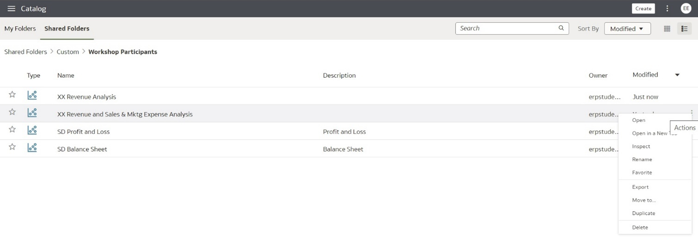
 
2. Let’s open it in **Edit** mode.

  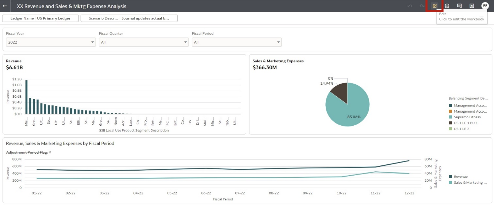

3. You will need to create a Data Action. Click on the **Menu** icon at the top-right and select **Data Actions**.

  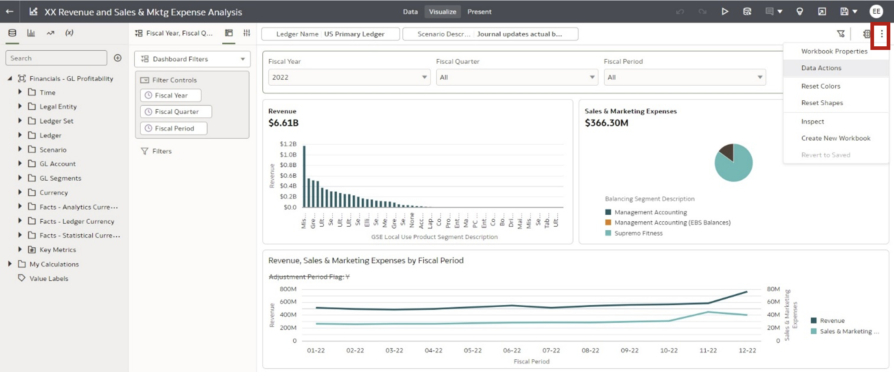
 
4. Give the link a name, in this case, “Jump to Revenue Analysis”. Select the Type: **Analytics Link**. For **Target** choose **Select from Catalog**.

  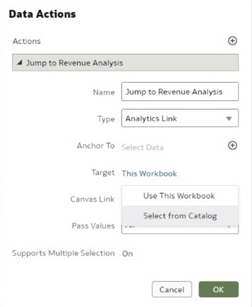

5. Select the Workbook from the required path. In this case the path where you saved the workbook you created in Lab 2. Click **OK**.

  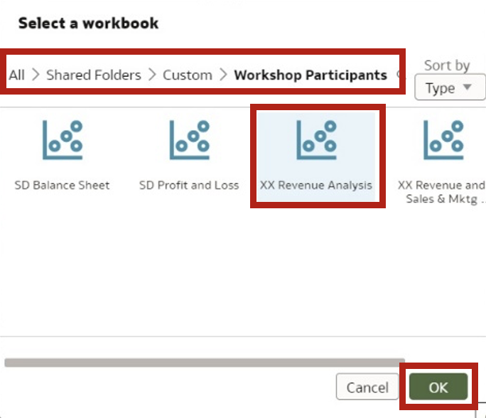
 
6. In the Data Actions set up **Anchor To**. Click on the **+** icon and select the fact, in this case **Revenue**, from the folder shown below.

  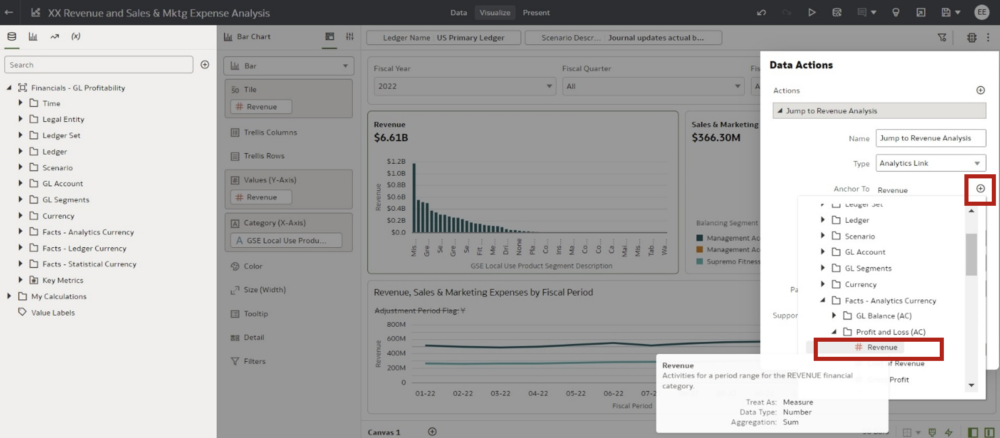

7. Confirm the properties and click **OK**.

  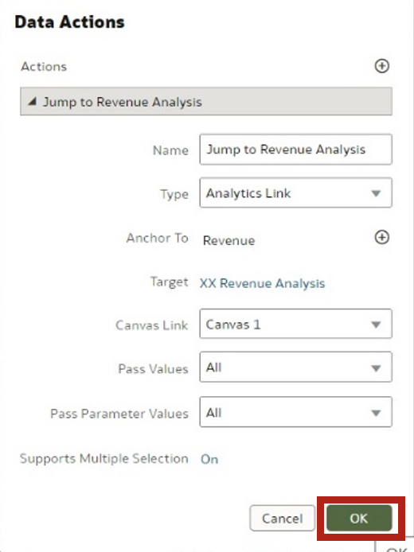
 
8. Let’s check out the Data Action Link in **Preview** mode.

  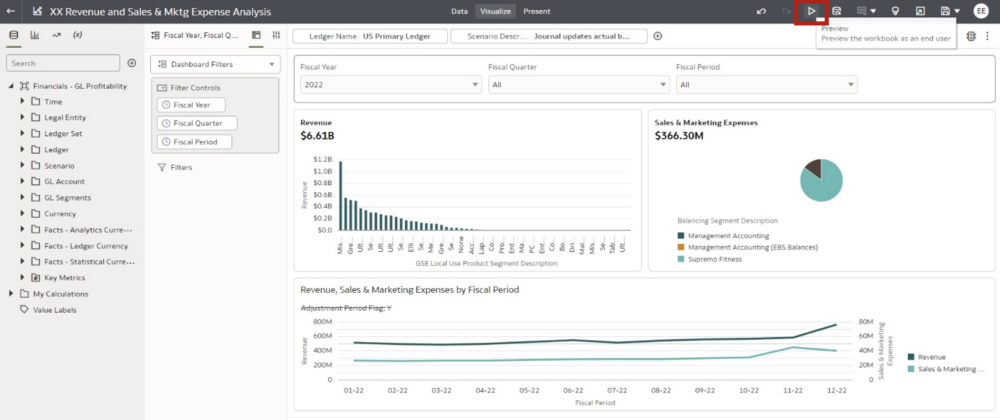

9. Select the Revenue visual and right click on a data point. A Menu appears. On the Menu you can see the link we just created. Let’s click on the **Jump to Revenue Analysis**.

  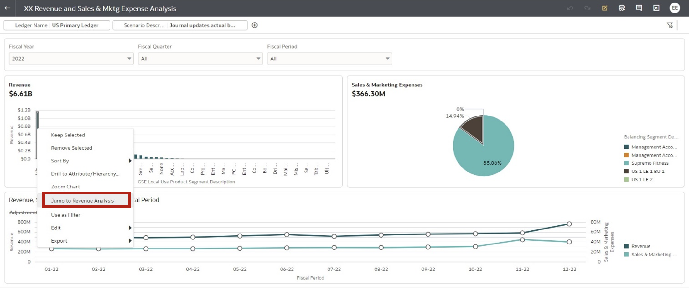
 
10. The target link opens in a new browser window. You have successfully linked to workbooks. You can now drill/navigate from a summary workbook to detailed workbook. As you see all column values are passed as filters in the target workbook.

  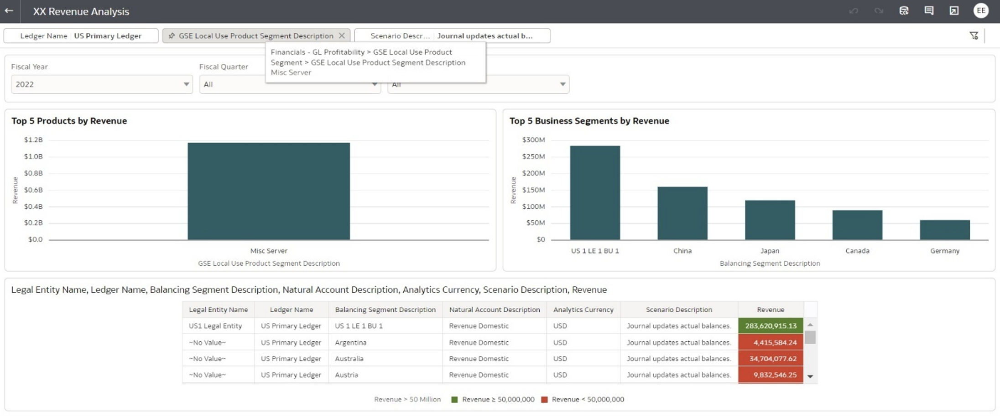

11. The target opens in a new browser window. You can now go back to your earlier browser window, where your source workbook is open. **Save** the workbook. You have completed your lab exercise.

  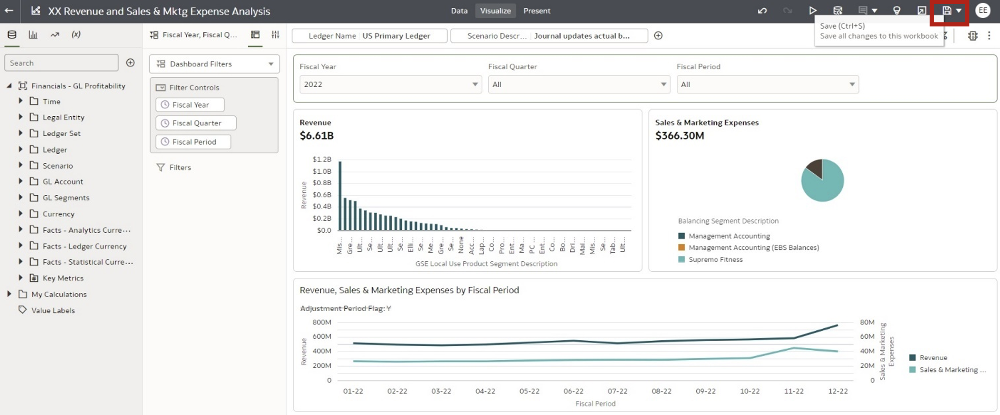

You are now able to create links to related contents, dig deeper from summary information to detailed analysis.

## Learn More
* [Getting Started with Oracle Analytics Cloud](https://docs.oracle.com/en/cloud/paas/analytics-cloud/acsgs/what-is-oracle-analytics-cloud.html#GUID-E68C8A55-1342-43BB-93BC-CA24E353D873)
* [Use Data Actions](https://docs.oracle.com/en/cloud/paas/analytics-cloud/acubi/use-data-actions.html#GUID-7AACD0C9-9CC1-430D-BB0F-66513BD138CE)

## Acknowledgements
* **Author** - Subroto Dutta, Senior Principal Product Manager, Analytics Product Strategy
* **Contributors** - Nagwang Gyamtso, Product Manager, Analytics Product Strategy
* **Last Updated By/Date** - Nagwang Gyamtso, October 2023
