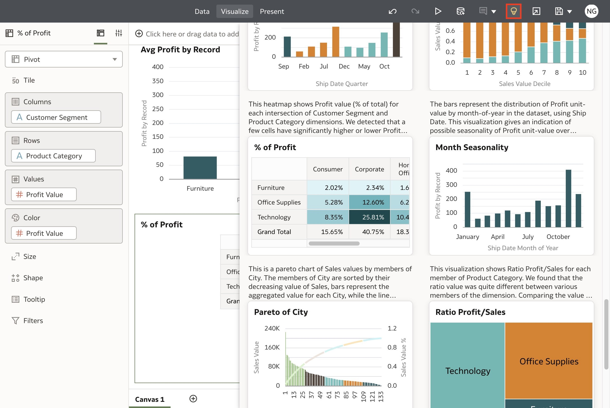
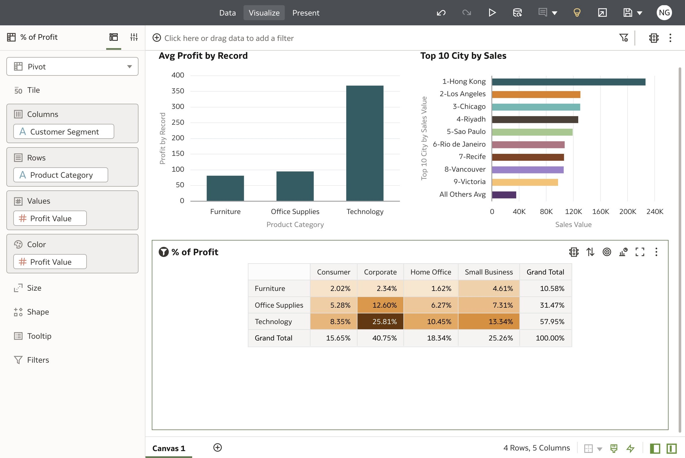
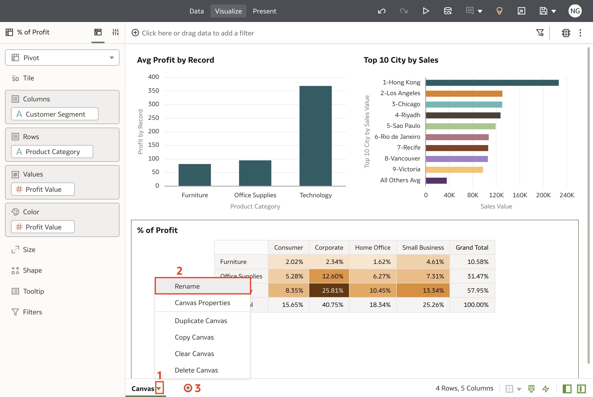

# Auto Insights

## Introduction

In this lab, you will learn how to explore your data with augmented analytics using auto-insights.

Estimated Time: 10 minutes

### Objectives

In this lab, you will:
* Create a canvas using Auto-Insights

### Prerequisites

This lab assumes you have:
* Access to Oracle Analytics Cloud
* [Sample Order Lines DS](https://objectstorage.us-phoenix-1.oraclecloud.com/p/TBMVACa7qZgj8ijJ3j5wlILzaVVtw1jo6n4rO8mREaAKjRoWAPX0OVTaEL39buPQ/n/idbwmyplhk4t/b/LiveLabsFiles/o/Sample%20Order%20Lines%20DS.xlsx) dataset

## Task 1: Create Custom Auto-Insights

1. From the Oracle Analytics homepage, click **Create** and then select **Workbook.**

  

2. In the **Add Data** dialogue, select **Sample Order Lines DS** and click **Add to Workbook.**

  

3. The auto-insights panel will auto-open with visualization suggestions to explore your data. To customize the data columns you want to see visualizations for, click the **Insights Settings** icon.

  

4. Let's generate auto-insights for Sales and Profit. From **Measures,** select **Sales** and uncheck **Discount.**

  

5. From **Small Size Attributes,** uncheck **Order Priority** and click **Apply.**

  

6. Expand the Auto Insights panel and choose any visual that you find interesting. For this lab, we will add **Avg Profit by Record**, **Top 10 City by Sales**, and **% of Profit**.

  

7. Close the Auto-Insights panel by clicking the **Auto-Insights** icon.

  

8. We have just created a canvas with visualizations auto-generated by Oracle Analytics.

  

9. Rename the canvas as **Auto-Insights** and click **Add Canvas**.

  

In this lab, you have successfully learned how to use Oracle Analytics' Augmented Analytics capabilities. You may now **proceed to the next lab**.

## Learn More
* [Let Oracle Analytics Suggest the Best Visualizations for a Dataset Using Auto Insights](https://docs.oracle.com/en/cloud/paas/analytics-cloud/acubi/let-oracle-analytics-suggest-best-visualizations-dataset.html)

* [Add a Language Narrative Visualization](https://docs.oracle.com/en/cloud/paas/analytics-cloud/acubi/add-language-narrative-visualization.html#GUID-F25DA183-DFFB-4788-8581-B6D935A26EE9)

* [Analyze Data with Explain](https://docs.oracle.com/en/cloud/paas/analytics-cloud/acubi/analyze-data-explain.html#GUID-D1C86E85-5380-4566-B1CB-DC14E0D3919E)

* [4 Reasons Why Augmented Analytics is the Future of Business Intelligence](https://blogs.oracle.com/cloud-infrastructure/post/4-reasons-why-augmented-analytics-is-the-future-of-business-intelligence)

## Acknowledgements
* Author - Nagwang Gyamtso, Product Manager, Analytics Product Strategy
* Last Updated By/Date - Nagwang Gyamtso, August, 2023
