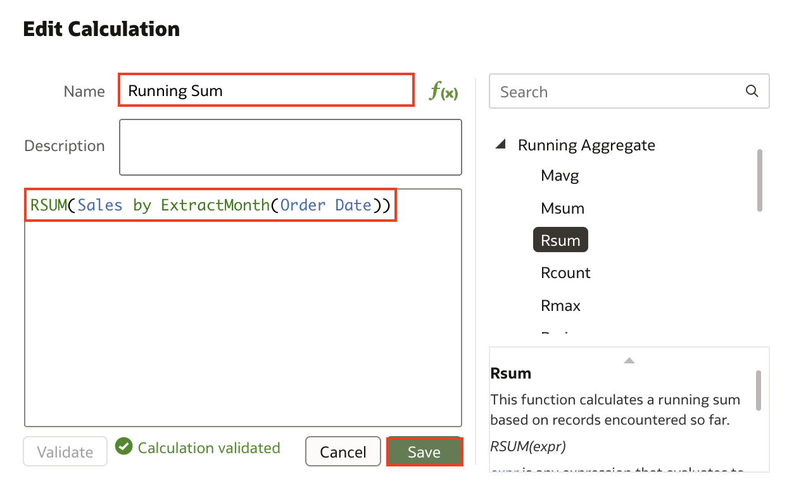
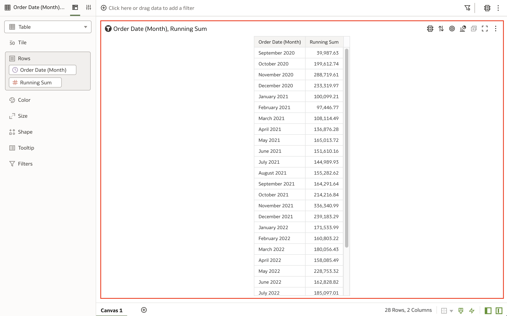

# Create Calculations

## Introduction

In this lab, you will learn how to create a new data measure using calculations.

Estimated Time: 5 minutes

### Objectives

In this lab, you will:
* Learn how to create a calculation

### Prerequisites

This lab assumes you have:
* Access to Oracle Analytics Cloud
* Access to a workbook

## Task 1: Create a New Measure Using Calculations

1. From the **Home page**, click **Create Workbook**.

  

2. Search for <code>Sample</code> and select the **Sample Order Lines DS Dataset**. Then click **Add to Workbook**.

  

3. Scroll down on the **Data Pane** and right-click on **My Calculations**. Then click **Create Calculation**.

  

4. A new pop up appears. In the **New Calculation** window, Type <code>Running Sum</code> in **Name Field** and choose the **RSUM** function from the **Functions Window**. Add the “Sales” attribute and type <code>by</code> and add **Order_Date_R > Month** to the expression. The final expression should look like the one in the image. Click **Save** to save the calculation.

  

5. Ctrl + Select **Running Sum**, **Order_Date > Month**. Then right-click and select **Pick Visualization**.

  

6. Choose the **Table** visualization.

  

7. A **Table Visualization** with **Running Sum by Order Month** appears.

  

8. Click **Save** to save the workbook.

  

9. In the new window, type <code>Sales Analysis using Calculations</code> in the **Name Field** and click **Save**.

  

Congratulations, you have learned how to create a calculation to create a new data element in Oracle Analytics. To learn more, check out the resources listed below!

You may now **proceed to the next lab**.

## Learn More
* [Getting Started with Oracle Analytics Cloud](https://docs.oracle.com/en/cloud/paas/analytics-cloud/acsgs/what-is-oracle-analytics-cloud.html#GUID-E68C8A55-1342-43BB-93BC-CA24E353D873)
* [About Visualizaton Types](https://docs.oracle.com/en/cloud/paas/analytics-cloud/acubi/visualization-types.html)
* [About Brushing Between Visualizations on a Canvas](https://docs.oracle.com/en/cloud/paas/analytics-cloud/acubi/brushing-visualizations-canvas.html)
* [Export Content from Analyses and Dashboards](https://docs.oracle.com/en/cloud/paas/analytics-cloud/acubi/export-content-analyses-and-dashboards.html#GUID-317A5C27-0C7C-4026-9D4D-3AF4773C9725)

## Acknowledgements
* Author - Nagwang Gyamtso, Product Manager, Analytics Product Strategy
* Contributors - Shiva Oleti
* Last Updated By/Date - Nagwang Gyamtso, August 2023
