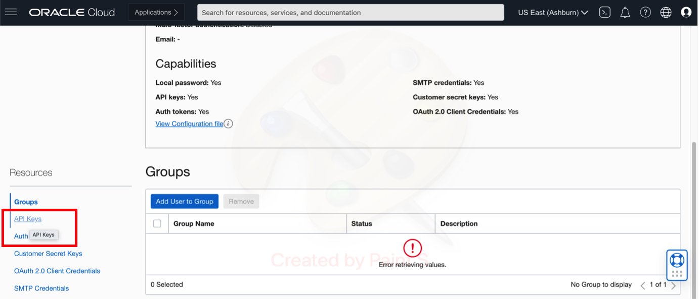
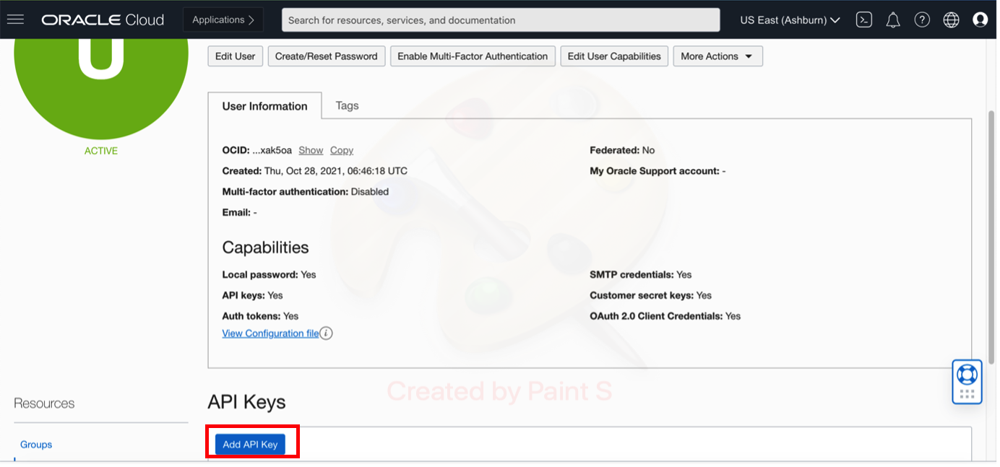
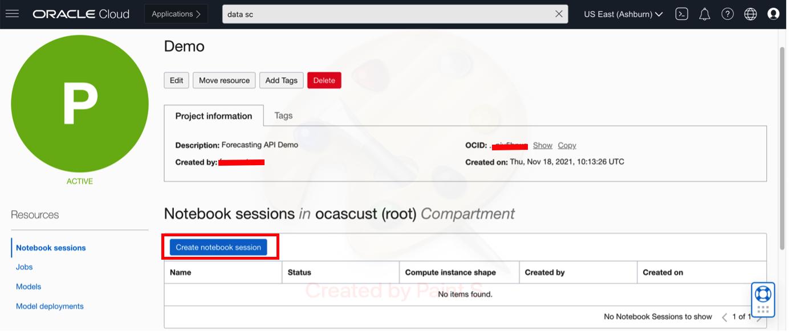
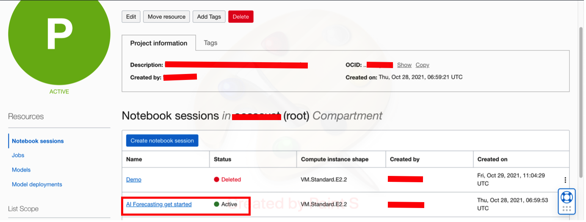
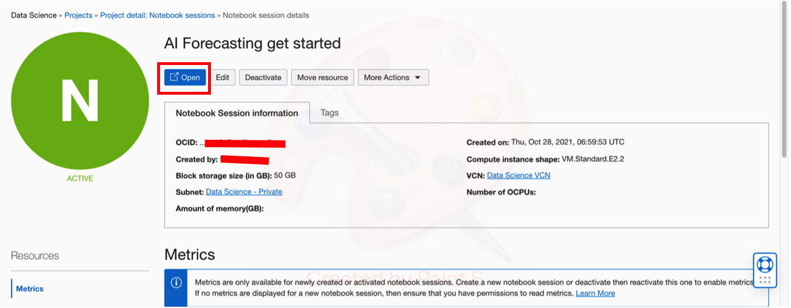
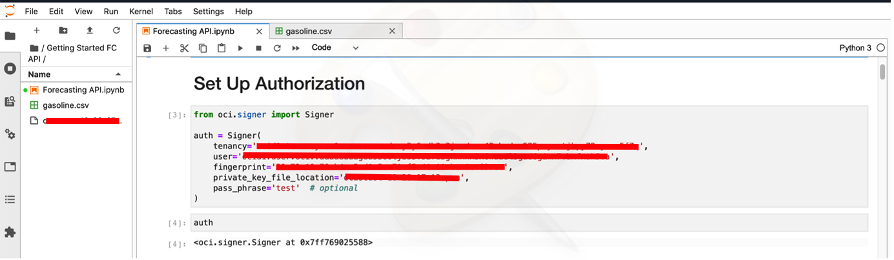
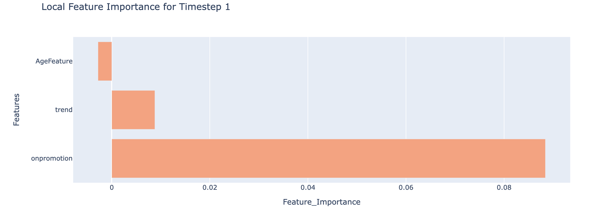

# Lab 2: (Optional) Forecast using Data Science Notebook 

In this lab, we will learn how to Forecast using Data Science Notebook. We will also learn about data requirements and data formats required by the OCI Forecasting Service APIs through some examples.

*Estimated Time*: 50 minutes

### Objectives:

*	Learn how to generate API key 
*	Learn how to create a project in Data Science service 
*	Learn how to set up a notebook session inside a data science project 
* Understand the data requirements and data formats for training model and forecast 
* Download prepared sample datasets & upload the downloaded dataset into Data Science Notebook Session
* Learn to use forecast API 
* Learn to get forecasts and predictions intervals for the forecast horizon
* Learn how to generate global explanation
* Learn how to generate local explanation for all the time steps in the forecast forizon


### Prerequisites:
*	A free tier or paid tenancy account in OCI
* Completed all the tasks in Getting Started
* Download the sample python [notebook](files/forecasting-api-sample-notebook.ipynb). It will be used to explain how to use the OCI Forecasting Service APIs


## Task 1: API key generation  
1.  Log in to the OCI account, expand the Profile menu and click on User Settings:
    

2.  Under User Settings, click on the API Keys under Resources on the left:
    

3. Click on Add API Key:
    

4. Download the private key. We will use this later for authorization when using the forecasting APIs. After downloading, click on Add button. By clikcing on Add, this key would get listed under API Keys and become active.  
    

5. Save the contents of the configuration file preview in a text file. Details such as user, fingerprint, tenancy, region etc. will be needed when setting up authorization for using the forecasting APIs.
    


## Task 2: Create a Data Science project


1.  Search for data science in the top search bar. Click on the Data Science under Services:
    

2.  Select the root compartment and press the create project button. 
    

3.  Fill the name and description field and press the create button: 
    


## Task 3: Create a Notebook session

1.  Select the project which we created now to create a notebook session
    
    

2.  Click on the create a notebook session
    

3.  Give a name to the notebook session. Select appropriate compute, storage, VCN and subnet. Press the create button
    
    

4.  It takes a few minutes (5-10 minutes) for the newly created notebook session to become active. It can be seen under the project. Once it has become active, open it

    

5.  Click on the open button
    
    

6.  A new notebook can be created by using Python 3 kernel. Also a new folder can be created and given a custom name by using the + button:
    

7.  Now, we will set up authorization to use forecasting APIs. Use the tenancy, user and fingerprint from the configuration file as shown in API key generation step. Also upload the private API key that we downloaded in the API key generation step and give its path to private_key_file. Don’t change the pass_phrase. 

    ```Python
    from oci.signer import Signer

    auth = Signer(
        tenancy='ocid1.tenancy.oc1-------------------------------------------',
        user='ocid1.user.oc1..-------------------------------------------,
        fingerprint='00:ff:00:::::::::::::::60',
        private_key_file_location='api_key.pem',
        pass_phrase='test'  # optional
    )

    ```

    


## Task 4: Understand Data, Download Samples, Prepare data, Create Project
OCI forecasting service provides an AutoML solution with multiple univariate/multivariate algorithms that can run on single series or multiple series at once. There are some data validations and data format requirements that the input data must satisfy.

**Data Validations**

For a successful forecast, the input data should pass the following data validations:

* Number of rows for a time series >= 5 and <= 5000
* Series length >= 2 X Major Seasonality
* If the series is non-seasonal, at least one non-seasonal method needs to be available for running.
* If the ensemble method is selected, at least 2 other methods need to be selected as well.
* Number of missing values <= 10% of series length
* If there are missing values for 5 consecutive time steps, throw an error.
* Input Data Frequency: 'MINUTE','HOUR', 'DAY', 'WEEK', 'MONTH' or 'YEAR'  and custom frequency depending on frequency of input data
* Forecast Frequency: 'HOUR', 'DAY', 'WEEK', 'MONTH' or 'YEAR' and custom frequency depending on forecast frequency required. For custom frequency: If the input data frequency multiplier is more than 1, then the forecast frequency should be also at the same base frequency as the input. 
Eg. If Input Data Frequency: 2HOURS , then the forecast frequency: 24HOURS if we want Forecast Frequency to be a DAY level
* All the timestamps in the primary data source should exist in the secondary data source also the number of rows in the additional data source should be equal to the number of rows in the primary data source + forecast horizon size (adjusted by input and output frequency).
* Check if there are any duplicate dates in time-series after grouping also (Check for both additional and primary data)

**Data format requirements**

The data should contain one timestamp column and other columns for target variable and series id (if using grouped data):
- timestamp column should contain dates in standard [ISO 8601]('https://en.wikipedia.org/wiki/ISO_8601') format. Allowed formats: "yyyy-MM-dd","yyyy-MM-dd HH:mm:ss","yyyy-dd-MM HH:mm:ss","MM-dd-yyyy HH:mm:ss" ,"dd-MM-yyyy HH:mm:ss","dd-MM-yyyy","MM-dd-yyyy", "yyyy-dd-MM" 
- If the input date doesn't follow allowed format then it needs to be converted in the required format. Sample Python code for converting different date strings to ISO 8601 format is provided in Step 3 of Task 6 in this lab for  "yyyy-MM-dd HH:mm:ss"
- target_column should contain target values of time series. For example it be sales number of a sales data 
- series_id column should contain identifiers for different series e.g., if the data is having sales for different products, then series id can have product codes. 

**Note**: The column names used in the examples here are just for representation and actual data can have different custom names.  

Currently, OCI Forecasting Service APIs support datasets that can be in one of the following formats:

1.  Single time series without any additional data
    Such datasets have only two columns in them. The first column should be a timestamp column and the second column should be the target column.

    **Here is a sample CSV-formatted data:**
    ```csv
    timestamp,target_column
    2020-07-13T00:00:00Z,20
    2020-07-14T00:00:00Z,30
    2020-07-15T00:00:00Z,28
    ...
    ...
    ```
2.  Multiple time series without any additional data
    The input data can have multiple time series. Such datasets are called grouped data and there must be a column to identify different time series.

    **Here is a sample CSV-formatted data:**
    ```csv
    timestamp,target_column,series_id
    2020-07-13T00:00:00Z,20,A
    2020-07-14T00:00:00Z,30,A
    2020-07-15T00:00:00Z,28,A
    ....
    ....
    2020-07-13T00:00:00Z,40,B
    2020-07-14T00:00:00Z,50,B
    2020-07-15T00:00:00Z,28,B
    ....
    ....
    2020-07-13T00:00:00Z,10,C
    2020-07-14T00:00:00Z,20,C
    2020-07-15T00:00:00Z,30,C
    ....
    ....
    ``` 
3.  Time series with additional data
    The input data can have additional influencers that help in forecasting. We call the two datasets primary and additional. The primary data should have three columns - timestamp, target column, and a column for the series id. The additional data should have a timestamp column, a series id column, and columns for additional influencers. 

    **Here is a sample CSV-formatted data:**

    Primary data 
    ```csv
    timestamp,target_column,series_id
    2020-07-13T00:00:00Z,20,A
    2020-07-14T00:00:00Z,30,A
    2020-07-15T00:00:00Z,28,A
    ....
    ....
    2020-07-13T00:00:00Z,40,B
    2020-07-14T00:00:00Z,50,B
    2020-07-15T00:00:00Z,28,B
    ....
    ....
    2020-07-13T00:00:00Z,10,C
    2020-07-14T00:00:00Z,20,C
    2020-07-15T00:00:00Z,30,C
    ....
    ....
    ```
    Additional data 
    ```csv
    timestamp,feature_1,series_id
    2020-07-13T00:00:00Z,0,A
    2020-07-14T00:00:00Z,1,A
    2020-07-15T00:00:00Z,2,A
    ....
    ....
    2020-07-13T00:00:00Z,0,B
    2020-07-14T00:00:00Z,0,B
    2020-07-15T00:00:00Z,1,B
    ....
    ....
    2020-07-13T00:00:00Z,1,C
    2020-07-14T00:00:00Z,0,C
    2020-07-15T00:00:00Z,0,C
    ....
    ....
    ```
   
    Steps on how to generate inline data from csv files are given in Task 6 below.
    
    **Note:**
    * Missing values are permitted (with empty), and boolean flag values should be converted to numeric (0/1)

## Task 5: Download Sample Data and upload to Data Science Notebook Session

1. Below is the sample dataset to help us to easily understand how the input data looks like, Download the files to the local machine.

* [Primary data](files/primary-15-automotive.csv)
* [Additional data](files/add-15-automotive.csv)
  

2.  Next, we need to upload the sample training data into data science notebook, to be used for *inline data* preparation for model training in next steps.

Click on upload and then browse to file to be uploaded:


## Task 6: Inline Data preparation

1.  Import the below necessary python modules for executing the scripts

    ```Python
    import pandas as pd
    import requests
    import json
    import ast
    import matplotlib.pyplot as plt
    import re
    import os
    import simplejson
    ```

2.  Load the data in the notebook via below mentioned python commands in a data frame by specifying the correct 
path for the csv file that has the time series data

    ```Python
    df_primary = pd.read_csv('primary-15-automotive.csv')
    df_add = pd.read_csv('add-15-automotive.csv')
    ```

3.  (Optional)Convert the date field to "yyyy-mm-dd hh:mm:ss" format with below commands if not in the right format
    Use this link https://docs.python.org/3/library/datetime.html#strftime-and-strptime-behavior for other date time formats

    ```Python
    # modify date format
    df_primary['date'] = pd.to_datetime(df_primary['date'],
                                            format='%d/%m/%y').apply(lambda x: str(x))
    # modify date format
    df_add['date'] = pd.to_datetime(df_add['date'],
                                            format='%d/%m/%y').apply(lambda x: str(x))
    ```
4.  Sort the data

    ```Python
    df_primary.sort_values(by = "date" , inplace = True)  
    df_add.sort_values(by = "date" , inplace = True)      
    ```

5.  Setting variables to create forecast with below commands
    - prim_load: is the variable having inline primary data
    - add_load: is the variable having inline additional data 

    ```Python
    #primary data
    prim_load = df_primary.values.transpose().tolist()
    prim_load
    ```

    ```Json
    [['15_AUTOMOTIVE',
      '15_AUTOMOTIVE',
      '15_AUTOMOTIVE',
      '15_AUTOMOTIVE',
      '15_AUTOMOTIVE',
      ...],
      ['2013-01-01 00:00:00',
      '2013-01-02 00:00:00',
      '2013-01-03 00:00:00',
      '2013-01-04 00:00:00',
      '2013-01-05 00:00:00',
      ...],
    [0,
      4,
      2,
      2,
      2,
      ...]]
      ```
      ```Python
    #additional data
    add_load = df_add.values.transpose().tolist()
    add_load
    ```

    ```Json
    [['15_AUTOMOTIVE',
      '15_AUTOMOTIVE',
      '15_AUTOMOTIVE',
      '15_AUTOMOTIVE',
      '15_AUTOMOTIVE',
      ...],
      ['2013-01-01 00:00:00',
      '2013-01-02 00:00:00',
      '2013-01-03 00:00:00',
      '2013-01-04 00:00:00',
      '2013-01-05 00:00:00',
      ...],
    [0,
      0,
      0,
      0,
      0,
      ...]]
      ```

## Task 7 : Create Project  

  Once, the data is prepared, we will learn how to create the project.

  In the payload:
  * compartmentId will be same as tenancy id if is root compartment else provide desired compartment id. Please visit API Key generation above. In the below eg. we will be using root compartment
  * displayName can be given any custom name
  * description can be customized

    ```Python
    url = "https://forecasting.---------------------.oraclecloud.com/20220101/projects"

    payload = json.dumps({
      "displayName": "Forecast API Demo",
      "compartmentId": "ocid-------------------",
      "description": "Forecasting service API Demo",
      "freeformTags": None,
      "definedTags": None,
      "systemTags": None
    })
    headers = {
      'Content-Type': 'application/json'
    }
    response = requests.request("POST", url, headers=headers, data=payload, auth=auth)
    ```
    We store the response using below command:
    ```Python
    create_project_response = json.loads(response.text)
    create_project_response
    ```

    ```Json
    {"id":"ocid.forecastproject..-----------",
    "displayName":"Forecast API Demo",
    "compartmentId":"ocid.tenancy.----------",
    "description":"Forecasting service API Demo",
    "timeCreated":"2021-11-18T05:18:58.737Z",
    "timeUpdated":"2021-11-18T05:18:58.737Z",
    "lifecycleState":"ACTIVE",
    "freeformTags":{},
    "definedTags":{"Oracle-Tags":{"CreatedBy":"demo_user_2","CreatedOn":"2021-11-18T05:18:58.568Z"}},"systemTags":{}}
    ```
    We store the compartment id and project id which will be used when calling create forecast API using below command:
    ```Python
    project_id = create_project_response['id']
    compartment_id = create_project_response['compartmentId']
    ```


**Note** : It is not needed to create new projects everytime we run this notebook. A project id once created can be used again and again.

## Task 8: Train Model and Forecast
In this task, we will learn how to use create and get forecast APIs. 

1. Creating a model requires 3 actions to train the forecasting model

    * Pass the inline data in the payload of the forecast train settings
    * Set other training parameters as show in below code snippet
    * Create Forecast API Call using the /forecasts url

   We pre-define some of the parameters of the payload based on the example input data (the one we uploaded in previous lab session)

    ```Python 
    date_col = 'date'
    target_col = 'sales'
    id_col = 'item_id'
    data_frequency = 'DAY'
    forecast_frequency = 'DAY'
    forecast_horizon  = 14
    forecast_name = "LiveLabs Inline Forecasting Service API "
    ```

    In the example below we show how to create the payload for calling create forecast API. 
    - "compartmentId": will be same as tenancy id if is root compartment else provide desired compartment id. Please visit API Key generation above. In the below eg. we will be using root compartment id
    - "projectId": we get it after creating a project in the above step
    - "targetVariables": name of the column in primary data having the target values
    - "models": models selected for training. Here we are showing some the models implemented in service.The AutoML feature selects the best model out of all the models selected for training
    - "forecastHorizon": number of future timesteps for which to forecast 
    - "tsColName": name of the timestamp column  
    - "dataFrequency": 'MINUTE','HOUR', 'DAY', 'WEEK', 'MONTH' or 'YEAR'  and custom frequency depending on frequency of input data
    - "forecastFrequency": 'HOUR', 'DAY', 'WEEK', 'MONTH' or 'YEAR' and custom frequency depending on forecast frequency required . For custom frequency : If input dataFrequency multiplier is more than 1, then the forecast frequency should be also at the same base frequency as the input. Eg.  If dataFrequency : 2HOURS  , then forecastFrequency: 24HOURS if we want forecastFrequency to be a DAY level
    - "isDataGrouped": True if data is grouped or having additional data. False if using only one series with no additional data
    - "columnData": inline data 
    - "columnSchema": provide column name and data type for each column in the data source
    - "additionalDataSource": column schema for additional data to be provided if using additional data.This field should be removed if there is no additional data
    - "models": We can use any of the available algorithms are univariate and multivariate methods 
      - Univariate:"SMA","DMA","HWSM","HWSA","SES","DES","SA","SM","UAM","UHM","HWSMDAMPED","HWSADAMPED", "PROPHET", "ARIMA"
      - Multivariate: "PROBRNN","APOLLONET","EFE"               

    ```Python
    %%time

    url = "https://forecasting.aiservice.us-phoenix-1.oci.oraclecloud.com/20220101/forecasts"

    payload = simplejson.dumps(
    {
    "displayName": forecast_name,
    "compartmentId": compartment_id,
    "projectId": project_id,
    "forecastCreationDetails": {
        "forecastHorizon": forecast_horizon,
        "confidenceInterval": "CI_5_95",
        "errorMeasure": "RMSE",
        "forecastTechnique": "ROCV",
        "forecastFrequency": forecast_frequency,
        "isForecastExplanationRequired": True,
        "modelDetails": {
            "models": [
                    "SMA",
                    "DMA",
                    "HWSM",
                    "HWSA",
                    "SES",
                    "DES",
                    "PROPHET"
            ]
        },
        "dataSourceDetails": {
            "type": "INLINE",
            "primaryDataSource": {
                "columnData": prim_load,
                "isDataGrouped": True,
                "tsColName": date_col,
                "tsColFormat": "yyyy-MM-dd HH:mm:ss",
                "dataFrequency": data_frequency,
                "columnSchema": [
                        {
                            "columnName": id_col,
                            "dataType": "STRING"
                        },
                        {
                            "columnName": date_col,
                            "dataType": "DATE"
                        },
                        {
                            "columnName": target_col,
                            "dataType": "INT"
                        }
                    ]
            },
            "additionalDataSource": {
                "columnData": add_load,
                "isDataGrouped": True,
                "tsColName": date_col,
                "tsColFormat": "yyyy-MM-dd HH:mm:ss",
                "dataFrequency": data_frequency,
                "columnSchema": [
                        {
                            "columnName": id_col,
                            "dataType": "STRING"
                        },
                        {
                            "columnName": "date",
                            "dataType": "DATE"
                        },
                        {
                            "columnName": "onpromotion",
                            "dataType": "INT"
                        }
                    ]
            }
              
        },
        "targetVariables": [
            target_col
        ]
    }
    }
        , ignore_nan=True
    )

    headers = {
      'Content-Type': 'application/json'
    }
          
    response = requests.request("POST", url, headers=headers, data=payload, auth=auth)
    ```

  We store the response and get forecast id 
    ```Python
    create_forecast_response = json.loads(response.text)
    create_forecast_response
    ```
   
2. Get forecast and prediction intervals
  - Take the forecast ID from response above and create a *Get forecast API* call using below code snippet
  - Once the results are produced, the  'lifecycleState' changes to 'ACTIVE'. If it is 'CREATING', then we need to re-run the code below after sometimes.
  - The ```forecastResult``` key in the below ```get_forecast_response``` gives us the forecast for the given horizon  
  - We also get prediction intervals from ```predictionInterval``` key in the response

  It can take some time to create the forecast depending on the models selected and the size of the input data. For the dataset we have taken, it should take around 3-4 minutes to give results.

    ```Python
    create_forecast_id = create_forecast_response['id']
    create_forecast_id
    url = "https://forecasting-------------------------.oci.oraclecloud.com/20220101/forecasts/{}".format(create_forecast_id)

    payload={}
    headers = {}

    response = requests.request("GET", url, headers=headers, data=payload, auth=auth)
    get_forecast_response = json.loads(response.text)
    get_forecast_response
    ```  
    Forecast Response below :
    ```json
    {'description': None,
    'id': 'ocid1.aiforecast.oc1.phx.amaaaaaasxs7gpyaqsmsy5gcfhfwjgvdxhmg35z2ba4eiifnw6i6eepeahpq',
    'responseType': None,
    'compartmentId': 'ocid1.tenancy.oc1..aaaaaaaadany3y6wdh3u3jcodcmm42ehsdno525pzyavtjbpy72eyxcu5f7q',
    'projectId': 'ocid1.aiforecastproject.oc1.phx.amaaaaaasxs7gpyacbbt7zdx4qw25qw52k3ibgu7avcth37cgyvdpxw5qa4a',
    'displayName': 'Inline Forecasting Service API BETA V3 ',
    'createdBy': None,
    'timeCreated': '2022-05-16T15:58:08.334Z',
    'timeUpdated': '2022-05-16T15:58:08.334Z',
    'lifecyleDetails': None,
    'lifecycleState': 'ACTIVE',
    'failureMessage': None,
    'trainingMessages': ['Seasonal models (HWSM, HWSA) cannot be run for non-seasonal series (e.g., 15_AUTOMOTIVE) and have been excluded'],
    'forecastCreationDetails': None,
    'forecastResult': {'dataSourceType': 'INLINE',
      'forecastHorizon': 14,
      'forecast': [{'targetColumn': '15_AUTOMOTIVE',
        'dates': ['2017-07-29 00:00:00',
        '2017-07-30 00:00:00',
        '2017-07-31 00:00:00',
        '2017-08-01 00:00:00',
        '2017-08-02 00:00:00',
        '2017-08-03 00:00:00',
        '2017-08-04 00:00:00',
        '2017-08-05 00:00:00',
        '2017-08-06 00:00:00',
        '2017-08-07 00:00:00',
        '2017-08-08 00:00:00',
        '2017-08-09 00:00:00',
        '2017-08-10 00:00:00',
        '2017-08-11 00:00:00'],
    'forecast': [2.6539671,
      5.7804775,
      2.6559596,
      4.222537,
      4.224941,
      2.6589296,
      5.7995687,
      2.6608968,
      5.8071876,
      4.236923,
      8.965763,
      5.8185964,
      4.2440825,
      4.246464],
    'predictionInterval': {'CI_5_95': [{'upper': 4.8414516,
        'lower': 0.44878063},
      {'upper': 7.95075, 'lower': 3.8090208},
      {'upper': 4.7923, 'lower': 0.512749},
      {'upper': 6.2729483, 'lower': 1.9829913},
      {'upper': 6.320279, 'lower': 2.0972533},
      {'upper': 4.7976575, 'lower': 0.50803226},
      {'upper': 7.932148, 'lower': 3.699345},
      {'upper': 4.697771, 'lower': 0.5560552},
      {'upper': 7.8081274, 'lower': 3.7081277},
      {'upper': 6.2549844, 'lower': 2.0798554},
      {'upper': 11.018603, 'lower': 7.0713277},
      {'upper': 7.9401455, 'lower': 3.69675},
      {'upper': 6.482114, 'lower': 1.9990458},
      {'upper': 6.480421, 'lower': 2.0199952}]}}],
    'metrics': {'trainingMetrics': {'numberOfFeatures': 1,
    'totalDataPoints': 1670,
    'generationTime': '78 seconds'},
    'targetColumns': [{'targetColumn': '15_AUTOMOTIVE',
      'bestModel': 'ProphetModel',
      'errorMeasureValue': 0.683359,
      'errorMeasureName': 'RMSE',
      'numberOfMethodsFitted': 8,
      'seasonality': 1,
      'seasonalityMode': 'ADDITIVE',
      'modelValidationScheme': 'ROCV',
      'preprocessingUsed': {'aggregation': 'NONE',
      'outlierDetected': 15,
      'missingValuesImputed': 0,
      'transformationApplied': 'NONE'}}]}},
  'freeformTags': {},
  'definedTags': {},
  'systemTags': None
  }
  ```
     
Using below code, we can save the forecast as tabular data in a csv file with prediction intervals.

```Python
df_forecasts = pd.DataFrame({'forecast_dates':[],'upper':[],'lower':[],'forecast':[], 'series_id':[]})
  for i in range(len(get_forecast_response['forecastResult']['forecast'])):
      group = get_forecast_response['forecastResult']['forecast'][i]['targetColumn']
      point_forecast = get_forecast_response['forecastResult']['forecast'][i]['forecast']
      pred_intervals = pd.DataFrame(get_forecast_response['forecastResult']
                                ['forecast'][i]['predictionInterval'],dtype=float)
      out = pred_intervals
      out['forecast'] = point_forecast
      forecast_dates = pd.DataFrame({'forecast_dates':get_forecast_response['forecastResult']['forecast'][i]['dates']})
      forecasts = pd.concat([forecast_dates,out],axis=1)
      forecasts['series_id'] = group
      df_forecasts = df_forecasts.append(forecasts, ignore_index = False)
file_name = 'forecast_demo.csv'
df_forecasts.to_csv(file_name, index = None)
df_forecasts        
```
The forecast.csv will be saved in the same folder as the notebook file.
  

3. Get Training Metrics report from the response

  * We can also retrieve training metrics report from the response which shows the best model selected using AutoML based on performance on selected error metric. Eg. RMSE in this example. 
  * We also get seasonality, outlier detected and other preprocessing methods applied to the series
      
    Code to execute:
    ```Python
    get_forecast_response['forecastResult']['metrics']['targetColumns']
    ```
    Output:
    ```Json
  [{'targetColumn': '15_AUTOMOTIVE',
    'bestModel': 'ProphetModel',
    'errorMeasureValue': 0.683359,
    'errorMeasureName': 'RMSE',
    'numberOfMethodsFitted': 8,
    'seasonality': 1,
    'seasonalityMode': 'ADDITIVE',
    'modelValidationScheme': 'ROCV',
    'preprocessingUsed': {'aggregation': 'NONE',
    'outlierDetected': 15,
    'missingValuesImputed': 0,
    'transformationApplied': 'NONE'}}]
    ```

## Task 9: Get Explainability for Forecast

The forecast will also give explainability for each of the target time series in the dataset. The explainability report includes both global and local level explanations. Explanations provide insights into the features that are influencing the forecast. Global explanation represents the general model behavior - e.g., which features does the model consider important? A local explanation tells the impact of each feature at a single time step level. The forecast provides local explanations for all the forecasts that it generates

In this task, we will discuss how to get a global and local explanation for the best model chosen by the forecast, to understand the features that are influencing the forecast

Here is a example on using the forecast explanation API to get the global and local explanations

### Get Global Explanation

1. Call the explanation API using below code as shown below
    ```Python
    url = "https://forecasting----.------.------.---.oraclecloud.com/20220101/forecasts/{}/explanations/".format(create_forecast_id)

    payload={}
    headers = {}
    response = requests.request("GET", url, headers=headers, data=payload, auth=auth)
    get_forecast_explanations = json.loads(response.text)
    get_forecast_explanations
    ```

2. Sample Json ouput

    The JSON format contains a key `globalFeatureImportance`, listing all the influencing features and their feature importance scores - raw and normalized scores

    ```Json
    {'dataSourceType': 'INLINE',
    'freeformTags': {},
    'definedTags': {},
    'systemTags': None,
    'explanations': [{'targetColumn': '15_AUTOMOTIVE',
    'bestModel': 'PROPHET',
    'bestHyperParameters': {'changepoint_range': '0.9300000000000002',
      'seasonality_mode': 'multiplicative',
      'changepoint_prior_scale': '0.46415888336127775',
      'seasonality_prior_scale': '0.03280877564642348',
      'holidays_prior_scale': '0.21544346900318823'},
    'hyperparameterSearchMethod': 'OPTUNA',
    'bestModelSelectionMetric': 'RMSE',
    'globalFeatureImportance': {'influencingFeatures': {'onpromotion': {'normalizedScore': 0.94157904,
        'rawScore': 1.8250475},
      'trend': {'normalizedScore': 0.04112942, 'rawScore': 0.07972049},
      'AgeFeature': {'normalizedScore': 0.017291514, 'rawScore': 0.033515863}}},
      'localFeatureImportance': {'forecastHorizon': 14,
      'influencingFeatures': [{'onpromotion': {'normalizedScore': -0.033462785,
        'rawScore': -0.8380138},
        'trend': {'normalizedScore': 0.0057607493, 'rawScore': 0.14426737},
        'AgeFeature': {'normalizedScore': -0.0027470351,
        'rawScore': -0.06879444}},
      {'onpromotion': {'normalizedScore': 0.08841861, 'rawScore': 2.2142813},
        'trend': {'normalizedScore': 0.008780366, 'rawScore': 0.21988809},
        'AgeFeature': {'normalizedScore': -0.0028031594,
        'rawScore': -0.07019997}},
      {'onpromotion': {'normalizedScore': -0.033493843, 'rawScore': -0.8387916},
        'trend': {'normalizedScore': 0.005983676, 'rawScore': 0.14985014},
        'AgeFeature': {'normalizedScore': -0.0028593347,
        'rawScore': -0.07160677}},
      {'onpromotion': {'normalizedScore': 0.027495557, 'rawScore': 0.6885756},
        'trend': {'normalizedScore': 0.0076055946, 'rawScore': 0.19046812},
        'AgeFeature': {'normalizedScore': -0.0029155605,
        'rawScore': -0.07301485}},
      {'onpromotion': {'normalizedScore': 0.027508264, 'rawScore': 0.6888938},
        'trend': {'normalizedScore': 0.007745165, 'rawScore': 0.1939634},
        'AgeFeature': {'normalizedScore': -0.0029718373,
        'rawScore': -0.07442419}},
      {'onpromotion': {'normalizedScore': -0.03354043, 'rawScore': -0.8399583},
        'trend': {'normalizedScore': 0.006317684, 'rawScore': 0.15821476},
        'AgeFeature': {'normalizedScore': -0.0030281649,
        'rawScore': -0.07583481}},
      {'onpromotion': {'normalizedScore': 0.08862331, 'rawScore': 2.2194076},
        'trend': {'normalizedScore': 0.009619388, 'rawScore': 0.24089986},
        'AgeFeature': {'normalizedScore': -0.0030845432,
        'rawScore': -0.0772467}},
      {'onpromotion': {'normalizedScore': -0.03357149, 'rawScore': -0.8407361},
        'trend': {'normalizedScore': 0.006540102, 'rawScore': 0.16378482},
        'AgeFeature': {'normalizedScore': -0.0031409722,
        'rawScore': -0.07865987}},
      {'onpromotion': {'normalizedScore': 0.08870519, 'rawScore': 2.2214582},
        'trend': {'normalizedScore': 0.009954642, 'rawScore': 0.24929567},
        'AgeFeature': {'normalizedScore': -0.0031974523,
        'rawScore': -0.0800743}},
      {'onpromotion': {'normalizedScore': 0.02757179, 'rawScore': 0.69048476},
        'trend': {'normalizedScore': 0.008442255, 'rawScore': 0.21142071},
        'AgeFeature': {'normalizedScore': -0.0032539829,
        'rawScore': -0.08149001}},
      {'onpromotion': {'normalizedScore': 0.2111922, 'rawScore': 5.28892},
        'trend': {'normalizedScore': 0.013706036, 'rawScore': 0.34324244},
        'AgeFeature': {'normalizedScore': -0.0033105647,
        'rawScore': -0.08290699}},
      {'onpromotion': {'normalizedScore': 0.088828005, 'rawScore': 2.2245338},
        'trend': {'normalizedScore': 0.01045714, 'rawScore': 0.26187983},
        'AgeFeature': {'normalizedScore': -0.003367197,
        'rawScore': -0.08432525}},
      {'onpromotion': {'normalizedScore': 0.027609907, 'rawScore': 0.6914393},
        'trend': {'normalizedScore': 0.008859898, 'rawScore': 0.22187984},
        'AgeFeature': {'normalizedScore': -0.00342388,
        'rawScore': -0.085744776}},
      {'onpromotion': {'normalizedScore': 0.027622612, 'rawScore': 0.69175744},
        'trend': {'normalizedScore': 0.0089990115, 'rawScore': 0.22536367},
        'AgeFeature': {'normalizedScore': -0.0034806142,
        'rawScore': -0.08716557}}]}}]}
    ```
*The above explanation shows features contributing towards the model output/prediction from the base value. The base value is nothing but the average model output computed over the most recent 100-time steps in the training data. If the dataset size is less than 100, then the base value is computed over the whole dataset. The features which have positive feature importance scores, push the prediction higher and the features that have negative feature importance scores, push the prediction lower. The feature importance scores are raw scores and those features with high magnitude influence the prediction most and the sign of the scores indicates whether the influence is positive or negative.*

3. Plotting the global feature importance 

    Here is a simple function to plot the global feature importance from the above json output.

    ```Python
    import plotly.express as px
    import plotly.graph_objects as go
    def plot_global_feature_importance(get_forecast_explanations, time_step):
        df_imps = pd.DataFrame()
        global_feature_importance = get_forecast_explanations['explanations'][0]['globalFeatureImportance']['influencingFeatures']
        df_imps['Feature_Importance'] = local_feature_importance.values()
        df_imps["Feature_Importance"] = df_imps["Feature_Importance"].apply(lambda x:x["normalizedScore"])
        feature_names = local_feature_importance.keys()
        df_imps['Features'] = feature_names

        title = "Global Feature Importance for Timestep " + str(time_step)
        fig = px.bar(df_imps, y="Features", x='Feature_Importance', title=title)
        fig.update_traces(marker_color='lightsalmon')
        fig.show()

    plot_global_feature_importance(get_forecast_explanations, time_step)
    ```

  ### Sample Global feature importance plot

  

### Get Local Explanation

  To get local explanation, there is no seperate API call required. The API call for get explanation will fetch both global and local explanations. The key `localFeatureImportance` in the json output contains all the influencing features and their feature importance scores for all the time steps in the forecast horizon

1. Plotting the local feature importance 

    Here is a simple function to plot the local feature importance from the above json output.

    ```Python
    import plotly.express as px
    import plotly.graph_objects as go
    import numpy as np

    def plot_local_feature_importance(get_forecast_explanations, time_step):
        df_imps = pd.DataFrame()
        local_feature_importance = get_forecast_explanations['explanations'][0]['localFeatureImportance']['influencingFeatures'][time_step]
        df_imps['Feature_Importance'] = local_feature_importance.values()
        df_imps["Feature_Importance"] = df_imps["Feature_Importance"].apply(lambda x:x["normalizedScore"])
        feature_names = local_feature_importance.keys()
        df_imps['Features'] = feature_names

        title = "Local Feature Importance for Timestep " + str(time_step)
        fig = px.bar(df_imps, y="Features", x='Feature_Importance', title=title)
        fig.update_traces(marker_color='lightsalmon')
        fig.show()

    time_step = 1 

    plot_local_feature_importance(get_forecast_explanations, time_step)
    ```

    ### Sample Local feature importance plot for step 1 forecast

    

    Similarly, by changing the time step, we can get the local feature importance for that corresponding forecast.

Congratulations on completing this workshop! 
Please feel free to contact us if any additional questions.

## Acknowledgements
* **Authors**
    * Ravijeet Kumar, Senior Data Scientist - Oracle AI Services
    * Anku Pandey, Data Scientist - Oracle AI Services
    * Sirisha Chodisetty, Senior Data Scientist - Oracle AI Services
    * Sharmily Sidhartha, Principal Technical Program Manager - Oracle AI Services
    * Last Updated By/Date: Ravijeet Kumar, May 2022

