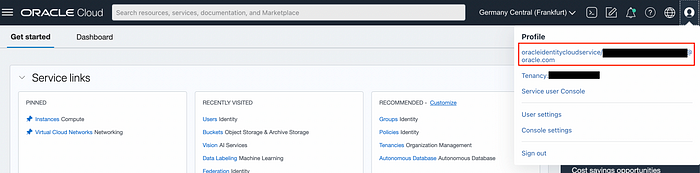
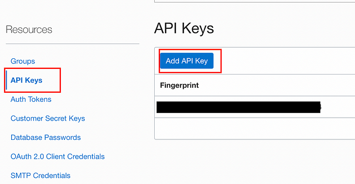
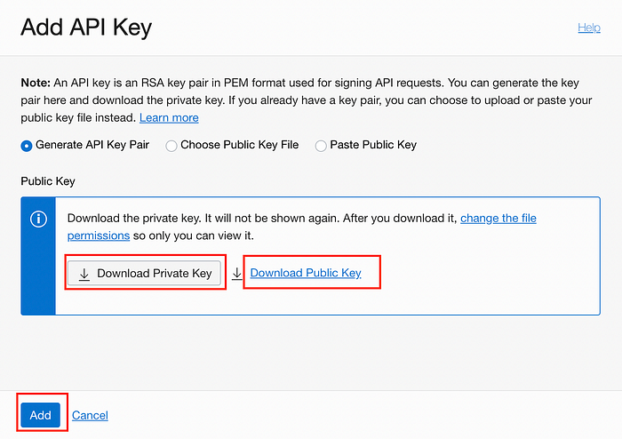
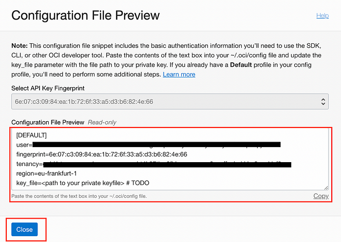
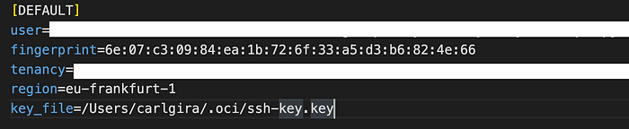

# Setup OCI-cli 

## Introduction 

In this lab, we will go over the steps to install and configure OCI-cli, a command-line interface tool for managing Oracle Cloud resources. By the end of this guide, you should be able to access and manage your Oracle Cloud tenant from your command line. 

Estimated Time: 15 minutes 

## Objectives 

By the end of this lab, you will have: 

- Installed OCI-cli on your local machine 
- Created an API key for your user 
- Configured the OCI-cli with your API credentials 
- Tested the CLI connection to your Oracle Cloud tenant 

## Prerequisites 

- An Oracle Cloud account 
- Administrative access to the tenant 

## Task 1: Install OCI-cli 

The installation process for OCI-cli varies depending on your operating system. Below are the instructions for macOS and Linux: 

### macOS 

Open your terminal and run the following command: 

```
<copy>
brew install oci-cli
</copy>
```

### Linux 

Open your terminal and run the bash command with the script from the OCI-cli GitHub repository: 

```
 <copy>
bash -c "$(curl -L <https://raw.githubusercontent.com/oracle/oci-cli/master/scripts/install/install.sh>)"
 </copy>
```

For other operating systems or more detailed installation instructions, refer to the official documentation: [OCI CLI Quickstart](https://docs.oracle.com/en-us/iaas/Content/API/SDKDocs/cliinstall.htm). 

## Task 2: Create an API Key 

To authenticate with OCI-cli, you need to create an API key for your user. Follow these steps: 

1. Open the OCI console and click on your profile icon in the top-right corner. 

2. Click on your user ID to open the user profile page. 



3. In the user profile, navigate to "User Settings" and select "API Keys". 

4. Click on the "Add API Key" button. 



5. A popup will appear. Download both the private and public key, and then click "Add". 



6. A window will display the API key details. Copy the contents of the text box and click "Close". 



## Task 3: Configure OCI-cli 

Now, we will set up the configuration file for OCI-cli: 

1. Create a hidden directory (if it doesn't exist): 

   ```
   <copy>
   mkdir ~/.oci
   <\copy>
   ```

2. Create a config file inside the directory: 

   ```
   <copy>
   touch ~/.oci/config
   </copy>
   ```

3. Move the downloaded SSH keys to the `.oci` directory and rename them: 

   ```
   <copy>
   mv ssh-key-2022-08-16.key ~/.oci/ssh-key.key
   mv ssh-key-2020-08-16.key.pub ~/.oci/ssh-key.key.pub
   </copy>
   ```

4. Open the config file and paste the content you copied from the API key details: 

   ```
   <copy>
   vi ~/.oci/config
   </copy>
   ```

5. Modify the last field of the config file using the absolute path of the private key. 

Your config file should look similar to the image below: 



## Task 4: Test the Connection 

To verify that OCI-cli is set up correctly, run the following command to list the regions of your Oracle Cloud tenant: 

```
<copy>
oci iam region list
</copy>
```

If the command executes successfully and displays a list of regions, your OCI-cli is configured correctly. 

## Download files

download the codes from [here](https://objectstorage.eu-frankfurt-1.oraclecloud.com/n/frpj5kvxryk1/b/ocw/o/OraclecloudWorld.zip) and unzip it. 

Run the below command to install all the dependencies 
 ```
<copy>
pip install -r requirements.txt
<\copy>
 ```
Once the dependencies are loaded run the below command to launch the app
 ```
<copy>
streamlit run ociChat.py
<\copy>
 ```
## Learn More 

- [OCI CLI Installation](https://docs.oracle.com/en-us/iaas/Content/API/SDKDocs/cliinstall.htm)
- [Managing API Keys](<https://docs.oracle.com/en-us/iaas/Content/Identity/Concepts/managingcredentials.htm#To4>)


## Acknowledgements

* **Author** - Anshuman Panda, Principal Generative AI Specialist, Alexandru Negrea , AI and App Integration Specialist Leader