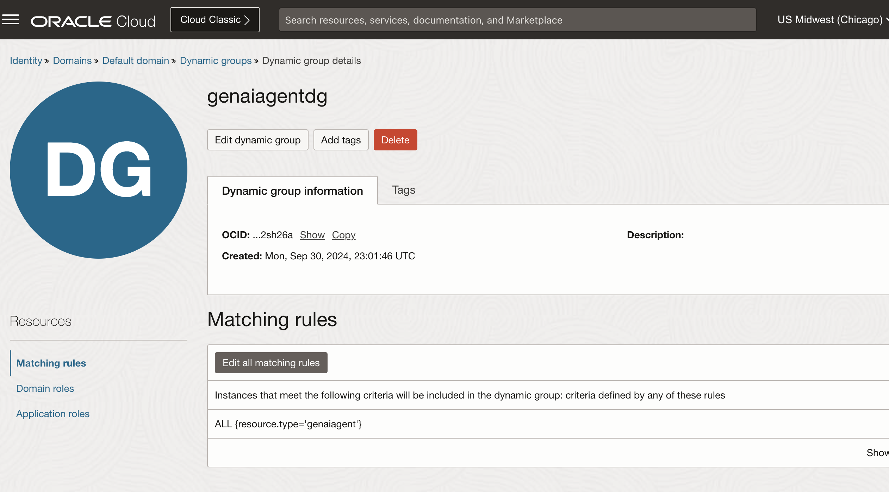
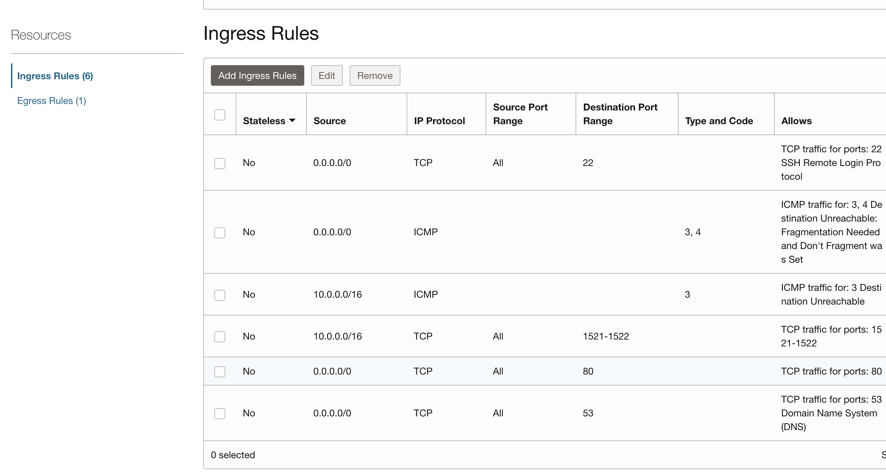
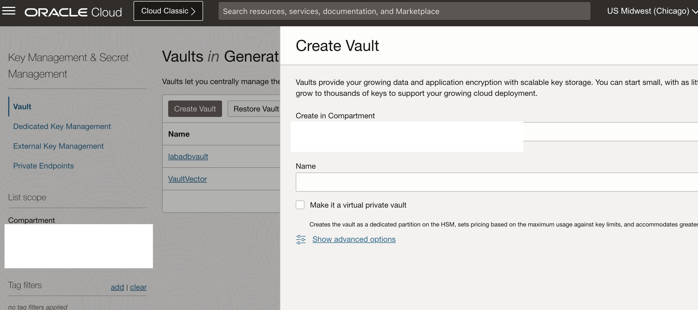
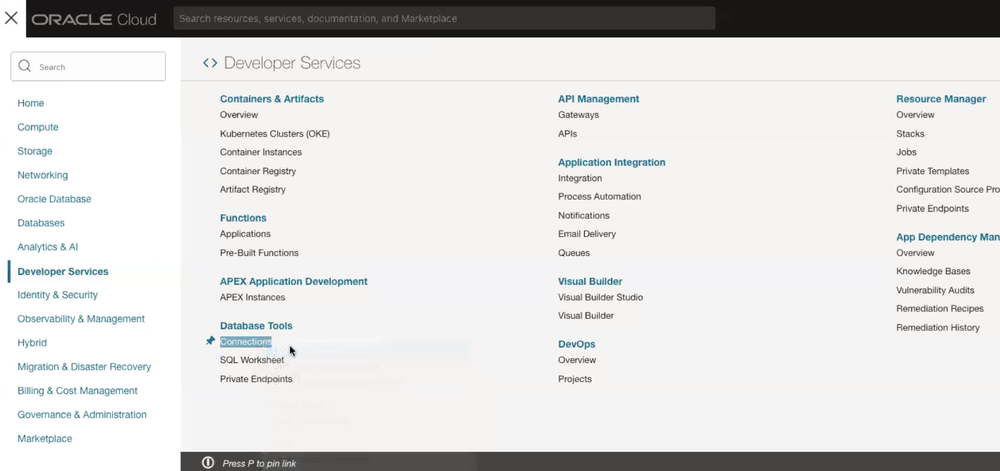
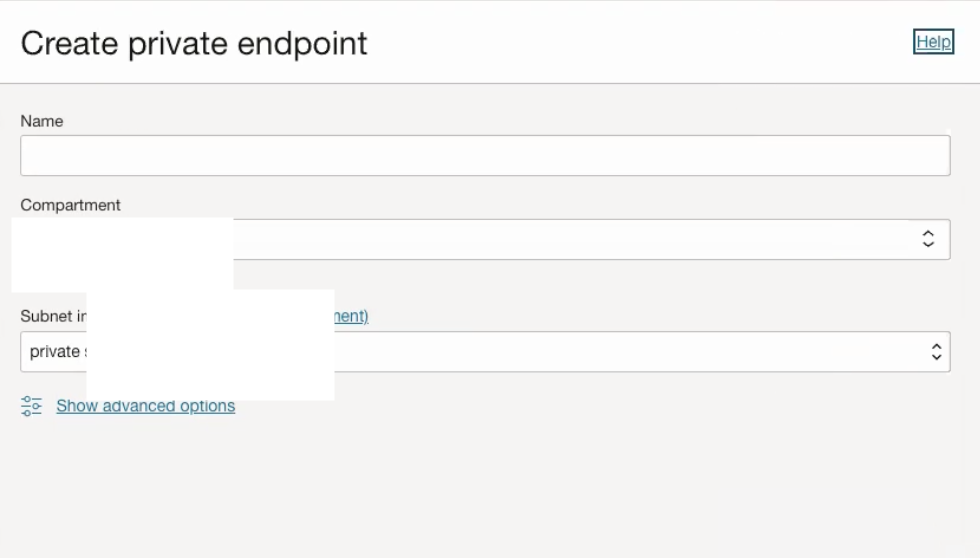
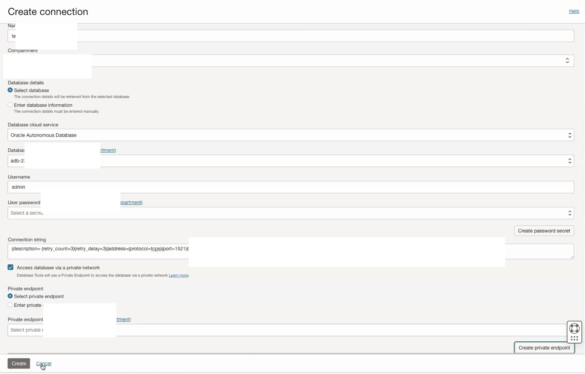

# Create ADB and DB Tools Connection

## Introduction

This lab will take you through the steps needed to provision Oracle Autonomous Database 23ai and Database Tools Connection. Keep in mind this is an optional lab if you already have a 23ai db provisioned and an existing DB tools connection. You can directly move to lab 3 if you also have a table and vector search function ready.

Estimated Time: 30 minutes

### About Oracle ADB 23ai

Oracle Database 23ai is the next long-term support release of Oracle Database. It includes over 300 new features with a focus on artificial intelligence (AI) and developer productivity. Oracle AI Vector Search is designed for Artificial Intelligence (AI) workloads and allows you to query data based on semantics, rather than keywords.
This feature provides a built-in VECTOR data type that enables vector similarity searches within the database.
With a built-in VECTOR data type, you can run run AI-powered vector similarity searches within the database instead of having to move business data to a separate vector database.

### Objectives

In this lab, you will:

* Provision an Oracle ADB 23ai
* Create DB Tools Connection

### Prerequisites

This lab assumes you have:

* All previous labs successfully completed
* Must have an Administrator Account or Permissions to manage several OCI Services: Oracle Databases, Networking, Policies.

## Task 1: Dynamic Group and Policy Definition

This task will help you ensure that the Dynamic Group and Policy are correctly defined.

1. Locate Domains under Identity & Security

    

2. Click on your current domain name

    

3. Click on Dynamic Groups, and then your Dynamic Group name

    

    **Note** The name of your dynamic group can be different.

4. Ensure that your Dynamic Group is properly defined - as follows. Then click on Identity

    

5. Click on Policies, ensure that you are in your "root" compartment, then click on your Policy name

    

    **Note** The name of your policy can be different.

6. Ensure that your Policy is properly defined - as follows.

    

    **Note** If you are using a non-default identity domain - then instead of of just supplying the dynamic group name, you need to provide domain-name/group-name in the policy statements.

## Task 2: Create VCN and private subnet

This task will help you to create a VCN and private subnet in your compartment.

1. Go to Networking -> Virtual cloud networks and Create VCN. Provide IPv4 CIDR Blocks as 10.0.0.0/16

2. Go to the newly created VCN and click on Create Subnet. Provide IPv4 CIDR Block as 10.0.1.0/24 and click on Private Subnet. You can leave rest as default. Click on Create Subnet.

3. Click on newly created subnet and go to the Security List. Add following ingress rules in the security list. Make sure to have the ingress rule to access database port 1521-1522

    

## Task 3: Create Vault to store database secrets

This task will help you to create vault which would be used to save secrets for the database

1. Locate Vault under Key Management & Secret Management. Provide Name and click on Create Vault.

    

2. Go to the newly created Vault. Click on Create Key.

3. Provide Name and leave rest as default. Choose Protection Mode as HSM and click on Create Key.

    

## Task 4: Create Autonomous Database

This task involves creating Autonomous Database 23ai.

1. Locate Autonomous Databases under Oracle Databases. Click on Create Autonomous Database.

    

2. Provide information for Compartment, Display name, Database name. Choose workload type as Data Warehouse. Choose deployment type as Serverless. Choose database version as 23ai and give it a password of your preference.

3. Make sure to select the Network Access: Private Endpoint access only, and select the VCN and subnet mentioned in above section. Also, do not check  Require mutual TLS (mTLS) authentication.

    

4. Finally provide a valid email ID and click on Create Autonomous Database.

## Task 5: Create Database Tools Connection

This task involves creating a Database Tools Connection which will be used to query the database using SQL Worksheet.

1. Locate Database Tools Connections under Developer Services. Click on Create connection.

    

2. Provide Name and Compartment information. Choose Oracle Autonomous Database as Database cloud service. Provide Username as admin.

3. Click on Create password secret. Provide Name, Vault and Key createdin Task 3. Provide same password used at the time of ADB creation in previous task.

    

4. Use the newly created password secret as User password secret.

5. Copy the connection string from your autonomous database. Go to ADB and click on database connection and copy any of the low, medium or high connection strings as shown below,

    

6. Modify the connection string with the following: Reduce retry_count form 20 to 3; Replace host with private ip address. You can get Private IP address from the autonomous database as shown below.

    

7. Click on Create private endpoint. Provide Name and private subnet created in Task 1.

    

8. Choose newly created private endpoint as Private Endpoint.

9. Choose Wallet format as None in SSO details.

10. Click on Create to create a database tools connection.

    

11. Go to newly create Database Tools connection. Click on Validate.

    

## Acknowledgements

* **Author**
    * **Abhinav Jain**, Senior Cloud Engineer, NACIE
* **Contributors**
    * **Kaushik Kundu**, Master Principal Cloud Architect, NACIE
