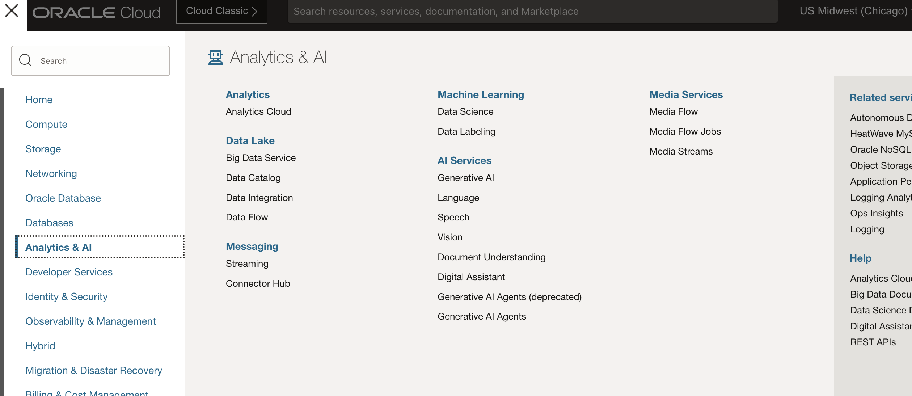
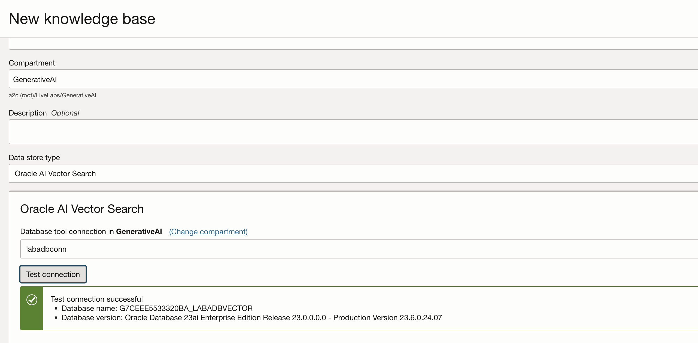
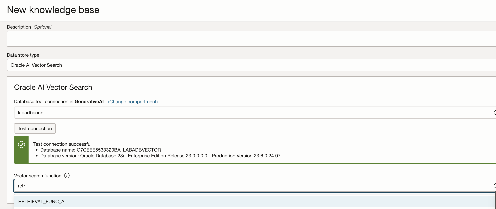
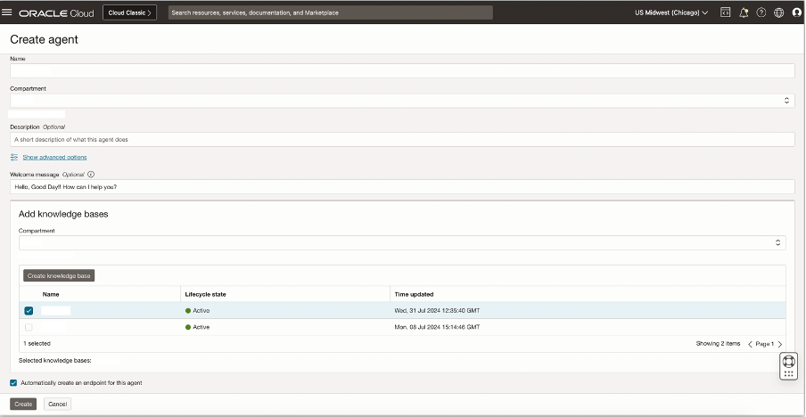

# Provision Generative AI Agents Service

## Introduction

This lab walks you through the steps to setup an OCI Generative AI Agent
Estimated Time: 30 minutes

### About Generative AI Agents

OCI Generative AI Agents is a fully managed service that combines the power of large language models (LLMs) with an intelligent retrieval system to create contextually relevant answers by searching your knowledge base, making your AI applications smart and efficient.

OCI Generative AI Agents supports several ways to onboard your data and then allows you and your customers to interact with your data using a chat interface or API.

### Objectives

In this lab, you will:

* Create Object Storage Bucket and upload files
* Create OCI Gen AI RAG Agent
* (optional) test agent in console
* (optional) update Agent's Knowledge Base

### Prerequisites

This lab assumes you have:

* All previous labs successfully completed
* Permissions to manage OCI Services: Generative AI Agents, Object Storage
* Access to a Region where the Agent service is available: Chicago, Frankfurt

## Task 1: Provision Knowledge Base

This task will help you to create Oracle Generative AI Agent’s Knowledge Base under your chosen compartment.

1. Locate Generative AI Agents under AI Services

    

2. Locate Knowledge Bases in the left panel, select the correct Compartment.

    Then click on “Create knowledge base” button

    

3. Specify the name of the knowledge base, ensure that you have selected the correct compartment.

    Select Oracle AI Vector Search in the “Select data source” dropdown.

    

4. Specify the name of the database tool connection

    Select the database tool connection from the dropdown and click on Test connection. Note - If you do not already have an existing databse connection. Refer to the optional lab on how to create it.

    

5. Select the Vector search function you want to use for performing the vector search from the dropdown. Note - If you do not already have an existing Vector search function created then refer to the optional lab on how to create it.

    

6. Click on Create button to create the Knowledge Base.

7. In few minutes the status of recently created Knowledge Base will change from Creating to Active

    

## Task 2: Provision Agent

This task will help you to create Oracle Generative AI Agent under your chosen compartment.

1. Locate Agents in the left panel, select the correct Compartment.

    Then click on “Create agent” button

    

2. Specify the agent name, ensure the correct compartment is selected and indicate a suitable welcome message

    Select the Knowledge Base that you created in the previous task

    Click the “Create” button.

    

3. In few minutes the status of recently created Agent will change from Creating to Active

    Click on “Endpoints” menu item in the left panel and then the Endpoint link in the right panel.

    

4. It’ll open up the Endpoint Screen. Copy and keep the OCID of the Endpoint. It’ll be used later.

   Click on “Launch chat” button

   

5. It’ll open up the Chat Playground, where you can ask questions in natural language, and get the responses from your documents stored in the vector database.

    

## Acknowledgements

* **Author**
    * **Abhinav Jain**, Senior Cloud Engineer, NACIE
* **Contributors**
    * **Kaushik Kundu**, Master Principal Cloud Architect, NACIE