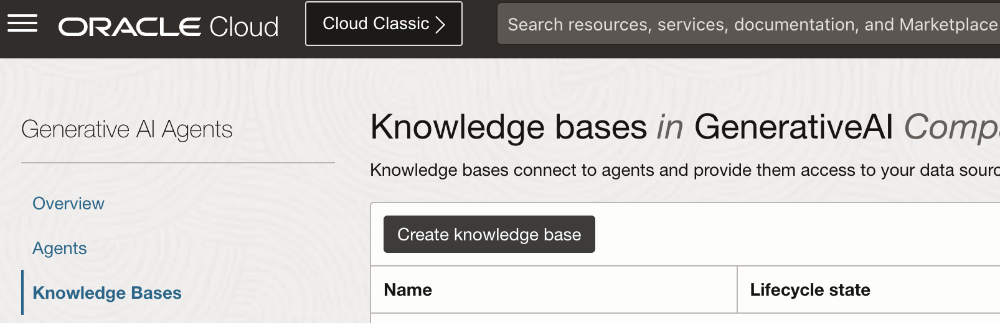
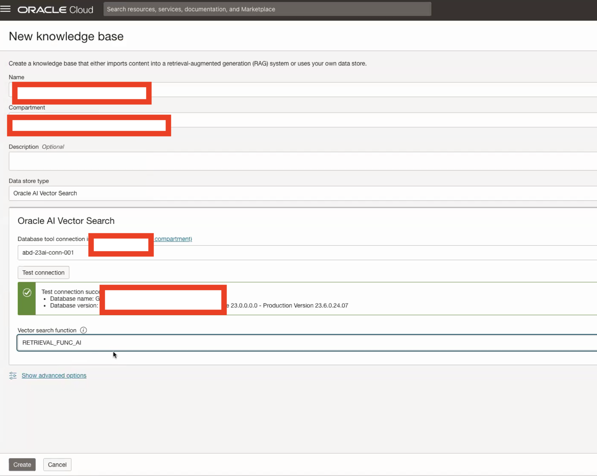
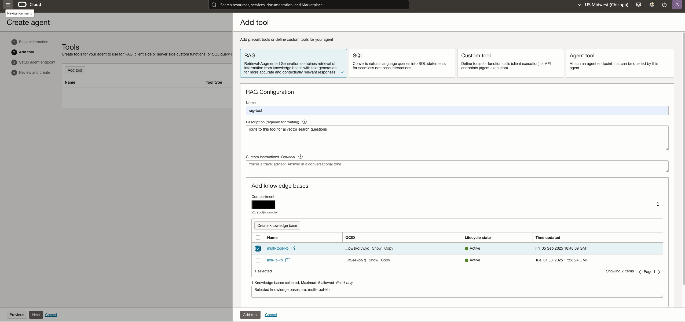
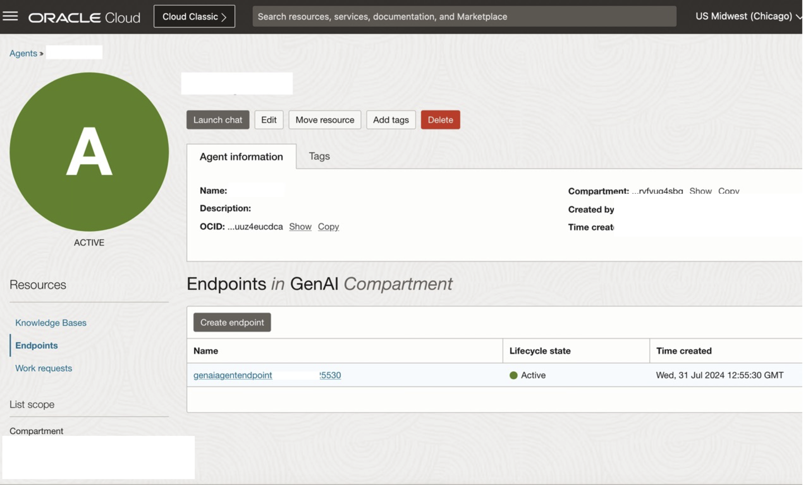
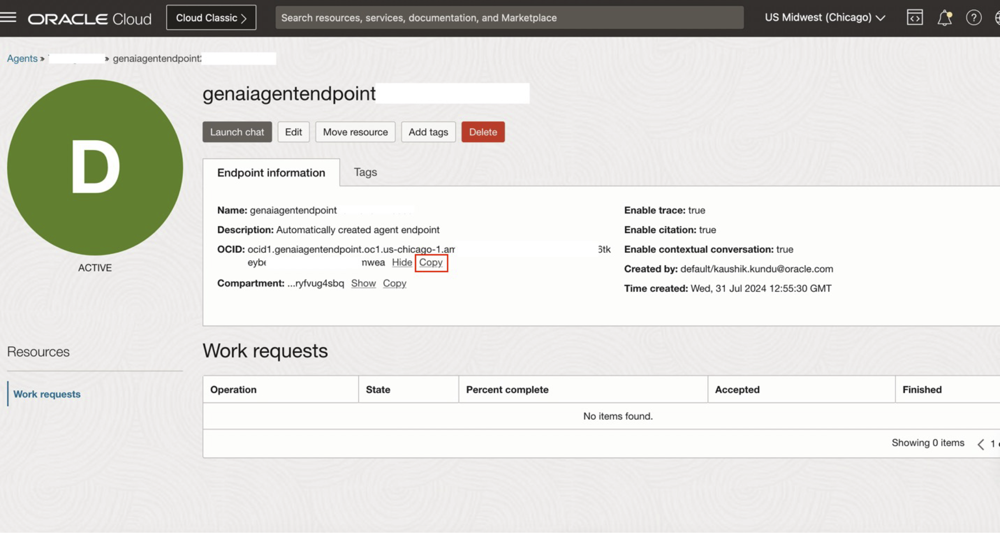
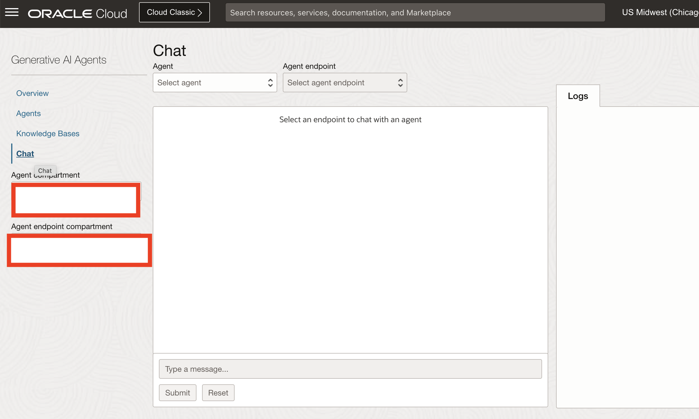

# Create Knowledge base and chat with agent

## Introduction

This lab walks you through the steps to setup an OCI Generative AI Agent including ingesting a knowledge base from 23ai adb.

Estimated Time: 30 minutes

### About Generative AI Agents

OCI Generative AI Agents is a fully managed service that combines the power of large language models (LLMs) with an intelligent retrieval system to create contextually relevant answers by searching your knowledge base, making your AI applications smart and efficient.

OCI Generative AI Agents supports several ways to onboard your data and then allows you and your customers to interact with your data using a chat interface or API.

### Objectives

In this lab, you will:

* Create Knowledge base
* Create Agent
* Chat with agent

### Prerequisites

This lab assumes you have:

* All previous labs successfully completed
* Permissions to manage OCI Services: Generative AI Agents
* Access to a Region where the Agent service is available: Chicago, Frankfurt

## Task 1: Create Knowledge Base

This task will help you create a knowledge base using 23ai database as source.

1. Locate Knowledge Bases under Analytics & AI -> Generative AI Agents.

    

2. Click on your Create knowledge base. Provide Name, Data store type as Oracle AI Vector Search, Provide Database tool connection and click on Test connection. Once successful provide the vector search function created in the optional lab or your own vector search function. Lastly, click on create to create the Knowledge base.

    

## Task 2: Create Agent

1. Locate Agents in the left panel, select the correct Compartment.

    Then click on “Create agent” button

    

2. Specify the agent name, ensure the correct compartment is selected and indicate a suitable welcome message

    Select Add tool > Choose RAG tool 

    

    Specify the RAG tool name and description, select the Knowledge Base that you created in the previous task. 

    Click the “Add tool” button.

    Click Next, and then "Create agent" button.

3. In few minutes the status of recently created Agent will change from Creating to Active. Click on "Endpoints" menu item in the left panel and then the Endpoint link in the right panel.

    

4. It’ll open up the Endpoint Screen. Copy and keep the OCID of the Endpoint. It’ll be used later. Click on "Launch chat" button

    

## Task 3: Chat with Agent

1. Locate Chat under Analytics & AI -> Generative AI Agents.

    

2. Select agent created in the previous task from the dropdown. Also, select the endpoint associated with that agent. Ask a relevant question depending on information stored in DB and start chatting with the agent.

## Acknowledgements

* **Author**
    * **Abhinav Jain**, Senior Cloud Engineer, NACIE
* **Contributors**
    * **Kaushik Kundu**, Master Principal Cloud Architect, NACIE
* **Last Updated By/Date**
    * **Kaushik Kundu**, Master Principal Cloud Architect, NACIE, September 2025
