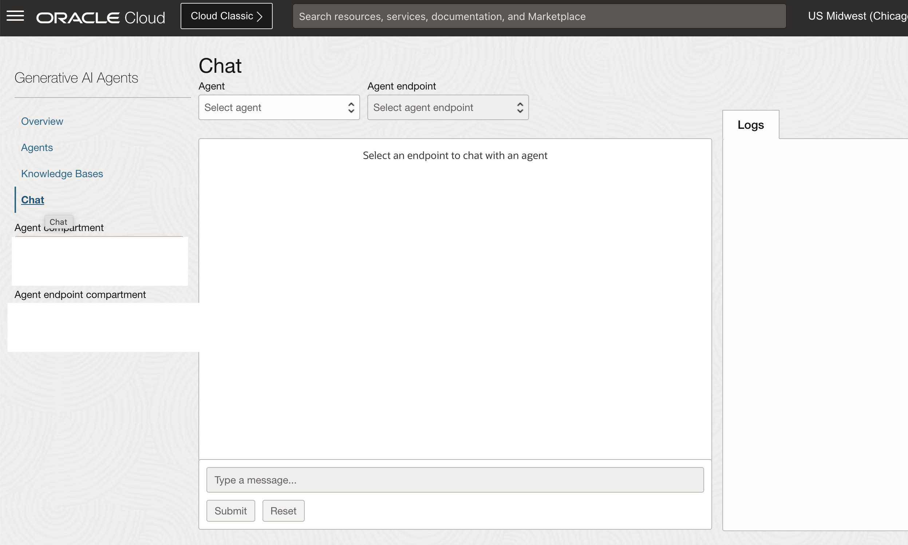

# Create Knowledge base and chat with agent

## Introduction

This lab will take you through the steps needed to provision Oracle Autonomous Database 23ai and Database Tools Connection

Estimated Time: 30 minutes

### About OCI Digital Assistant

Oracle Digital Assistant (ODA) is a platform that allows you to create and deploy digital assistants for your users. Digital assistants are virtual devices that help users accomplish tasks through natural language conversations, without having to seek out and wade through various apps and web sites. Each digital assistant contains a collection of specialized skills. When a user engages with the digital assistant, the digital assistant evaluates the user input and routes the conversation to and from the appropriate skills.

### Objectives

In this lab, you will:

* Provision an ODA instance
* Import and configure a skill to use GenAI Agents
* Create a Channel to connect the skill to a frontend

### Prerequisites

This lab assumes you have:

* All previous labs successfully completed
* Must have an Administrator Account or Permissions to manage several OCI Services: Digital Assistant

## Task 1: Create Knowledge Base

This task will help you create a knowledge base using 23ai database as source.

1. Locate Knowledge Bases under Analytics & AI -> Generative AI Agents.

    

2. Click on your Create knowledge base. Provide Name, Data store type as Oracle AI Vector Search, Provide Database tool connection and click on Test connection. Once successful provide the vector search function created in the optional lab or your own vector search function. Lastly, click on create to create the Knowledge base.

    

## Task 2: Create Agent

1. Locate Agents under Analytics & AI -> Generative AI Agents.

    

2. Click on Create Agent. Provide Name, an optional welcome message - Hi I'm 23ai Vector DB RAG Agent. How can I help you? Select the Knowledge base created in previous task. Click on Create. It may take 15-20 minutes for agent to become active.

    

## Task 3: Chat with Agent

1. Locate Chat under Analytics & AI -> Generative AI Agents.

    

2. Select agent created in the previous task from the dropdown. Also, select the endpoint associated with that agent. Ask a relevant question depending on information stored in DB and start chatting with the agent.

## Acknowledgements

* **Author**
    * **Abhinav Jain**, Senior Cloud Engineer, NACIE
* **Contributors**
    * **Kaushik Kundu**, Master Principal Cloud Architect, NACIE
