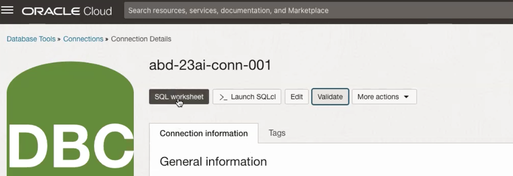
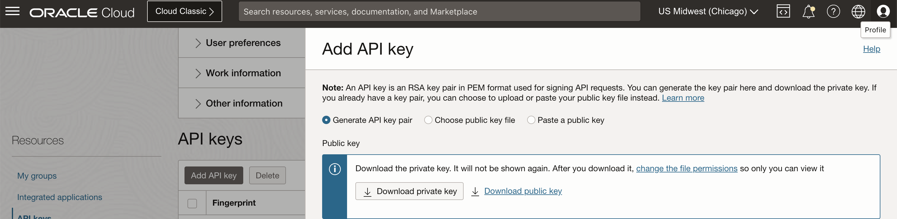

# Load vector data in ADB using sql

## Introduction

This lab will take you through the steps needed to load data and create a vector search function in your ADB 23ai. Keep in mind this is an optional lab if you already have your table ready with a vector search function. If yes, you can skip this lab and move to lab 3.

Estimated Time: 30 minutes

### Objectives

In this lab, you will:

* Create a vector table and load data
* Create vector search function

### Prerequisites

This lab assumes you have:

* All previous labs successfully completed
* Must have an Administrator Account or Permissions to manage several OCI Services: Oracle ADB

## Task 1: Oracle Database 23ai Prerequisites

The user must have the Oracle Database 23ai with the following components:

* Table: Used to store records with 'docid', 'body', and 'vector'.
* Database Function: Provides vector search results against the provided query.

### Table

The table should have the following required fields:

* 'docid': The record or document ID.
* 'body': The content used for the search.
* 'vector': The vector generated from an embedding model based on the 'body' content.

Optional fields include:

* 'chunkid': The chunk ID for the same 'docid' in case of large content.
* 'url': A URL reference for the content, if available.
* 'title': The title of the body content.

### Function

A function with the following requirements:

* Return Type: 'SYS_REFCURSOR'
* Input Parameters:
  * 'p_query' (query string)
  * 'top_k' (number of top results)The embedding model used for the query string should be the same as the one used for embedding the 'body' field. The return fields should match the table's required (DOCID, BODY and SCORE) and optional fields (CHUNKID, TITLE, and URL)

Note: Names can vary but must be aliased as follows in the function.

## Task 2: Run SQL statements to create a vector table

1. Go to your Database connection created in previous lab. Click on SQL worksheet and run the following code blocks one by one.

    

2. First code block is for Access Control List to let user go out everywhere. This is required for ADB user to access Bucket public link and GenAI Embedding model. It's not required for Oracle Base Database.

     ```text
       <copy>
       -- ACL to let user go out everywhere (host =>'*'), it's not required for Oracle Base Database.
       begin
        -- Allow all hosts for HTTP/HTTP_PROXY
        dbms_network_acl_admin.append_host_ace(
            host =>'*',
            lower_port => 443,
            upper_port => 443,
            ace => xs$ace_type(
            privilege_list => xs$name_list('http', 'http_proxy'),
            principal_name => upper('admin'),
            principal_type => xs_acl.ptype_db)
        );
        end;
        /
       </copy>
    ```

3. Create the credentials to access OCI GenAI service. Check and find the credential information below with your information.

    * user ocid: You can find under Profile -> My Profile when you click the top right section of OCI console.
    * tenancy ocid: You can find under Profile -> tenancy when you click the top right section of OCI console.
    * compartment ocid: Go to your compartment under Identity and copy compartment ocid
    * private_key
    * fingerprint

    For private key and fingerprint go to Profile -> My Profile when you click the top right section of OCI console. Click on API Keys under Resources and add an API Key

    

4. DBMS_CLOUD credentials: (Important Note: Put the private key all on a single line.)

     ```text
       <copy>
       -- DBMS_CLOUD credentials
       -- Some examples are based on DBMS_CLOUD, that is included in Autonomous DB.
       -- If you need to install it (for example on Base Database) you can refer to: https://support.oracle.com/knowledge/Oracle%20Cloud/2748362_1.html
       begin
            DBMS_CLOUD.CREATE_CREDENTIAL (
                credential_name => 'OCI_CRED_BUCKET',
                user_ocid       => 'ocid1.user.oc1..aaaaaaaaa2...',
                tenancy_ocid    => 'ocid1.tenancy.oc1..aaaaaaaa...',
                private_key     => 'MIIEvgI...RpV',
                fingerprint     => '0f:df...1d:88:d6'
            );
        end;
        /
       </copy>
    ```

5. Credentials for GenAI OCI

     ```text
       <copy>
       declare
            jo json_object_t;
       begin
            jo := json_object_t();
            jo.put('user_ocid','ocid1.user.oc1..aaaaaaaaa2...');
            jo.put('tenancy_ocid','ocid1.tenancy.oc1..aaaaaaaa...');
            jo.put('compartment_ocid','ocid1.tenancy.oc1..aaaaaaaa...');
            jo.put('private_key','MIIEvgI...RpV');
            jo.put('fingerprint','0f:df...1d:88:d6');
            dbms_vector.create_credential(
                credential_name   => 'OCI_CRED',
                params            => json(jo.to_string)
            );
        end;
        /
       </copy>
    ```

6. Run the following to test: - this should return vector embedding for "hello"

     ```text
       <copy>
       SELECT
            dbms_vector.utl_to_embedding(
                'hello',
                json('{
                    "provider": "OCIGenAI",
                    "credential_name": "OCI_CRED",
                    "url": "https://inference.generativeai.us-chicago-1.oci.oraclecloud.com/20231130/actions/embedText",
                    "model": "cohere.embed-multilingual-v3.0"
                }')
            )
        FROM dual;
       </copy>
    ```

7. Create a table from a PDF file. Please upload the PDF file to a storage bucket and get the Pre-Authenticated Request link to access the PDF file.

    * Upload the PDF file to a storage bucket.
    * Get the Pre-Authenticated Request link to access the PDF file.
    * Divide the BLOB into chunks using 'utl to chunks'. Adjust the chunk settings according to your needs. For more details, check this link: [Custom Chunking Specifications](https://docs.oracle.com/en/database/oracle/oracle-database/23/vecse/convert-text-chunks-custom-chunking-specifications.html)
    * Use 'utl to text' for further processing. More details can be found here: [UTL TO CHUNKS](https://docs.oracle.com/en/database/oracle/oracle-database/23/arpls/dbms_vector_chain1.html#GUID-4E145629-7098-4C7C-804F-FC85D1F24240)

     ```text
       <copy>
       CREATE TABLE ai_extracted_data AS
       SELECT
            j.chunk_id,
            j.chunk_offset,
            j.chunk_length,
            j.chunk_data
       FROM
            -- divide a blob into chunks (utl_to_chunks):
            (select * from dbms_vector_chain.utl_to_chunks(
                dbms_vector_chain.utl_to_text(
                    to_blob(
                        DBMS_CLOUD.GET_OBJECT('OCI_CRED_BUCKET', 'https://objectstorage.us-chicago-1.oraclecloud.com/p/Aaklz9CEuOdwhdWbV-bLcDTvML4DNlRtTw7z6dMuSMh1gn2toBnmE1airTA-ZhkW/n/axk4z7krhqfx/b/AI_Vector_Search/o/oracle-ai-vector-search-users-guide.pdf')
                    )
                ), json('{"max":"75", "normalize":"all", "overlap":"15"}')
            )),
            JSON_TABLE(column_value, '$'
                COLUMNS (
                    chunk_id NUMBER PATH '$.chunk_id',
                    chunk_offset NUMBER PATH '$.chunk_offset',
                    chunk_length NUMBER PATH '$.chunk_length',
                    chunk_data CLOB PATH '$.chunk_data'
                )
            ) j;
       </copy>
    ```

8. Check the table.

    ```text
       <copy>
       select * from ai_extracted_data
       select count(*) from ai_extracted_data
       </copy>
    ```

9. Create a vector table and load data from an existing table: If your existing data hasn't been processed into chunks yet, your chunk size might exceed 512, which would prevent embedding generation. To address this, refer to [Custom Chunking Specifications](https://docs.oracle.com/en/database/oracle/oracle-database/23/vecse/convert-text-chunks-custom-chunking-specifications.html) to convert content to chunk.

    * Create  the vector table from an existing table: For the existing table, there will be at least two columns: one for the record ID to locate each record, and a content column (typically of 'CLOB' data type) for processing vector search.

     ```text
       <copy>
       -- Create vector table from an existing table
       -- There is a quota limit for running the embedding model. For datasets with more than 400 records, we can repeatedly load the data or write a script to load data in batches.
       -- In the following table ai_extracted_data, chunk_id is the record id while chunk_data is the content column.
       create table ai_extracted_data_vector as (
            select chunk_id as docid, to_char(chunk_data) as body, dbms_vector.utl_to_embedding(
                chunk_data,
                json('{
                    "provider": "OCIGenAI",
                    "credential_name": "OCI_CRED",
                    "url": "https://inference.generativeai.us-chicago-1.oci.oraclecloud.com/20231130/actions/embedText",
                    "model": "cohere.embed-multilingual-v3.0"
                }')
            ) as text_vec
            from ai_extracted_data
            where chunk_id <= 400
        )
       </copy>
    ```

10. Load data for datasets with more than 400 records

     ```text
       <copy>
       insert into ai_extracted_data_vector
       select chunk_id as docid, to_char(chunk_data) as body, dbms_vector.utl_to_embedding(
            chunk_data,
            json('{
                "provider": "OCIGenAI",
                "credential_name": "OCI_CRED",
                "url": "https://inference.generativeai.us-chicago-1.oci.oraclecloud.com/20231130/actions/embedText",
                "model": "cohere.embed-multilingual-v3.0"
            }')
            ) as text_vec
        from ai_extracted_data
        where chunk_id > 400
       </copy>
    ```

11. Check the vector table

     ```text
       <copy>
       select * from ai_extracted_data_vector
       select count(*) from ai_extracted_data_vector
       </copy>
    ```

12. Create Function against vector table

    * When returning the results, rename (alias) the record ID as 'DOCID', the content column as 'BODY', and the VECTOR DISTANCE between text vec and query vec as 'SCORE'. These 3 columns are required. If the vector table includes 'URL' and 'Title' columns, rename them (alias) as 'URL' and 'TITLE' respectively.

    * For more details, please check [Vector Distance Functions and Operators](https://docs.oracle.com/en/database/oracle/oracle-database/23/vecse/vector-distance-functions-and-operators.html)

    * For specific information on vector distance, refer to [VECTOR DISTANCE](https://docs.oracle.com/en/database/oracle/oracle-database/23/sqlrf/vector_distance.html#GUID-BA4BCFB2-D905-43DC-87B0-E53522CF07B7)

     ```text
       <copy>
       -- Create function from vector table
       -- When returning the results, rename (alias) the record ID as 'DOCID', the content column as 'BODY', and the VECTOR_DISTANCE between text_vec and query_vec as 'SCORE'. These 3 columns are required. If the vector table includes 'URL' and 'Title' columns, rename them (alias) as 'URL' and 'TITLE' respectively.
       create or replace FUNCTION retrieval_func_ai (
            p_query IN VARCHAR2,
            top_k IN NUMBER
       ) RETURN SYS_REFCURSOR IS
            v_results SYS_REFCURSOR;
            query_vec VECTOR;
       BEGIN
            query_vec := dbms_vector.utl_to_embedding(
                p_query,
                json('{
                    "provider": "OCIGenAI",
                    "credential_name": "OCI_CRED",
                    "url": "https://inference.generativeai.us-chicago-1.oci.oraclecloud.com/20231130/actions/embedText",
                    "model": "cohere.embed-multilingual-v3.0"
                }')
            );

            OPEN v_results FOR
                SELECT DOCID, BODY, VECTOR_DISTANCE(text_vec, query_vec) as SCORE
                FROM ai_extracted_data_vector
                ORDER BY SCORE
                FETCH FIRST top_k ROWS ONLY;

            RETURN v_results;
        END;
       </copy>
    ```

13. Run & check the function

     ```text
       <copy>
       -- Run & check the function
       -- Display the DOCID and SCORE
       DECLARE
            v_results SYS_REFCURSOR;
            v_docid VARCHAR2(100);
            v_body VARCHAR2(4000);
            v_score NUMBER;
            p_query VARCHAR2(100) := 'How to Convert Text String to Embedding?';
            top_k NUMBER := 10;
       BEGIN
            v_results := retrieval_func_ai(p_query, top_k);

            DBMS_OUTPUT.PUT_LINE('DOCID | SCORE');
            DBMS_OUTPUT.PUT_LINE('--------|------');

            LOOP
                FETCH v_results INTO v_docid, v_body, v_score;
                EXIT WHEN v_results%NOTFOUND;

                DBMS_OUTPUT.PUT_LINE(v_docid || ' | ' || v_score);
            END LOOP;

            CLOSE v_results;
        END;
       </copy>
    ```

## Acknowledgements

* **Author**
    * **Abhinav Jain**, Senior Cloud Engineer, NACIE
* **Contributors**
    * **Kaushik Kundu**, Master Principal Cloud Architect, NACIE
* **Last Updated By/Date**
    * **Abhinav Jain**, Senior Cloud Engineer, NACIE, May 2025
