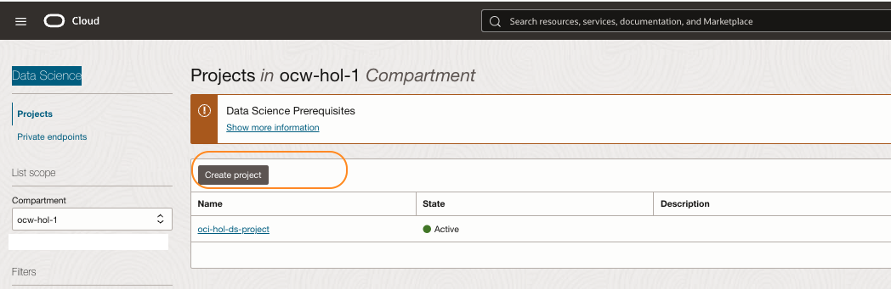
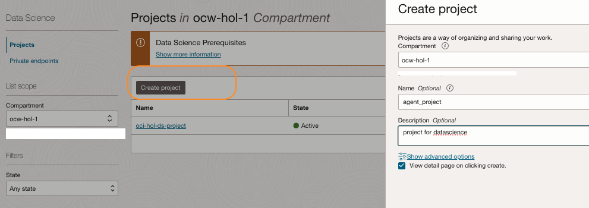
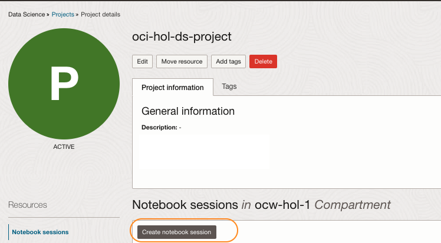
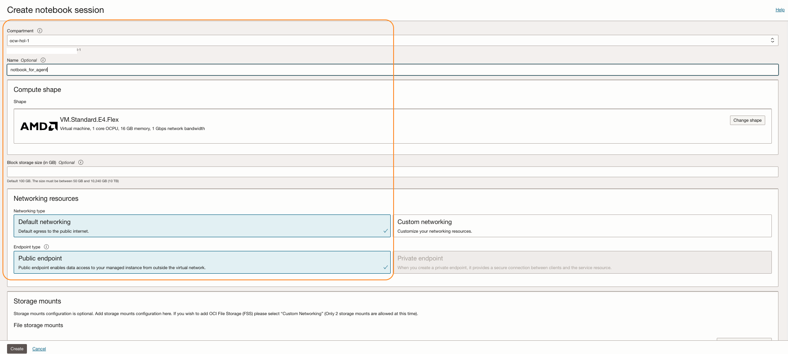
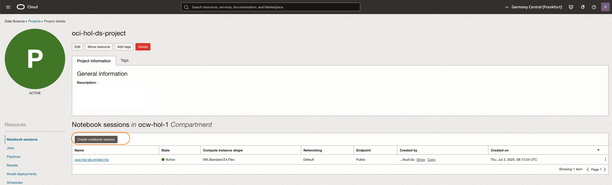
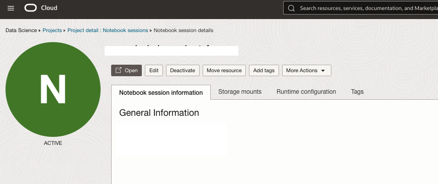
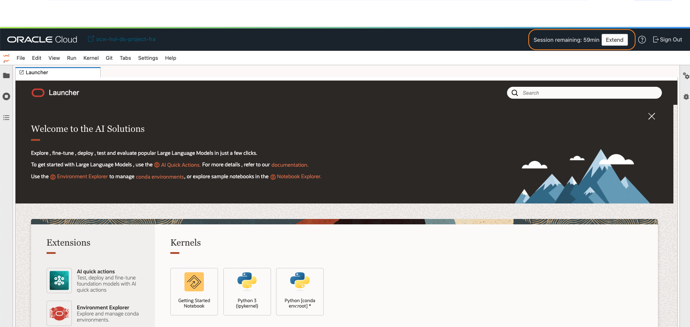
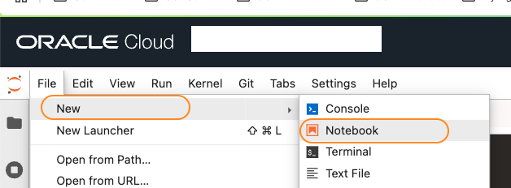
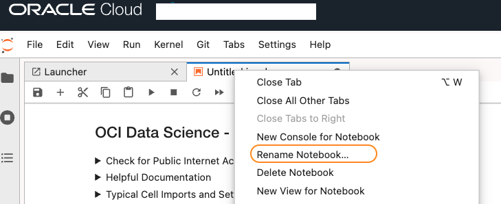
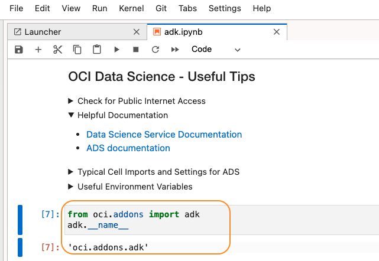

# Setup OCI Agent Development Kit (ADK)

## Introduction

This lab guides you through installing ADK using the Python installer. We recommend using an *OCI Data Science* notebook, as it includes all necessary software. Optional steps are provided for installing the ADK client on a local machine.

Estimated Time: 30 minutes


## Task 1: Setup OCI Data Science notebook for **ADK** usage.

1. From OCI Console > AI & Analytics > Data Science

    

2. Select Create project. Provide a name and description.

    

3. Within the project, click Create notebook session.

    

4. Provide a name, retain all the other default settings, and click Create.

    

5. Wait for the resource to become active.

    

6. Open the notebook detail page and click Open.

    

7. Provide credentials and multi-factor authentication when prompted. Wait for the notebook to open.

    
    
8. Click Extend and extend the notebook timeout.


**You can skip the next section and proceed to Task 3** 


## Task 2: (Optional) Setup a local machine for **ADK** usage.

1. Python ADK requires Python 3.10 or later. Ensure you have the correct version of Python installed in your environment.

2. Follow the steps below and install OCI with ADK:

   ```
   <copy>
    # Create a project folder with name of your choice
    mkdir <your-project-name>
    cd <your-project-name>
    # Create and activate a virtual environment under `<myenv>` subfolder
    python -m venv <myenv>
    source <myenv>/bin/activate
   </copy>
   ```

3. After you create a project and a virtual environment, install the latest version of ADK:

   ```
   <copy>
    pip install "oci[adk]"
    pip install oci-cli
   </copy>
   ```
4. Create an *API Signing Key* and store for it further usage. Refer [here](https://docs.oracle.com/en-us/iaas/Content/API/Concepts/apisigningkey.htm#two) for detailed steps.

## Task 3: Validate ADK installation using OCI Data science.

1. Follow the steps below if you are using a Data Science notebook. If not, move to Task 4 

    * Click File > New >Notebook.

    

2. Right-click on the untitled notebook and rename it.

    

3. Run the following and validate that it returns the correct name reference.

   ```
   <copy>
    from oci.addons import adk
    adk.__name__
   </copy>
   ```

<!--  -->

## Task 4: Validate ADK installation for local setup

1. Follow the steps below for a local machine:

   ```
   <copy>
    from oci.addons import adk
    adk.__name__
   </copy>
   ```

2. Validate the name reference.

**Proceed to the next lab.**

## Acknowledgements

* **Author**
    * **Rahul MR**, Principal Solutions Architect - OCI 
* **Contributors**
    * **Sanjeeva Kalva**, Principal Data Scientist - OCI 
