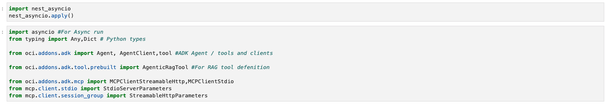
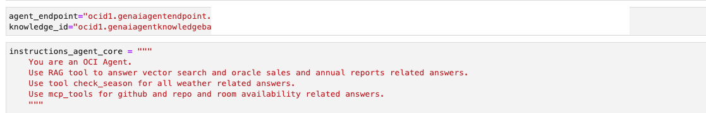
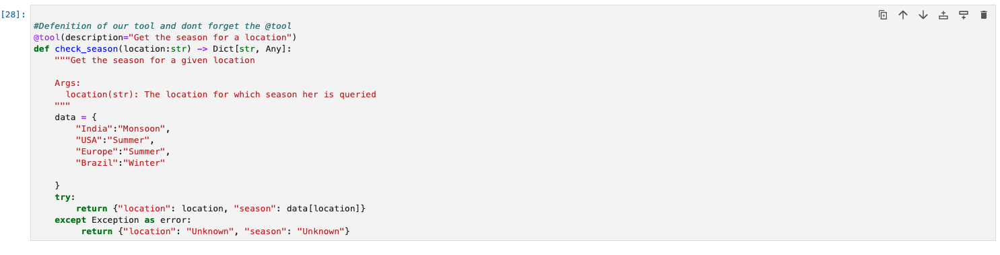
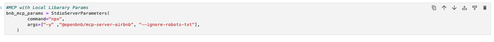
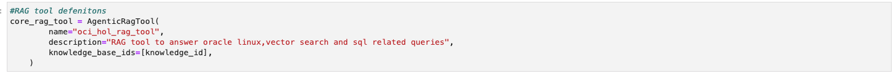
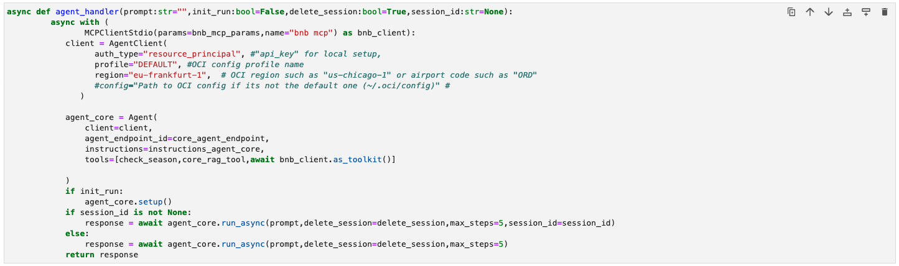
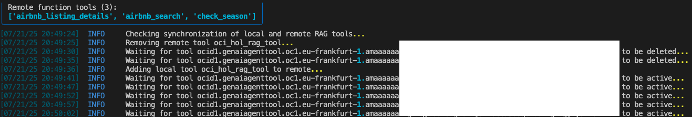
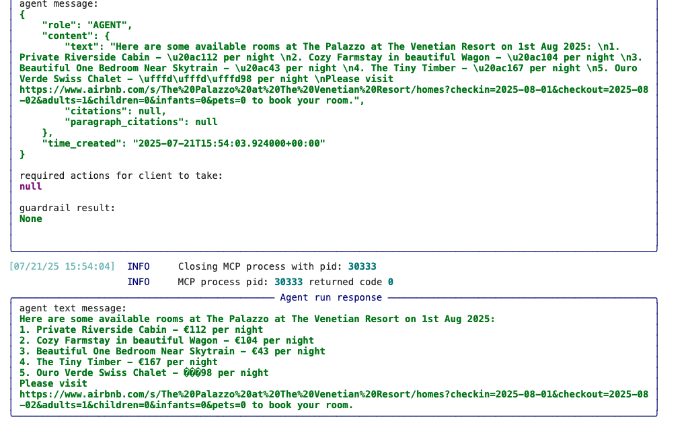

# Configure OCI Agent RAG tool

## Introduction

This lab details the steps to configure an Agent using the tools that were created. It also provides steps to add additional client-side tools, such as custom tools using functions, as well as integration with Model Context Protocol - MCP.

## Task 1: Import ADK modules.
This task imports various ADK Python modules as well as some optional libraries for our usage. All these instructions work for Python scripts as well as OCI Data Science notebooks.

1. Add below to the notebook cell.

    ```
    <copy>
    import asyncio #For Async run 
    from typing import Any,Dict # Python types 

    from oci.addons.adk import Agent, AgentClient,tool #ADK Agent / tools and clients

    from oci.addons.adk.tool.prebuilt import AgenticRagTool #For RAG tool defenition 

    from oci.addons.adk.mcp import MCPClientStreamableHttp,MCPClientStdio
    from mcp.client.stdio import StdioServerParameters
    from mcp.client.session_group import StreamableHttpParameters
    </copy>
    ```

2. Add the below snippet to enable async run for the notebook.

    ```
    <copy>
    import nest_asyncio
    nest_asyncio.apply()
    </copy>
    ```

    

3. For notebooks, you may use the Play button and run these commands. For Python scripts, you may use your editor or run using the python script.py format.


## Task 2: Define variables.

1. Define variables for the agent endpoint and RAG knowledge base IDs.

    ```
    <copy>
    agent_endpoint="endpoint OCID"
    knowledge_id="knowledgeBase OCID"
    </copy>
    ```

2. Define instructions for agents.

    ```
    <copy>
    instructions_agent_core = """
    You are an OCI Agent.
    Use RAG tool to answer vector search and oracle sales and annual reports related answers.
    Use tool check_season for all weather related answers.
    Use mcp_tools for github and repo and room availability related answers.
    """
    </copy>
    ```

    

## Task 3: Define a custom tool based on function.

1. Use the below code to set a simple custom function-based tool, which will return the season based on a location.

    ```
    <copy>

    #Definition of our tool and do not forget the @tool
    @tool(description="Get the season for a location")
    def check_season(location:str) -> Dict[str, Any]:
        """Get the season for a given location

        Args:
        location(str): The location for which season her is queried
        """
        data = {
            "India":"Monsoon",
            "USA":"Summer",
            "Europe":"Summer",
            "Brazil":"Winter"

        }
        try:
            return {"location": location, "season": data[location]}
        except Exception as error:
            return {"location": "Unknown", "season": "Unknown"}
        </copy>
    ```

    

## Task 4: Define MCP call using stdIO mode.

* We are using an open-source MCP library to fetch information from the public internet.
* The library details and credit goes to https://github.com/openbnb-org/mcp-server-airbnb.
* If you are using local client execution, ensure Node.js and npx are available to run.

1. Copy the below to a notebook or local script to define the MCP.

    ```
    <copy>
    #MCP with Local Library Params 
    bnb_mcp_params = StdioServerParameters(
            command="npx",
            args=["-y" ,"@openbnb/mcp-server-airbnb", "--ignore-robots-txt"],
        )

    </copy>
    ```

    


## Task 5: Connect Knowledge Base to the RAG tool.

   1. Connect the knowledge base ID and RAG tool with the agent. To do so, copy the below snippet and paste it into the notebook or Python script.

    ```
    <copy>
    #RAG tool detentions
    core_rag_tool = AgenticRagTool(
            name="oci_hol_rag_tool",
            description="RAG tool to answer oracle linux,vector search and sql related queries",
            knowledge_base_ids=[knowledge_id],
        )
    </copy>
    ```

    

## Task 6: Define an agent and connect with the tools.

   1. Use the below snippet to define an agent along with the tools. You need to update the placeholders accordingly.

    ```
    <copy>
    async def agent_handler(prompt:str="",init_run:bool=False,delete_session:bool=True,session_id:str=None):
         async with (
                MCPClientStdio(params=bnb_mcp_params,name="bnb mcp") as bnb_client):
            client = AgentClient(
                  auth_type="resource_principal", #"api_key" for local setup,
                  profile="DEFAULT", #OCI config profile name
                  region="eu-frankfurt-1",  # OCI region such as "us-chicago-1" or airport code such as "ORD"
                  #config="Path to OCI config if its not the default one (~/.oci/config)" #
               )
    
            agent_core = Agent(
                client=client,
                agent_endpoint_id=agent_endpoint,
                instructions=instructions_agent_core,
                tools=[check_season,core_rag_tool,await bnb_client.as_toolkit()]
                
            )
            if init_run:
                agent_core.setup()
            if session_id is not None:
                response = await agent_core.run_async(prompt,delete_session=delete_session,max_steps=5,session_id=session_id)
            else:
                response = await agent_core.run_async(prompt,delete_session=delete_session,max_steps=5)
            return response
    </copy>
    ```
    


## Task 7: Initialize and set up the agent.
During the process, the ADK will check the tools defined and associate them with the Agent.
The process may take several minutes depending on the tools and their configuration.

1. Run the below to set up and run a sample query. The setup process is only needed for the first time or for any configuration changes that need to be pushed from the local environment or notebook to agents. You may update your query as well.

    ```
    <copy>
    question="give availability of room at The Palazzo at The Venetian Resort on 1st Aug 2025"
    response = asyncio.run(agent_handler(prompt=question,init_run=True)) 
    response.pretty_print()
    </copy>
    ```
    


2. Wait for the execution to complete and validate the result. A result would look like the one below.

    


**Proceed to the next lab.**

## Acknowledgements

* **Author**
    * **Rahul MR**, Prinicipal Solutions Architect - OCI 
* **Contributors**
    * **Sanjeeva Kalva**, Principal Data Scientist - OCI 