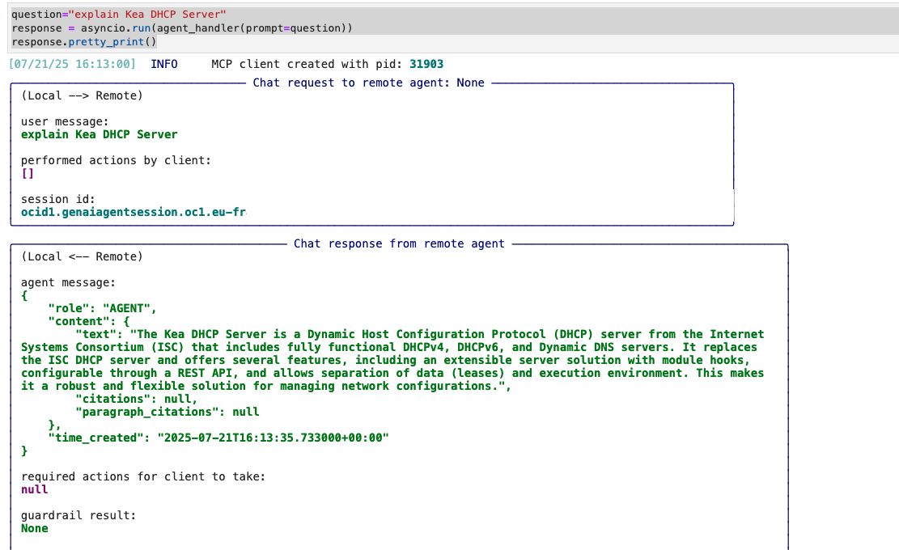
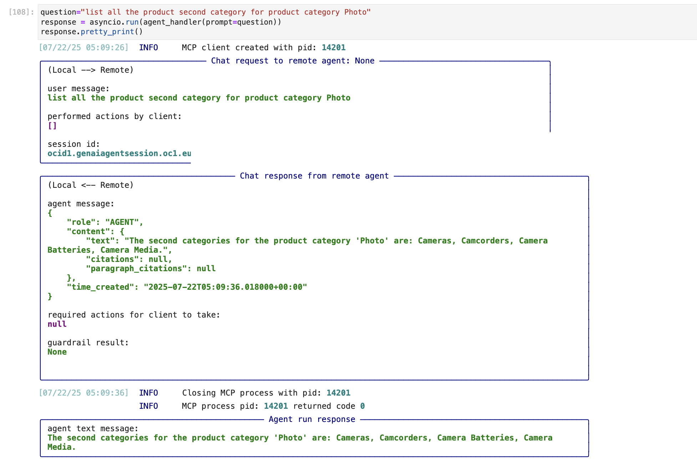
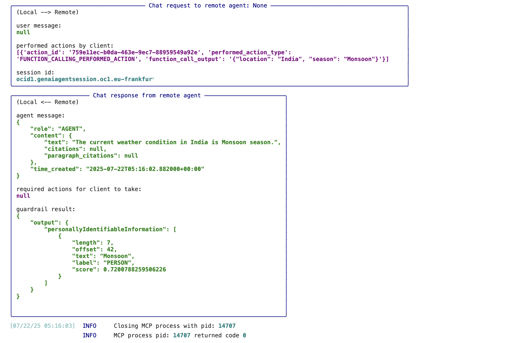
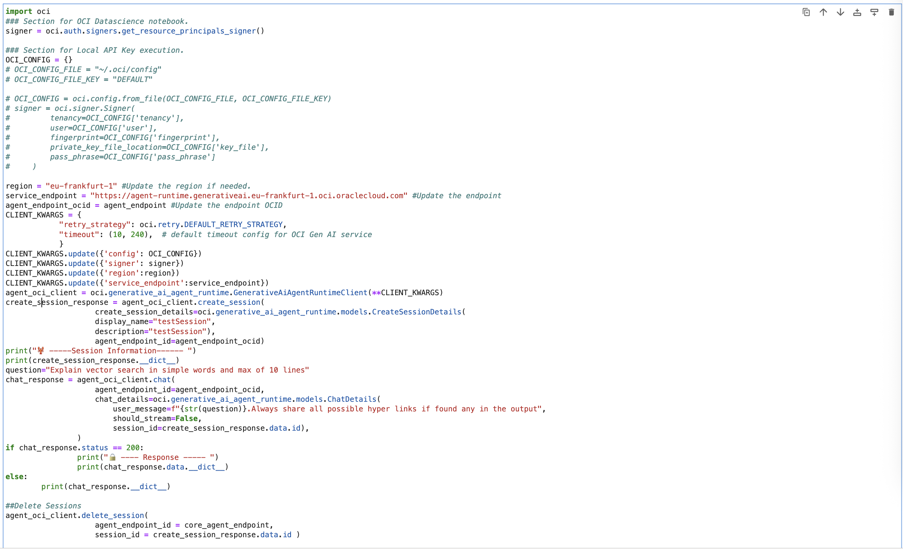
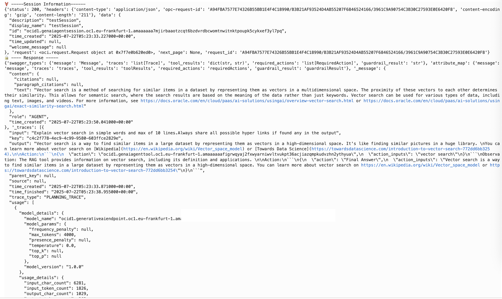

# Run OCI Agent 

## Introduction

This lab will take provide various run modes with the *Agent* we have configured.

## Task 1: Run a query using RAG tool.

1. Run below query to fetch answers from OCI Agent RAG tool based on the knowledge base attached.

    ```
    <copy>
    question="explain Kea DHCP Server"
    response = asyncio.run(agent_handler(prompt=question)) 
    response.pretty_print()
    </copy>
    ```
* The agent will run and share the information based on the RAG too.


    

## Task 2: Validate SQL tool execution.

1. Run below query to fetch information via agent ,which will fetch and report the information from OCI Autonomous Data Base.

    ```
    <copy>
    question="list all the product second category for product category Photo"
    response = asyncio.run(agent_handler(prompt=question))
    response.pretty_print()
    </copy>
    ```
* Here the query about secondary category will translate to product subcategory based on the column description that we defined during SQL Tool setup.

    

## Task 3: Validate function exeuction.

1. Run below to understand how agent reacts based on the function tool we defined.

    ```
    <copy>
    question="What is the weather condition in India"
    response = asyncio.run(agent_handler(prompt=question))
    </copy>
    ```

    

## Task 4 : Sample agent run using OCI SDK.
Here we are using OCI python SDK to run the agent endpoint and fetch results.
1. Use below snippet to fetch results using OCI SDK.You may comment/uncomment the Auth section/Region and endpoint details accordingly.

    ```
    <copy>
    import oci
    ### Section for OCI Data science notebook.
    signer = oci.auth.signers.get_resource_principals_signer()

    ### Section for Local API Key execution.
    OCI_CONFIG = {}
    # OCI_CONFIG_FILE = "~/.oci/config"
    # OCI_CONFIG_FILE_KEY = "DEFAULT"

    # OCI_CONFIG = oci.config.from_file(OCI_CONFIG_FILE, OCI_CONFIG_FILE_KEY)
    # signer = oci.signer.Signer(
    #         tenancy=OCI_CONFIG['tenancy'],
    #         user=OCI_CONFIG['user'],
    #         fingerprint=OCI_CONFIG['fingerprint'],
    #         private_key_file_location=OCI_CONFIG['key_file'],
    #         pass_phrase=OCI_CONFIG['pass_phrase']
    #     )

    region = "eu-frankfurt-1" #Update the region if needed.
    service_endpoint = "https://agent-runtime.generativeai.eu-frankfurt-1.oci.oraclecloud.com" #Update the endpoint 
    agent_endpoint_ocid = agent_endpoint #Update the endpoint OCID
    CLIENT_KWARGS = {
                "retry_strategy": oci.retry.DEFAULT_RETRY_STRATEGY,
                "timeout": (10, 240),  # default timeout config for OCI Gen AI service
                }
    CLIENT_KWARGS.update({'config': OCI_CONFIG})
    CLIENT_KWARGS.update({'signer': signer})
    CLIENT_KWARGS.update({'region':region})
    CLIENT_KWARGS.update({'service_endpoint':service_endpoint})
    agent_oci_client = oci.generative_ai_agent_runtime.GenerativeAiAgentRuntimeClient(**CLIENT_KWARGS)
    create_session_response = agent_oci_client.create_session(
                        create_session_details=oci.generative_ai_agent_runtime.models.CreateSessionDetails(
                        display_name="testSession",
                        description="testSession"),
                        agent_endpoint_id=agent_endpoint_ocid)
    print("🦞 -----Session Information------ ")
    print(create_session_response.__dict__)
    question="Explain vector search in simple words and max of 10 lines"
    chat_response = agent_oci_client.chat(
                        agent_endpoint_id=agent_endpoint_ocid, 
                        chat_details=oci.generative_ai_agent_runtime.models.ChatDetails(
                            user_message=f"{str(question)}.Always share all possible hyper links if found any in the output",
                            should_stream=False,
                            session_id=create_session_response.data.id),
                    )
    if chat_response.status == 200:
                    print("🔒 ---- Response ----- ")
                    print(chat_response.data.__dict__)
    else:
            print(chat_response.__dict__)

    ##Delete Sessions
    agent_oci_client.delete_session(
                        agent_endpoint_id = agent_endpoint_ocid,
                        session_id = create_session_response.data.id )

    </copy>
    ```
    

1. A sample execution result will be as follows.Its for demo purpose only and the same can be achieved using ADK .As you may refer the SDK goes at a lower API level while ADK remains at the upper layer.

    


## Task 5 : Additional samples.
* You may refer [here](https://docs.oracle.com/en-us/iaas/Content/generative-ai-agents/adk/api-reference/examples.htm) for additional samples and can run against the setup.


**Proceed to the next lab.**

## Acknowledgements

* **Author**
    * **Rahul MR**, Prinicipal Solutions Architect - OCI 
* **Contributors**
    * **Sanjeeva Kalva**, Principal Data Scientist - OCI 