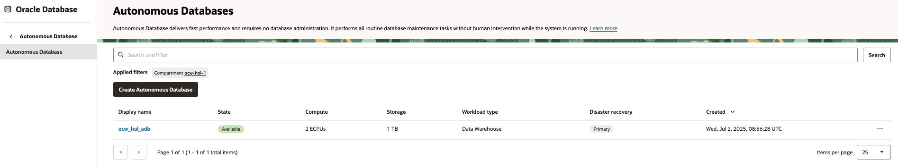

# Setup OCI Infrastructures

## Introduction

This lab will take you through the steps needed to provision Oracle Infrastructure resources such as 

* OCI IAM resources.
* OCI Virtual Cloud Network resources.
* OCI Object Storage bucket. 
* OCI Autonomous Database.

Estimated Time: 30 minutes


## Task 1: Dynamic Group and Policy Definition

This task will help you ensure that the Dynamic Group and Policy are correctly defined.

1. Locate Domains under Identity & Security

    

1. Click on your desired  domain name
1. Click on Dynamic Groups, and then your Dynamic Group name

    
1. Click create dynamic group.Provide a name and a description.Select option Match any rules defined below.

    
1. Add below rules to the dynamic group.

   ```
   <copy>
    all {resource.type='datasciencenotebooksession', resource.compartment.id='OCID of the Compartment'}
    ALL {resource.type='genaiagent',resource.compartment.id='OCID of the Compartment'}
    </copy>
   ```
1. Create the dynamic group.

    


1. Make a note of *dynamic group's OCID* for further usage.

    

## Task 2: Create policies.

The tasks will help you to associate necessary policies with the dynamic group

1. Select policies from section Identity & Security.

    

1. Ensure the compartment selected as the desired one.
1. Click *Create policy*.
1. Provide a name and description.

    

1. Click *Show manual editor* option.
1. Add below policy statements,ensure to update OCI accordingly.

   ```
   <copy>
    allow dynamic-group <OCID of the Dynamic group> to manage genai-agent-family in compartment id <OCID of the compartment>
    allow any-user to manage genai-agent-family in compartment id <OCID of the compartment>  where ALL {request.principal.type = 'datasciencenotebooksession'}
    allow dynamic-group <OCID of the Dynamic group> to read database-tools-family compartment id <OCID of the compartment>
    allow dynamic-group <OCID of the Dynamic group> to read secret-bundle in compartment id <OCID of the compartment>
    allow dynamic-group <OCID of the Dynamic group> to use database-tools-connections in compartment id <OCID of the compartment>
    allow dynamic-group <OCID of the Dynamic group> to use database-family in compartment id <OCID of the compartment>
    allow dynamic-group <OCID of the Dynamic group> to use object-family in compartment id <OCID of the compartment>
    allow dynamic-group <OCID of the Dynamic group> to manage  all-resources  in compartment id <OCID of the compartment> 
   </copy>
   ```
1. Click create and validate.

    

## Task 3: Create virtual cloud network and subnet.

The tasks allows your to create our VCN that we will use for various transactions.

1. From OCI console ,select Network > *Virtual Cloud Networks*

    ![VCN View] (images/vcn_view.png)

1. Click *Actions* > *Start VCN Wizard*.

    

1. Select option *Create VCN with Internet Connectivity*.

    

1. Provide name ,description and use default information and create the VCN.
1. Wait for the vcn state to be *Active*.

    

## Task 4: Create Autonomous Database(ADB).

The task help to create ADB that we will use for Nl2SQL tool usage.

1. From *OCI Console* > *Oracle Database* > *Autonomous Databases*.

    

1. Click create autonomous database.
1. Provide a friendly name for display and table name.

    

1. Select version as *23ai*.Select other default configuration values.

    

1. Provide a complex password for the database.

    

1. As this for lab purpose select the option *Secure access from everywhere*.
1. Provide a contact mail id and click *Create*.
1. It will take several minutes to have the resource in Available status.

    
1. Make a note of Admin password for further usage.

## Task 5: Create a vault.

The task helps to setup the OCI Vault.

1. From OCI console > *Identity & Security* > *Key Management & Secret Management* > *Vault*

    

1. Click *Create vault*.Provide a name and click *Create Vault*.

    

1. Click *Create Master Key*.Provide a name and use default options.Click *Create Key*.

    

1. Wait till the resources are in active state before moving to next section.

## Task 6: Create database connection.

The task allow to create a DB connection for agent usage.

1. From OCI console > *Developer Services* > *Connections*.

    

1. Click *Create connection*.Provide name for the connection.Always ensure you are selected  the desired compartment. 

    

1. Use *Select Database* option.
1. Select option as *Oracle Autonomous Database*.
1. Select the compartment and the database created earlier.

    
1. Click *Create password secret*.
1. Provide name and description.
1. Select the vault and master key created.
1. Use the same password that used during ADB creation.
1. Click *Create*.

    

1. Click *Create wallet content secret*.

    

1. Provide *Name*, *Description*,Select *Vault* and *Key*.
1. Use option *Retrieve regional wallet from Autonomous Database*.

    

1. Click create.Wait for the resource to become active.

    

1. Provide confirmation. Wait for the validation.If there is an error fix accordingly.

    

1. Click *Close*.


## Task 7: Create OCI Object storage.

The task help to create a object storage bucket to store artifacts for RAG usages.

1. From OCI Console > *Object Storage & Archive Storage* > *Buckets*.

    

1. Click *Create bucket*.
1. Provide name and use with default options.

    
1. Make a note of *Name space name* and *Bucket name*.


## Task 8: Create OCI Generative AI agents.

The task help to create a basic agent to which we will add further tools later.

1. From OCI console > *Analytics&AI* > *Generative AI Agents*.

    

1. Click *Agents* > *Create Agent*.Provide basic information and click *Next*.

    

1. Skip the tools page and click *Next*.
1. With in page *Setup agent endpoint* , check option *Automatically create an endpoint for this agent
*.

1. Enable option *Enable human in the loop*.

    

1. Select option *Inform* for all the option of Guardrails.

    

1. Click *Next* and click *Create agent*

    

1. Wait for the agent and endpoint to become active,once completed make a note of the *OCID of the Agent endpoint*.

    


**Proceed to the next lab.**

## Acknowledgements

* **Author**
    * **Rahul MR**, Principal Solutions Architect - OCI 
* **Contributors**
    * **Sanjeeva Kalva**, Principal Data Scientist - OCI 
