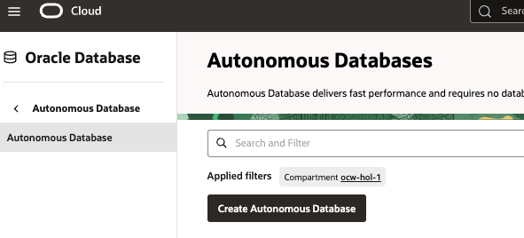
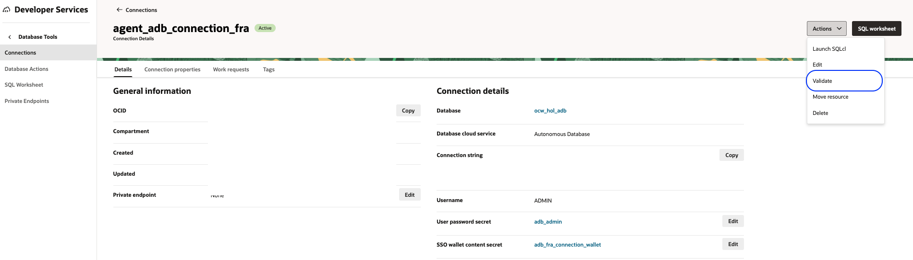

# Setup OCI Infrastructures

## Introduction

This lab will take you through the steps needed to provision Oracle Infrastructure resources such as:

* OCI IAM resources.
* OCI Virtual Cloud Network resources.
* OCI Object Storage bucket. 
* Autonomous AI Database.

Estimated Time: 30 minutes


## Task 1: Dynamic Group and Policy Definition

This task will help you ensure that the Dynamic Group and Policy are correctly defined.

1. Locate Domains under Identity & Security

    

2. Click on your desired domain name.

3. Click on Dynamic Groups, and then your Dynamic Group name.

    

4. Click Create dynamic group. Provide a name and a description. Select the option Match any rules defined below.

    
    
5. Add the below rules to the dynamic group:

   ```
   <copy>
    all {resource.type='datasciencenotebooksession', resource.compartment.id='OCID of the Compartment'}
    ALL {resource.type='genaiagent',resource.compartment.id='OCID of the Compartment'}
    </copy>
   ```

6. Create the dynamic group.

    


7. Make a note of the Dynamic Group's OCID for further usage.

    

## Task 2: Create Policies

This task will help you associate necessary policies with the dynamic group.

1. Select Policies from the Identity & Security section.

    

2. Ensure the selected compartment is the desired one.

3. Click Create Policy.

4. Provide a name and description.

    

5. Click the Show manual editor option.

6. Add the policy statements below, ensuring to update the OCIDs accordingly:

   ```
   <copy>
    allow dynamic-group <OCID of the Dynamic group> to manage genai-agent-family in compartment id <OCID of the compartment>
    allow any-user to manage genai-agent-family in compartment id <OCID of the compartment>  where ALL {request.principal.type = 'datasciencenotebooksession'}
    allow dynamic-group <OCID of the Dynamic group> to read database-tools-family compartment id <OCID of the compartment>
    allow dynamic-group <OCID of the Dynamic group> to read secret-bundle in compartment id <OCID of the compartment>
    allow dynamic-group <OCID of the Dynamic group> to use database-tools-connections in compartment id <OCID of the compartment>
    allow dynamic-group <OCID of the Dynamic group> to use database-family in compartment id <OCID of the compartment>
    allow dynamic-group <OCID of the Dynamic group> to use object-family in compartment id <OCID of the compartment>
    allow dynamic-group <OCID of the Dynamic group> to manage  all-resources  in compartment id <OCID of the compartment> 
   </copy>
   ```

7. Click Create and validate.

    

## Task 3: Create Virtual Cloud Network and Subnet

This task allows you to create the VCN that we will use for various transactions.

1. From OCI Console, select Networking > Virtual Cloud Networks

    ![VCN View] (images/vcn_view.png)

2. Click Actions > Start VCN Wizard.

    

3. Select the option Create VCN with Internet Connectivity.

    

4. Provide a name and description. Use the default information and create the VCN.

5. Wait for the VCN state to become Active.

    

## Task 4: Create Autonomous AI Database (ADB).

This task helps to create an ADB that we will use for NL2SQL tool usage.

1. From OCI Console > Oracle AI Database > Autonomous AI Databases

    

2. Click create Autonomous AI Database.

3. Provide a friendly name for display and a database name.

    

4. Select version 26ai. Select other default configuration values.

    

5. Provide a complex password for the database.

    

6. As this is for lab purposes, select the option Secure access from everywhere.

7. Provide a contact email ID and click Create.

8. It will take several minutes for the resource to reach Available status.

    

9. Make a note of the admin password for further usage.

## Task 5: Create a Vault

This task helps to set up the OCI Vault.

1. From OCI Console > Identity & Security > Key Management & Secret Management > Vault

    

2. Click Create Vault. Provide a name and click Create Vault.

    

3. Click Create Master Key. Provide a name and use the default options. Click Create Key.


    

4. Wait until the resources are in Active state before moving to the next section.

## Task 6: Create Database Connection

This task allows you to create a DB connection for agent usage.

1. From OCI Console > Developer Services > Connections

    

2. Click Create Connection. Provide a name for the connection. Always ensure the desired compartment is selected.

    

3. Use the Select Database option.

4. Select the option Oracle Autonomous AI Database.
   
5. Select the compartment and the database created earlier.

    

6. Click Create password secret.

7. Provide a name and description.

8. Select the vault and master key created earlier.

9. Use the same password that was used during ADB creation.

10. Click Create

    

11. Click Create wallet content secret.

    

12. Provide Name, Description, and select the Vault and Key.

13. Use the option Retrieve regional wallet from Autonomous Database.

    

14. Click Create. Wait for the resource to become active.

    

15. Provide confirmation and wait for the validation. If there is an error, fix it accordingly.

    

16. Click Close.


## Task 7: Create OCI Object Storage

This task helps to create an Object Storage bucket to store artifacts for RAG usage.

1. From OCI Console > Object Storage & Archive Storage > Buckets

    

2. Click Create Bucket.

3. Provide a name and use the default options.

    

4. Make a note of the Namespace name and Bucket name.

## Task 8: Create OCI Generative AI Agents

This task helps to create a basic agent, to which we will add tools later.

1. From OCI Console > Analytics & AI > Generative AI Agents

    

2. Click Agents > Create Agent. Provide basic information and click Next.

    

3. Skip the tools page and click Next.

4. Within the Setup agent endpoint page, check the option Automatically create an endpoint for this agent.

5. Enable the option Enable human in the loop.

    

6. Select the option Inform for all the Guardrail settings.

    

7. Click Next and then Create Agent.

    

8. Wait for the agent and endpoint to become active. Once completed, make a note of the OCID of the Agent Endpoint.

    

**Proceed to the next lab.**

## Acknowledgements

* **Author**
    * **Rahul MR**, Principal Solutions Architect - OCI 
* **Contributors**
    * **Sanjeeva Kalva**, Principal Data Scientist - OCI 
