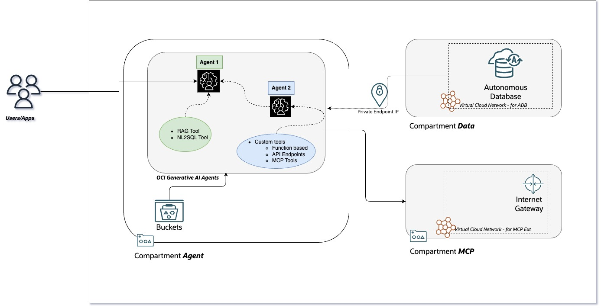

# Introduction

## About this Workshop

This workshop will help to configure,deploy and run a chat powered by OCI Generative AI Agents using OCI Agent Development Kit (`adk`).During the flow the learner will 

- Create and configure OCI Generative AI agents.
- Configure tools such as Retrival Augmented Generation(RAG),Nl2SQL,Custom tools including Model Context Protocol(MCP) based tools.
- Use `adk` for all the above tasks. 

Estimated Workshop Time: 2 hours

### Objectives

Objective of this workshop is to configure ,build ,deploy and run OCI Generative AI Agents using Agent Development Kit (**ADK**).The following services and features will be covered during the lab

* OCI Generatvie AI Agent build and deploy.
* Configure and use inbuild Retrival Augmented Generation (**RAG**)tool.
* Configure and use inbuilt Natural Language 2 to SQL tool (**NL2SQL**).
* Usage of Model Context Protocol(**MCP**) with OCI Generative AI Agent.
* Configure and use Customer tools with OCI Generatvie AI Agents.

### Prerequisites

This lab assumes you have:

* An Oracle Cloud Account (Non Free Tier)
* Access to OCI Generative AI Agents 
* Access to a Region where the Agent service is available.
    * Refer [here for more.](https://docs.oracle.com/en-us/iaas/Content/generative-ai-agents/overview.htm#regions)
* An OCI compartment on which we will allocate all the necessary resources.
* Must have an Administrator Account or Permissions to manage several OCI Services: Generative AI Agents, Autonomous Databases, Data Science, Object Storage, Network, Dynamic Groups, Policies, IDCS/Identity.
* Familiarity with Oracle Cloud Infrastructure (OCI) is helpful

## Learn More

* [What Is Generative AI? How Does It Work?](https://www.oracle.com/artificial-intelligence/generative-ai/what-is-generative-ai/)
* [What Is Retrieval-Augmented Generation (RAG)?](https://www.oracle.com/artificial-intelligence/generative-ai/retrieval-augmented-generation-rag/)
* [Overview of Generative AI Service](https://docs.oracle.com/en-us/iaas/Content/generative-ai/overview.htm)
* [Overview of Digital Assistants and Skills](https://docs.oracle.com/en-us/iaas/digital-assistant/doc/overview-digital-assistants-and-skills.html)
* [Overview of Visual Builder](https://docs.oracle.com/en-us/iaas/visual-builder/doc/oracle-visual-builder.html)
* [Oracle Digital Assistant's large language model integration](https://docs.oracle.com/en/cloud/paas/digital-assistant/use-chatbot/llm-blocks-skills.html)

## Acknowledgements

* **Author**
    * **Rahul MR**, Prinicipal Solutions Architect - OCI 
* **Contributors**
    * **Sanjeeva Kalva**, Principal Data Scientist - OCI 
* **Last Updated By/Date**
    * **TBD**, TBD