# Setup OCI Agent RAG tool

## Introduction

This lab will take you through the steps needed to install setup knowledge ,data source and connect with OCI Agents.The lab covers all the following elements of OCI generative AI agents concepts.

* *RAG Tool* - A RAG tool in Generative AI Agents retrieves information from one or more knowledge bases and aims to respond with relevant and context-aware information in natural language.
* *Knowledge Bases* - A knowledge base is the base for all the data sources that an agent can use to retrieve information for its chat answers. You can create a knowledge base in advance and then add it to an agent's RAG tool.
* *Data source* - A data source points to the source of data. After you add a data source to a knowledge base, you must ingest the data source's data, so agents using the knowledge base can reach that data.* - 

Estimated Time: 30 minutes


## Task 1: Download PDFs for the RAG usage.

1. Run below command for data science notebook,else move to next step for adk running on local machine.

   ```
   <copy>
    !mkdir pdfs
    !wget https://docs.oracle.com/en/database/oracle/sql-developer-command-line/19.2/sqcug/oracle-sqlcl-users-guide.pdf -O pdfs/oracle-sqlcl-users-guide.pdf
    !wget https://docs.oracle.com/en/database/oracle/oracle-database/23/vecse/ai-vector-search-users-guide.pdf -O pdfs/ai-vector-search-users-guide.pdf
    !wget https://docs.oracle.com/en/operating-systems/oracle-linux/10/relnotes10.0/OL10-RELNOTES-10-0.pdf -O pdfs/OL10-RELNOTES-10-0.pdf
    </copy>
    ```

    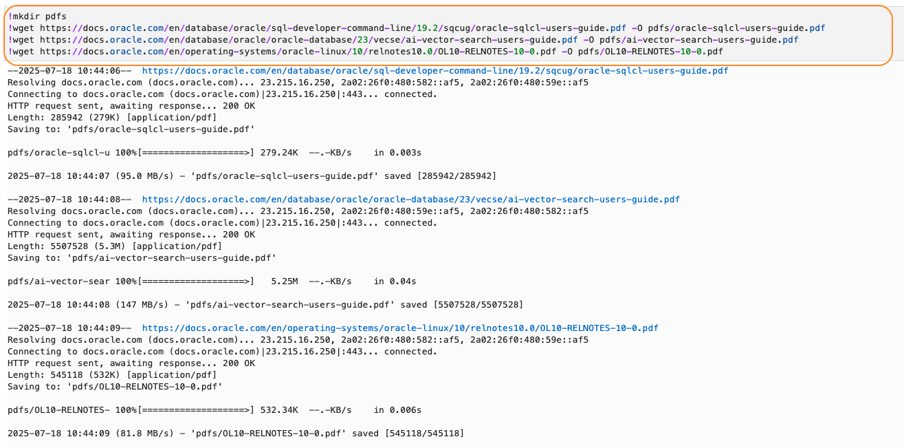

1. Run below for ADK that runs on a local machine.

    ```
    <copy>
    mkdir pdfs
    wget https://docs.oracle.com/en/database/oracle/sql-developer-command-line/19.2/sqcug/oracle-sqlcl-users-guide.pdf -O pdfs/oracle-sqlcl-users-guide.pdf
    wget https://docs.oracle.com/en/database/oracle/oracle-database/23/vecse/ai-vector-search-users-guide.pdf -O pdfs/ai-vector-search-users-guide.pdf
    wget https://docs.oracle.com/en/operating-systems/oracle-linux/10/relnotes10.0/OL10-RELNOTES-10-0.pdf -O pdfs/OL10-RELNOTES-10-0.pdf
    </copy>
    ```

## Task 2: Upload the PDFs to object storage.

1.Run below commands to push PDFs to object storage

*  via OCI datascience notebook.

    ```
    <copy>

    !oci os object bulk-upload --src-dir pdfs  -bn "<Name of the Bucket>" -ns "<Namespace Name>" --auth "resource_principal" --prefix "oracle_pdfs/"
    
    </copy>
    ```
    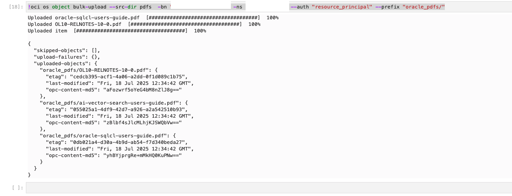

* via Locally installed OCI CLI. 


    ```
    <copy>
    !oci os object bulk-upload --src-dir pdfs  -bn "<Name of the Bucket>" -ns "<Namespace Name>"  --prefix "oracle_pdfs/"
    
    </copy>
    ```
* You can  download and upload the files mannaully too.

1. Validate the files via object storage bucket.

    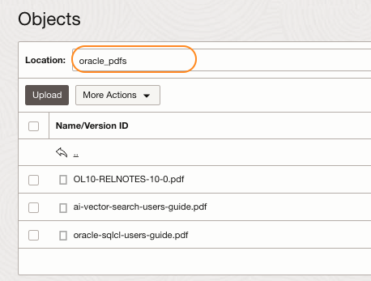

## Task 2: Create OCI AI Agents knowledge base.

1. Open OCI console > `Analytics & AI` > `Generatvie AI Agents`

    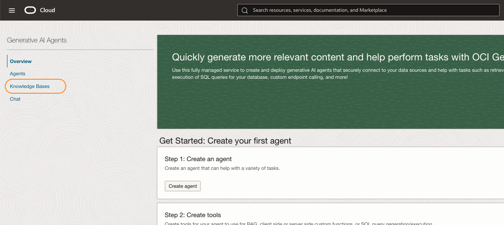

1. Click `Knowledge Bases` > `Create knowledge base`.


    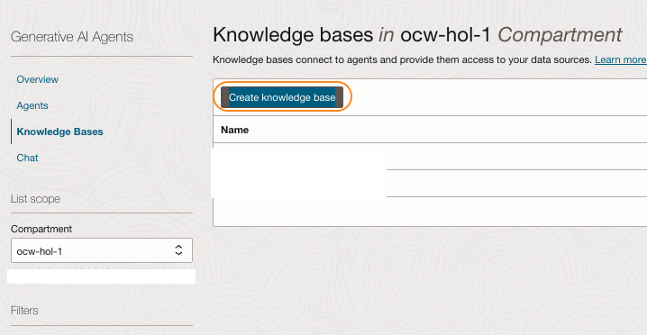

1. Provide a `name` and `description`.
1. Select the compartment accordingly.
1. Select `Data store type` as `Object storage`.
1. Click option `Enable hybrid search`.

    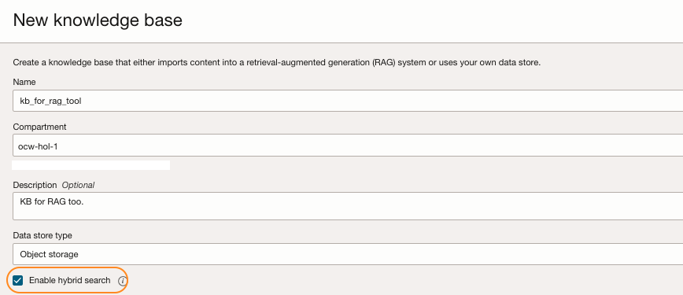


1. Click `Specify data source`.

    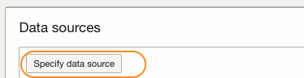

1. Provide `Name`,`Description`,and select option `Enable multi-model parsing`.

    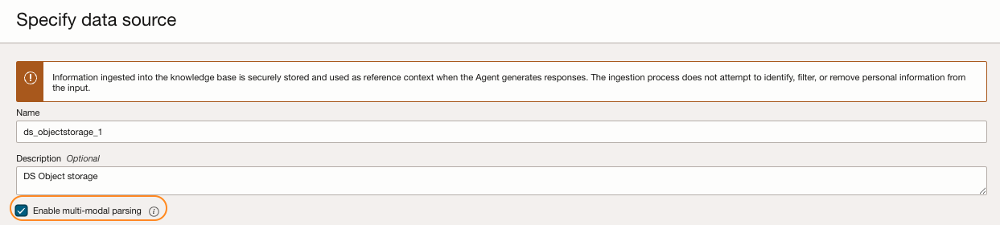

1. Select the bucket and select all the files that we have uploaded.

1. Click `Create`.

    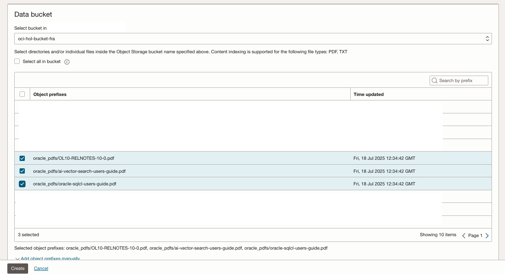
1. It will take back the previous screen,ensure the option `Automatically start ingestion job for above data sources` selected.
1. Click `Create`.

    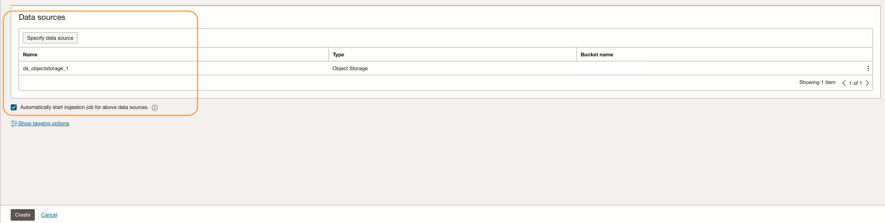

1. The status of the KB will be in `Creating`.

    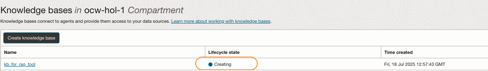

1. Once its become active ,make a note of the OCID for further steps.

    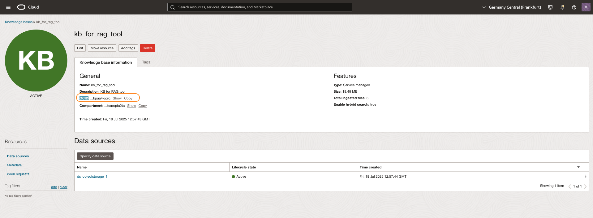

1. We will associate the KB with agents later.


**Proceed to the next lab.**

## Acknowledgements

* **Author**
    * **Rahul MR**, Prinicipal Solutions Architect - OCI 
* **Contributors**
    * **Sanjeeva Kalva**, Principal Data Scientist - OCI 


