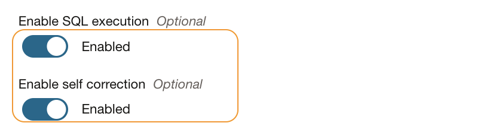
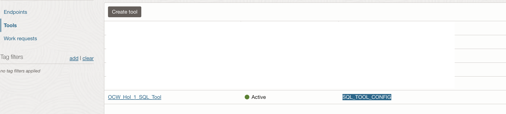

# Setup OCI Agent RAG tool

## Introduction

This lab will take you through the steps needed to setup a OCI Generative AI Agents SQL tool via console.Some of the key aspects that we cover as follows 

* *SQL Tool* - A SQL tool in Generative AI Agents converts natural language queries into Oracle SQL and SQLite statements and can run the SQL commands to generate responses against a connected database.

* *Databases* - The SQL tool in Generative AI Agents supports Oracle Database (Base Database and Autonomous Database).

* *Database Schema* - A valid database schema must be provided when you add a SQL tool to an agent in Generative AI Agents. SQL tool creation fails at the validation step if the schema is invalid.

* *Model Customization* - When creating a SQL tool, you can select between using a small or large model.
A small model provides faster response times. You'd select a small mode for simple queries such as "Get total sales for January 2025."
A large model provides more accuracy but at the cost of higher latency. You'd select a large model for more complex queries such as "Show the average sales of the top 5 performing products in Q1 2023 grouped by region."

Estimated Time: 30 minutes


## Task 1: Configure SQL tool.

We will be using the *Database connection* created during the initial step to proceed further.

1. Using OCI console > `Analytics & AI` > `Generative AI Agents`

    
1. Click on the name of the desired agent.

    

1. Click `Tools` > `Create tool`.

    

1. Select option `SQL`

    
1. Provide a name for the tool.
1. Provide description as `Tools for product related queries`.

    

1. Select `Inline` for schema and provide below informatin.We will be using some of the default tables availale with our database.

    ```
    <copy>
    create table "sh.products"(
    "PROD_ID" NUMBER(6),      
    "PROD_NAME" VARCHAR2(50),
    "PROD_DESC"  VARCHAR2(4000) , 
    "PROD_SUBCATEGORY" VARCHAR2(50) ,   
    "PROD_SUBCATEGORY_ID" NUMBER ,         
    "PROD_SUBCATEGORY_DESC" VARCHAR2(2000) , 
    "PROD_CATEGORY" VARCHAR2(50) ,   
    "PROD_CATEGORY_ID" NUMBER ,         
    "PROD_CATEGORY_DESC" VARCHAR2(2000), 
    "PROD_WEIGHT_CLASS" NUMBER(3),      
    "PROD_UNIT_OF_MEASURE" VARCHAR2(20),   
    "PROD_PACK_SIZE" VARCHAR2(30) ,   
    "SUPPLIER_ID" NUMBER(6) ,      
    "PROD_STATUS" VARCHAR2(20) ,   
    "PROD_LIST_PRICE" NUMBER(8,2) ,    
    "PROD_MIN_PRICE" NUMBER(8,2) ,    
    "PROD_TOTAL" VARCHAR2(13) ,   
    "PROD_TOTAL_ID" NUMBER,         
    "PROD_SRC_ID" NUMBER,         
    "PROD_EFF_FROM" DATE,           
    "PROD_EFF_TO" DATE,           
    "PROD_VALID" VARCHAR2(1)    
    );
    </copy>
    ```

    

1. Select `Inline` for choice `In-context learning examples`.
1. Provide below sample learning examples.

    ```
    <copy>
    Question: What is the product category for product Y Box.
    Oracle SQL: SELECT PROD_CATEGORY FROM sh.products WHERE PROD_NAME = 'Y Box'     
    </copy>
    ```
    
1. Select `Inline` for option `Description of tables and columns`.
1. Copy below and update.

    ```
    <copy>
    Description of the important tables in the schema:

    sh.products         All about products
    sh.sales       Details about sales

    Description of the important columns of the tables in the schema:

    sh.products table

    sh.products.PROD_ID A unique code assigned to each product
    sh.products.PROD_SUBCATEGORY Product's secondary categories
    ---------------------------------------------------------------------
    sh.sales table

    sh.sales.CUST_ID ID for customer associated to each sales record
    </copy>
    ```

    

1. Select `Small (faster response)` for option `Model customization`
1. Select ` Oracle SQL` for option `Dialect`.

    
1. Select the database connection created earlier,if necessary change the compartment name.
1. Click `Test connection` and validate the connection.

    
1. Enable SQL execution option.
1. Enable self correction option.

    

1. Provide below custom instructions.

    ```
    <copy>
    Always try all the possible cases with in a query before returning the answer
    Always use aggregators such as COUNT, SUM, AVG, MIN, and MAX in Oracle SQL queries that contain GROUP BY.
    </copy>
    ```

    

1. Click create.
1. Wait for the tool to be `Active`.It may take few minutes.

    


**Proceed to the next lab.**

## Acknowledgements

* **Author**
    * **Rahul MR**, Prinicipal Solutions Architect - OCI 
* **Contributors**
    * **Sanjeeva Kalva**, Principal Data Scientist - OCI 