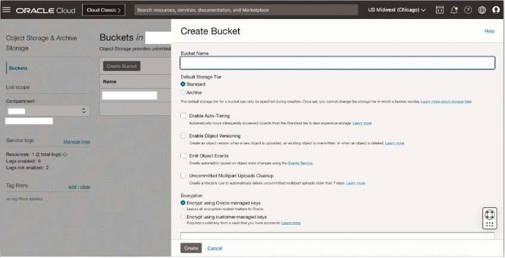
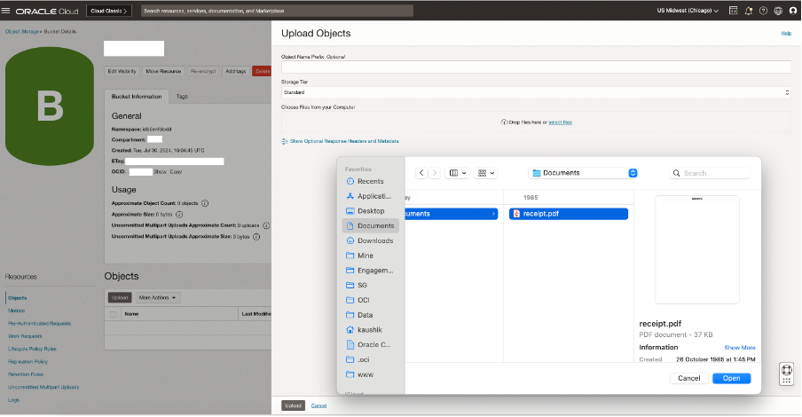
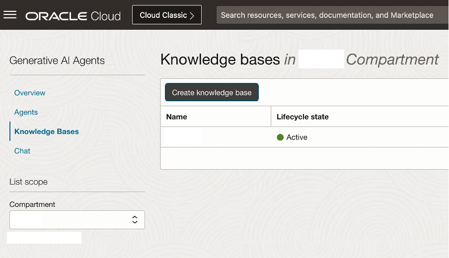
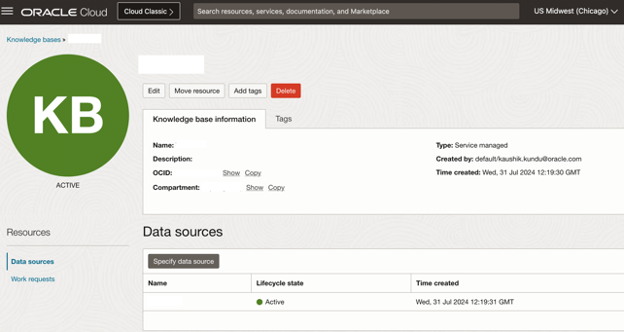
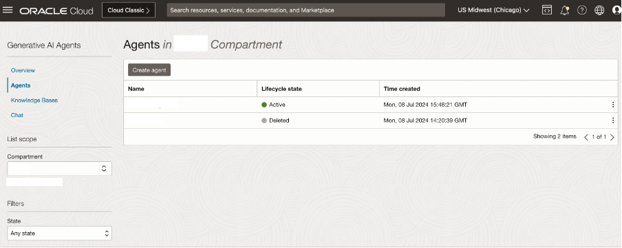

# Provision Generative AI Agents Service

## Introduction

This lab walks you through the steps to setup an OCI Generative AI Agent including ingesting a knowledge base from OCI Object Storage

Estimated Time: -- minutes

### About Generative AI Agents

OCI Generative AI Agents is a fully managed service that combines the power of large language models (LLMs) with an intelligent retrieval system to create contextually relevant answers by searching your knowledge base, making your AI applications smart and efficient.

OCI Generative AI Agents supports several ways to onboard your data and then allows you and your customers to interact with your data using a chat interface or API. OCI Object Storage Service enables you to create Buckets. Once the Buckets are created, you can then upload your unstructured PDF manuals / documents in those buckets.

### Objectives

In this lab, you will:

* Create Object Storage Bucket and upload files
* Create OCI Gen AI RAG Agent
* (optional) test agent in console
* (optional) update Agent's Knowledge Base

### Prerequisites (Optional)

<!--*List the prerequisites for this lab using the format below. Fill in whatever knowledge, accounts, etc. is needed to complete the lab. Do NOT list each previous lab as a prerequisite.*-->

This lab assumes you have:

* All previous labs successfully completed

## Task 1: Provision Oracle Object Storage Bucket

This task will help you to create Oracle Object Storage Bucket under your chosen compartment.

1. Locate Buckets under Object Storage & Archive Storage

    

2. Provide the information for **Compartment** and **Bucket Name**. Click Create.
    The Object Storage Bucket will be created 

    

## Task 2: Upload custom PDF document in the Object Storage Bucket

1. Click on the Bucket name, then Objects -> Upload button

    Click on “select files” link to select files from your machine. This step can be repeated to select multiple files to upload to the bucket.

    **Note:** The Gen AI Agents service currently supports .pdf and .txt file formats

    

2. Click Upload -> Close to upload the PDF file in the Object Storage Bucket.

    

## Task 3: Provision Knowledge Base

This task will help you to create Oracle Generative AI Agent’s Knowledge Base under your chosen compartment.

1. Locate Generative AI Agents (new Beta) under AI Services

    

2. Locate Knowledge Bases in the left panel, select the correct Compartment.

    Then click on “Create knowledge base” button

    

3. Specify the name of the knowledge base, ensure that you have selected the correct compartment.

    Select “Object storage” in the “Select data source” dropdown, and then click on the “Specify data source” button

    1[knowledge base creation wizard](images/kb_wizard.png)

4. Specify the name of the data source and Description (Optional)

    Select the bucket that you have created in the previous lab, and for Object prefix choose “Select all in bucket”

    Click the “Create” button

    

5. Click the “Create” button to create the knowledge base

    

6. In few minutes the status of recently created Knowledge Base will change from Creating to Active

    

## Task 4: Provision Agent

This task will help you to create Oracle Generative AI Agent under your chosen compartment.

1. Locate Agents in the left panel, select the correct Compartment.

    Then click on “Create agent” button

    

2. Specify the agent name, ensure the correct compartment is selected and indicate a suitable welcome message

    Select the Knowledge Base that you created in the previous task

    Click the “Create” button.

    

3. In few minutes the status of recently created Agent will change from Creating to Active

    Click on “Launch chat” button

    

4. It’ll open up the Chat Playground, where you can ask questions in natural language, and get the responses from your PDF documents

    

## Task 5: Update Agent's Knowledge Base (optional)

You may want to update your agent's knowledge base for a variety of reasons in the future. This optional tasks walks through how to do this.

1. Add/Update/Remove files from Object Storage

2. Run Ingestion Job

    **Note:** Data ingestion Jobs perform incremental ingestions from 2nd run onwards
<!-- TODO -->

## Learn More

*(optional - include links to docs, white papers, blogs, etc)*

* [URL text 1](http://docs.oracle.com)
* [URL text 2](http://docs.oracle.com)

## Acknowledgements
* **Author**
* **Kaushik Kundu**, Master Principal Cloud Architect, NACIE
* **JB Anderson**, Senior Cloud Engineer, NACIE
* **Contributors** -  <Name, Group> -- optional
* **Abhinav Jain**, Senior Cloud Engineer, NACIE
* **Last Updated By/Date** - <Name, Month Year>