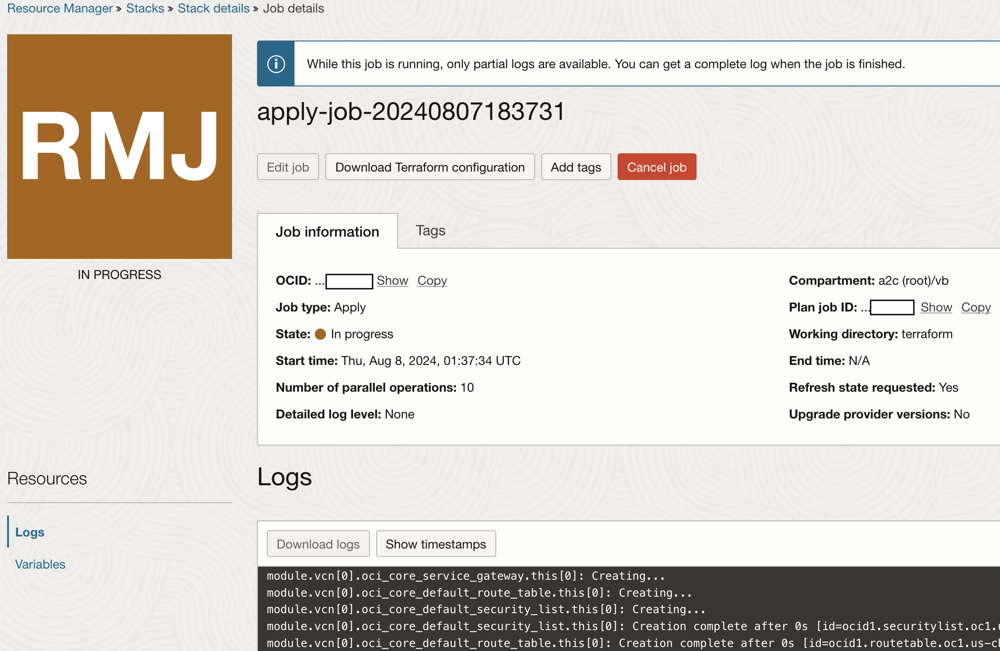
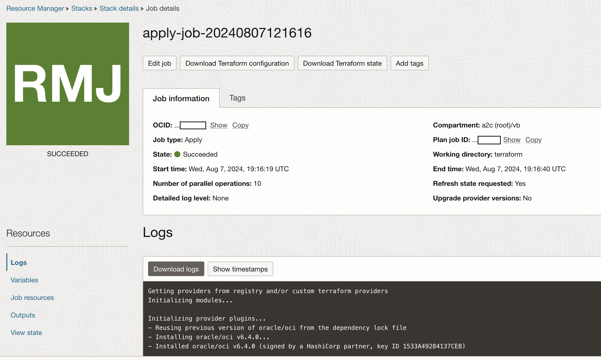
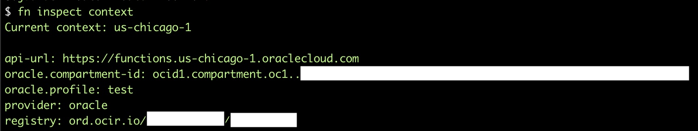

# (optional) Explore Functions in depth

## Introduction

This lab will walk you through how to deploy a test and dev environment for your functions as well as promoting a version to production.

Estimated Time: 1 hour <!-- TODO update-->

### Objectives

In this lab, you will:

* Create a Dev Cloud environment via Terraform
* Install and Configure the FN CLI
* Test a function locally
* Deploy the Function to Dev
* Deploy the Function to Prod

### Prerequisites (Optional)

This lab assumes you have:

* All previous labs successfully completed

## Task 1: Create Resource Manager Stack

This task is mostly the same as when we deployed the Stack in lab 2. The only required variable change is to change the **Function Deployment Method**. Using a different **prefix** is recommended. You can reuse IAM and Networking resources if you deploy these stacks in the same compartment.

1. Start Create Stack Workflow via the button below

    <!-- https://docs.oracle.com/en-us/iaas/Content/ResourceManager/Tasks/deploybutton.htm
    TODO: update package url when available
    -->
    [](https://cloud.oracle.com/resourcemanager/stacks/create?zipUrl=https://objectstorage.us-chicago-1.oraclecloud.com/p/kV1zhJYS_PWDJPYHXYpO0UXv1ay0dDZuDIhDzMAYrJehFaLLeoxdugihZjuzSHPe/n/idb6enfdcxbl/b/generative-ai-agent-oda/o/genai-agent-oda-teraform-8-12-24.zip)

    Clicking this button will direct you to log in to your tenancy and then to Resource Manager's **Create Stack** page

2. Fill out **Stack Information**

    
    * Ensure you are creating your stack in the correct region.
    * Accept the Terms of Use.

    
    * Ensure you have selected the compartment you want the stack to live in.
    * Optionally, update the name and description of the stack.
    * Click Next

3. General Configuration

    

    * Optionally, You can select another compartment to deploy your resources in
    * Customize the prefix used to name resources
        * It is required to use a different **prefix** from your first stack to avoid name collisions in a single compartment
    * Setting up IAM will enable a policy that allows all ODA instances to talk to functions and all functions to talk to the genai agent service in this compartment.
        * These are required to be deployed in your home region
    * Setting up Functions will deploy a function application enabled with logging and tracing on top of a Network

4. GenAI Agent Configuration

    

    * Supply the Regional url for the GenAI Agent Endpoint. Chicago's is provided by default
    * Provide the OCID for the Agent's Endpoint that was created in lab 1 <!-- should we have this be it's own task or ask reader to write down this value when resource is created in lab 1>

5. Functions Configuration

    

    * Change the **Function Deployment Method** to **fn_cli**
    * Optionally you can increase log retention

6. VCN

    You have the choice of creating a new vcn or choosing an existing one.

    

    * If you are creating a vcn, You can customize the cidr block ranges

    

    * You can also choosing an existing vcn and subnet

    <!--TODO: validate what the networking requirements are. Currently provide a SGW and very minimal traffic rules. Not sure we even need that. How many ip addresses does a function application require?-->

    Click Next

7. Review and Create

    

    On this page, you can review your stack information and variable configuration.

    When you are done, click **Create** or **Save Changes** to finish the stack creation wizard.

    You can select **Run Apply** and skip Tasks 2, but it is recommended you perform these tasks separately so you can review the Terraform plan before applying.

## Task 2: Run Terraform stack

1. Click on the **Plan** button

    

    This will bring up a window on the right side. Click **Plan** again to initiate the job.

2. Review completed plan

    

    The plan job may take a couple minutes to complete. After it is completed, you can search through the logs to see the resources that will be created/updated/deleted as well as their configuration parameters.

3. Click on the **Apply** button

    
    * This will bring up a window on the right side.
    * In the **Apply job plan resolution** dropdown menu, select the Plan job you just reviewed
    * Click **Apply** again to initiate the job


4. Wait for the job to be completed

    

    The deployment of the infrastructure may take 10-20 minutes.

    

## Task 3: Set up your local host dev environment

Complete section C of the [localhost functions quickstart guide](https://docs.oracle.com/en-us/iaas/Content/Functions/Tasks/functionsquickstartlocalhost.htm#functionsquickstartlocalhost_topic_start_setting_up_local_dev_environment)

The rest of the the instructions in this task expand upon the directions provided in the quickstart guide.

1. Install and Start Docker

    Alternatively you can install Rancher Desktop or any other docker client and server software compatible with the docker cli.

2. Use the OCI CLI to create an auth profile instead of using an API key

    * If necessary, install the [OCI CLI](https://docs.oracle.com/en-us/iaas/Content/API/SDKDocs/cliinstall.htm)
    * run `oci session authenticate`
    * select the region to deploy the functions into.
    * Log into your tenancy in the browser popup window
    * Create a unique name for your profile

3. Install Fn Project CLI and configure context

    continue following the quickstart guide for steps 3, 4, and 5
    <!-- TODO what to do with registry creation. Could be in TF. Can also use create repo on push global setting. Is this on in tenancies by default?-->

4. Check Fn context setup

    

    use `fn inspect context` to display the current context details

    

    use `fn list context` to list all contexts on your machine

    use `fn use context <context name>` to switch contexts


5. Generate an Auth Token and Log into the Registry

    If your account is in a non-default domain, you will have to use the domain name in the login username

    `docker login -u '<tenancy-namespace>/<domain-name>/<user-name>' <region-key>.ocir.io`

    <!-- TODO Sometimes the auth token doesn't copy/paste correctly for me. I have to copy to an intermediate text file, then copy/paste again-->

## task 4: Setup Local Environment

1. Download and unzip Function code
    [genai-agent-function](https://objectstorage.us-chicago-1.oraclecloud.com/p/lITopjMfdLTOKL9IQz8Ej6oP4TwQsp8G_n7IYRvEep1HSxHoyEwyqCqnWBnkgc3C/n/idb6enfdcxbl/b/generative-ai-agent-oda/o/genai-agent-function-8-12-24.zip)

2. In a terminal, navigate to the recently unzipped folder


3. (optional) Create a Python Virtual Environment
    It is recommended that you create virtual environments for different python projects. There are multiple tools to manage these environments including venv, conda, pyenv, and virtualenv.

4. Install requirements
    Navigate to the function code folder, activate your virtual environment, and run `pip install -r requirements.txt`

    <!-- TODO: deal with getting python modules from artifactory or host the whl file as another artifact-->

## task 5: Test function locally

1. Setup local environment variables

    ```zsh
    export PROFILE_NAME=<profile name> #name of the profile created in task 3, step 2
    export ENDPOINT_URL=https://agent-runtime.generativeai.us-chicago-1.oci.oraclecloud.com #update for your region
    export ENDPOINT_ID=ocid1.genaiagentendpoint.oc1.us-chicago-1.**** #update for your endpoint
    export KEEP_ALIVE_SESSION=False
    ```

    **NOTE** most of these values are also set in the function application configuration. These are the default values used if the parameters are not passed in the request body


2. create a local listener for your function
    run this command in one terminal in the function's folder
    `env FDK_DEBUG=1 FN_FORMAT=http-stream FN_LISTENER=unix://tmp/func.sock fdk func.py  handler`
    keep this terminal open. When requests come in, the logs will be displayed in this window

    

3. Send a local http request
    Run this command in another terminal
    `curl -v --unix-socket /tmp/func.sock -H "Fn-Call-Id: 0000000000000000" -H "Fn-Deadline: 2030-01-01T00:00:00.000Z" -XPOST http://function/call -d '{"user_message":"Which account is associated with bill number 28676209?"}'`
    * you can update the user message to fit your knowledge base and agent
    * Any of these parameters can be used in the request body: endpoint_url, endpoint_id, delete_session, user_message, session_id, and keep_alive_session

     <!-- TODO update image with better response-->

<!-- TODO: add task for running pytest testbench-->

## task 6: Deploy the Function to Dev

1. update app.yaml file

    run `fn list apps` to see a list of your apps available in the current context

    update the name to match the name of the funtion application deployed by the terraform

2. Deploy function using fn cli

    `fn deploy --app <app name> --verbose`

    <!-- TODO: deal with getting python modules from artifactory-->

    <!-- TODO: might need to leave vpn to get base docker images-->

3. Invoke function in Cloud Dev environment

    `echo -n '{"user_message":"Which account is associated with bill number 28676209?"}' | fn invoke <app name> genai-agent --content-type application/json`
    * You can customize this request body just like in the local test

    **Note** Requests may take significantly longer than your production environment as provisioned concurrency is not on

## task 7: Deploy the Function to Prod

1. Update Prod Resource Manager Stack variables

    From stack details page, edit -> edit stack -> next:

    For the functions variables,
    * you can either copy the full image url from the function details page
    * or provide the local image details

    
    <!--TODO: Can we let user provide an easier value than OCIR OCID? -->

    click next -> save changes

2. Run a new Plan and Apply Job

    The Function should be the only resource requiring changes. It should update it's image and digest.

3. Invoke function in Cloud Prod environment

    Use a similar command as in the dev environment, but update the app and function name to the prod function application
    `echo -n '{"user_message":"Which account is associated with bill number 28676209?"}' | fn invoke <app name> genai-agent-func --content-type application/json`

    <!-- TODO should we update the dev and prod function names to match currently dev is 'genai-agent' and prod is 'genai-agent-func'-->


<!-- X. Explore Logs and Traces (optional) TODO: create-->

## Learn More

*(optional - include links to docs, white papers, blogs, etc)*

* [URL text 1](http://docs.oracle.com)
* [URL text 2](http://docs.oracle.com)

## Acknowledgements

* **Author**
    * **Kaushik Kundu**, Master Principal Cloud Architect, NACIE
    * **JB Anderson**, Senior Cloud Engineer, NACIE
* **Contributors**
    * **Abhinav Jain**, Senior Cloud Engineer, NACIE
* **Last Updated By/Date**
    * **JB Anderson**, Senior Cloud Engineer, NACIE, August 2024