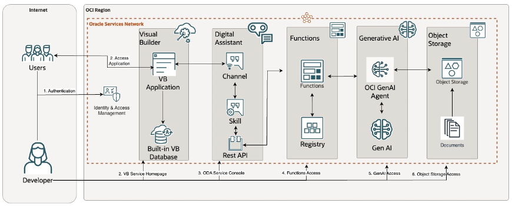

# Introduction

## About this Workshop

This workshop will help to configure Generative AI powered chatbot (ATOM) on your own OCI tenancy. 
This workshop enables developers to perform GenAI RAG on custom PDF documents (stored in OCI Object Storage) using the OCI Generative AI Agent Service.
The users can then

- Connect to OCI Generative AI Agent Service from OCI Digital Assistant Chatbot (hosted in OCI Visual Builder ATOM Application)
- Get responses of their question (in natural language) from those custom PDF documents.
By following the workshop users can install this ATOM application in their own tenancy

Estimated Workshop Time: 3 hours -- minutes
<!-- (This estimate is for the entire workshop - it is the sum of the estimates provided for each of the labs included in the workshop.)
TODO update estimate
-->

### Objectives

Objective of this workshop is to set-up the required OCI services to create a full Generative AI Agent solution with RAG capabilities:

* OCI Object Storage Service – Users can configure OCI Object Storage and create Buckets.
Users can then upload their own unstructured PDF manuals / documents in those buckets.
* OCI Generative AI Agent Service – Users can configure OCI Generative AI Agent Service (create and configure Knowledge Bases and Agents).
Users can then ingest and perform RAG on the user’s documents in OCI Object Storage, using OCI Generative AI Agent Service.
* OCI Functions – Users can configure OCI Functions, using the provided automation scripts.
Users can then connect to OCI Generative AI Agent Service using OCI Functions. The OCI Functions can be exposed as a Rest Service
* OCI Digital Assistant (ODA) – Users can create ODA instance and import the provided ODA Skill.
Users can then connect from ODA chatbot to OCI Generative AI Agent Service, leveraging OCI Functions Rest Service.
* OCI Visual Builder (VB) ATOM Application – User can create OCI Visual Builder (VB) instance and import ATOM VB web application.
Users can then embed the ODA chatbot in ATOM application. Then the users can get responses from their PDF manuals / documents, using the ATOM application.

In this workshop, you will learn how to:

* Create Object Storage Buckets, and upload custom PDF documents in those buckets
* Setup & configure Generative AI Agent Service (Knowledge Bases and Agents)
* Setup & configure Functions to connect to Generative AI Agent Service
* Setup & configure ODA as an LLM powered chatbot
* Setup & configure Visual Builder as a frontend channel for ODA
* Test out the features and capabilities of this ATOM application

### Prerequisites

This lab assumes you have:

* An Oracle Cloud Account
* Enrolled in Beta fo OCI Generative AI Agents for RAG - https://apexadb.oracle.com/ords/f?p=108:501:508002131060566::::P501_SELF_NOMINATION:Self-Nomination
* Access to a Region where the Agent service is available: Chicago, Frankfurt
* Must have an Administrator Account or Permissions to manage several OCI Services: Generative AI Agents, Digital Assistant, Visual Builder, Object Storage, Functions, Dynamic Groups, Policies, IDCS/Identity Domain Confidential Applications, Resource Manager
* Familiarity with Oracle Cloud Infrastructure (OCI) is helpful

## Learn More

* [What Is Generative AI? How Does It Work?](https://www.oracle.com/artificial-intelligence/generative-ai/what-is-generative-ai/)
* [What Is Retrieval-Augmented Generation (RAG)?](https://www.oracle.com/artificial-intelligence/generative-ai/retrieval-augmented-generation-rag/)
* [Overview of Generative AI Service](https://docs.oracle.com/en-us/iaas/Content/generative-ai/overview.htm)
*	[Overview of Digital Assistants and Skills](https://docs.oracle.com/en-us/iaas/digital-assistant/doc/overview-digital-assistants-and-skills.html)
*	[Overview of Visual Builder](https://docs.oracle.com/en-us/iaas/visual-builder/doc/oracle-visual-builder.html)
*	[Oracle Digital Assistant's large language model integration](https://docs.oracle.com/en/cloud/paas/digital-assistant/use-chatbot/llm-blocks-skills.html)

## Acknowledgements

* **Author**
* **Kaushik Kundu**, Master Principal Cloud Architect, NACIE
* **JB Anderson**, Senior Cloud Engineer, NACIE
* **Contributors** -  <Name, Group> -- optional
* **Abhinav Jain**, Senior Cloud Engineer, NACIE
* **Last Updated By/Date** - <Name, Month Year>
