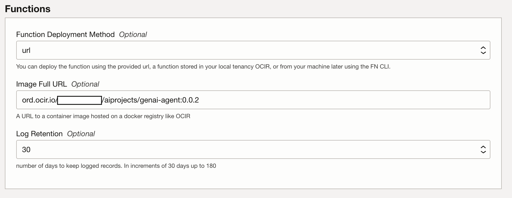
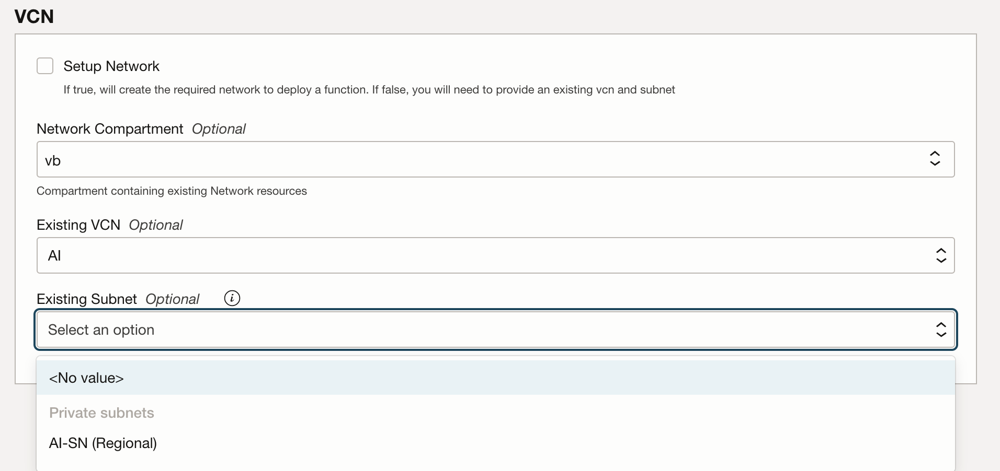

# Provision Infrastructure via Terraform

## Introduction

This lab helps you deploy the required OCI Infrastructure and Services via a Resource Manager stack for Terraform

Estimated Time: 30 minutes

### Objectives

In this lab, you will:

* Create OCI Functions on an existing or new network
* Create Dynamic Groups and Policies for Functions and ODA services

### Prerequisites (Optional)

*List the prerequisites for this lab using the format below. Fill in whatever knowledge, accounts, etc. is needed to complete the lab. Do NOT list each previous lab as a prerequisite.*

This lab assumes you have:
* All previous labs successfully completed

## Task 1: Create Resource Manager Stack

1. Start Create Stack Workflow via the button below

    <!-- https://docs.oracle.com/en-us/iaas/Content/ResourceManager/Tasks/deploybutton.htm
    TODO: update package url when available
    use current OS PAR format. New format throws an error
    -->
    

    Clicking this button will direct you to log in to your tenancy and then to Resource Manager's **Create Stack** page

2. Fill out **Stack Information**

    
    * Ensure you are creating your stack in the correct region.
    * Accept the Terms of Use.

    
    * Ensure you have selected the compartment you want the stack to live in.
    * Optionally, update the name and description of the stack.
    * Click Next

3. General Configuration

    

    * Optionally, You can select another compartment to deploy your resources in
    * Optionally, You can customize the prefix used to name resources
    * Setting up IAM will enable a policy that allows all ODA instances to talk to functions and all functions to talk to the genai agent service in this compartment.
        * These are required to be deployed in your home region
    * Setting up Functions will deploy a function application enabled with logging and tracing on top of a Network

4. GenAI Agent Configuration

    

    * Supply the Regional url for the GenAI Agent Endpoint. Chicago's is provided by default
    * Provide the OCID for the Agent's Endpoint that was created in lab 1
    <!-- TODO: link to lab task where this is shown-->

5. Functions Configuration

    

    * Leave the **Function Deployment Method** and **Image Full URL** as is
    * Optionally you can increase log retention

6. VCN

    You have the choice of creating a new vcn or choosing an existing one.

    

    * If you are creating a vcn, You can customize the cidr block ranges

    

    * You can also choosing an existing vcn and subnet

    <!--TODO: validate what the networking requirements are. Currently provide a SGW and very minimal traffic rules. Not sure we even need that. How many ip addresses does a function application require?-->

    Click Next

7. Review and Create

    

    On this page, you can review your stack information and variable configuration.

    When you are done, click **Create** or **Save Changes** to finish the stack creation wizard.

    You can select **Run Apply** and skip Task 2, but it is recommended you perform this separately so you can review the Terraform plan before applying.

## Task 2: Run Terraform stack

1. Click on the **Plan** button

    

    This will bring up a window on the right side. Click **Plan** again to initiate the job.

2. Review completed plan

    

    The plan job may take a couple minutes to complete. After it is completed, you can search through the logs to see the resources that will be created/updated/deleted as well as their configuration parameters.

    

    **NOTE** You can navigate back from a job details page by clicking the **Stack details** breadcrumb in the top left
    <!-- TODO: consider scaling down this image https://oracle-livelabs.github.io/common/sample-livelabs-templates/create-labs/labs/workshops/livelabs/?lab=4-labs-markdown-develop-content#Task8:Scaleanimage-->

3. Click on the **Apply** button

    
    * This will bring up a window on the right side.
    * In the **Apply job plan resolution** dropdown menu, select the Plan job you just reviewed
    * Click **Apply** again to initiate the job

4. Wait for the job to be completed

    

    The deployment of the infrastructure may take 10-20 minutes.

    

## Task 3: Inspect Created Resources

1. Find Function Invoke Endpoint

    In the latest Apply Job's View menu in the lower left, select **Outputs**

    

    Note down the **function_invoke_endpoint** url. You will need it when configuring ODA

2. List all created resources (optional)

    On the **Stack Details** page, Click on the **Stack Resources** view in the lower left

    

    * This page lists all of the resources managed by this stack as well as their attributes.
    * Some resources have direct link to their details

## Acknowledgements

* **Author**
* **Kaushik Kundu**, Master Principal Cloud Architect, NACIE
* **JB Anderson**, Senior Cloud Engineer, NACIE
* **Contributors** -  <Name, Group> -- optional
* **Abhinav Jain**, Senior Cloud Engineer, NACIE
* **Last Updated By/Date** - <Name, Month Year>