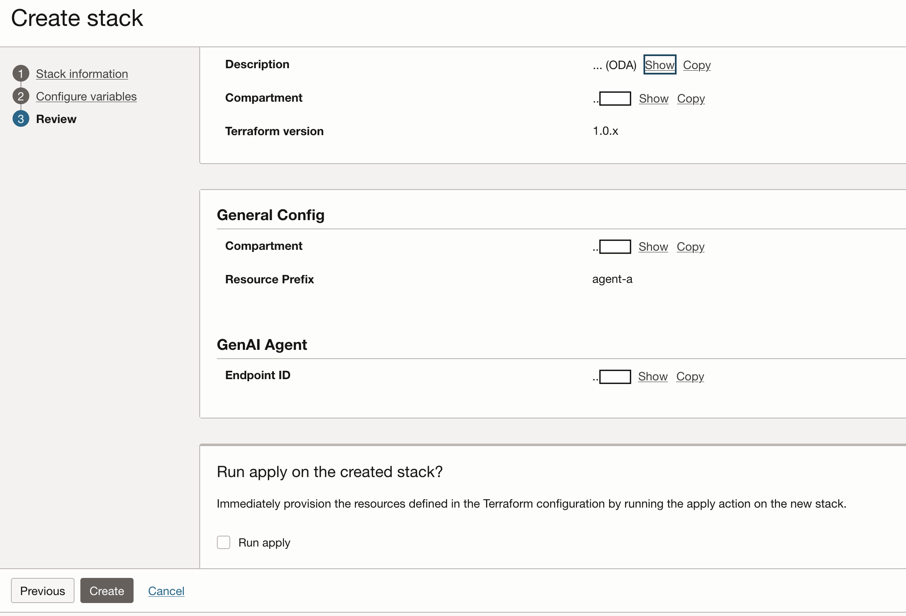
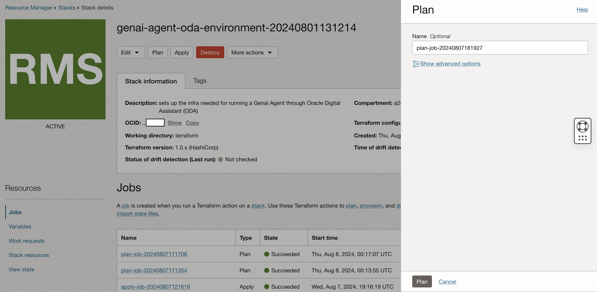

# (Optionally) Provision Infrastructure via Terraform

## Introduction

This lab helps you deploy the required OCI Infrastructure and Services via a Resource Manager stack for Terraform. This lab is optional as the next several labs will walk through how to manually configure each service.

Estimated Time: 30 minutes

### Objectives

In this lab, you will:

* Create Dynamic Groups and Policies required for interservice api calls
* Create an Object Storage Bucket
* Create or connect to an existing GenAI Agent including knowledge base, datasource, and endpoint with a function
* Create or connect to an existing ODA Instance

### Prerequisites

This lab assumes you have:

* All previous labs successfully completed
* Must have an Administrator Account or Permissions to manage several OCI Services: GenAI Agents, Functions, Logging, APM, Network, Dynamic Groups, Policies, Resource Manager, Digital Assistant

## Task 1: Create Resource Manager Stack

1. Start Create Stack Workflow via the button below

    <!-- https://docs.oracle.com/en-us/iaas/Content/ResourceManager/Tasks/deploybutton.htm
    TODO: update package url when available
    use current OS PAR format. New format throws an error
    -->
    [](https://cloud.oracle.com/resourcemanager/stacks/create?zipUrl=https://objectstorage.us-ashburn-1.oraclecloud.com/p/OOL_2RmaYtzKH1cwpwYzo0eLGE1kIKSTywmoJdYa5YN6zVEnBAw7th9E2pa-LxSU/n/c4u02/b/hosted_workshops/o/generative_ai_agent_oda/agent-terraform-livelabs-1.1.zip)


    Clicking this button will direct you to log in to your tenancy and then to Resource Manager's **Create Stack** page

2. Fill out **Stack Information**

    
    * Ensure you are creating your stack in the correct region.
    * Accept the Terms of Use.

    
    * Ensure you have selected the compartment you want the stack to live in.
    * Optionally, update the name and description of the stack.
    * Click Next


## Task 2: High level configuration

1. General Configuration

    

    * Optionally, You can select another compartment to deploy your resources in
    * Optionally, You can customize the prefix used to name resources
    * Setting up IAM will enable policies that allow the configured OCI services to communicate with each other
        * IAM Resources are required to be deployed in your home region

2. GenAI Backend Configuration

    

    * Leave these as the default values

3. Frontend Application

    

    * You can turn off the frontend service automation for ODA and VB by selecting Application Type None
    * You can deploy your frontend components in a different region, but this will introduce additional latency


## Task 3: Detailed configuration for Gen AI Agent

1. Existing Agent resources

    

    * Selecting this option will deploy the resources necessary automatically deploy GenAI Agents
    * You will have the option later to use the provided function container or build it yourself from source code


2. GenAI Agent Configuration

    

    * You can customize your agent with whatever features you want. However, the ODA skill currently requires Multi-turn Sessions and Citations to be enabled

## Task 4a Object Storage Data Source Configuration

1. Object Storage Configuration

    

    * You can either provide an existing Bucket, or a new one will be created for you

2. Auto Ingest Configuration

    

    * You can optionally deploy a function to automatically start ingestion jobs for you. Currently only trigger is object storage events.

<!--
## Task 4b 23AI Autonomous Data Source Configuration

## Task 4c OpenSearch Data Source Configuration

-->


9. OCI Digital Assistant Configuration

    

    * You can either provide an existing instance, or a new one will be created for you
    * If you are setting up IAM policies, a dynamic group and policy will be set up for the new/existing instance
    * It is important to setup the correct policies for your ODA instance based on your desired ODA configuration.

    


    * If your oda instance in this tenancy uses a non default domain for authentication (and you are not still on IDCS), you will need to provide the name of the domain as well as the IDCS web url. You can find it on the domain details console page and will be in this format: https://idcs-XXXXXXXXXXXXXXXXXXXXXXXXXXXXXXXX.identity.oraclecloud.com:443

    

    * If your existing oda instance is in another tenancy like a Fusion SaaS environment, you will need to set up cross tenancy policies. By providing ocid for the other tenancy, the proper policy will be created for this tenancy. However, you will still need to create a policy in the ODA tenancy. For Fusion SaaS customers, that will require a Service Request to create the policy on your behalf as well as get the ocid of the oda instance. The policy on the oda tenancy should look like this:

    ```
      <copy>endorse any-user to manage genai-agent-session in any-tenancy where request.principal.type='odainstance'
      endorse any-user to manage genai-agent-endpoint in any-tenancy where all {request.principal.type='odainstance', request.permission='GENAI_AGENT_ENDPOINT_CHAT'}</copy>
    ```

    * You can find more details about [setting up cross tenancy policies for ODA here](https://docs.oracle.com/en-us/iaas/digital-assistant/doc/users-groups-and-policies1.html)


10. Functions Configuration

    

    * You can choose to manually deploy the functions or use the provided container image
    * You have the choice of creating a new vcn or choosing an existing one.
    * If you are creating a vcn, You can customize the cidr block ranges

    

    * You can also choosing an existing vcn and subnet

    <!--TODO: validate what the networking requirements are. Currently provide a SGW and very minimal traffic rules. Not sure we even need that. How many ip addresses does a function application require?-->

    Click Next

11. Review and Create

    

    On this page, you can review your stack information and variable configuration.

    When you are done, click **Create** or **Save Changes** to finish the stack creation wizard.

    You can select **Run Apply** and skip Task 2, but it is recommended you perform this separately so you can review the Terraform plan before applying.

## Task 2: Run Terraform Stack

1. Click on the **Plan** button

    

    This will bring up a window on the right side. Click **Plan** again to initiate the job.

2. Review completed plan

    

    The plan job may take a couple minutes to complete. After it is completed, you can search through the logs to see the resources that will be created/updated/deleted as well as their configuration parameters.

    

    **NOTE** You can navigate back from a job details page by clicking the **Stack details** breadcrumb in the top left

3. Click on the **Apply** button

    
    * This will bring up a window on the right side.
    * In the **Apply job plan resolution** dropdown menu, select the Plan job you just reviewed
    * Click **Apply** again to initiate the job

4. Wait for the job to be completed

    

    The deployment of the infrastructure may take 10-20 minutes.

    

## Task 3: Inspect Created Resources


<!-- TODO: overhaul this task with RM schema output section-->

1. Find Output Variables

    In the latest Apply Job's View menu in the lower left, select **Outputs**

    

    * These outputs provide a set of quick reference urls to the various services you provisioned as well as key ocids you may need later

2. List all created resources (optional)

    On the **Stack Details** page, Click on the **Stack Resources** view in the lower left

    

    * This page lists all of the resources managed by this stack as well as their attributes.
    * Some resources have direct link to their details

<!-- TODO create new task outlining where automation stops and where you need to start doing manual steps again-->

## Acknowledgements

* **Author**
    * **Kaushik Kundu**, Master Principal Cloud Architect, NACIE
    * **JB Anderson**, Senior Cloud Engineer, NACIE
* **Contributors**
    * **Abhinav Jain**, Senior Cloud Engineer, NACIE
* **Last Updated By/Date**
    * **JB Anderson**, Senior Cloud Engineer, NACIE, October 2024
