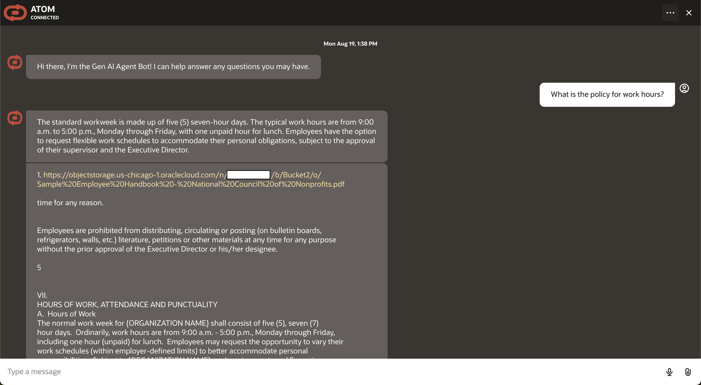
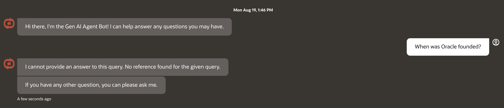

# Demo User Experience

## Introduction

This lab walks you through using the application as an end user.

Estimated Time: 15 minutes

### Objectives

In this lab, you will:

* login to the application
* Chat with the agent

### Prerequisites

This lab assumes you have:

* Access to a fully deployed application

## Task 1: Login to the Application

1. Navigate to the website url your application administrator provided you.

    The url may be a vanity url or look like this:

    `https://<vb_instance_name>-vb-<tenancy_namespace>.builder.<region>.ocp.oraclecloud.com/ic/builder/rt/<vb_app_name>/live/webApps/atom/`

2. If you do not have an active session, you will be prompted to login to the OCI tenancy.

    

    * If your tenancy has an SSO option, try that first
    * If you have issues logging in or do not know what credentials to use, reach out to your application administrator
    * If this is your first time logging into the tenancy, you may need to setup a MFA device

## Task 2: Chat with the Agent

1. Agent Chat loop
    This chatbot provides a simple continuous loop for you to ask questions against. These questions should be about topics or documentation found in the agent's knowledge base

    

    **NOTE** While the frontend application will display your chat history for your current session, the behind the scenes agent currently does not support chat history. From it's point of view, every message is an independent question.

2. Example Dataset Prompts
    The below questions are example prompts you can use if your administrator setup the application with the provided example dataset. If your administrator used a custom or company-specific dataset, you will need to ask them what topics the agent knows about

    <!-- TODO: provide a couple prompts that will work with provided example dataset-->

3. Agent Response Limitations
    The Generative AI agents service uses pre-trained foundational models from the Generative AI Inference service. However, the agents service limits responses to only knowledge found in the agent's data-sources. This means it will not be able to answer general world questions like a foundational model typically does. Instead, the agent will respond saying it cannot answer your question

    

## Acknowledgements

* **Author**
    * **Kaushik Kundu**, Master Principal Cloud Architect, NACIE
    * **JB Anderson**, Senior Cloud Engineer, NACIE
* **Contributors**
    * **Abhinav Jain**, Senior Cloud Engineer, NACIE
* **Last Updated By/Date**
    * **JB Anderson**, Senior Cloud Engineer, NACIE, August 2024
