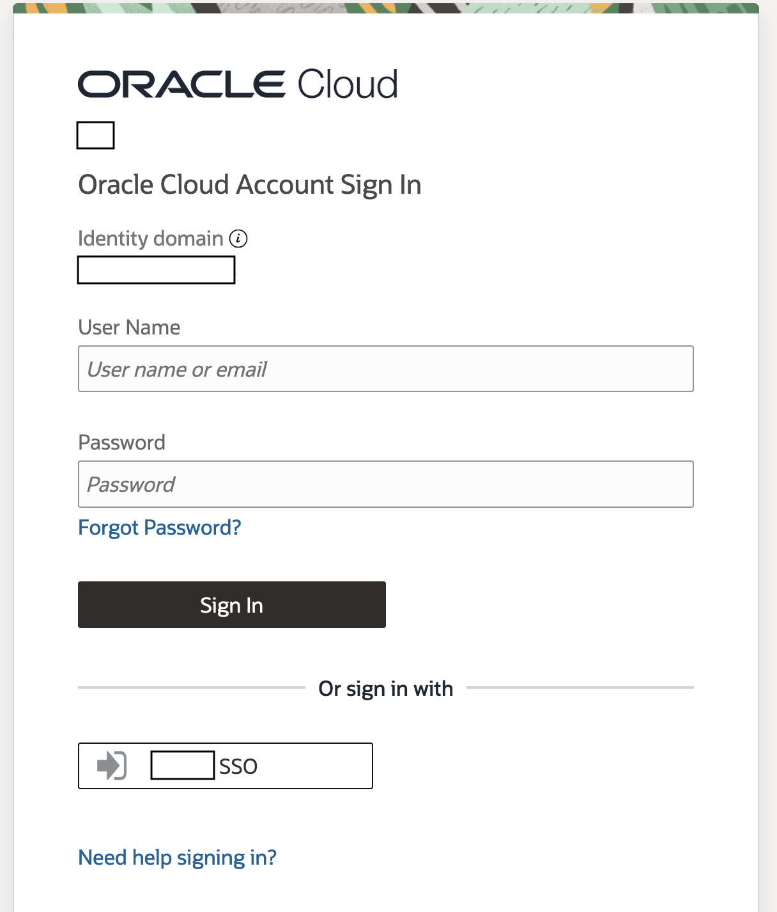

# Demo User Experience

## Introduction

This lab walks you through using the application as an end user.

Estimated Time: 15 minutes

### Objectives

In this lab, you will:

* login to the application
* Chat with the agent

### Prerequisites (Optional)

This lab assumes you have:

* All previous labs successfully completed

## Task 1: Login to the application

1. Navigate to the website url your application administrator provided you.

    The url may be a vanity url or look like this: `https://<vb_instance_name>-vb-<tenancy_namespace>.builder.<region>.ocp.oraclecloud.com/ic/builder/rt/<vb_app_name>/live/webApps/atom/`

2. If you do not have an active session, you will be prompted to login to the OCI tenancy.

    

    * If your tenancy has an SSO option, try that first
    * If you have issues logging in or do not know what credentials to use, reach out to your application administrator
    * If this is your first time logging into the tenancy, you may need to setup a MFA device

## Task 2: Chat with the agent

1. 

    <!-- TODO:
    explain the chat loop
    screenshot of chat
    example prompts for provided dataset-->

## Acknowledgements

* **Author**
    * **Kaushik Kundu**, Master Principal Cloud Architect, NACIE
    * **JB Anderson**, Senior Cloud Engineer, NACIE
* **Contributors**
    * **Abhinav Jain**, Senior Cloud Engineer, NACIE
* **Last Updated By/Date**
    * **JB Anderson**, Senior Cloud Engineer, NACIE, August 2024