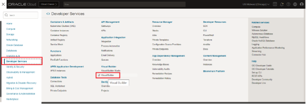
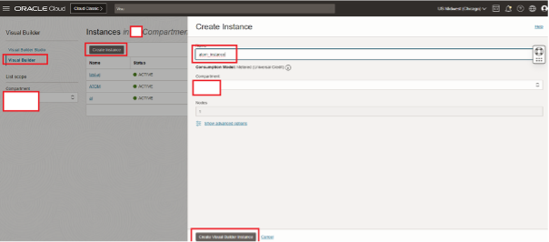
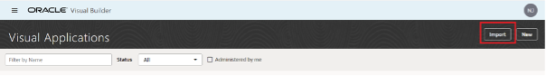
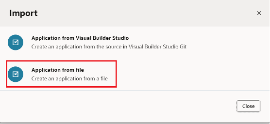
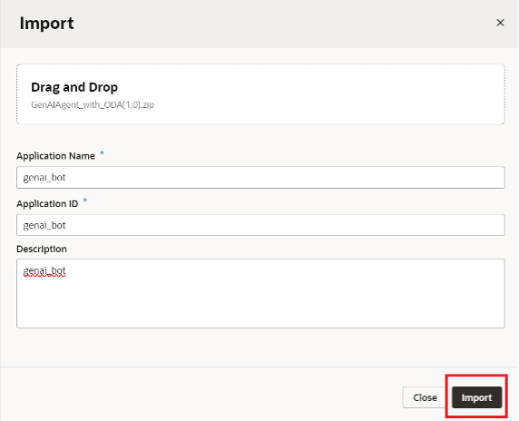
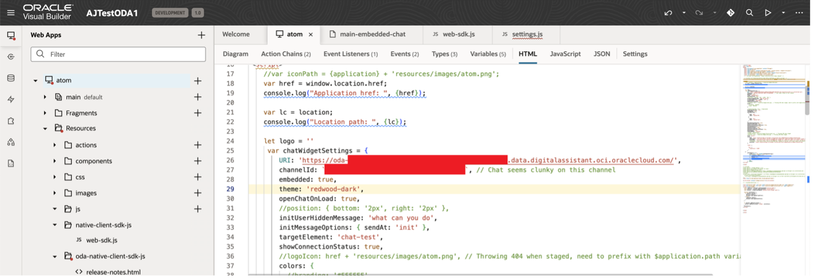

# Provision of Oracle Visual Builder

## Introduction

This lab will take you through the steps needed to provision Oracle Visual Builder (VB)

Estimated Time: -- minutes

### About Visual Builder

<!-- TODO-->

### Objectives

In this lab, you will:

<!-- TODO-->

### Prerequisites (Optional)

This lab assumes you have:

* All previous labs successfully completed

## Task 1: Create VBCS Instance & embed ODA skill in VBCS Application

1. Click on main hamburger menu on OCI cloud console and navigate Developer Services > Visual Builder

    

2. Create Visual Builder Instance by providing the details and click Create Visual Builder Instance:
    * Name =
    * Compartment =
    * Node =

    

3. Wait for the instance to come to Active (green color) status

4. Click on the link to download the VB application (zip file): ATOM_VB.zip
    <!-- TODO: host artifact and provide download link (as par?)-->

5. Import the application in provisioned instance as per the screenshots. Users only need one VCBS instance created. They can import/create multiple applications in the instance for each additional chatbot they have
    * Click on Import from Visual Builder Instance

    

    * Choose the option as below

    

    * Provide the App Name with other details and select the provided application zip file

    

6. Once import is completed, open the index.html file in the VB Instance and update the details as follows:
    * URI = 'oda-XXXXXXXXXXXX.data.digitalassistant.oci.oraclecloud.com/'
        * URI is the hostname of the ODA instance provisioned in Task 1 of the previous lab
    * channelId = 'XXXXXXXXXXXXXXXXXXXXXXXXXXXX'
        * o	channelId is created during Task 5 - Step 3 of the previous lab
    * Please set value of initUserHiddenMessage on Line 32 to “Hi”

    

7. The UI of the chatbot such as theme, color and icon can be changed by modifying the parameters under var chatWidgetSetting from index.html

8. Click on the Play button shown in the above image on the top right corner to launch ATOM chatbot and start chatting with ATOM.

## Learn More

*(optional - include links to docs, white papers, blogs, etc)*

* [URL text 1](http://docs.oracle.com)
* [URL text 2](http://docs.oracle.com)

## Acknowledgements
* **Author**
* **Kaushik Kundu**, Master Principal Cloud Architect, NACIE
* **JB Anderson**, Senior Cloud Engineer, NACIE
* **Contributors** -  <Name, Group> -- optional
* **Abhinav Jain**, Senior Cloud Engineer, NACIE
* **Last Updated By/Date** - <Name, Month Year>