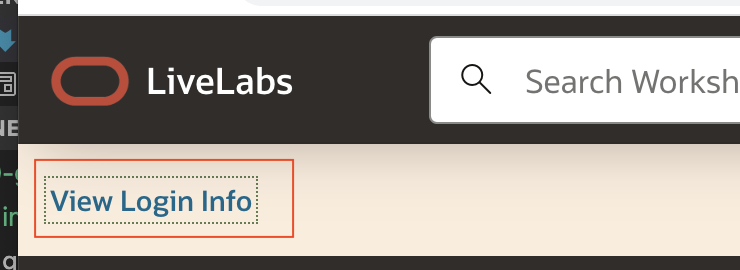
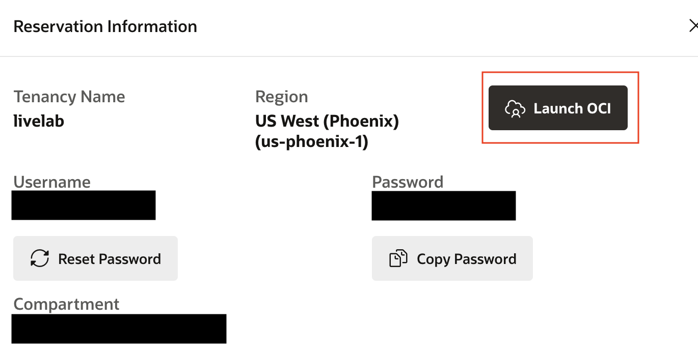
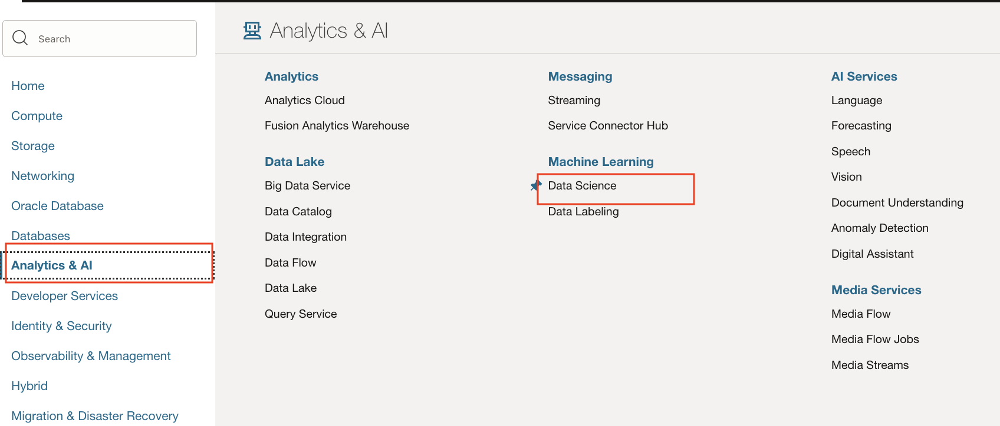
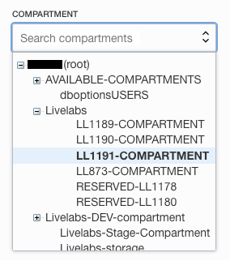
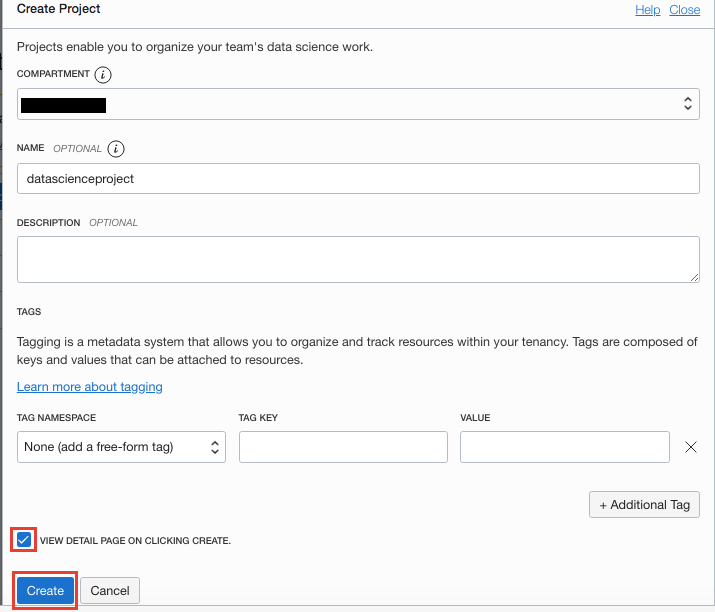

# Data Science Project Setup

## Introduction

Projects are used to collect related data science resources and artifact, such that it enables you to organize your work. They contain a collection of notebook sessions and models.

Estimated Time: 5 minutes

### Objective

* Use the Console to create a Data Science Project.

### Prerequisites

* A tenancy that is configured to work with the Data Science service.
* An account that has permission to create a Data Science project.

## Task 1: Creating a Project

You create a Data Science project to organize your notebook sessions and models within your project.

1. After launching the workshop, click on **View login Info**.
    
1. Click on **Launch OCI** and login with the username and password provided in the Reservation Information.
    
1. Click the **Navigation Menu** in the upper left, navigate to **Analytics & AI**, and select **Data Science**.
    
1. Select the compartment, generally, you will need to expand (click the + symbol) the ``root`` and ``Livelabs`` sections. Then select the compartment name in the Reservation Information.  It generally has the format ``LL####-COMPARTMENT`` where ``####`` is a number.
    
1. Click **Create Project**.
    
1. (Optional, but recommended) Enter a unique name (255 character limit) for the project. If you do not provide a name, a name is automatically generated for you.
1. (Optional, but recommended) Enter a description (400 character limit) for the project. If you do not add a description, it remains empty.
1. (Optional) Add tags to easily locate and track the project by selecting a tag namespace, then entering the key and value. To add more than one tag, click **Add tag**. [Tagging](https://docs.cloud.oracle.com/iaas/Content/Tagging/Concepts/taggingoverview.htm) describes the various tags that you can use organize and find projects.
1. (Optional) To view the details for your project immediately after creation, select **Display project details after creation**.
    
1. Click **Create**.

This creates the project and opens the project page.

You can **proceed to the next lab**.

## **Acknowledgements**

* **Authors** - Lyudmil Pelov, Wendy Yip, Yanir Shahak
